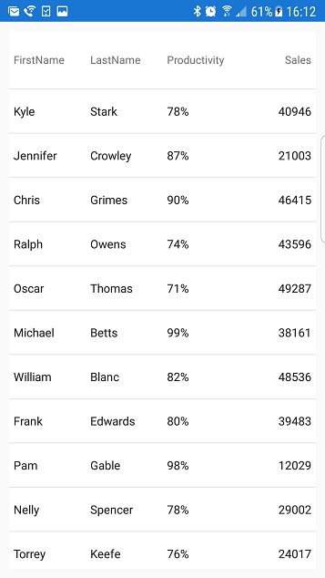

////
|metadata|
{
    "name": "datagrid-responsive-layout-on-grid-rotation",
    "controlName": ["{DataGridName}"],
    "tags": [],
    "guid": "","buildFlags": [],
    "createdOn": "2017-02-05T19:11:09.6948794Z"
}
|metadata|
////

= グリッド回転のレスポンシブ レイアウト

このトピックでは、link:{DataGridLink}.{DataGridName}.html[{DataGridName}] コントロールが反転する際のレスポンシブ レイアウトの概念を解説します。
   

== 概要

このトピックは、以下のセクションで構成されます。

* <<_Introduction,概要>>
* <<_Preview,プレビュー>>
ifdef::xamarin[]  
* <<_Prepare_Application,アプリケーションの準備 >>
endif::xamarin[]
* <<_Example,コード例>> 
* <<_RelatedContent,関連コンテンツ>>

[[_Introduction]]
== 概要 

レスポンシブ レイアウトを使用すると、たとえばデバイスを水平方向から垂直方向に回転した場合のように、水平画面のスペースが大幅に縮小する状態に対応できます。このような場合、すべての {DataGridName} 列が表示されるように維持すると、データの可読性を損ない、アプリケーションの審美性が低下することがあります。したがって、重要性が低い情報が表示されている列をビューから削除すると同時に、最も関連性の高いデータが含まれた列を継続して表示するようにします。

この動作は、主に 2 つ以上の link:{DataGridLink}.ResponsiveState.html[ResponsiveState] オブジェクトにより、表示を想定または維持する列を調整できます。各オブジェクトには、画面の最小幅と最大幅に基づいた特定の数値の範囲が関連付けられるため、{DataGridName} コントロールの範囲内では、画面の幅密度がどのように変化しても、動的に対応できます。
 

[[_Preview]]
== プレビュー  

レスポンシブ レイアウトの概念については、次の図に示す基本的な回転レイアウトのシナリオがもっとも分かりやすいでしょう。

最初のスクリーンショットでは、{DataGridName} コントロールが水平方向に表示され、表示の 7 列 (*First Name*、*Last Name*、*Territory*、*Productivity*、*Sales*、*Experience*、*Salary*) が含まれます。

image::images/Responsive_Layout_On_Grid_Rotation_1.png[]

2 番目のスクリーンショットでは、垂直方向に回転されたデバイスで水平方向の画面領域が減少し、{DataGridName} コントロールの幅も大幅に縮小しています。すべての列が表示されたままで水平方向に圧縮された外観は、表示されたデータがユーザーにとって分かりにくくなるだけでなく、ユーザー エクスペリエンスの満足度も低下します。

image::images/Responsive_Layout_On_Grid_Rotation_2.png[]

ただし、レスポンシブ グリッド レイアウトでは、このシナリオは関連度の最も低い列 (*Experience*、*Territory*、*Salary*) をビューから削除することにより応答して、残りの列を新しくできたスペースに再配分します。 
 

 
ifdef::xamarin[]  
[[_Prepare_Application]]
== アプリケーションの準備  

レスポンシブ レイアウト ビヘイビアを実装する前に、 {DataGridName} コントロールの `ResponsiveState` オブジェクトを定義するために後で使用されるアプリケーション プロジェクトを準備し、デバイスの画面のパラメーターを保存する必要があります。

[start=1]
. *Portable* アプリケーション プロジェクトで、このコードを追加して、デバイスの画面のパラメーターを定義します。

*C# の場合:*
[source, csharp]
----
public partial class App : Application
{
    static public int ScreenWidth;
    static public int ScreenHeight;
    static public float ScreenDensity = 1;
    ...
}
----

[start=2]
. *.Droid* アプリケーション プロジェクトで、このコードを追加して、デバイスの画面のパラメーターを保存します。

*C# の場合:*
[source, csharp]
----
public class MainActivity : FormsAppCompatActivity
{
    protected override void OnCreate(Bundle bundle)
    {
        App.ScreenDensity = Resources.DisplayMetrics.Density;
        App.ScreenWidth   = Resources.DisplayMetrics.WidthPixels;
        App.ScreenHeight  = Resources.DisplayMetrics.HeightPixels;
        ...
    }
}
----

[start=3]
. *.iOS* アプリケーション プロジェクトで、このコードを追加して、デバイスの画面のパラメーターを保存します。

*C# の場合:*
[source, csharp]
----
public partial class AppDelegate : FormsApplicationDelegate
{
    public override bool FinishedLaunching(UIApplication app, NSDictionary options)
    {
        App.ScreenWidth  = (int)UIScreen.MainScreen.Bounds.Width;
        App.ScreenHeight = (int)UIScreen.MainScreen.Bounds.Height; 
        ...
    }
}
----
endif::xamarin[]

[[_Example]]
== コード例

アプリケーションを実行しているデバイスを回転すると、アプリケーション内で {DataGridName} コントロールが使用できる水平領域が大きく変化します。この例では、{DataGridName} コントロールでレスポンシブ レイアウトのデザイン パターンを実装するプロセスを通してウォークスルーを提供します。
 
 
[start=1]
. メインビューでデバイスの表示領域の寸法データを格納する 4 つの `int` 型の変数を実装します。このデータは、デバイスの向きを判別するために使用されます。
 
ifdef::android[]
*Java の場合:*

[source, java]
----
int ContentWidth  = getResources().getDisplayMetrics().widthPixels;
int ContentHeight = getResources().getDisplayMetrics().heightPixels;
int ThresholdMax = Math.max(ContentHeight, ContentWidth);
int ThresholdMin = Math.min(ContentHeight, ContentWidth);
----
endif::android[]

ifdef::xamarin[]
*C# の場合:*
[source, csharp]
----
static int ContentWidth = (int)(App.ScreenWidth / App.ScreenDensity);
static int ContentHeight = (int)(App.ScreenHeight / App.ScreenDensity);
static int ThresholdMax = Math.Max(ContentHeight, ContentWidth);
static int ThresholdMin = Math.Min(ContentHeight, ContentWidth);
----
endif::xamarin[]

ifdef::wpf[]
*C# の場合:*
[source, csharp]
----
// TODO add code snippet
----
endif::wpf[]

[start=2]
. メインビューに link:{DataGridLink}.{DataGridName}.html[{DataGridName}] のインスタンスを作成します。

ifdef::android[]
*Java の場合:*
[source, java]
----
{DataGridName} DataGrid = new {DataGridName}(this);
DataGrid.setAutoGenerateColumns(true);
DataGrid.setDataSource(SampleSalesPerson.GenerateSalesData(300));

setContentView(DataGrid);
----
endif::android[]

ifdef::xaml[]
*C# の場合:*
[source, csharp]
----
var DataGrid = new {DataGridName}();
DataGrid.AutoGenerateColumns = true;
DataGrid.ItemsSource = SampleSalesPerson.GenerateSalesData(300);
----
endif::xaml[]

ifdef::xaml[]
*XAML の場合:*
[source, xaml]
----
<ig:XamDataGrid x:Name="DataGrid" AutoGenerateColumns="True">
    <ig:XamDataGrid.ItemsSource>
        <local:SampleSalesTeam />
    </ig:XamDataGrid.ItemsSource> 
</ig:XamDataGrid>
----
endif::xaml[]

[start=3]
. 以下のコードに示すように、link:{DataGridLink}.ResponsivePhase.html[ResponsivePhase] オブジェクトを作成するヘルパー メソッドを追加します。

ifdef::android[]
*Java の場合:* 
[source, java]
---- 
private ResponsivePhase CreatePhase(string columnName, string propertyName, object value)
{
    var setter = new ColumnPropertySetter(columnName, propertyName, value);
    return new ResponsivePhase().addColumnPropertySetter(setter);
}
----
endif::android[]

ifdef::xaml[]  
*C# の場合:*
[source, csharp]
---- 
private ResponsivePhase CreatePhase(string columnName, string propertyName, object value)
{
    var setter = new ColumnPropertySetter()
    {
        ColumnName = columnName,
        PropertyName = propertyName,
        Value = value,
    }; 
    return new ResponsivePhase().AddColumnPropertySetter(setter);
}
----
endif::xaml[]

[start=4]
. 以下のコードスニペットでは、link:{DataGridLink}.ResponsiveState.html[ResponsiveState] クラスのインスタンスを作成し、ポートレートの向きで非表示にしない列を定義します。

ifdef::android[]
*Java の場合:*

[source, java]
----
ResponsiveState state1 = new ResponsiveState();
state1.setName("Landscape State");
state1.setMaximumWidth(TypedValue.COMPLEX_UNIT_PX, ThresholdMax);
state1.setMinimumWidth(TypedValue.COMPLEX_UNIT_PX, ThresholdMin + 1); 
state1.AddResponsivePhase(CreatePhase("Salary", "IsHidden", false));
state1.AddResponsivePhase(CreatePhase("Territory", "IsHidden", false));
state1.AddResponsivePhase(CreatePhase("Experience", "IsHidden", false));
----
endif::android[]

ifdef::xaml[]
*C# の場合:*
[source, csharp]
---- 
var state1 = new ResponsiveState();
state1.Name = "Landscape State";
state1.MaximumWidth = ThresholdMax;  
state1.MinimumWidth = ThresholdMin + 1;
state1.AddResponsivePhase(CreatePhase("Salary", "IsHidden", false));
state1.AddResponsivePhase(CreatePhase("Territory", "IsHidden", false));
state1.AddResponsivePhase(CreatePhase("Experience", "IsHidden", false));
---- 
endif::xaml[]

[start=5]
. 次に以下のコードスニペットでは、link:{DataGridLink}.ResponsiveState.html[ResponsiveState] クラスの 2 番目のインスタンスを作成し、横長の向きで非表示にする列を定義します。

ifdef::android[]
*Java の場合:*

[source, java]
----
ResponsiveState state2 = new ResponsiveState();
state2.setName("Portrait State");
state2.setMaximumWidth(TypedValue.COMPLEX_UNIT_PX, ThresholdMin);
state2.setMinimumWidth(0); 
state2.AddResponsivePhase(CreatePhase("Salary", "IsHidden", true));
state2.AddResponsivePhase(CreatePhase("Territory", "IsHidden", true));
state2.AddResponsivePhase(CreatePhase("Experience", "IsHidden", true));
----
endif::android[]

ifdef::xaml[]
*C# の場合:*
[source, csharp]
---- 
var state2 = new ResponsiveState();
state2.Name = "Portrait State";
state2.MaximumWidth = ThresholdMin;  
state2.MinimumWidth = 0;
state2.AddResponsivePhase(CreatePhase("Salary", "IsHidden", true));
state2.AddResponsivePhase(CreatePhase("Territory", "IsHidden", true));
state2.AddResponsivePhase(CreatePhase("Experience", "IsHidden", true));
---- 
endif::xaml[]
   
  
[start=6]
. 次のコード スニペットに示すように、{DataGridName} コントロールに両方の `ResponsiveState` オブジェクトを追加します。

ifdef::android[]
*Java の場合:* 
[source, java]
----
DataGrid.addResponsiveState(state1);
DataGrid.addResponsiveState(state2);
----
endif::android[]

ifdef::xaml[]  
*C# の場合:*
[source, csharp]
---- 
DataGrid.ResponsiveStates.Add(state1);
DataGrid.ResponsiveStates.Add(state2);
----
endif::xaml[]

    
[start=7]
. アプリケーションを保存して実行し、{DataGridName} コントロールのレスポンシブ レイアウト ビヘイビアを確認します。

デバイスを水平方向にすると（ランドスケープ モードになると想定）、{DataGridName} コントロールは、7 つすべての列 (*First Name*、*Last Name*、*Territory*、*Productivity*、*Sales*、*Experience*、*Salary*) を表示します。

image::images/Responsive_Layout_On_Grid_Rotation_1.png[]
[start=17]

デバイスを水平方向から垂直方向に変えると（デバイスがポートレート モードになることと想定）、{DataGridName} コントロールはビューの *Experience*、*Territory*、および *Salary* 列を非表示にします。

[[_RelatedContent]]   
=== 関連コンテンツ

以下の表は、このトピックに関連するトピックを示します。

[options="header", cols="a,a"]
|====
|トピック|目的
 
| link:datagrid-responsive-layout-on-grid-resize.html[グリッド サイズ変更のレスポンシブ レイアウト] 
| このトピックでは、link:{DataGridLink}.{DataGridName}.html[{DataGridName}] コントロールのサイズ変更の隣接レイアウトでレスポンシブ レイアウトを実装する方法について説明します。

| link:datagrid-supported-column-types.html[サポートされる列タイプ]
|このトピックでは、{DataGridName} コントロールでサポートされている列タイプについて説明します。
  
| link:datagrid-working-with-columns.html[列の作業]
|このトピックでは、{DataGridName} コントロールの列を操作する際のコード例を紹介します。
|====