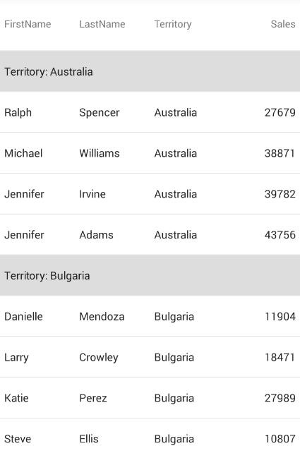
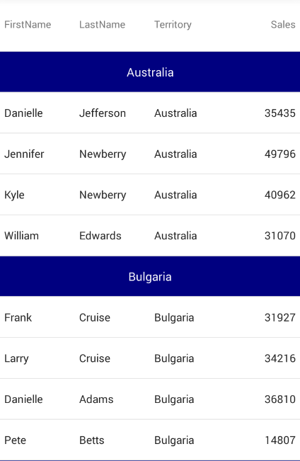

= 行のグループ化

このトピックでは、link:{DataGridLink}.{DataGridName}.html[{DataGridName}] コントロールを使用した行グループ化の実装プロセスを手順を追って説明します。

== このトピックの内容

このトピックは、以下のセクションで構成されます。

* <<ReqBackground, 前提条件>>
* <<Overview, 概要>>
* <<PropSettings, プロパティの設定>>
* <<GroupingExample, 行のグループ化 - コード例>>
* <<GroupingSplitExample, グループ化された行の分割 - コード例>>
* <<GroupFormattingExample, グループ化された行の書式設定 - コード例>>
* <<GroupStylingExample, グループ化された行のスタイル設定 - コード例>>
* <<Related, 関連コンテンツ>>

[[ReqBackground]]
== 前提条件

|===
|トピック|目的

| link:datagrid-getting-started-with-grid.html[{DataGridName} を使用した作業の開始] 
| このトピックでは、{DataGridName} コントロールをビューに追加し、サンプル データを生成するために必要な基本的な手順を紹介します。

|link:datagrid-sorting.html[{DataGridName} の並べ替え]
| このトピックでは、{DataGridName} コントロールで実装できる並べ替えの動作を説明します。

|===

[[Overview]]
== 概要

{DataGridName} コントロールは、基本データ項目のプロパティに基づいて行をグループ化する機能があります。別のレコードで複製のデータ値がある場合、その複製値を含むプロパティ パスによってレコードを分割する場合に便利です。

行をグループ化するには、link:{DataGridLink}.columngroupdescription.html[ColumnGroupDescription] 要素を {DataGridName} の link:{DataGridLink}.{DataGridName}{ApiPropGet}groupdescriptions.html[GroupDescriptions] コレクションに追加して、`PropertyPath` プロパティを設定します。`PropertyPath` を設定するために `ColumnGroupDescription` 要素のコンストラクターも使用できます。

複数のプロパティ パスでグループ化する場合、`GroupHeaderDisplayMode` プロパティを設定することにより、行グループの表示をカスタマイズできます。このプロパティには、Combined または Split の 2 つのオプションがあります。Combined オプションは同じグループ ヘッダーに複数のプロパティ パスをインラインで配置します。Split オプションはグループの順序に基づいて別の階層ヘッダーにプロパティ パスを配置します。

[[PropSettings]]
== プロパティの設定

デフォルトで、基本データ項目の特定のプロパティによってグループ化する場合、グループ化されている各プロパティのためにグループ ヘッダーが「プロパティ名: プロパティ値」を表示します。このグループ行が表示される方法を {DataGridName} コントロールの以下のプロパティを設定して変更できます。

|===
|プロパティ名|プロパティ タイプ|説明

|link:{DataGridLink}.{DataGridName}{ApiPropGet}sectionheader.html[SectionHeader]
|link:{DataGridLink}.sectionheader.html[SectionHeader]
|{DataGridName} グループ ヘッダーのさまざまなスタイル設定プロパティを変更します。

グループ ヘッダーでカスタム コンテンツを提供するために link:{DataGridLink}.templatesectionheader.html[TemplateSectionHeader] 要素を使用できます。

|link:{DataGridLink}.{DataGridName}{ApiPropGet}isgrouprowsticky.html[IsGroupRowSticky]
|`bool`
|true に設定される場合、そのグループに関連するデータ行にスクロールする間にグループ ヘッダーは上に固定されます。新しいグループにスクロールする場合、新しいグループのセクション ヘッダーは固定されます。

|link:{DataGridLink}.{DataGridName}{ApiPropGet}groupheaderdisplaymode.html[GroupHeaderDisplayMode]
|link:{DataGridLink}.{DataGridName}{ApiPropGet}datasourcesectionheaderdisplaymode.html[DataSourceSectionHeaderDisplayMode]
|複数のプロパティ パスでグループ化して Combined に設定すると、同じグループ化されたヘッダーに複数のプロパティ パスをインラインに配置します。
Split オプションは、各プロパティ パスに別の階層ヘッダーを使用します。 

|===

グループがグリッドに表示される方法をカスタマイズする `ColumnGroupDescription` 要素のプロパティおよびイベントもあります。これらのプロパティは以下にリストされます。

|===
|プロパティ名|プロパティ タイプ|説明

|link:{DataGridLink}.columnsortdescription{ApiProp}propertypath.html[PropertyPath]
|`string`
|グループ化する基本データ項目のプロパティ。これが {DataGridName} に表示されるとは限りません。

|link:{DataGridLink}.columnsortdescription{ApiProp}sortdirection.html[SortDirection]
|link:{DataGridLinkBase}.listsortdirection.html[ListSortDirection]
|グループは昇順または降順の並べ替え順序を決定します。

|link:{DataGridLink}.columngroupdescription{ApiProp}displayname.html[DisplayName]
|`string`
|グループ化されたプロパティの表示テキストを取得または設定します。空の場合、`ColumnGroupDescription.PropertyPath` が表示されます。

|link:{DataGridLink}.columngroupdescription{ApiProp}valueformat.html[ValueFormat]
|`string`
|グループ化された値の書式文字列を取得または設定します。

|link:{DataGridLink}.columngroupdescription{ApiProp}formattext_ev.html[FormatText Event]
|link:{DataGridLink}.formatgrouptexteventhandler.html[FormatGroupTextEventHandler]
|このイベントは、特定のグループの値が評価されているときに発生します。このイベントの link:{DataGridLink}.formatgrouptexteventargs.html[FormatGroupTextEventArgs] 引数はグループ ヘッダーの表示テキストを設定します。これは `DisplayName` プロパティをオーバーライドします。イベント引数の `GroupName`、`GroupValue`、および `FormattedValue` プロパティを使用すると、グループ名、グループ値、および書式設定された値を `ValueFormat` プロパティに基づいて表示できます。 

|===

[[GroupingExample]]
== 行のグループ化 - コード例

以下の例は {DataGridName} コントロールで行をグループ化する方法を紹介します。この例および次の例は link:samplesalesperson.html[SampleSalesPerson] データ ソースを使用します。

*XAML の場合:*
[source, xaml]
----
xmlns:ig="clr-namespace:{DataGridNamespace};assembly={ApiPlatform}DataGrid"
...
<ig:{DataGridName} ItemsSource="{Binding}">
    <ig:{DataGridName}.GroupDescriptions>
        <ig:ColumnGroupDescription PropertyPath="Territory"/>
    </ig:{DataGridName}.GroupDescriptions>
</ig:{DataGridName}>
----

*C# の場合:*
[source,csharp]
----
{DataGridName} grid = new {DataGridName}() { ItemsSource = new SampleSalesTeam() };
grid.GroupDescriptions.Add(new ColumnGroupDescription("Territory"));
----

以上のコード スニペットは以下のような {DataGridName} になります。

[[GroupFormattingExample]]
== グループ化された行の書式設定 - コード例

以下の例は、上に説明した `DisplayName`、`ValueFormat`、および `SortDirection` プロパティを使用してグループ ヘッダーを書式設定する方法を紹介します。 

*XAML の場合:*
[source, xaml]
----
xmlns:ig="clr-namespace:{DataGridNamespace};assembly={ApiPlatform}DataGrid"
...
<ig:{DataGridName} ItemsSource="{Binding}">
    <ig:{DataGridName}.GroupDescriptions>
        <ig:ColumnGroupDescription PropertyPath="Sales"
                                   DisplayName="Sales Amount"
                                   SortDirection="Descending"
                                   ValueFormat="C"/>
    </ig:{DataGridName}.GroupDescriptions>
</ig:{DataGridName}>
----

*C# の場合:*
[source, csharp]
----
{DataGridName} grid = new {DataGridName}() { ItemsSource = new SampleSalesTeam() };

ColumnGroupDescription desc = new ColumnGroupDescription("Sales");
desc.SortDirection = ListSortDirection.Descending;
desc.DisplayName = "Sales Amount";
desc.ValueFormat = "C";

grid.GroupDescriptions.Add(desc);
----

以上のコード スニペットは以下のような {DataGridName} になります。

image:images/datagrid_grouping_formatted.png[]

[[GroupingSplitExample]]
== グループ化された行の分割 - コード例 

以下の例は、`GroupHeaderDisplayMode` が Split に設定された複数のグループの {DataGridName} の結果を示します。 

*XAML の場合:*
[source,xaml]
----
xmlns:ig="clr-namespace:{DataGridNamespace};assembly={ApiPlatform}DataGrid"
...
<ig:{DataGridName} x:Name="dataGrid" ItemsSource="{Binding}" GroupHeaderDisplayMode="Split">
    <ig:{DataGridName}.GroupDescriptions>
        <ig:ColumnGroupDescription PropertyPath="Territory"/>
        <ig:ColumnGroupDescription PropertyPath="FirstName" />
    </ig:{DataGridName}.GroupDescriptions>
</ig:{DataGridName}>
----

以上のコード スニペットは以下のような {DataGridName} になります。

image:images/datagrid_row_grouping_split.png[]

[[GroupStylingExample]]
== グループ化された行のスタイル設定 - コード例

以下の例は、link:https://developer.xamarin.com/guides/xamarin-forms/application-fundamentals/templates/data-templates/selector/[DataTemplateSelector] を持つ link:{DataGridLink}.templatesectionheader.html[TemplateSectionHeader] を使用してグループ ヘッダーの表示方法をスタイル設定する方法を紹介します。

*XAML の場合:*
[source, xaml]
----
xmlns:ig="clr-namespace:{DataGridNamespace};assembly={ApiPlatform}DataGrid"
xmlns:local="clr-namespace:MyAppNamespace
...
<ig:{DataGridName} ItemsSource="{Binding}">
    <ig:{DataGridName}.GroupDescriptions>
        <ig:ColumnGroupDescription PropertyPath="Territory"/>
    </ig:{DataGridName}.GroupDescriptions>
    <ig:{DataGridName}.SectionHeader>
        <ig:TemplateSectionHeader Background="Navy">
            <ig:TemplateSectionHeader.ContentTemplate>
                <local:GroupContentSelector/>
            </ig:TemplateSectionHeader.ContentTemplate>
        </ig:TemplateSectionHeader>
    </ig:{DataGridName}.SectionHeader>
</ig:{DataGridName}>
----

*C# の場合:*
[source,csharp]
----
{DataGridName} grid = new {DataGridName}() { ItemsSource = new SampleSalesTeam() };       
grid.GroupDescriptions.Add(new ColumnGroupDescription("Territory"));

TemplateSectionHeader header = new TemplateSectionHeader() { Background = new SolidColorBrush(Color.Navy) };
header.ContentTemplate = new GroupContentSelector();

grid.SectionHeader = header;
----

TemplateSectionHeader の ContentTemplate プロパティと DataTemplateSelector を使用する場合、OnSelectTemplate オーバーライドの `BindableObject` パラメーターは TemplateSectionHeader 自身で、「オブジェクト項目」パラメーターはプロパティ名である文字列およびプロパティ値であるオブジェクトを含む `Dictionary<string, object>` です。

*C# の場合:*
[source,csharp]
----
public class GroupContentSelector : DataTemplateSelector
{
    protected override DataTemplate OnSelectTemplate(object item, BindableObject container)
    {
        System.Collections.Generic.Dictionary<string, object> dict = item as Dictionary<string, object>;
        KeyValuePair<string, object> itemPair = dict.First();

        DataTemplate template = new DataTemplate(() =>
        {
            Label label = new Label() { HorizontalTextAlignment = TextAlignment.Center, VerticalTextAlignment = TextAlignment.Center };
            label.TextColor = Color.White;                

            if(itemPair.Value != null)
            {
                label.Text = itemPair.Value.ToString();
            }

            return label;
        });

        return template;
    }
}
----

以上のコード スニペットは以下のような {DataGridName} になります。

[[Related]]
== 関連コンテンツ

|===

|トピック|目的

|link:datagrid-row-pinning.html[行のピン固定]
|このトピックではコード例を使用して、{DataGridName} コントロールで行のピン固定を構成する方法を説明します。

|===