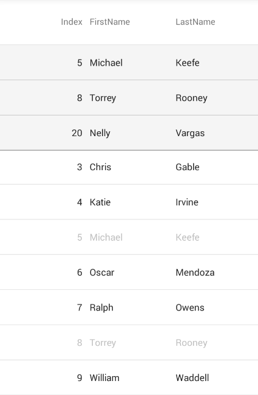
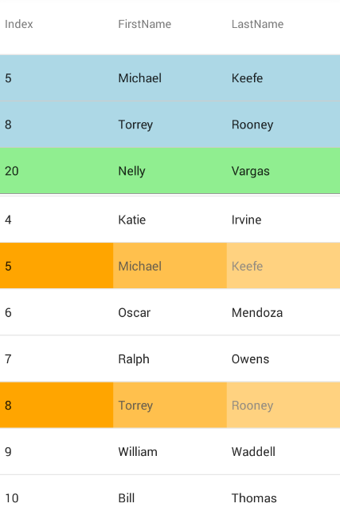

= 行のピン固定

このトピックでは、link:{DataGridLink}.{DataGridName}.html[{DataGridName}] コントロールを使用した行のピン固定の実装プロセスを手順を追って説明します。

== このトピックの内容

このトピックは、以下のセクションで構成されます。

* <<ReqBackground,前提条件>>
* <<Overview,概要>>
* <<PinItems,項目別に行をピン固定>>
* <<PinKeys,項目のキーで行をピン固定>>
* <<Styling, ピン固定行のスタイル設定>>
* <<RelatedContent,関連コンテンツ>>

[[ReqBackground]]
== 前提条件

本トピックの理解を深めるために、以下のトピックを参照することをお勧めします。

|===
|トピック|目的

|link:datagrid-getting-started-with-grid.html[{DataGridName} を使用した作業の開始] 
|このトピックでは、{DataGridName} コントロールをビューに追加し、サンプル データを生成するために必要な基本的な手順を紹介します。

|link:datagrid-working-with-columns.html[列の作業]
|このトピックでは、{DataGridName} コントロールの列を操作する際のコード例を紹介します。

|===

[[Overview]]
== 概要

{DataGridName} コントロールは、キーまたは基本データ ソースの項目を使用して行のピン固定を許可します。行がピン固定される場合、データ グリッドの一番上に表示され、そこに残ります。

以下のセクションは、コード例を使用してグリッドで行をピン固定し、スタイル設定する方法を紹介します。以下のコード例はlink:contactsdatasource.html[連絡先情報のデータ ソース]を使用します。

[[PinItems]]
== 項目別に行をピン固定

{DataGridName} コントロールでターゲット行の基本データ項目をグリッドの link:{DataGridLink}.{DataGridName}{ApiPropGet}pinneditems.html[PinnedItems] コレクションに追加すると、行をピン固定できます。
 
以下のコードは、実際の基本データ項目を使用してグリッドで行をピン固定する方法を紹介します。

*C# の場合:*
[source, csharp]
----
ContactsDataSource data = new ContactsDataSource();
{DataGridName} grid = new {DataGridName}() { ItemsSource = data };

grid.PinnedItems.Add(data[5]);
grid.PinnedItems.Add(data[8]);
grid.PinnedItems.Add(data[20]);
----

以上のコード スニペットは以下のような {DataGridName} になります。

[[PinKeys]]
== 項目のキーで行をピン固定

{DataGridName} の link:{DataGridLink}.{DataGridName}{ApiPropGet}pinnedkeys.html[PinnedKeys] コレクションを使用して行もピン固定できます。グリッドの link:{DataGridLink}.{DataGridName}{ApiPropGet}primarykey.html[PrimaryKey] プロパティを設定する必要があります。次に link:{DataGridLink}.primarykeyvalue.html[PrimaryKeyValue] 要素を使用してそのキーに相対するデータ項目をピン固定するために、その PrimaryKey にマップされたプロパティの値を PinnedKeys コレクションに追加できます。

以下のコード例は、`PinnedKeys` コレクションを使用して {DataGridName} で行をコードによってピン固定する方法を紹介します。

[start = 1]
. {DataGridName} の ItemsSource を設定します:

*C# の場合:*
[source, csharp]
----
var data = new ContactsDataSource();
var grid = new {DataGridName}() { ItemsSource = data };
----

[start = 2]
. コンテンツがプライマリ キーとして使用するプロパティ名にポイントする文字列配列インスタンスを作成し、{DataGridName} の `PrimaryKey` プロパティに割り当てます。

*C# の場合:*
[source, csharp]
----
string[] key = { "Index" };
grid.PrimaryKey = key;
----

.注:
[NOTE]
====
{DataGridName} コントロールの PrimaryKey が設定されていない場合、オブジェクトのハッシュコードが代わりに PrimaryKey として使用されます。複数のオブジェクトが同じハッシュコードを持つ場合、そのオブジェクトを表すすべての行がピン固定されます。
====

[start = 3]
. `PinnedKeys` コレクションと使用する Index プロパティの値に参照する `PrimaryKeyValue` 要素を作成します。

*C# の場合:*
[source, csharp]
----
var pk1 = new PrimaryKeyValue(5);
var pk2 = new PrimaryKeyValue(8);
var pk3 = new PrimaryKeyValue(20);
----

[start = 4]
. `PrimaryKeyValue` 要素を `PinnedKeys` コレクションに追加します。

*C# の場合:*
[source, csharp]
----
grid.PinnedKeys.Add(pk1);
grid.PinnedKeys.Add(pk2);
grid.PinnedKeys.Add(pk3);
----

以上のコード スニペットは以下のような {DataGridName} になります。

[[Styling]]
== ピン固定行のスタイル設定

グリッドのスクロール可能なデータ領域でのピン固定行を表す行の不透明度がデフォルトで減らされます。{DataGridName} コントロールのピン固定行のスタイルを変更するには、以下のグリッドの Column 要素のプロパティを設定できます。

|===
|Column プロパティ|プロパティ タイプ|デフォルト値|説明

|link:{DataGridLink}.definitionbase{ApiPropGet}pinnedrowbackground.html[PinnedRowBackground]
|link:{DataVizLinkBase}.Brush.html[Brush]
|`null`
|{DataGridName} のスクロール可能なデータ領域でピン固定行を表す行背景に使用する色を取得または設定します。

|link:{DataGridLink}.definitionbase{ApiPropGet}pinnedrowopacity.html[PinnedRowOpacity]
|`double`
|`0.3`
|{DataGridName} のスクロール可能なデータ領域でピン固定行を表す行の不透明度を取得または設定します。

|link:{DataGridLink}.definitionbase{ApiPropGet}stickyrowbackground.html[StickyRowBackground]
|link:{DataVizLinkBase}.Brush.html[Brush]
|`#F5F5F5`
|{DataGridName} の固定領域でピン固定行の行背景に使用する色を取得または設定します。

|link:{DataGridLink}.definitionbase{ApiPropGet}laststickyrowbackground.html[LastStickyRowBackground]
|link:{DataVizLinkBase}.Brush.html[Brush]
|`null`
|{DataGridName} の固定領域で最後のピン固定行の背景に使用する色を取得または設定します。これが設定されていない場合、StickyRowBackground は最後の行に使用されます。

|===

.注:
[NOTE]
====
このプロパティはグリッドの Column 要素に存在するため、行ではなく、その列のセルをスタイル設定します。
====

以下のコード スニペットは、以上のプロパティを使用して {DataGridName} コントロールのデータ行領域および固定行領域でピン固定行をスタイル設定する方法を紹介します。

*C# の場合:*
[source, csharp]
----
var col1 = new TextColumn() { PropertyPath = "Index" };
var col2 = new TextColumn() { PropertyPath = "FirstName" };
var col3 = new TextColumn() { PropertyPath = "LastName" };

var pinnedRowBrush = new SolidColorBrush(Color.Orange);
col1.PinnedRowBackground = pinnedRowBrush;
col2.PinnedRowBackground = pinnedRowBrush;
col3.PinnedRowBackground = pinnedRowBrush;

col1.PinnedRowOpacity = 1.0;
col2.PinnedRowOpacity = 0.7;
col3.PinnedRowOpacity = 0.5;

var stickyRowBrush = new SolidColorBrush(Color.LightBlue);
col1.StickyRowBackground = stickyRowBrush;
col2.StickyRowBackground = stickyRowBrush;
col3.StickyRowBackground = stickyRowBrush;

var lastStickyRowBrush = new SolidColorBrush(Color.LightGreen);
col1.LastStickyRowBackground = lastStickyRowBrush;
col2.LastStickyRowBackground = lastStickyRowBrush;
col3.LastStickyRowBackground = lastStickyRowBrush;

var data = new ContactsDataSource();
var grid = new {DataGridName}() { ItemsSource = data, AutoGenerateColumns = false };

grid.PrimaryKey = new string[] { "Index" };
grid.PinnedKeys.Add(new PrimaryKeyValue(5));
grid.PinnedKeys.Add(new PrimaryKeyValue(8));
grid.PinnedKeys.Add(new PrimaryKeyValue(20));

grid.Columns.Add(col1);
grid.Columns.Add(col2);
grid.Columns.Add(col3);
----

以上のコード例は以下のような {DataGridName} になります。

[[RelatedContent]]
== 関連コンテンツ

以下の表は、このトピックに関連するトピックを示します。

|===
|トピック|目的

|link:datagrid-row-grouping.html[行のグループ化]

|このトピックでは、{DataGridName} コントロールで行のグループ化のコード例を紹介します。

|===