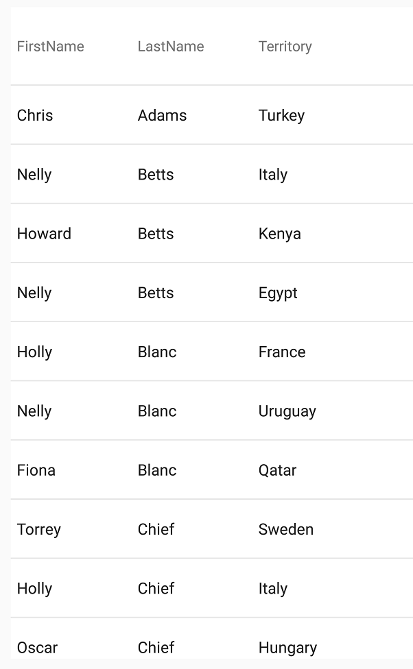
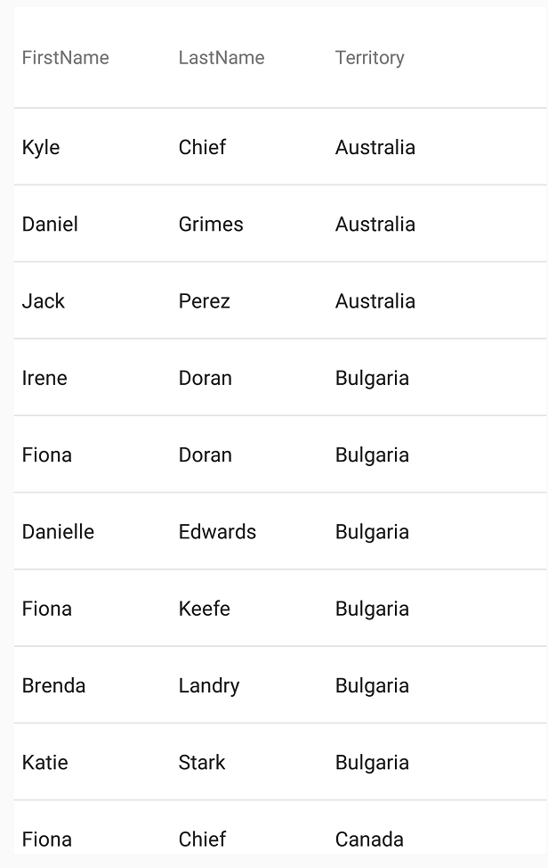

////
|metadata|
{
    "name": "datagrid-sorting",
    "controlName": ["{DataGridName}"],
    "tags": [],
    "guid": "529a67f4-caed-4327-b2ed-7dd7e808371d","buildFlags": [],
    "createdOn": "2016-02-05T19:11:35.6935295Z"
}
|metadata|
////

= 並べ替え

このトピックでは、link:{DataGridLink}.{DataGridName}.html[{DataGridName}] コントロールによって実装できる並べ替えの動作を分かりやすく説明し、簡単に理解できるようにします。

== このトピックの内容

このトピックには、以下のセクションがあります。

* <<RequiredBackground,前提条件>>
* <<_Ref441830695,概要>>
* <<_Ref441830703,列の並べ替え説明>>
* <<_Ref441830710,列のレコードの並べ替え>>
* <<_Ref441830728,複数列レコードの並べ替え>>
* <<RelatedTopics,関連トピック>>

[[RequiredBackground]]   
== 前提条件

本トピックの理解を深めるために、以下のトピックを参照することをお勧めします。

[options="header", cols="a,a"]
|====
|トピック|目的

| link:datagrid-getting-started-with-grid.html[{DataGridName} を使用した作業の開始] 
| このトピックでは、{DataGridName} コントロールをビューに追加してサンプルデータを生成するための基本的な手順を紹介します。

| link:SampleSalesPerson.html[営業担当者サンプル] 
| このリソース トピックは、 {DataGridName} コントロールのデータソースを使用したサンプル データの実装を提供します。

|====

[[_Ref441830695]]
== 概要

{DataGridName} コントロールを使用すると、 link:{DataGridLink}.column_members.html[Column] のレコードを並べ替えることができます。残りの列の関連コンテンツは、それに伴って並べ替えられ、これらの並べ替えられたレコードの集計が {DataGridName} コントロールの UI に表示されます。並べ替えは、ローカルおよびリモートのデータ ソースに実装できます。詳細については、以下のトピックを参照してください。

* link:datagrid-binding-remote-data-source.html[リモート データ ソースへのバインディング]
* link:datagrid-binding-local-data-source.html[ローカル データ ソースへのバインディング]

次の手順では、並べ替えを実装する方法を紹介します。

== {DataGridLinkBase}.ListSortDirection

[start=1]
. {DataGridName} コントロールをデータにバインドします。
[start=2]
. link:{DataGridLink}.ColumnSortDescription.html[ColumnSortDescription] クラスの新しいインスタンスを作成し、そのパラメーターを並べ替える link:{DataGridLink}.Column_members.html[Column] のpick:[android="キー"]pick:[xaml=" `PropertyPath` "]として、また使用する link:{DataGridLinkBase}.listsortdirection.html[ListSortDirection] として渡します（昇順または降順）。
[start=3]
. `ColumnSortDescription` オブジェクトを {DataGridName} コントロールの link:{DataGridLink}.columnsortdescriptioncollection.html[ColumnSortDescriptionCollection] コレクションに追加します。

[[_Ref441830703]]
== 列の並べ替え説明

link:{DataGridLink}.ColumnSortDescription.html[ColumnSortDescription] オブジェクトは、{DataGridName} コントロールに対して、レコードの並べ替える方法を指定するために使用します。各 `ColumnSortDescription` は、単一の並べ替え動作を行います（「LastName」 link:{DataGridLink}.column_members.html[Column] を昇順で並べ替えるなど）。複数の `ColumnSortDescription` オブジェクトを {DataGridName} コントロールに同時に割り当て、より複雑な並べ替え動作ができます（詳細は、「<<_Ref441830728,複数列のレコードの並べ替えの例>>」を参照してください）。

{DataGridName} コントロールは、 `ColumnSortDescription` オブジェクトがある場合、それを link:{DataGridLink}.ColumnSortDescriptionCollection.html[ColumnSortDescriptionCollection] コレクション内で反復することによって、並べ替える方法を決定します。 `ColumnSortDescription` オブジェクトがない場合、{DataGridName} コントロールは基本の link:{DataGridLink}.{DataGridName}{ApiProp}{ApiDatasource}.html[{ApiDataSource}] の元のレコードの順序を維持します。

`ColumnSortDescription` オブジェクトは、各レコードが並べ替えられる {DataGridName} コントロールの {ApiDataSource} にプロパティが割り当てられ（たとえば、 link:{DataGridLink}.column_members.html[Column] に割り当てられるパブリック プロパティ）、並べ替えの方向を示す `ColumnSortDescription` が列レコードに適用されます（昇順または降順）。

[[_Ref441830710]]
== 列レコードの並べ替え

次の例では、基本的な並べ替えの動作を実装する方法を紹介します。このシナリオでは、{DataGridName} コントロールが、3 つの  link:{DataGridLink}.column_members.html[Column]（FirstName、LastName、および Territory）を含むデータにバインドされ、LastName link:{DataGridLink}.column_members.html[Column] に昇順の並べ替え動作が適用されます。

このコード スニペットは、LastName link:{DataGridLink}.Column_members.html[Column] pick:[android="キー"]pick:[xaml=" `PropertyPath` "]で link:{DataGridLink}.ColumnSortDescription.html[ColumnSortDescription] クラスのインスタンスを作成し、link:{DataGridLinkBase}.ListSortDirection.html[ListSortDirection] 列挙型を使用して昇順の並べ替えで渡します。link:{DataGridLink}.{DataGridName}{ApiPropGet}SortDescriptions.html[pick:[android="set"]SortDescriptions] {ApiMember}を使用して {DataGridName} コントロールの ColumnSortDescription オブジェクトを link:{DataGridLink}.ColumnSortDescriptionCollection.html[ColumnSortDescriptionCollection] コレクションに追加します。

ifdef::android[]
*Java の場合:*

[source,js]
----
SortDescription nameSortDescription = new SortDescription("LastName", SortDirection.ASCENDING);
DataGrid.getSortDescriptions().add(nameSortDescription);
----
endif::android[]

ifdef::xamarin[]
*C# の場合:*

[source,csharp]
----
var description = new ColumnSortDescription("LastName", ListSortDirection.Ascending);
DataGrid.SortDescriptions.Add(description);
----

endif::xamarin[]

次のスクリーンショットは、結果の並べ替え動作を示しています。LastName link:{DataGridLink}.Column_members.html[Column] 内のレコードが昇順で並べ替えられ、他の関連するレコードもすべてそれに伴って並べ替えられていることを確認してください。

[[_Ref441830728]]
== 複数列レコードの並べ替え

複数の link:{DataGridLink}.ColumnSortDescription.html[ColumnSortDescription] オブジェクトを同時に {DataGridName} コントロールに適用できます。このような状況では、{DataGridName} コントロールは、割り当てられた link:{DataGridLink}.columnsortdescriptioncollection.html[ColumnSortDescriptionCollection] の同期操作を実行し、並べ替え条件を満足させます。この処理の場合、{DataGridName} コントロールが `ColumnSortDescriptionCollection` コレクション内を反復して、コレクション内に存在する順序に基づき、各 `ColumnSortDescription` の並べ替え動作の優先順を決定します（item[0] を最初に実行、item[1] を 2 番目に実行など）。この方法により、複数列の並べ替えが可能になります。データはグループで並べ替えられ、グループ自体も並べ替えられます。

次の例で、複数の並べ替え動作を説明します。

このシナリオでは、2 つの `ColumnSortDescription` オブジェクトが {DataGridName} コントロールに適用されます。最初の `ColumnSortDescription` は Territory link:{DataGridLink}.Column_members.html[Column] をターゲットにして昇順で並べ替えます。2 つ目は LastName `Column` をターゲットにして、同様に昇順で並べ替えます。この組み合わせの `ColumnSortDescription` オブジェクトを使用することによって、擬似グループ化の動作が行われます。指定された領域に割り当てられた個人の名前が領域でグループ化され (昇順で並べ替えたリスト)、個人の各グループも昇順でリスト化されます。

ifdef::android[]
*Java の場合:*

[source,js]
----
SortDescription sorting1 = new SortDescription("Territory”, SortDirection.ASCENDING);
SortDescription sorting2 = new SortDescription("LastName”, SortDirection.ASCENDING);

DataGrid.getSortDescriptions().add(sorting1);
DataGrid.getSortDescriptions().add(sorting2);
----
endif::android[]

ifdef::xamarin[]

*C# の場合:*

[source,csharp]
----
var sorting1 = new ColumnSortDescription("Territory", ListSortDirection.Ascending);
var sorting2 = new ColumnSortDescription("LastName", ListSortDirection.Ascending);

DataGrid.SortDescriptions.Add(sorting1);
DataGrid.SortDescriptions.Add(sorting2);
----

endif::xamarin[]

次のスクリーンショットは、Territory 列と LastName 列に適用した並べ替え動作の結果を示しています。

Territory link:{DataGridLink}.column_members.html[Column] が最初に昇順で並べ替えられ、次に LastName 列も昇順で並べ替えられていることに注意してください。{DataGridName} コントロールがこれらの並べ替え操作を同期するため、両方の条件が満たされます（ link:{DataGridLink}.columnsortdescription.html[ColumnSortDescription] が実行された順序が、それらの優先順位を示しています）。このようにして、領域に割り当てられたすべてのデータ項目が領域によってグループ化され、項目の各グループも昇順で並べ替えらえます。

[[RelatedTopics]]   
=== 関連トピック

以下の表は、このトピックに関連するトピックを示します。

[options="header", cols="a,a"]
|====
|トピック|目的
 
| link:datagrid-supported-column-types.html[サポートされる列タイプ]
|このトピックでは、{DataGridName} コントロールでサポートされる列タイプの情報を提供します。
  
| link:datagrid-working-with-columns.html[列の作業]
|このトピックでは、{DataGridName} コントロールで列を使用する際のコード例を提供します。

| link:datagrid-filtering-grid.html[グリッドのフィルタリング]
|このトピックは、{DataGridName} コントロールのフィルタリング動作に関する情報とコード例を提供します。
|====