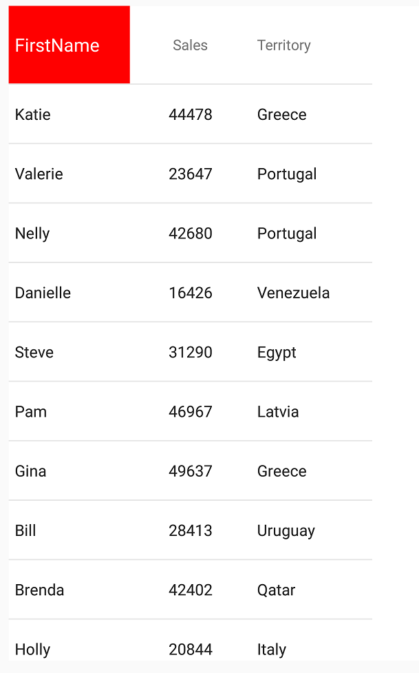
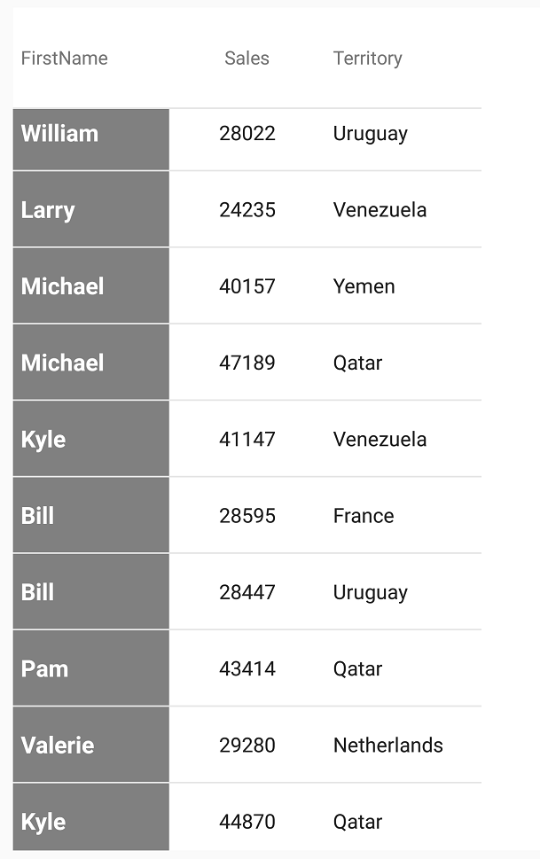

////
|metadata|
{
    "name": "datagrid-styling-the-grid",
    "controlName": ["{DataGridName}"],
    "tags": [],
    "guid": "2e24e5c5-7f19-4103-b242-fa1a2c77d950",
    "buildFlags": [],
    "createdOn": "2016-02-05T19:12:12.1065345Z"
}
|metadata|
////

= {DataGridName} のスタイル設定

このトピックでは、テキストおよび {DataGridName} コントロールに関連付けられた要素のスタイル設定に必要な基本手順を説明し、link:{DataGridLink}.{DataGridName}.html[{DataGridName}] コントロールの外観のカスタマイズを通して、ユーザーができるだけ早く操作に慣れることができるようにします。

== このトピックの内容

このトピックには、以下のセクションがあります。

* <<Requirements,前提条件 >>
* <<StylingRows,行のスタイル設定 >>
* <<StylingHeaders,列ヘッダーのスタイル設定>>
* <<_Column_Content_Styling,列コンテンツのスタイル設定 >>
* <<RelatedTopics,関連トピック>>

[[Requirements]]   
== 前提条件

本トピックの理解を深めるために、以下のトピックを参照することをお勧めします。

[options="header", cols="a,a"]
|====
|トピック|目的

| link:datagrid-getting-started-with-grid.html[{DataGridName} を使用した作業の開始] 
| このトピックでは、{DataGridName} コントロールをビューに追加してサンプルデータを生成するための基本的な手順を紹介します。

| link:SampleSalesPerson.html[営業担当者サンプル] 
| このリソース トピックは、 {DataGridName} コントロールのデータソースを使用したサンプル データの実装を提供します。

|====

[[StylingRows]]
== 行のスタイル設定

{DataGridName} コントロールは、行要素のスタイル設定に関連した以下のpick:[xaml="プロパティ"]pick:[android="メソッド"]を公開します。

[options="header", cols="a,a,a"]
|====
|*{DataGridName} のスタイル設定の動作*|*{ApiMember}*|*詳細*

|*HeaderHeight* 
| link:{DataGridLink}.{DataGridName}{ApiProp}headerheight.html[pick:[android="set"]HeaderHeight]
|ヘッダー行の高さを設定できます。この行には、{DataGridName} コントロールに存在するすべての列ヘッダーが含まれます。

|*RowHeight* 
| link:{DataGridLink}.{DataGridName}{ApiProp}rowheight.html[DataGrid.pick:[android="set"]RowHeight]
|{DataGridName} コントロール内のすべての行の高さを設定できます。

|*RowSeparatorHeight* 
| link:{DataGridLink}.{DataGridName}{ApiProp}rowseparatorheight.html[DataGrid.pick:[android="set"]RowSeparatorHeight]
|各行の間に存在するセパレーター バーの高さを設定できます。

|*RowSeparatorStyle* 
| link:{DataGridLink}.{DataGridName}{ApiProp}rowseparator.html[DataGrid.pick:[android="set"]RowSeparator] 

ifdef::android[]
link:{DataGridLink}.{DataGridName}{ApiPropGet}RowSeparator.html[DataGrid.pick:[android="get"]RowSeparator] 
endif::android[]

| link:{DataGridLink}.rowseparator.html[RowSeparator] インスタンスへの正確な参照を取得する、または{DataGridName} コントロールが使用する独自のインスタンスを提供することによって、それらの任意の外観プロパティを変更できます。

|====

次の例では、すべてのスタイル動作を変更して、{DataGridName} コントロールの上位外観をカスタマイズする方法を順を追って説明します。

[start=1]
. 次のコード スニペットをメイン コード ファイルに追加します。

ifdef::android[]
*Java の場合:*

[source,js]
----
RowSeparator separator = new RowSeparator();
separator.setBackground(new SolidColorBrush(Color.BLUE));
DataGrid.setRowSeparator(separator);
DataGrid.setRowSeparatorHeight(5);
DataGrid.setRowHeight(50);
----
endif::android[]

ifdef::xamarin[]
*XAML の場合:*

[source, xaml]
----
<ig:XamDataGrid RowSeparatorHeight="4"
                RowHeight="50">
    <ig:XamDataGrid.RowSeparator>
        <ig:RowSeparator Background="Blue"/>
    </ig:XamDataGrid.RowSeparator>
</ig:XamDataGrid>
----

*C# の場合:*

[source, csharp]
----
DataGrid.RowSeparator = new RowSeparator();
DataGrid.RowSeparator.Background = new SolidColorBrush(Color.Blue);
DataGrid.RowSeparatorHeight = 5;
DataGrid.RowHeight = 50;
----

endif::xamarin[]

[start=2]
. アプリケーションを保存して実行し、外観の変化を確認します。 RowSeparator は、背景が青、高さが 5 ピクセルで表示されます。

[[StylingHeaders]]
== 列ヘッダーのスタイル設定

{DataGridName} コントロールの link:{DataGridLink}.textheader_members.html[ヘッダー] オブジェクトは、そのヘッダーとテキストの外観を変更するメソッドを複数公開します。

[options="header", cols="a,a,a"]
|====
|*ヘッダーのスタイル設定の動作*|*{ApiMember}*|*詳細*

|Height
| link:{DataGridLink}.{DataGridName}{ApiProp}HeaderHeight.html[DataGrid.pick:[android="set"]HeaderHeight]
|ヘッダー行の高さを設定できます。この行には、{DataGridName} コントロールに存在するすべての列ヘッダーが含まれます。

|BackgroundColor
| link:{DataGridLink}.definitionbase{ApiProp}background.html[Header.pick:[android="set"]Background]
|列のヘッダー要素の背景色を設定できます。

|FontFamily
| link:{DataGridLink}.definitionbase{ApiProp}fontfamily.html[Header.pick:[android="set"]FontFamily]
|列のヘッダーで使用されるフォント ファミリを指定できます。

|FontSize
| link:{DataGridLink}.definitionbase{ApiProp}fontsize.html[Header.pick:[android="set"]FontSize]
|列のヘッダーで使用されるテキストのポイント サイズを設定できます。

ifdef::xaml[]
|FontStyle
| link:{DataGridLink}.DefinitionBase{ApiProp}FontAttributes.html[Header.pick:[android="set"]FontAttributes]
|列のヘッダー内のテキストで使用されるフォントのスタイル属性を指定できます。
endif::xaml[]

ifdef::android[]
|Font Style
| link:{DataGridLink}.DefinitionBase{ApiProp}FontStyle.html[Header.pick:[android="set"]FontStyle]
|列のヘッダー内のテキストで使用されるフォントのスタイルを指定できます。
endif::android[]

|HorizontalAlignment
| link:{DataGridLink}.definitionbase{ApiProp}horizontalalignment.html[Header.pick:[android="set"]HorizontalAlignment]
|列のヘッダー内のテキストの配置を水平プレインに沿って設定できます。

|VerticalAlignment
| link:{DataGridLink}.definitionbase{ApiProp}verticalalignment.html[Header.pick:[android="set"]VerticalAlignment]
|列のヘッダー内のテキストの配置を垂直プレインに沿って設定できます。

ifdef::android[]
|TypeFace
| link:{DataGridLink}.definitionbase{ApiProp}typeface.html[Header.pick:[android="set"]Typeface]
|列のヘッダーで使用される TypeFace を設定できます。この設定は、フォント ファミリーの設定に優先します。
endif::android[]

|TextColor
| link:{DataGridLink}.definitionbase{ApiProp}textcolor.html[Header.pick:[android="set"]TextColor]
|列のヘッダー内に含まれるテキストに、特定のブラシの色を割り当てることができます。

ifdef::xaml[]
|TextLineBreakMode 
| link:{DataGridLink}.DefinitionBase{ApiProp}LineBreakMode.html[Header.pick:[android="set"]LineBreakMode]
|列のセル内に表示するテキストの長さを制御するために特定の link:{DataGridLink}.TextCellLineBreakMode.html[TextCellLineBreakMode] enum を使用できます。

|TextPadding
| 
link:{DataGridLink}.Header{ApiProp}PaddingBottom.html[Header.pick:[android="set"]PaddingBottom]

link:{DataGridLink}.Header{ApiProp}PaddingLeft.html[Header.pick:[android="set"]PaddingLeft]

link:{DataGridLink}.Header{ApiProp}PaddingRight.html[Header.pick:[android="set"]PaddingRight]

link:{DataGridLink}.Header{ApiProp}PaddingTop.html[Header.pick:[android="set"]PaddingTop]
|列のヘッダー内に含まれるテキスト周りに特定のパディングを適用できます。
endif::xaml[]

|====

次の例では、ヘッダー要素とヘッダーのテキストにいくつかの外観メソッドを使用して、{DataGridName} コントロールの link:{DataGridLink}.column_members.html[Column] ヘッダーの外観をカスタマイズする基本的なシナリオを順を追って説明します。

[start=1]
. 次のコード スニペットをメイン コード ファイルに追加します。

ifdef::android[]
*Java の場合:*

[source,js]
----
TextColumn nameColumn = new TextColumn();
nameColumn.setKey("FirstName");

NumericColumn salesColumn = new NumericColumn();
salesColumn.setKey("Sales");

TextColumn territoryColumn = new TextColumn();
territoryColumn.setKey("Territory");

{DataGridName} DataGrid = new {DataGridName}(this);
DataGrid.setAutoGenerateColumns(false);
DataGrid.setDataSource(SampleSalesPerson.GenerateSalesData(300));
DataGrid.addColumn(nameColumn);
DataGrid.addColumn(salesColumn);
DataGrid.addColumn(territoryColumn);
----
endif::android[]

ifdef::xamarin[]

*C# の場合:*

[source, csharp]
----
TextColumn nameColumn = new TextColumn();
nameColumn.PropertyPath = "FirstName";
nameColumn.HeaderText = "FirstName";

NumericColumn salesColumn = new NumericColumn();
salesColumn.PropertyPath = "Sales";
salesColumn.HeaderText = "Sales"; 

TextColumn territoryColumn = new TextColumn();
territoryColumn.PropertyPath = "Territory";
territoryColumn.HeaderText = "Territory";

DataGrid.Columns.Add(nameColumn);
DataGrid.Columns.Add(salesColumn);
DataGrid.Columns.Add(territoryColumn);
----
endif::xamarin[]

[start=2]
. 以下のプロパティで link:{DataGridLink}.TextHeader.html[TextHeader] クラスのインスタンスを作成します。

ifdef::android[]
*Java の場合:*

----
TextHeader header = new TextHeader();
header.setFontSize(15);
header.setBackground(new SolidColorBrush(Color.RED));
header.setTextColor(new SolidColorBrush(Color.WHITE));
nameColumn.setHeader(colHeader);
----
endif::android[]

ifdef::xamarin[]
*C# の場合:*
[source, csharp]
----
var header = new TextHeader();
header.Background = new SolidColorBrush(Color.Red);
header.TextColor = new SolidColorBrush(Color.White);
header.FontSize = 15;
nameColumn.Header = header;
----
endif::xamarin[]

または、nameColumn を表す link:{DataGridLink}.header_members.html[Header] オブジェクトの正確なインスタンスを取得し、そのインスタンスを直接編集することもできます。この方法を使用すると、すべてのプロパティ変更が、{DataGridName} コントロールの UI すべてに伝播されます。次のコードで、この方法を説明します。

ifdef::android[]
*Java の場合:*

----
Header header = nameColumn.getHeader();
header.setFontSize(15);
header.setBackground(new SolidColorBrush(Color.RED));
header.setTextColor(new SolidColorBrush(Color.WHITE)); 
----
endif::android[]

ifdef::xamarin[]
*C# の場合:*
[source, csharp]
----
var header = nameColumn.Header;
header.Background = new SolidColorBrush(Color.Red);
header.TextColor = new SolidColorBrush(Color.White);
header.FontSize = 15; 
----
endif::xamarin[]

[start=3]
. 次のスクリーンショットに示すように、アプリケーションを保存して実行し、結果を確認します。

[[StylingCells]]
== 列コンテンツのスタイル設定 

link:{DataGridLink}.column_members.html[Column] オブジェクトは、列の幅、テキストの配置、およびテキストの外観など、集計内に含まれるセルの視覚的コンポーネントを変更するためのメソッドを複数公開します。

[options="header", cols="a,a,a"]
|====
|*列のスタイル設定の動作*|*{ApiMember}*|*詳細*

|コンテンツ不透明度
| link:{DataGridLink}.definitionbase{ApiProp}contentopacity.html[Column.pick:[android="set"]ContentOpacity]
|列のセル内のコンテンツ（テキストおよび画像を含む）の透明度を調整できます。

|Width
| link:{DataGridLink}.column{ApiProp}width.html[Column.pick:[android="set"]Width]
|列の幅を調整できます。

|Background
| link:{DataGridLink}.definitionbase{ApiProp}background.html[Column.pick:[android="set"]Background]
|列内のセルの塗りつぶしに使用する特定の色を設定できます。

|SelectedBackground
| link:{DataGridLink}.column{ApiProp}selectedbackground.html[Column.pick:[android="set"]SelectedBackground]
|列が選択された場合に、列内のセルの特定の色を設定できます。

|FontFamily
| link:{DataGridLink}.definitionbase{ApiProp}fontfamily.html[Column.pick:[android="set"]FontFamily]
|列のセルのテキストで使用される FontFamily を指定できます。

|FontSize
| link:{DataGridLink}.definitionbase{ApiProp}fontsize.html[Column.pick:[android="set"]FontSize]
|列のセルで使用されるフォントのポイント サイズを設定できます。

ifdef::xaml[]
|FontStyle
| link:{DataGridLink}.DefinitionBase{ApiProp}FontAttributes.html[Column.pick:[android="set"]FontAttributes]
|列のセル内のテキストで使用されるフォントのスタイル属性を指定できます。
endif::xaml[]

ifdef::android[]
|FontStyle
| link:{DataGridLink}.definitionbase{ApiProp}fontstyle.html[Column.pick:[android="set"]FontStyle]
|列のセル内のテキストで使用されるフォントのスタイルを指定できます。
endif::android[]

|HorizontalAlignment
| link:{DataGridLink}.definitionbase{ApiProp}horizontalalignment.html[Column.pick:[android="set"]HorizontalAlignment]
|列のセル内のテキストの配置を水平プレインに沿って設定できます。

|VerticalAlignment
| link:{DataGridLink}.definitionbase{ApiProp}verticalalignment.html[Column.pick:[android="set"]VerticalAlignment]
|列のセル内のテキストの配置を垂直プレインに沿って設定できます。

ifdef::android[]
|TypeFace
| link:{DataGridLink}.definitionbase{ApiProp}typeface.html[Column.pick:[android="set"]Typeface]
|列のセルで使用される TypeFace を設定できます。この設定は、FontFamily の設定に優先します。
endif::android[]

|TextColor
| link:{DataGridLink}.definitionbase{ApiProp}textcolor.html[Column.pick:[android="set"]TextColor]
|列のセル内に含まれるテキストに、特定のブラシの色を割り当てることができます。

ifdef::xaml[]
|TextLineBreakMode 
| link:{DataGridLink}.DefinitionBase{ApiProp}LineBreakMode.html[Column.pick:[android="set"]LineBreakMode]
|列のセル内に表示するテキストの長さを制御するために特定の link:{DataGridLink}.TextCellLineBreakMode.html[TextCellLineBreakMode] enum を使用できます。

|TextPadding
| 
link:{DataGridLink}.Column{ApiProp}PaddingBottom.html[Column.pick:[android="set"]PaddingBottom]

link:{DataGridLink}.Column{ApiProp}PaddingLeft.html[Column.pick:[android="set"]PaddingLeft]

link:{DataGridLink}.Column{ApiProp}PaddingRight.html[Column.pick:[android="set"]PaddingRight]

link:{DataGridLink}.Column{ApiProp}PaddingTop.html[Column.pick:[android="set"]PaddingTop]
|列のセル内に含まれるテキスト周りに特定のパディングを適用できます。
endif::xaml[]

|====

この例では、列要素の {DataGridName} 内の列の外観と、列に関連するセル内のコンテンツをカスタマイズする方法を順を追って説明します。

この例は、 link:datagrid-working-with-columns.html[列の作業]のトピックで説明する SampleGridApp プロジェクトを作成済みであることが前提です。

[start=1]
. 次のコード スニペットをメイン コード ファイルに追加します。

ifdef::android[]
*Java の場合:*

[source,js]
----
TextColumn nameColumn = new TextColumn();
nameColumn.setKey("FirstName");

NumericColumn salesColumn = new NumericColumn();
salesColumn.setKey("Sales");

TextColumn territoryColumn = new TextColumn();
territoryColumn.setKey("Territory");

{DataGridName} DataGrid = new {DataGridName}(this);
DataGrid.setAutoGenerateColumns(false);
DataGrid.setDataSource(SampleSalesPerson.GenerateSalesData(300));
DataGrid.addColumn(nameColumn);
DataGrid.addColumn(salesColumn);
DataGrid.addColumn(territoryColumn);
----
endif::android[]

ifdef::xamarin[]
*C# の場合:*

[source, csharp]
----
TextColumn nameColumn = new TextColumn();
nameColumn.PropertyPath = "FirstName";
nameColumn.HeaderText = "FirstName";

NumericColumn salesColumn = new NumericColumn();
salesColumn.PropertyPath = "Sales";
salesColumn.HeaderText = "Sales"; 

TextColumn territoryColumn = new TextColumn();
territoryColumn.PropertyPath = "Territory";
territoryColumn.HeaderText = "Territory";
  
DataGrid.Columns.Add(nameColumn);
DataGrid.Columns.Add(salesColumn);
DataGrid.Columns.Add(territoryColumn);
----

endif::xamarin[]

[start=2]
. 次のプロパティを設定して、nameColumn の link:{DataGridLink}.column_members.html[Column] ヘッダーのスタイルを変更します。

* 背景色 - 灰色
* テキスト色 - 白色
* フォント スタイル - 太字
* フォント サイズ - 15

ifdef::android[]
*Java の場合:*

----
nameColumn.setFontSize(15);
nameColumn.setFontStyle(FontStyles.BOLD); 
nameColumn.setBackground(new SolidColorBrush(Color.GRAY));
nameColumn.setTextColor(new SolidColorBrush(Color.WHITE));
----
endif::android[]

ifdef::xamarin[]
*C# の場合:*

[source, csharp]
----
nameColumn.FontSize = 15;
nameColumn.FontAttributes = FontAttributes.Bold;
nameColumn.Background = new SolidColorBrush(Color.Gray);
nameColumn.TextColor = new SolidColorBrush(Color.White);
----

endif::xamarin[]

[start=3]
. 結果を確認するために、SampleGridApp を保存し実行します。

[[RelatedTopics]]   
=== 関連トピック

以下の表は、このトピックに関連するトピックを示します。

[options="header", cols="a,a"]
|====
|トピック|目的
 
| link:datagrid-supported-column-types.html[サポートされる列タイプ]
|このトピックでは、{DataGridName} コントロールでサポートされる列タイプの情報を提供します。
  
| link:datagrid-working-with-columns.html[列の作業]
|このトピックでは、{DataGridName} コントロールで列を使用する際のコード例を提供します。
|====