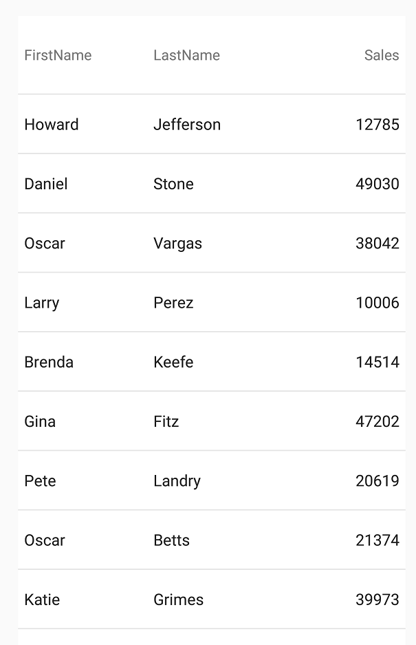

////
|metadata|
{
    "name": "datagrid-working-with-columns",
    "controlName": ["{DataGridName}"],
    "tags": [],
    "guid": "d921078c-d0d5-4aca-8ac3-bf9fb2e0b2b6","buildFlags": [],
    "createdOn": "2016-02-05T19:12:36.6773736Z"
}
|metadata|
////

= 列の作業

このトピックでは、link:{DataGridLink}.{DataGridName}.html[{DataGridName}] コントロールの作業で使用できる、サポートされている列タイプと一般的な列の操作を分かりやすく説明し、理解を深めることができるようにします。

== このトピックの内容

このトピックは、以下のセクションで構成されます。

* <<Background,前提条件>>
* <<_Ref435537616,列の自動生成>>
* <<_Ref440618575,概念的な概要>>
* <<_Ref435537735,手動による列の定義>>
* <<_Ref440618663,手動による列の定義の例>>
* <<_Ref440618664,自動生成列の列タイプをオーバーライド>>
* <<_Ref435537745,列の操作>>

[[RequiredBackground]]   
== 前提条件 

本トピックの理解を深めるために、以下のトピックを参照することをお勧めします。

[options="header", cols="a,a"]
|====
|トピック|目的

| link:datagrid-getting-started-with-grid.html[{DataGridName} を使用した作業の開始] 
| このトピックでは、{DataGridName} コントロールをビューに追加してサンプルデータを生成するための基本的な手順を紹介します。

| link:SampleSalesPerson.html[営業担当者サンプル] 
| このリソース トピックは、 {DataGridName} コントロールのデータソースを使用したサンプル データの実装を提供します。

|====

[[_Ref435537616]]
== 列の自動生成

このプロパティを使用すると、割り当てられたデータ ソースに存在するデータのカテゴリごとに、グリッドが自動的に列を作成するかどうかを設定できます。

[[_Ref440618575]]
== 概念的な概要:

{DataGridName} コントロールは、デフォルトでは公開されている基本データに基づき、自動的に適切な列のタイプを決定して、データ項目のpick:[android="フィールド"]pick:[xaml="プロパティ"]の型ごと（またはパブリック プロパティごと）に列を作成します。たとえば、「 link:datagrid-getting-started-with-grid.html[{DataGridName} を使用した作業の開始]」のトピックで使用される link:samplesalesperson.html[SampleSalesPerson] クラスでは、ビュー内でパブリック プロパティが使用されています。

ifdef::android[]
*Java の場合:*

[source, java]
----
public class SampleSalesPerson
{
    public String FirstName;    // public property FirstName
    public String LastName;     // public property LastName
    public String Territory;    // public property Territory
    public int Sales;           // public property Sales
}
----
endif::android[]

ifdef::xamarin[]
*C# の場合:*
[source, csharp]
----
public class SampleSalesPerson
{
    public string FirstName { get; set; }
    public string LastName { get; set; }
    public string Territory { get; set; }
    public int Sales { get; set; }
}
----
endif::xamarin[]

FirstName、LastName、Sales、および Territory という 4 つのパブリック プロパティがあることに注意してください。{DataGridName} コントロールは、これらの各プロパティのデータ型に基づき列を作成します。この処理をさらに概念化してみましょう。たとえばいくつかの link:samplesalesperson.html[SampleSalesPerson] オブジェクトを作成してリストに追加した場合に、各 link:samplesalesperson.html[SampleSalesPerson] オブジェクトには、FirstName、LastName、Sales、および Territory プロパティに一意の値が割り当てられているとします。

これを前提とすると、次に示すコードのように、このリストは {DataGridName} コントロールの link:{DataGridLink}.{DataGridName}~{ApiDataSource}.html[{ApiDataSource}] として割り当てられ、{DataGridName} コントロールの link:{DataGridLink}.{DataGridName}{ApiProp}autogeneratecolumns.html[pick:[android="set"]AutoGenerateColumn] {ApiMember}には、パラメーターとしてブール値 True が渡されます。

ifdef::android[]
*Java の場合:*

[source,js]
----
DataGrid.setAutoGenerateColumns(true);
----
endif::android[]

ifdef::xamarin[]
*XAML の場合:*
[source, xaml]
----
<ig:XamDataGrid x:Name="DataGrid" AutoGenerateColumns="True" />
----
endif::xamarin[]

{DataGridName} コントロールは、データ型に基づき適切なタイプの個別の列を 4 つ作成し、各プロパティの名前をそれに関連付られた列の名前として使用します。

[options="header", cols="a,a,a"]
|====
|プロパティ名|プロパティ タイプ|列タイプ

| FirstName
| `String`
| link:{DataGridLink}.TextColumn_members.html[TextColumn] 

| LastName
| `String`
| link:{DataGridLink}.TextColumn_members.html[TextColumn] 

| Territory
| `String`
| link:{DataGridLink}.TextColumn_members.html[TextColumn] 
 
| Sales
| `Int`
| link:{DataGridLink}.NumericColumn_members.html[NumericColumn] 
 
|====

結果の {DataGridName} は、次のスクリーンショットのようになります。

== 手動による列の定義

{DataGridName} コントロールを使用すると、手動で列を定義できます。これにより、列の表示方法を完全に制御できます。

この動作が使用されるシナリオは 2 つあります。

* {DataGridName} コントロールが特定のタイプのデータの列のみを作成するようにする場合。
* {DataGridName} コントロールが自動的に作成する列の選択に、特定の列タイプのみが使用されるようにする場合。

デフォルトでは、{DataGridName} コントロールはデータに基づき、すべての列を自動的に作成します。ただし、使用する列のタイプを明示的に選択するオプションも用意されています。

[[_Ref440618663]]
== 手動による列の定義の例

以下のコード例は、{DataGridName} コントロールの link:{DataGridLink}.TextColumn_members.html[TextColumn] および link:{DataGridLink}.NumericColumn_members.html[NumericColumn] を手動で定義する方法を示します。ただし、任意のlink:datagrid-supported-column-types.html[サポートされる列タイプ]に同じロジックを使用できます。

この例は、link:SampleSalesPerson.html[SampleSalesPerson] クラスを 4 パブリック プロパティ (FirstName、LastName、Sales、Territory) を持つデータ項目の実装に使用しています。ただし、基になるデータ項目の 4 つのプロパティすべての列を自動生成するデフォルトの動作とは対照的に手動で 3 つのプロパティ (FirstName、LastName、Sales) のみの列を定義します。

[start=1]
.  {DataGridName} コントロールの link:{DataGridLink}.{DataGridName}{ApiProp}AutoGenerateColumns.html[pick:[android="set"]AutoGenerateColumns] {ApiMember}を使用して列の自動生成を無効にします。

ifdef::android[]
*Java の場合:*
[source, java]
----
DataGrid.setAutoGenerateColumns(false);
----
endif::android[]

ifdef::xamarin[]
*XAML の場合:*
[source, xaml]
----
<ig:XamDataGrid x:Name="DataGrid" AutoGenerateColumns="False" />
----

*C# の場合:*
[source, csharp]
----
DataGrid.AutoGenerateColumns = false;
----
endif::xamarin[]

[start=2]
. 文字列プロパティのための `TextColumn` の 2 つのインスタンス、そして数値プロパティのための `NumericColumn` の 1 つのインスタンスを作成します。

ifdef::android[]
*Java の場合:*
[source, java]
----
TextColumn column1 = new TextColumn();
column1.setKey("FirstName");

TextColumn column2 = new TextColumn();
column2.setKey("LastName");

NumericColumn column3 = new NumericColumn();
column3.setKey("Sales");

DataGrid.addColumn(column1);
DataGrid.addColumn(column2);
DataGrid.addColumn(column3); 
----
endif::android[]

ifdef::xamarin[]
*XAML の場合:*
[source, xaml]
----
<ig:XamDataGrid.Columns>  
    <ig:TextColumn PropertyPath="FirstName" /> 
    <ig:TextColumn PropertyPath="LastName" /> 
    <ig:NumericColumn PropertyPath="Sales" /> 
</ig:XamDataGrid.Columns>                
----

*C# の場合:*
[source, csharp]
----
TextColumn column1 = new TextColumn();
column1.PropertyPath = "FirstName"; 

TextColumn column2 = new TextColumn();
column2.PropertyPath = "LastName"; 

NumericColumn column3 = new NumericColumn();
column3.PropertyPath = "Sales"; 
  
DataGrid.Columns.Add(column1);
DataGrid.Columns.Add(column2);
DataGrid.Columns.Add(column3);
----
endif::xamarin[]

[start=3]

. アプリケーションを実行します。{DataGridName} コントロールは 2 つの `TextColumn` タイプと 1 つの `NumericColumn` タイプを表示します。

== 自動生成列の列タイプをオーバーライド

1 つまたは複数の列に使用された特定の列タイプのみを制御し、残りの列は {DataGridName} コントロールで自動的に作成する場合があります。次の手順では、使用する列タイプのみ明示的な制御が必要な場合に、手動でそれらの列を定義する方法を順を追って説明します。

これらの手順では、Sales データに使用される数値の `TextColumn` を追加します。この場合、これらの値は文字列データ型に変換され、`TextColumn` 内でレンダリングされます。

.注:
[NOTE]
====
この列を手動で定義しない、または列が定義済みの場合、`PropertyPath` がデータ プロパティの名前と一致しないと、{DataGridName} コントロールは自動的にこのデータ型の `NumericColumn` を作成し、Int 型を維持します。
====

[start=1]
. {DataGridName} コントロール オブジェクトがインスタンス化された場所の後に、自動的に列を作成するために次のコードを追加します。

ifdef::android[]
*Java の場合:*

[source,js]
----
DataGrid.setAutoGenerateColumns(true);
----
endif::android[]

ifdef::xamarin[]
*XAML の場合:*
[source, xaml]
----
<ig:XamDataGrid x:Name="DataGrid" AutoGenerateColumns="True" />
----

*C# の場合:*
[source, csharp]
----
DataGrid.AutoGenerateColumns = true;
----

endif::xamarin[]

[start=2]
. 数値 "Sales" プロパティにマップして link:{DataGridLink}.TextColumn_members.html[TextColumn] のインスタンスを作成し、デフォルトの `NumericColumn` を `TextColumn` タイプでオーバーライドします。

ifdef::android[]
*Java の場合:*

[source,js]
----
TextColumn column1 = new TextColumn();
column1.setKey(“Sales”);
column1.setTitle(“Sales (As Text)”);
DataGrid.addColumn(column1);
----
endif::android[]

ifdef::xamarin[]
*XAML の場合:*
[source, xaml]
----
<ig:XamDataGrid.Columns>   
    <ig:TextColumn PropertyPath="Sales" HeaderText="Sales (As Text)" /> 
</ig:XamDataGrid.Columns>                
----

*C# の場合:*
[source, csharp]
---- 
TextColumn column1 = new TextColumn();
column1.PropertyPath = "Sales"; 
column1.HeaderText = "Sales (As Text)"; 
DataGrid.Columns.Add(column1); 
----
endif::xamarin[]

[start=3]
. アプリケーションを実行します。{DataGridName} コントロールは、数値プロパティ Sales も含め 4 つの TextColumn オブジェクトを表示します。

表示された Sales 列は、前述の手順で作成した `TextColumn` を使用し、{DataGridName} コントロールのデフォルトの動作を上書きします。デフォルトでは、このデータ型に `NumericColumn` が作成されますが、このコンテキストでは、2 つの列タイプは表示上の区別ができません。

FirstName 列、LastName 列、と Territory 列は、 link:{DataGridLink}.{DataGridName}{ApiProp}autogeneratecolumns.html[pick:[android="set"]AutoGenerateColumns] {ApiMember}を使用して、基本データの残りのプロパティに基づいて {DataGridName} コントロールが自動的に作成します。

image::images/Working_with_Columns_3.png[]

[[_Ref435537745]]
== 列の操作

いくつかの共通の列操作を簡素化するメソッドが {DataGridName} コントロールから公開されています。このようなメソッドには、列の追加、削除、挿入、交換、および非表示があります。このセクションでは、例を示してこれらのメソッドの使用方法を詳しく説明します。

次の例では、列の論理インデックスと表示上のインデックスが同じであるため、{DataGridName} コントロールの link:{DataGridLink}.column_members.html[Column] コレクション内で基本の列に変更を加えると、その変更が {DataGridName} コントロールの UI にすぐに反映されます。

[options="header", cols="a,a,a"]
|====
|列の操作|API の概要|説明

| <<AddingColumns,列の追加>> 
| 
ifdef::android[]
link:{DataGridLink}.{DataGridName}~AddColumn.html[DataGrid.addColumn](`Column` column)
endif::android[]

ifdef::xaml[]
link:{DataGridLink}.GridColumnCollection_members.html[DataGrid.Columns.Add](`Column` column)
endif::xaml[]

| {DataGridName} の右側にある最後の列の後に新しい列を加えて {DataGridName} の列コレクションに追加します。

| <<RemovingColumns,列の削除>> 
| 
ifdef::android[]
link:{DataGridLink}.{DataGridName}~RemoveColumn.html[DataGrid.RemoveColumn](`Column` column)

link:{DataGridLink}.{DataGridName}~RemoveColumnAt.html[DataGrid.RemoveColumnAt](`int` index)
endif::android[]
 
ifdef::xaml[]
link:{DataGridLink}.GridColumnCollection_members.html[DataGrid.Columns.Remove](`Column` column)

link:{DataGridLink}.GridColumnCollection_members.html[DataGrid.Columns.RemoveAt](`int` index)
endif::xaml[]

|　インデックスまたは参照オブジェクトによって {DataGridName} の列コレクションの既存列を削除します。

| <<InsertingColumns,列の挿入>> 
| 
ifdef::android[]
link:{DataGridLink}.{DataGridName}~InsertColumn.html[DataGrid.InsertColumn](`int` index, `Column` column)
endif::android[]

ifdef::xaml[]
link:{DataGridLink}.GridColumnCollection_members.html[DataGrid.Columns.Insert](`int` index, `Column` column)
endif::xaml[]

| {DataGridName} の指定した列コレクションのインデックスに新しい列を挿入します。

| <<MovingColumns,列の移動>> 
| 
link:{DataGridLink}.{DataGridName}~MoveColumn.html[DataGrid.MoveColumn](`int` oldIndex, `int` newIndex)

| 既存の項目を列コレクションの古いインデックスから新しいインデックスへ移動します。

| <<ExchangingColumns,列の交換>> 
| 
link:{DataGridLink}.{DataGridName}~ExchangeColumn.html[DataGrid.ExchangeColumn](`Column` newColumn, `Column` existingColumn) 

| {DataGridName} の列コレクションの既存列と新しい列を交換します。
 
| <<HidingColumns,列の非表示>> 
| 
ifdef::android[]
`Column`.link:{DataGridLink}.column{ApiProp}IsHidden.html[setIsHidden](`true`)
endif::android[]

ifdef::xaml[]
 `Column`.link:{DataGridLink}.column{ApiProp}IsHidden.html[IsHidden] = true
endif::xaml[]

| {DataGridName} の列コレクションの既存列を非表示にします。
 
|====

[[AddingColumns]]
==== 列の追加

{DataGridName} コントロールを使用すると、手動で定義した列に動的に列を追加できます。これは、アプリケーション内で何らかの条件に対する応答として特定の列を追加する必要がある場合に役立ちます。
 
このコード スニペットは pick:[android="`addColumn`"] pick:[xamarin="`Add`"] メソッドを使用して `NumericColumn` を {DataGridName} に追加する方法を示します。 このコードを実行した後に列が既存列 (ある場合) の右側に表示されます。または {DataGridName} の左に最初の列として追加されます。

ifdef::android[]
*Java の場合:*

[source,js]
----
NumericColumn numericColumn = new NumericColumn();
numericColumn.setKey("Sales");

DataGrid.addColumn(numericColumn);
----

endif::android[]
 
ifdef::xamarin[]
*C# の場合:*
[source, csharp]
----
NumericColumn numericColumn = new NumericColumn();
numericColumn.PropertyPath = "Sales";  
DataGrid.Columns.Add(numericColumn); 
----
endif::xamarin[]

==== 列の削除

{DataGridName} コントロールを使用すると、各 pick:[android="`removeColumn` と removeColumnAt"]pick:[xamarin="`Remove` と `RemoveAt`"] メソッドを使用して、手動で定義した列や、自動で生成された列を削除できます。

このコード スニペットは、pick:[android="`removeColumnAt`"]pick:[xamarin="`RemoveAt`"] メソッドを使用して {DataGridName} コントロールでインデックス 1 に定義された列を削除する方法を示します。 このコードをを実行した後に列が削除され右に列がある場合左へシフトされます。

ifdef::android[]
*Java の場合:*
[source, java]
---- 
DataGrid.removeColumnAt(1);
----
endif::android[]

ifdef::xamarin[]
*C# の場合:*
[source, csharp]
---- 
DataGrid.Columns.RemoveAt(1); 
----
endif::xamarin[]

[[InsertingColumns]]
==== 列の挿入

{DataGridName} コントロールを使用すると、手動で定義した列を挿入できます。これは、たとえば {DataGridName} コントロール内の特定の位置に列を追加する必要がある場合に役立ちます。

このコード スニペットは、pick:[android="`insertColumn`"]pick:[xamarin="`Insert`"] メソッドを使用して {DataGridName} コントロールでインデックス 0 に定義された新しい列を挿入する方法を示します。このコードを実行した後に列が {DataGridName} コントロール内の最初の列として表示され、既存の列がある場合は右にシフトされます。

ifdef::android[]
*Java の場合:*

[source,js]
----
NumericColumn numericColumn = new NumericColumn();
numericColumn.setKey("Sales");

DataGrid.insertColumn(0, numericColumn);
----
endif::android[]

ifdef::xamarin[]
*C# の場合:*
[source, csharp]
----
NumericColumn numericColumn = new NumericColumn();
numericColumn.PropertyPath = "Sales";  
DataGrid.Columns.Insert(0, numericColumn); 
----
endif::xamarin[]

[[MovingColumns]]
== 列の移動

{DataGridName} を使用すると、手動で定義した列を動的に配置できます。この動作は、アプリケーションで何らかの条件を満たした場合に、即座に列を再配置する必要がある場合に役立ちます。

このコード スニペットは pick:[android="`moveColumns`"]pick:[xamarin="`MoveColumn`"] メソッドを使用して {DataGridName} コントロールで既存の 2 列を移動する方法を示します。このコードを実行すると、コレクション内の `oldIndex` 位置に存在する列オブジェクトのインデックスが `newIndex` に設定され、コレクション内で newIndex 以上のインデックスを持つすべての列のインデックス位置が 1 つ増分されます。newIndex 未満のインデックス位置で oldIndex 以上のインデックス位置を持つ列は、インデックス位置が 1 つ減分されます。次の例で、この処理を説明します。

ifdef::android[]
*Java の場合:*

[source,js]
----
DataGrid.moveColumn(2, 1);
----
endif::android[]

ifdef::xamarin[]
*C# の場合:*
[source, csharp]
----
DataGrid.MoveColumn(2, 1); 
----
endif::xamarin[]

[[ExchangingColumns]]
== 列の交換

{DataGridName} コントロールを使用すると、手動で定義した列のうち、まだ列コレクションに追加されていない列を、配置済みの列と交換できます。この動作はアプリケーションで何らかの条件を満たした場合の応答として、列内に含まれる現在のデータのセットを、現在表示されていない基本データを使用する別のセットに置き換える必要がある場合に役立ちます。
 
このコード スニペットは、pick:[android="`exchangeColumn`"]pick:[xamarin="`ExchangeColumn`"] メソッドを使用して {DataGridName} コントロールの既存の列を新しい列で置き換える方法を示します。このコードを実行すると、2 番目のパラメーターとして渡された列オブジェクトが  {DataGridName} コントロールから削除され、最初のパラメーターとして渡された列で置き換えられます。

[NOTE]
====
注: 交換する列は、両方とも手動で定義されている必要があります。
====

ifdef::android[]
*Java の場合:*

[source,js]
----
NumericColumn salesColumn = new NumericColumn();
salesColumn.setKey("Sales");
DataGrid.addColumn(salesColumn);

TextColumn territoryColumn = new TextColumn();
territoryColumn.setKey("Territory");
...
DataGrid.exchangeColumn(territoryColumn, salesColumn);
----
endif::android[]

ifdef::xamarin[]
*C# の場合:*
[source, csharp]
----
NumericColumn salesColumn = new NumericColumn();
salesColumn.PropertyPath = "Sales";  
DataGrid.Columns.Add(salesColumn); 

TextColumn territoryColumn = new TextColumn();
territoryColumn.PropertyPath = "Territory";  
...
DataGrid.ExchangeColumn(territoryColumn, salesColumn);
----
endif::xamarin[]

[[HidingColumns]]
== 列の非表示

{DataGridName} コントロールを使用すると、ビューから列を非表示にできます。この動作は、すべての `Column` オブジェクトから公開される pick:[android="`setIsHidden`"]pick:[xamarin="`IsHidden`"] {ApiMember}からアクセスできます。列を非表示にする動作は、アプリケーションの何らかの条件によって、ビュー列から削除する必要があり、実際のグリッドから削除しない場合に役立ちます。非表示になった列は、{DataGridName} コントロールの Columns コレクション内のインデックス位置を維持します。

このコード コードスニペットは、{DataGridName} コントロールで定義済みの列を非表示にする方法を示します。このコードを実行した後、{DataGridName} コントロール内に表示された Sales 列がビューから削除され、Sales 列の次にあった Territory 列が、最初に Sales 列の配置されていた場所にシフトします。

ifdef::android[]
*Java の場合:*

[source,js]
----
NumericColumn salesColumn = new NumericColumn();
salesColumn.setKey("Sales");
DataGrid.addColumn(salesColumn);
...
salesColumn.setIsHidden(true);
----
endif::android[]

ifdef::xamarin[]
*C# の場合:*
[source, csharp]
---- 
NumericColumn salesColumn = new NumericColumn();
salesColumn.PropertyPath = "Sales";  
DataGrid.Columns.Add(salesColumn); 
...
salesColumn.IsHidden = true;   
----
endif::xamarin[]