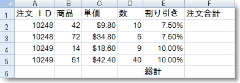
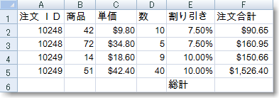
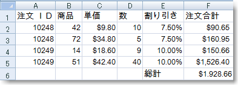

////

|metadata|
{
    "name": "excelengine-calculating-order-totals",
    "controlName": ["Infragistics Excel Engine"],
    "tags": [],
    "guid": "{90C4FD4E-608F-4033-9C3E-9A00F145338E}",  
    "buildFlags": [],
    "createdOn": "2007-04-05T08:24:48Z"
}
|metadata|
////

= 注文合計を計算

== 始める前に

Microsoft® Excel® ワークブックで一般的な作業は、数値データの列または行を保管して、これらの数の合計をセルに出すことです。この合計の優れた点は、これらの数字のいずれかが変更されると、自動的に合計が更新されることです。セルの値として計算式を適用することにより、ワークシートに合計セルを作成できます。

== 達成すること

このトピックを使用して、データの合計を含むセルをワークシートで作成する方法を学習します。

== 次の手順を実行します

[start=1]
. *ワークシートを使用してワークブックを作成します。*

.. 新しい Visual Basic または C# プロジェクトを作成します。 
.. Button をフォームに追加します。
.. Button をダブルクリックして、その Click イベントのコード ビハインドを開きます。
.. ひとつのワークシートを使用してワークブックを作成します。

*Visual Basic の場合：*

----
Dim workbook As New Infragistics.Documents.Excel.Workbook()
Dim worksheet As Infragistics.Documents.Excel.Worksheet = _
  workbook.Worksheets.Add("Sheet1")
----

*C# の場合：*

----
Infragistics.Documents.Excel.Workbook workbook = new Infragistics.Documents.Excel.Workbook();
Infragistics.Documents.Excel.Worksheet worksheet = workbook.Worksheets.Add( "Sheet1" );
----

[start=2]
. *ワークシート データの列を定義します。*

.. データを簡単に識別できるように列ヘッダを作成します。

*Visual Basic の場合：*

----
Dim headersRow As Infragistics.Documents.Excel.WorksheetRow = worksheet.Rows.Item(0)
headersRow.Cells.Item(0).Value = "Order ID"
headersRow.Cells.Item(1).Value = "Product"
headersRow.Cells.Item(2).Value = "Unit Price"
headersRow.Cells.Item(3).Value = "Quantity"
headersRow.Cells.Item(4).Value = "Discount"
headersRow.Cells.Item(5).Value = "Order Total"
----

*C# の場合：*

----
Infragistics.Documents.Excel.WorksheetRow headersRow = worksheet.Rows[ 0 ];
headersRow.Cells[ 0 ].Value = "Order ID";
headersRow.Cells[ 1 ].Value = "Product";
headersRow.Cells[ 2 ].Value = "Unit Price";
headersRow.Cells[ 3 ].Value = "Quantity";
headersRow.Cells[ 4 ].Value = "Discount";
headersRow.Cells[ 5 ].Value = "Order Total";
----

[start=2]
.. 特別なフォーマットを必要とする任意の列に特別なフォーマットを設定します。

*Visual Basic の場合：*

----
' "Unit Price" 列は、ドルで値を表示すべきです。
worksheet.Columns.Item(2).CellFormat.FormatString = _
  """$""#,##0.00_);(""$""#,##0.00)"
' "Discount" 列はパーセントで値を表示すべきです。
worksheet.Columns.Item(4).CellFormat.FormatString = "0.00%"
' "Order Total" 列は、ドルで値を表示すべきです。
worksheet.Columns.Item(5).CellFormat.FormatString = _
  """$""#,##0.00_);(""$""#,##0.00)"
' 合計を表示するために十分な領域を作ることができます。
worksheet.Columns.Item(5).Width = 3000
----

*C# の場合：*

----
// "Unit Price" 列は、ドルで値を表示すべきです。
worksheet.Columns[ 2 ].CellFormat.FormatString = "\"$\"#,##0.00_);(\"$\"#,##0.00)";
// "Discount" 列はパーセントで値を表示すべきです。
worksheet.Columns[ 4 ].CellFormat.FormatString = "0.00%";
// "Order Total" 列は、ドルで値を表示すべきです。
worksheet.Columns[ 5 ].CellFormat.FormatString = "\"$\"#,##0.00_);(\"$\"#,##0;00)";
// 合計を表示するために十分な領域を作ることができます。
worksheet.Columns[ 5 ].Width = 3000;
----

[start=3]
. *セルにデータを格納します。*

.. セルにデータを格納します（合計を含むセルではありません。これらは後で数式で計算されます）。

*Visual Basic の場合：*

----
Dim currentRow As Infragistics.Documents.Excel.WorksheetRow
currentRow = worksheet.Rows.Item(1)
currentRow.Cells.Item(0).Value = 10248
currentRow.Cells.Item(1).Value = 42
currentRow.Cells.Item(2).Value = 9.8
currentRow.Cells.Item(3).Value = 10
currentRow.Cells.Item(4).Value = 0.075
currentRow = worksheet.Rows.Item(2)
currentRow.Cells.Item(0).Value = 10248
currentRow.Cells.Item(1).Value = 72
currentRow.Cells.Item(2).Value = 34.8
currentRow.Cells.Item(3).Value = 5
currentRow.Cells.Item(4).Value = 0.075
currentRow = worksheet.Rows.Item(3)
currentRow.Cells.Item(0).Value = 10249
currentRow.Cells.Item(1).Value = 14
currentRow.Cells.Item(2).Value = 18.6
currentRow.Cells.Item(3).Value = 9
currentRow.Cells.Item(4).Value = 0.1
currentRow = worksheet.Rows.Item(4)
currentRow.Cells.Item(0).Value = 10249
currentRow.Cells.Item(1).Value = 51
currentRow.Cells.Item(2).Value = 42.4
currentRow.Cells.Item(3).Value = 40
currentRow.Cells.Item(4).Value = 0.1
----

*C# の場合：*

----
Infragistics.Documents.Excel.WorksheetRow currentRow;
currentRow = worksheet.Rows[ 1 ];
currentRow.Cells[ 0 ].Value = 10248;
currentRow.Cells[ 1 ].Value = 42;
currentRow.Cells[ 2 ].Value = 9.80;
currentRow.Cells[ 3 ].Value = 10;
currentRow.Cells[ 4 ].Value = 0.075;
currentRow = worksheet.Rows[ 2 ];
currentRow.Cells[ 0 ].Value = 10248;
currentRow.Cells[ 1 ].Value = 72;
currentRow.Cells[ 2 ].Value = 34.80;
currentRow.Cells[ 3 ].Value = 5;
currentRow.Cells[ 4 ].Value = 0.075;
currentRow = worksheet.Rows[ 3 ];
currentRow.Cells[ 0 ].Value = 10249;
currentRow.Cells[ 1 ].Value = 14;
currentRow.Cells[ 2 ].Value = 18.60;
currentRow.Cells[ 3 ].Value = 9;
currentRow.Cells[ 4 ].Value = 0.1;
currentRow = worksheet.Rows[ 4 ];
currentRow.Cells[ 0 ].Value = 10249;
currentRow.Cells[ 1 ].Value = 51;
currentRow.Cells[ 2 ].Value = 42.40;
currentRow.Cells[ 3 ].Value = 40;
currentRow.Cells[ 4 ].Value = 0.1;
----

[start=4]
. *データの下に Grand Total のラベルを作成します。*

.. マージしたセルを作成し、データを更新して、ラベルを適用します。

*Visual Basic の場合：*

----
Dim mergedCell As Infragistics.Documents.Excel.WorksheetMergedCellsRegion = _
  worksheet.MergedCellsRegions.Add(5, 0, 5, 4)
mergedCell.Value = "Grand Total"
----

*C# の場合：*

----
Infragistics.Documents.Excel.WorksheetMergedCellsRegion mergedCell = 
  worksheet.MergedCellsRegions.Add( 5, 0, 5, 4 );
mergedCell.Value = "Grand Total";
----

[start=2]
.. Grand Total セルが配置される近くにラベルが表示されるように、テキストの配置を調整します。

*Visual Basic の場合：*

----
mergedCell.CellFormat.Alignment = _
  Infragistics.Documents.Excel.HorizontalCellAlignment.Right
----

*C# の場合：*

----
mergedCell.CellFormat.Alignment = 
  Infragistics.Documents.Excel.HorizontalCellAlignment.Right;
----

[start=5]
. *各注文記録の小計を計算するために数式を適用します。*

.. 注文合計を計算する数式を作成します。数式は、次のように単価に数量を掛けて、合計から値引きを引きます。 =[UnitPrice]$$*$$[Quantity]$$* $$(1-[Discount])。最初の発注の注文合計を計算するかのように、数式を作成します（セル F2 の合計）。ただし、相対的なセルの参照を使用して数式は作成されます。したがって、その他の発注合計セルに適用されると、セル参照は正しく下に移動します。

*Visual Basic の場合：*

----
Dim orderTotalFormula As Infragistics.Documents.Excel.Formula = _
  Infragistics.Documents.Excel.Formula.Parse("=C2$$*$$D2$$* $$(1-E2)", _
  Infragistics.Documents.Excel.CellReferenceMode.A1)
----

*C# の場合：*

----
Infragistics.Documents.Excel.Formula orderTotalFormula =
Infragistics.Documents.Excel.Formula.Parse( "=C2*D2* (1-E2)", Infragistics.Documents.Excel.CellReferenceMode.A1 );
----

[start=2]
.. 数式が適用されるセルを定義するセル領域を作成します。

*Visual Basic の場合：*

----
Dim region As Infragistics.Documents.Excel.WorksheetRegion = _
  New Infragistics.Documents.Excel.WorksheetRegion(worksheet, 1, 5, 4, 5)
----

*C# の場合：*

----
Infragistics.Documents.Excel.WorksheetRegion region =
  new Infragistics.Documents.Excel.WorksheetRegion( worksheet, 1, 5, 4, 5 );
----

[start=3]
.. 注文合計セルの領域に数式を適用します。

*Visual Basic の場合：*

----
orderTotalFormula.ApplyTo(region)
----

*C# の場合：*

----
orderTotalFormula.ApplyTo( region );
----

[start=6]
. *総計を決定するために数式を適用します。*

.. 総計を出すためにすべての「Order Total」セルを合計する数式を作成します。この数式は、ドル記号（$）を行および列の識別子の前に置くことで絶対参照を使用しますが、相対参照も同様に使用できます。

*Visual Basic の場合：*

----
Dim grandTotalFormula As Infragistics.Documents.Excel.Formula = _
  Infragistics.Documents.Excel.Formula.Parse("=SUM($F$2:$F$5)", _
  Infragistics.Documents.Excel.CellReferenceMode.A1)
----

*C# の場合：*

----
Infragistics.Documents.Excel.Formula grandTotalFormula =
  Infragistics.Documents.Excel.Formula.Parse( "=SUM($F$2:$F$5)",
  Infragistics.Documents.Excel.CellReferenceMode.A1 );
----

[start=2]
.. 数式を総計セルに適用します。

*Visual Basic の場合：*

----
grandTotalFormula.ApplyTo(worksheet.Rows.Item(5).Cells.Item(5))
----

*C# の場合：*

----
grandTotalFormula.ApplyTo( worksheet.Rows[ 5 ].Cells[ 5 ] );
----

[start=7]
. *ワークブックを保存します。*

ワークブックをファイルに書き出します。

*Visual Basic の場合：*

----
workbook.Serialize("C:\Orders.xls")
----

*C# の場合：*

----
workbook.Serialize( "C:\\Orders.xls" );
----