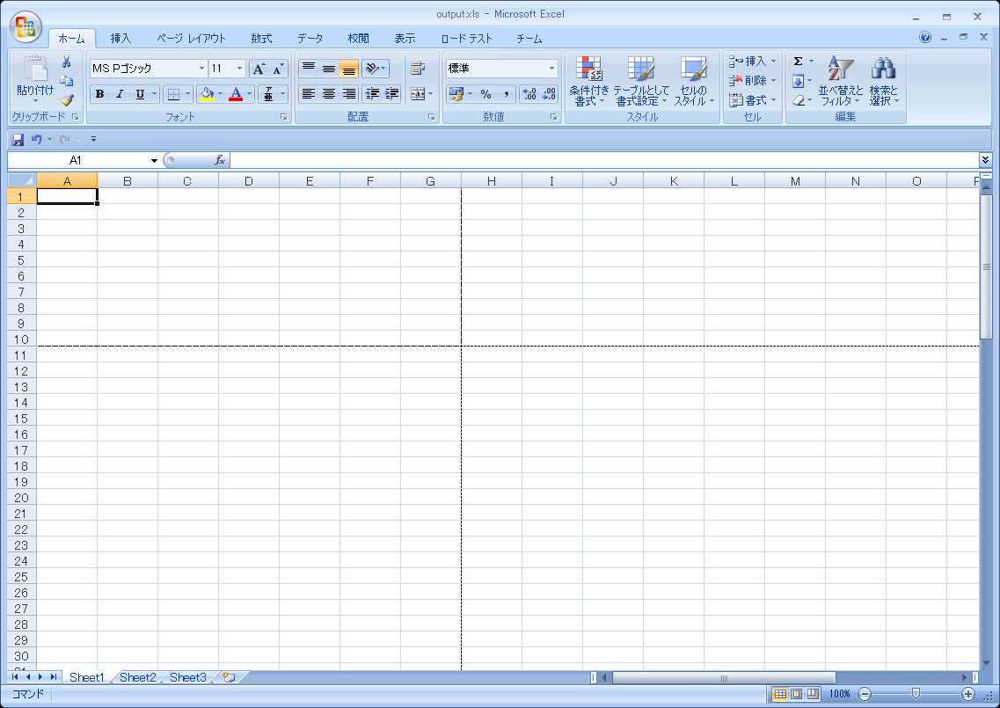

////

|metadata|
{
    "name": "excelengine-page-breaks",
    "controlName": ["Infragistics Excel Engine"],
    "tags": [],
    "guid": "cfc30d90-7cfc-43e0-b939-bf4e3d162ccc",  
    "buildFlags": [],
    "createdOn": "2011-10-10T13:55:17.8926395Z"
}
|metadata|
////

= 改ページ

このトピックは、Infragistics Excel Engine における改ページのサポートの概要を説明し、使い方のコード例を示します。

トピックは以下のとおりです。

* <<One,はじめに>>
* <<Two,改ページの作成>>

** <<TwoOne,概要>>
** <<TwoTwo,プレビュー>>
** <<TwoThree,コード例>>

* <<Three,関連トピック>>

[[One]]
== はじめに

Infragistics Excel Engine では、Microsoft Excel の改ページ機能のように、ワークシート内またはワークシート上の印刷領域で垂直方向または水平方向の改ページを挿入できます。

ワークシートを印刷する場合、印刷ページが新たに始まる場所を改ページで示します。さらに、カスタム ビューが作成される場合は、改ページ情報が含まれます。したがって、異なる改ページを異なるカスタム ビューで使用できます。

[[Two]]
== 改ページの作成

[[TwoOne]]
== 概要

以下のコード例は、垂直方向と水平方向の 2 つの改ページを作成します。セル H11 を改ページの参照ポイントとして使用し、ワークブックを以下のパラメータとともに使用します:

* ワークブック名: output.xls
* ワークシート名: PageBreaks
* 水平方向および垂直方向の改ページ場所: H11

[[TwoTwo]]
== プレビュー

以下は最終結果のプレビューです。

図1: コード例の最終結果を示す Microsoft Excel: 改ページは 2 カ所

[[TwoThree]]
== コード例

*C# の場合：*

----
// PageBreaks というワークシートを持つワークブックを作成します
Infragistics.Documents.Excel.Workbook workbook = new Infragistics.Documents.Excel.Workbook();
Infragistics.Documents.Excel.Worksheet worksheet = workbook.Worksheets.Add("PageBreaks");
// セル H11 へのセル参照を作成します (将来的に水平方向および垂直方向の改ページ)
WorksheetCell wsc = worksheet.GetCell("H11");
// セル H11 に水平方向および垂直方向の改ページを追加します
worksheet.PrintOptions.InsertPageBreak(wsc);
try
{
    // 作成したワークブックを保存します
    workbook.Save("output.xls");
    // ワークブックを開いて結果を表示します
    System.Diagnostics.Process.Start("output.xls");
}
catch
{
    MessageBox.Show("If the workbook is open, please close it before saving.", "Save Error",
        MessageBoxButtons.OK, MessageBoxIcon.Stop);
}
----

*Visual Basic の場合:*

----
' PageBreaks というワークシートを持つワークブックを作成します
Dim workbook As New Infragistics.Documents.Excel.Workbook()
Dim worksheet As Infragistics.Documents.Excel.Worksheet = workbook.Worksheets.Add("PageBreaks")
' セル H11 へのセル参照を作成します (将来的に水平方向および垂直方向の改ページ)
Dim wsc As WorksheetCell = worksheet.GetCell("H11")
' セル H11 に水平方向および垂直方向の改ページを追加します
worksheet.PrintOptions.InsertPageBreak(wsc)
Try
    ' 作成したワークブックを保存します。
    workbook.Save("output.xls")
    ' ワークブックを開いて結果を表示します。
    System.Diagnostics.Process.Start("output.xls")
Catch
    MessageBox.Show("If the workbook is open, please close it before saving.", "Save Error", MessageBoxButtons.OK, MessageBoxIcon.[Stop])
End Try
----

[[Three]]
== 関連トピック

* link:excelengine-print-areas.html[印刷範囲]
* link:excelengine-accessing-cells-and-regions-by-their-reference-strings.html[Reference Strings による Cells および Regions のアクセス]
* link:excelengine-create-a-workbook.html[ワークブックを作成]
* link:excelengine-write-a-workbook-to-an-excel-file.html[ワークブックを Excel ファイルに書き出す]