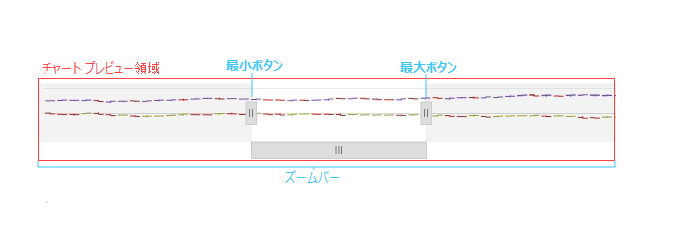

= ズーム ペイン

=== 目的

このトピックは、link:{FinancialChartLink}.{FinancialChartName}.html[{FinancialChartName}] コントロールのズーム ペインを紹介します。

pick:[wpf="image::images/financialchart_wpf_zoompane.png[]"]
pick:[jquery="image::images/financialchart_jquery_zoompane.png[]"]

上の画面はチャートのズーム ペインを強調表示します。ズーム ペインを有効にするには、link:{FinancialChartLink}.{FinancialChartName}{ApiProp}zoomSliderType{HtmlApiExtension}[pick:[wpf="ZoomSliderType"]pick:[jquery="zoomSliderType"]] pick:[wpf="プロパティ"]pick:[jquery="オプション"] を `None` 以外の値に設定します。ズーム ペインを使用するには、その他のペインの上にマウス ホイールをスクロールするか、その他のペインの領域を選択するためにクリック ドラッグするか、左右の棒および下のスクロールバーを使用してズーム ペインに移動できます。

ズーム ペインはlink:financial-chart-pane-price.html[価格ペイン]を表示します。価格ペインと異なるチャート タイプをズーム ペインに描画できます。以下の画像は、ズーム ペインの重要な領域を示します。

[options="header", cols="a,a"]
|====
|領域|説明

|チャート プレビュー領域
|価格ペイン全体に比較してズームインしている領域のプレビューを表示します。

|最小ボタン
|X 軸で開始日を設定します。

|最大ボタン
|X 軸で終了日を設定します。

|ズームバー
|チャート データの X 軸でチャートのズーム領域をスクロールします。
|====

ifdef::xaml[]
*XAML の場合:*
[source,xaml]
----
<ig:{FinancialChartName} ItemsSource="{Binding}" ZoomSliderType="Bar" />
----
endif::xaml[]

ifdef::wpf[]
*Visual Basic の場合:*
[source,vb]
----
Dim chart = New {FinancialChartName}()
chart.ZoomSliderType = Infragistics.Controls.Charts.FinancialChartZoomSliderType.Bar
----

*C# の場合:*
[source,csharp]
----
var chart = new {FinancialChartName}();
chart.ZoomSliderType = Infragistics.Controls.Charts.FinancialChartZoomSliderType.Bar;
----
endif::wpf[]

ifdef::jquery[]
*JavaScript の場合:*
[source,javascript]
----
$("#financialChart").{FinancialChartName}({ 
    dataSource: data,
    zoomSliderType: "Bar"
});
----

[source,js]
----
$("#financialChart").{FinancialChartName}("option", "zoomSliderType", "Bar");
----
endif::jquery[]

== 関連コンテンツ

[options="header", cols="a,a"]
|====
|トピック|目的

|link:financial-chart-pane-price.html[価格ペイン]
|このトピックは価格ペインを説明します。

|link:financial-chart-pane-indicator.html[インジケーター ペイン]
|このトピックはインジケーター ペインを説明します。

|link:financial-chart-pane-volume.html[ボリューム ペイン]
|このトピックはボリューム ペインを説明します。

|====