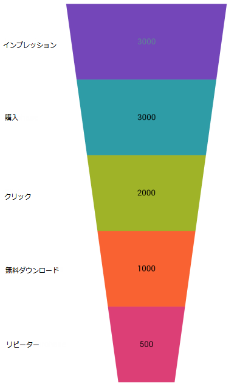

////
|metadata|
{
    "name": "funnelchart-data-binding",
    "controlName": ["{FunnelChartName}"],
    "tags": ["Data Binding"],
    "guid": "a61a6e30-c292-42f1-b815-4adcc051fe86",
    "buildFlags": ["SL","WPF","win-phone","ANDROID"],
    "createdOn": "2014-06-05T19:53:12.0358823Z"
}
|metadata|
////

= データ バインディング

このトピックは、 link:{FunnelChartLink}.{FunnelChartName}.html[{FunnelChartName}] コントロールにデータをバインドする方法を示します。コード例およびスクリーンショットがトピック全体で示されています。

== 概要

== トピックは以下のとおりです。

* <<Introduction,概要>>
* <<RequiredReferences,参照要件>> 
* <<RequiredNamespaces,名前空間要件>> 
* <<Data_Requirements,データ要件>>
* <<Data_Rendering_Rules,データ描画の規則>>
* <<StepsOverview,ステップの概要>>
* <<Steps,手順>>
* <<RelatedTopics,関連トピック>>

[[Introduction]]
== 概要

このトピックで示される手順は、{FunnelChartName} コントロールをデータ コレクションにバインドする方法を示します。データ コレクションを定義し、Funnel Chart コントロールをアプリケーションに追加し、そのコントロールの  pick:[wpf,win-universal=" link:{FunnelChartLink}.{FunnelChartName}{ApiProp}itemssource.html[ItemsSource]"]pick:[android=" link:{FunnelChartLink}.{FunnelChartName}{ApiProp}datasource.html[DataSource]"]pick:[xamarin=" link:{FunnelChartLink}.{FunnelChartName}{ApiProp}itemssource.html[ItemsSource]"]  をデータ コレクションのインスタンスにバインドします。

[[RequiredReferences]]
== 参照要件

ifdef::wpf[]

以下の NuGet パッケージへの参照を追加します。

** Infragistics.WPF.Charts

NuGet フィードのセットアップと NuGet パッケージの追加の詳細については、link:nuget-feeds.html[NuGet フィード] ドキュメントを参照してください。

endif::wpf[]

ifdef::win-universal[]
** {ApiPlatform}{FunnelChartAssembly}{ApiVersion}.dll
** {ApiPlatform}{DataVizAssembly}{ApiVersion}.dll
** {ApiPlatform}{ApiVersion}dll
endif::win-universal[]

ifdef::win-forms[]
* {ApiPlatform}{FunnelChartAssembly}{ApiVersion}.dll
* {ApiPlatform}{DataVizAssembly}{ApiVersion}.dll
* {ApiPlatform}Portable.Core{ApiVersion}.dll
endif::win-forms[]

ifdef::android[]
** Infragistics.DataChart.jar
** DV.Shared.jar
** Infragistics.Core.jar
** Infragistics.UI.jar
endif::android[]

ifdef::xamarin[]
link:xamarin-project-with-infragistics-controls.html#NuGetPackages[NuGet パッケージで参照を追加]トピックについてアセンブリ参照を追加します。
endif::xamarin[]

ifdef::xaml,win-forms[]
[[RequiredNamespaces]]
== 名前空間要件

ifdef::wpf,win-universal[]
*XAML の場合:*
[source,xaml]
----
xmlns:ig="http://schemas.infragistics.com/xaml"
xmlns:local="clr-namespace:FunnelChart_Demo"
----
endif::wpf,win-universal[]

ifdef::xamarin[]
*XAML の場合:*
[source,xaml]
----
xmlns:ig="clr-namespace:Infragistics.XamarinForms.Controls.Charts;assembly=Infragistics.XF.Charts"
xmlns:local="clr-namespace:FunnelChart_Demo"
---- 
endif::xamarin[]

endif::xaml,win-forms[]

以下の手順では、FunnelChart_Demo は、データ モデルが定義される名前空間です。以下の using 構文は、FunnelChart_Demo デモまたはデータ モデルを含むクラスで必要です。

ifdef::xaml,win-forms[]

*C# の場合:*
[source,csharp]
----
using System.Collections.ObjectModel;
----

endif::xaml,win-forms[]

ifdef::wpf,win-forms[]

*Visual Basic の場合:*
[source,vb]
----
Imports System.Collections.ObjectModel
----

endif::wpf,win-forms[]

[[Data_Requirements]]
== データ要件

チャート コントロールによって固有のデータ モデルにチャートを簡単にポイントすることができますが、そのチャートが必要とするデータの適切な量とタイプを提供することが重要です。使用しているチャートのタイプに基づいた最小要件をデータが満たさないと、エラーが生成されます。

以下は、ファンネル チャートのデータ要件のリストです。

* データ モデルには 1 つの数値列を含む必要があります。
* データ モデルには凡例ラベルのためのオプションの文字列の列を含むことができます。

[[Data_Rendering_Rules]]
== データ描画の規則

チャート データは以下の規則を使用して描画されます。

* ファンネル チャートは軸を使用しないため軸は描画されません。
* 各行はファンネルの単一の色が付けられたセクションを構成します。
* 列内のデータ値の合計を使用して各行に適用可能なパーセンテージを計算するため、データ値はパーセンテージである必要はありません。
* データ マッピングの Label プロパティにマップされる文字列の列は凡例のラベルとして使用されます。
* シリーズ コレクションの最初のシリーズのみが描画されます。

[[StepsOverview]]
== ステップの概要

[start=1]
. データ モデルの定義
[start=2]
. Funnel Chart コントロールのインスタンスの追加
[start=3]
. (オプション) 結果の検証

[[Steps]]
== 手順

[start=1]
. *データ モデルを定義します* 。

データをモデル化するためのクラスを作成します。以下のコードは、シンプルな値とラベルのペアを表す TestDataItem クラス、そしてそれらのペアのコレクションを表す TestData クラスを作成します:

ifdef::wpf,win-forms[]

*Visual Basic の場合:*
[source,vb]
----
Public Class TestData
    Inherits ObservableCollection(Of TestDataItem)
    Public Sub New()
    Dim slice1 As New TestDataItem()
    slice1.Label = "Impressions"
    slice1.Value = 3000
    Add(slice1)
    Dim slice2 As New TestDataItem()
    slice2.Label = "Clicks"
    slice2.Value = 2000
    Add(slice2)
    Dim slice3 As New TestDataItem()
    slice3.Label = "Free Downloads"
    slice3.Value = 1000
    Add(slice3)
    Dim slice4 As New TestDataItem()
    slice4.Label = "Purchase"
    slice4.Value = 3000
    Add(slice4)
    Dim slice5 As New TestDataItem()
    slice5.Label = "Repeat Purchase"
    slice5.Value = 500
    Add(slice5)
End Sub
End Class
Public Class TestDataItem
    Public Property Label() As String
        Get
            Return m_Label
        End Get
        Set
            m_Label = Value
        End Set
    End Property
    Private m_Label As String
    Public Property Value() As Double
        Get
            Return m_Value
        End Get
        Set
            m_Value = Value
        End Set
    End Property
    Private m_Value As Double
End Class
----

endif::wpf,win-forms[]

ifdef::xaml,win-forms[]

*C# の場合:*
[source,csharp]
----
    public class TestData : ObservableCollection<TestDataItem> {
         var slice1 = new TestDataItem();
        slice1.Label = "Impressions";
        slice1.Value = 3000;
        Add(slice1);
        TestDataItem slice2 = new TestDataItem();
        slice2.Label = "Clicks";
        slice2.Value = 2000;
        Add(slice2);
        TestDataItem slice3 = new TestDataItem();
        slice3.Label = "Free Downloads";
        slice3.Value = 1000;
        Add(slice3);
        TestDataItem slice4 = new TestDataItem();
        slice4.Label = "Purchase";
        slice4.Value = 3000;
        Add(slice4);
        TestDataItem slice5 = new TestDataItem();
        slice5.Label = "Repeat Purchase";
        slice5.Value = 500;
        Add(slice5);
        }
    }
    public class TestDataItem
    {
        public string Label { get; set; }
        public double Value { get; set; }
    }
----

endif::xaml,win-forms[]

ifdef::android[]

*Java の場合:*

[source,js]
----
public class TestDataItem {
private String _label;
public String getLabel() {
return _label;
}
public String setLabel(String label) { 
_label = label;
return label;
}
private double _value;
public double getValue(){
return _value;
} 
public double setValue(double value) {
_value = value;
return _value;
}
public TestDataItem(String label, double value){
_label = label;
_value = value;
}
}
  
public class TestData extends ArrayList<TestDataItem> {
public TestData(){
add(new TestDataItem("Impressions",3000));
add(new TestDataItem("Clicks",2000));
add(new TestDataItem("Free Downloads",1000));
add(new TestDataItem("Purchase",3000));
add(new TestDataItem("Repeat Purchase",500));
}
}
----

endif::android[]

[start=2]
. {FunnelChartName} コントロールのインスタンスを追加します。

ifdef::wpf,win-universal[]
データ コレクションのインスタンスを XAML でレイアウト ルートに追加します。
endif::wpf,win-universal[]

ifdef::xamarin[]
データ コレクションのインスタンスを XAML で ContentPage の BindingContext に追加します。
endif::xamarin[]

ifdef::wpf,win-universal[]

*XAML の場合:*
[source,xaml]
----
<UserControl.Resources>
        <local:TestData x:Key="data" />
</UserControl.Resources>
<Grid x:Name="LayoutRoot" Background="White">
        <ig:{FunnelChartName} 
                x:Name="funnel"
                Grid.Column="0" Margin="10"
                ItemsSource="{StaticResource data}"
                ValueMemberPath="Value"
                UseOuterLabelsForLegend="True"                   
                InnerLabelMemberPath="Value"
                OuterLabelMemberPath="Label"
                OuterLabelVisibility="Visible"
                UseUnselectedStyle="True"  
                AllowSliceSelection="
                TransitionDuration="0:00:00.8" >
        </ig:{FunnelChartName}>
    </Grid>
----

endif::wpf,win-universal[]

ifdef::xamarin[]

*XAML の場合:*
[source,xaml]
----
<ContentPage.BindingContext>
    <local:TestData />
</ContentPage.BindingContext>
<ig:XamFunnelChart x:Name="funnel" 
                    Margin="10" 
                    ItemsSource="{Binding}"
                    ValueMemberPath="Value"
                    AllowSliceSelection="True"
                    SelectedSliceOpacity="0.5" 
                    UseOuterLabelsForLegend="True"
                    InnerLabelMemberPath="Value"
                    OuterLabelMemberPath="Label"
                    OuterLabelVisibility="Visible">
</ig:XamFunnelChart>
----
endif::xamarin[]

ifdef::android[]

*Java の場合:*

[source,js]
----
FrameLayout rootView = (FrameLayout) inflater.inflate(R.layout.fragment_main, container, false);
TestData data = new TestData();
Context context = rootView.getContext();
FunnelChartView funnelChart = new FunnelChartView(context);
FrameLayout.LayoutParams funnelParams = new FrameLayout.LayoutParams(500, 500);
funnelParams.gravity = Gravity.CENTER;
funnelChart.setLayoutParams(funnelParams);
funnelChart.setDataSource(data);
funnelChart.setValueMemberPath("Value");
funnelChart.setUseOuterLabelsForLegend(true);
funnelChart.setInnerLabelMemberPath("Value");
funnelChart.setInnerLabelVisibility(Visibility.VISIBLE);
funnelChart.setOuterLabelMemberPath("Label");
funnelChart.setOuterLabelVisibility(Visibility.VISIBLE);
funnelChart.setUseUnselectedStyle(true);
funnelChart.setAllowSliceSelection(false);
----

endif::android[]

ifdef::win-forms[]
*VB の場合:*

[source,vb]
----
Me.funnel = New Infragistics.Win.DataVisualization.UltraFunnelChart()
Me.funnel.DataSource = New TestData()
Me.funnel.ValueMemberPath = "Value"
Me.funnel.InnerLabelMemberPath = "Value"
Me.funnel.InnerLabelVisibility = Infragistics.Portable.Components.UI.Visibility.Visible
Me.funnel.OuterLabelMemberPath = "Label"
Me.funnel.OuterLabelVisibility = Infragistics.Portable.Components.UI.Visibility.Visible
Me.funnel.UseOuterLabelsForLegend = True
Me.funnel.UseUnselectedStyle = True
Me.funnel.AllowSliceSelection = True
Me.funnel.TransitionDuration = 1
----

*C# の場合:*

[source,csharp]
----
this.funnel = new Infragistics.Win.DataVisualization.UltraFunnelChart();
this.funnel.DataSource = new TestData();
this.funnel.ValueMemberPath = "Value";
this.funnel.InnerLabelMemberPath = "Value";
this.funnel.InnerLabelVisibility = Infragistics.Portable.Components.UI.Visibility.Visible;
this.funnel.OuterLabelMemberPath = "Label";
this.funnel.OuterLabelVisibility = Infragistics.Portable.Components.UI.Visibility.Visible;
this.funnel.UseOuterLabelsForLegend = true;
this.funnel.UseUnselectedStyle = true;
this.funnel.AllowSliceSelection = true;
this.funnel.TransitionDuration = 1;
----
endif::win-forms[]

[start=3]
. (オプション) 結果を確認します。

結果を検証するために、アプリケーションを実行します。Funnel Chart コントロールのデータ コレクションへのバインドが成功すれば、結果のチャートはここに示すようなものになります。

ifdef::wpf,win-universal,android,win-forms[]
image::images/xamFunnelChart_DataBind_01.png[]
endif::wpf,win-universal,android,win-forms[]

ifdef::xamarin[]

endif::xamarin[]

[[RelatedTopics]]
== 関連トピック

link:funnelchart-getting-started-with-funnelchart.html[{FunnelChartName} を使用した作業の開始]