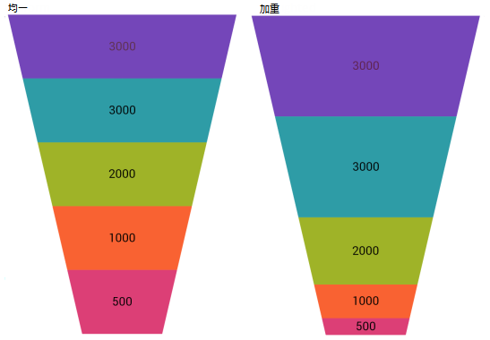
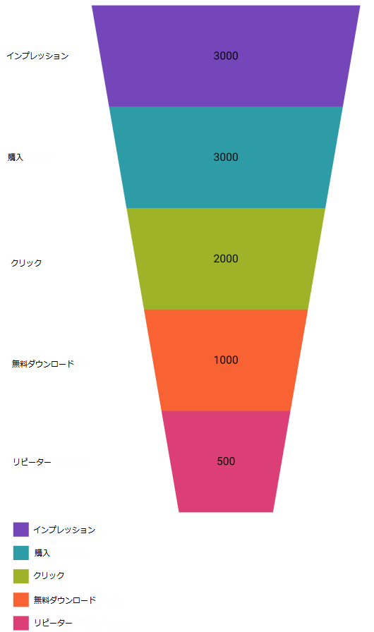
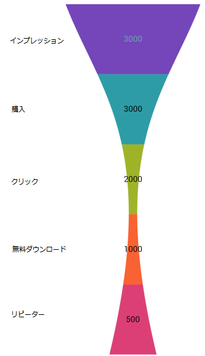

////
|metadata|
{
    "name": "funnelchart-getting-started-with-funnelchart",
    "controlName": ["{FunnelChartName}"],
    "tags": ["Getting Started"],
    "guid": "b9cf7ea0-bead-438b-b6a8-dde63baad4c2",
    "buildFlags": ["SL","WPF","win-phone","ANDROID"],
    "createdOn": "2014-06-05T19:53:12.0338816Z"
}
|metadata|
////

= {FunnelChartName} を使用した作業の開始

このトピックは、 link:{FunnelChartLink}.{FunnelChartName}.html[{FunnelChartName}] コントロールのさまざまな主な特長および機能の構成方法と使用法を説明することを目的としています。

== {FunnelChartName} の使用

このセクションでは機能の理解を助け使用例をご覧いただけるよう重要な概念的およびタスク ベースの情報を含んでいます。

== 前提条件

まず以下のトピックを読む必要があります。

* link:funnelchart-data-binding.html[データ バインディング]

== コントロールの構成の概要

== コントロールの構成表

以下の表は、{FunnelChartName} コントロールの構成可能な要素とビヘイビアを示しています。

[options="header", cols="a,a,a"]
|====
|構成可能な要素とビヘイビア
|構成の詳細
|構成プロパティ

|スライスの選択
|スライスの選択を有効にし、スライスの表示形式を指定する方法を説明します。
| link:{FunnelChartLink}.{FunnelChartName}{ApiProp}allowsliceselection.html[AllowSliceSelection] 

link:{FunnelChartLink}.{FunnelChartName}{ApiProp}funnelslicedisplay.html[FunnelSliceDisplay]

|スライスの反転
|データの選択を縦方向に表すようスライスを反転する方法を説明します。
| link:{FunnelChartLink}.{FunnelChartName}{ApiProp}isinverted.html[IsInverted]

|ラベルを表示します
|ラベルを表示するには、InnerLabelMemberPath と OuterLabelMemberPath をターゲット プロパティに設定します。 pick:[sl,wpf,win-universal="外側のラベルの表示状態はデフォルトで折り畳みとなっており、内側のラベルの表示状態はデフォルトで表示です。"]
|
ifdef::sl,wpf,win-universal[] 
pick:[sl,wpf,win-universal="link:{FunnelChartLink}.{FunnelChartName}{ApiProp}innerlabelvisibility.html[InnerLabelVisibility]"] 

endif::sl,wpf,win-universal[] 

link:{FunnelChartLink}.{FunnelChartName}{ApiProp}innerlabelmemberpath.html[InnerLabelMemeberPath] 

pick:[sl,wpf,win-universal="link:{FunnelChartLink}.{FunnelChartName}{ApiProp}outerlabelvisibility.html[OuterLabelVisibility]"] 

link:{FunnelChartLink}.{FunnelChartName}{ApiProp}outerlabelmemberpath.html[OuterLabelMemberPath]

|凡例を表示します
|凡例を表示するには ItemLegend のインスタンスを作成し、それをファンネル チャート コントロールの凡例プロパティに設定する必要があります。
| link:{FunnelChartLink}.{FunnelChartName}{ApiProp}legend.html[Legend] 

link:{FunnelChartLink}.{FunnelChartName}{ApiProp}useouterlabelsforlegend.html[UseOuterLabelsForLegend]

|ベジエ曲線の使用
|ベジエ曲線を使用するとファンネル チャートがスムーズなカーブになります。
| link:{FunnelChartLink}.{FunnelChartName}{ApiProp}usebeziercurve.html[UseBezierCurve]

|====

== スライスの選択

== スライス選択プロパティ設定

以下の表は、推奨構成 / ビヘイビアを対応するプロパティ設定にマップしています。

[options="header", cols="a,a,a"]
|====
|目的|使用するプロパティ:|それを次に設定...

|スライス選択の有効化
| link:{FunnelChartLink}.{FunnelChartName}{ApiProp}allowsliceselection.html[AllowSliceSelection]
|True

|スライスの表示形式を示します
| link:{FunnelChartLink}.{FunnelChartName}{ApiProp}funnelslicedisplay.html[FunnelSliceDisplay]
|Uniform 

Weighted

|====

== スライスを選択するコードの例

スライス選択を有効にするためには link:{FunnelChartLink}.{FunnelChartName}{ApiProp}allowsliceselection.html[AllowSliceSelection] プロパティは true に設定してください。

ifdef::sl,win-phone,win-universal,wpf,win-forms[]
*Visual Basic の場合:*

[source,vb]
----
funnel.AllowSliceSelection = True
----
endif::sl,win-phone,win-universal,wpf,win-forms[]

ifdef::sl,win-phone,win-universal,wpf,xamarin,win-forms[]
*C# の場合:*

[source,csharp]
----
funnel.AllowSliceSelection = true;
----
endif::sl,win-phone,win-universal,wpf,xamarin,win-forms[]

ifdef::sl,win-phone,win-universal,wpf,xamarin[]
*XAML の場合:*

[source,xaml]
----
<ig:{FunnelChartName} AllowSliceSelection="True"/>
----
endif::sl,win-phone,win-universal,wpf,xamarin[]

ifdef::android[]

*Java の場合:*

[source,js]
----
funnelChart.setAllowSliceSelection(true);
----

endif::android[]

{FunnelChartName} コントロールは 2 つの表示形式タイプを公開します。

. スライスがすべて同じ高さの部分を統合します (デフォルト) 。
. スライスの高さが基本となるデータの計算されたパーセンテージ値に基づいている部分を重み付けします。

ifdef::sl,win-phone,win-universal,wpf,win-forms[]
*Visual Basic の場合:*

[source,vb]
----
funnel.FunnelSliceDisplay = FunnelSliceDisplay.Uniform
----
endif::sl,win-phone,win-universal,wpf,win-forms[]

ifdef::sl,win-phone,win-universal,wpf,xamarin,win-forms[]
*C# の場合:*

[source,csharp]
----
funnel.FunnelSliceDisplay = FunnelSliceDisplay.Uniform;
----
endif::sl,win-phone,win-universal,wpf,xamarin,win-forms[]

ifdef::sl,win-phone,win-universal,wpf,xamarin[]
*XAML の場合:*

[source,xaml]
----
<ig:{FunnelChartName} FunnelSliceDisplay="Uniform" />
----
endif::sl,win-phone,win-universal,wpf,xamarin[]

ifdef::android[]

*Java の場合:*

[source,js]
----
funnelChart.setFunnelSliceDisplay(FunnelSliceDisplay.UNIFORM);
----

endif::android[]

ifdef::sl,win-phone,win-universal,wpf,android[]
image::images/xamFunnelChart_UsingFunnelChart_01.png[]
endif::sl,win-phone,win-universal,wpf,android[]

ifdef::xamarin,win-forms[]

endif::xamarin,win-forms[]

図 1: FunnelChart 表示形式

== スライスの反転

== スライスのプロパティ設定の反転

以下の表は、推奨構成 / ビヘイビアを対応するプロパティ設定にマップしています。

[options="header", cols="a,a,a"]
|====
|目的|使用するプロパティ:|それを次に設定...

|スライスの反転
| link:{FunnelChartLink}.{FunnelChartName}{ApiProp}isinverted.html[IsInverted]
|True

|====

== スライスのコード例の反転

コントロール上のスライスを反転するために、 link:{FunnelChartLink}.{FunnelChartName}{ApiProp}isinverted.html[IsInverted] プロパティは true (デフォルトは false) に設定し、スライスがボタンのクリックでトリガーされるようにします。

ifdef::sl,win-phone,win-universal,wpf,win-forms[]
*Visual Basic の場合:*

[source,vb]
----
funnel.IsInverted = true
----
endif::sl,win-phone,win-universal,wpf,win-forms[]

ifdef::sl,win-phone,win-universal,wpf,xamarin,win-forms[]
*C# の場合:*

[source,csharp]
----
funnel.IsInverted = true;
----
endif::sl,win-phone,win-universal,wpf,xamarin,win-forms[]

ifdef::sl,win-phone,win-universal,wpf,xamarin[]
*XAML の場合:*

[source,xaml]
----
<ig:{FunnelChartName} IsInverted="True"/>
----
endif::sl,win-phone,win-universal,wpf,xamarin[]

ifdef::android[]

*Java の場合:*

[source,js]
----
funnelChart.setIsInverted(Boolean.TRUE);
----

endif::android[]

== ラベルを表示します

== ラベル プロパティ設定の表示

以下の表は、推奨構成 / ビヘイビアを対応するプロパティ設定にマップしています。

[options="header", cols="a,a,a"]
|====
|目的|使用するプロパティ:|それを次に設定...

|ラベルを表示します
| link:{FunnelChartLink}.{FunnelChartName}{ApiProp}innerlabelmemberpath.html[InnerLabelMemberPath]
|[データ モデルの任意フィールド]

|
| link:{FunnelChartLink}.{FunnelChartName}{ApiProp}outerlabelmemberpath.html[OuterLabelMemberPath]
|[データ モデルの任意フィールド]

ifdef::sl,wpf,win-universal,win-forms[]
|
| link:{FunnelChartLink}.{FunnelChartName}{ApiProp}innerlabelvisibility.html[InnerLabelVisibility]
|Visible
endif::sl,wpf,win-universal,win-forms[]

ifdef::sl,wpf,win-universal,win-forms[]
|
| link:{FunnelChartLink}.{FunnelChartName}{ApiProp}outerlabelvisibility.html[OuterLabelVisibility]
|Visible
endif::sl,wpf,win-universal,win-forms[]

|====

== ラベル コード例の表示

ラベルの表示はまず表示状態の設定が先で、次にパスを適切なターゲットに指定します。

ifdef::sl,win-phone,win-universal,wpf,win-forms[]
*Visual Basic の場合:*

[source,vb]
----
funnel.InnerLabelVisibility = System.Windows.Visibility.Visible
funnel.OuterLabelVisibility = System.Windows.Visibility.Visible
funnel.InnerLabelMemberPath = "Value"
funnel.OuterLabelMemberPath = "Label"
----
endif::sl,win-phone,win-universal,wpf,win-forms[]

ifdef::sl,win-phone,win-universal,wpf,xamarin,win-forms[]
*C# の場合:*

[source,csharp]
----
funnel.InnerLabelVisibility = System.Windows.Visibility.Visible;
funnel.OuterLabelVisibility = System.Windows.Visibility.Visible;
funnel.InnerLabelMemberPath = "Value";
funnel.OuterLabelMemberPath = "Label";
----
endif::sl,win-phone,win-universal,wpf,xamarin,win-forms[]

ifdef::xamarin[]
[source,csharp]
----
funnel.InnerLabelVisibility = Infragistics.Core.Visibility.Visible;
funnel.OuterLabelVisibility = Infragistics.Core.Visibility.Visible;
funnel.InnerLabelMemberPath = "Value";
funnel.OuterLabelMemberPath = "Label";
----
endif::xamarin[]

pick:[sl,win-phone,win-universal,wpf,xamarin="*XAML の場合:*"]

ifdef::sl,win-phone,win-universal,wpf,xamarin[]
[source,xaml]
----
<ig:{FunnelChartName}
     InnerLabelVisibility="Visible"
     OuterLabelVisibility="Visible"
     InnerLabelMemberPath="Value"
     OuterLabelMemberPath="Label"/>
----
endif::sl,win-phone,win-universal,wpf,xamarin[]

ifdef::android[]

*Java の場合:*

[source,js]
----
funnelChart.setInnerLabelMemberPath("Value");
funnelChart.setInnerLabelVisibility(Visibility.VISIBLE);
funnelChart.setOuterLabelMemberPath("Label");
funnelChart.setOuterLabelVisibility(Visibility.VISIBLE);
----

endif::android[]

== 凡例を表示します

== 凡例プロパティ設定の表示

以下の表は、推奨構成 / ビヘイビアを対応するプロパティ設定にマップしています。

[options="header", cols="a,a,a"]
|====
|目的|使用するプロパティ:|それを次に設定...

|凡例を表示します
| link:{FunnelChartLink}.{FunnelChartName}{ApiProp}legend.html[Legend]
|Legend = [ItemLegend インスタンスの要素名]

|
| link:{FunnelChartLink}.{FunnelChartName}{ApiProp}useouterlabelsforlegend.html[UseOuterLabelsForLegend]
|True

|====

== 凡例の表示 - コード例

凡例の表示には ItemLegend のインスタンスを作成してからファンネル チャート コントロールの凡例プロパティを ItemLegend インスタンスの要素名に設定することが必要です。

ifdef::win-forms[]
*Visual Basic の場合:*

[source,vb]
----
Me.Funnel.Legend = New UltraItemLegend()
Me.Controls.Add(Me.Funnel.Legend)

----
endif::win-forms[]

ifdef::win-forms[]
*C# の場合:*

[source,csharp]
----
this.Funnel.Legend = new UltraItemLegend();
this.Controls.Add(this.Funnel.Legend);
----
endif::win-forms[]

ifdef::sl,win-phone,win-universal,wpf[]

*XAML の場合:*
[source,xaml]
----
<ig:{FunnelChartName} Legend="{Binding ElementName=Legend}" />
<ig:ItemLegend 
     x:Name="Legend" VerticalAlignment="Top" HorizontalAlignment="Right" />
----

endif::sl,win-phone,win-universal,wpf[]

ifdef::xamarin[]

*XAML の場合:*
[source,xaml]
----
<Grid>
    <Grid.RowDefinitions>
        <RowDefinition Height="*"/>
        <RowDefinition Height="Auto"/>
    </Grid.RowDefinitions>

    <ig:ItemLegend x:Name="Legend" Grid.Row="1"
                    VerticalOptions="CenterAndExpand" 
                    HorizontalOptions="StartAndExpand" />
    <ig:XamFunnelChart x:Name="funnel" Grid.Row="0" 
                       ItemsSource="{Binding}"
                       ValueMemberPath="Value"              
                       UseOuterLabelsForLegend="True"
                       InnerLabelMemberPath="Value"
                       OuterLabelMemberPath="Label"
                       OuterLabelVisibility="Collapsed"
                       Legend="{x:Reference Legend}">
        </ig:XamFunnelChart>
    </Grid>
----

endif::xamarin[]

ifdef::android[]

*Java の場合:*

[source,js]
----
ItemLegendView legend = new ItemLegendView(context);
FrameLayout.LayoutParams legendParams = new FrameLayout.LayoutParams(ViewGroup.LayoutParams.WRAP_CONTENT, ViewGroup.LayoutParams.WRAP_CONTENT);
legendParams.gravity = Gravity.TOP | Gravity.RIGHT;
legend.setLayoutParams(legendParams);
funnelChart.setLegend(legend);
legend.setVisibility(View.VISIBLE);
rootView.addView(legend);
----

endif::android[]

ifdef::sl,win-phone,win-universal,wpf,android[]
image::images/xamFunnelChart_UsingFunnelChart_02.png[]
endif::sl,win-phone,win-universal,wpf,android[]

ifdef::xamarin,win-forms[]

endif::xamarin,win-forms[]

図 2: FunnelChart 凡例

== ベジエ曲線の使用

== ベジエ曲線プロパティ設定の使用

以下の表は、推奨構成 / ビヘイビアを対応するプロパティ設定にマップしています。

[options="header", cols="a,a,a"]
|====
|目的|使用するプロパティ:|それを次に設定...

|ベジエ曲線の使用
| link:{FunnelChartLink}.{FunnelChartName}{ApiProp}usebeziercurve.html[UseBezierCurve]
|True

|====

== ベジエ曲線例の使用

ベジエ曲線を使うという考えは、ファンネル チャート コントロールの外観をスムーズな線にするためです。{FunnelChartName} はベジエ曲線の設定のための Point タイプの 2 つのプロパティを公開します。コントロールがベジエ曲線を使うために設定される場合、ファンネルの両側の線は曲線を形成するコントロール ポイントに向かって動くようコントロール ポイントを使います。詳細については、 link:http://en.wikipedia.org/wiki/Bézier_curve[ベジエ曲線]を参照してください。

UpperBezierControlPoint および LowerBezierControlPoint プロパティは、ベジエ曲線のコントロール ポイントとして X/Y 座標を取得します。以下のコード例では、プロパティ設定とその結果をスクリーンショットと共に示します。

ifdef::win-forms[]
*Visual Basic の場合:*

[source,vb]
----
funnel.UseBezierCurve= true
----
endif::win-forms[]

ifdef::win-forms[]
*C# の場合:*

[source,csharp]
----
funnel.UseBezierCurve = true;
----
endif::win-forms[]

ifdef::sl,win-phone,win-universal,wpf,xamarin[]

*XAML の場合:*
[source,xaml]
----
<ig:{FunnelChartName}
     UseBezierCurve="True"
     UpperBezierControlPoint="0.25, 0.25"
     LowerBezierControlPoint="0.7, 0.4" />
----

endif::sl,win-phone,win-universal,wpf,xamarin[]

ifdef::android[]

*Java の場合:*

[source,js]
----
funnelChart.setUseBezierCurve(Boolean.TRUE);
funnelChart.setUpperBezierControlPoint(new PointF(.25f, .25f));
funnelChart.setLowerBezierControlPoint(new PointF(.7f, .4f));
----

endif::android[]

ifdef::sl,win-phone,win-universal,wpf,android,win-forms[]
image::images/xamFunnelChart_UsingFunnelChart_03.png[]
endif::sl,win-phone,win-universal,wpf,android,win-forms[]

ifdef::xamarin[]

endif::xamarin[]

図 3: ベジエ曲線を使った FunnelChart

== 関連トピック

link:funnelchart-data-binding.html[データ バインディング] はファンネル チャートをバインドする方法を示します。

link:funnelchart-api-overview.html[APIの概要] には、コントロールを使ったプログラミングの差異に知っておくべき名前空間といくつかの主要なクラスのリストが含まれます。