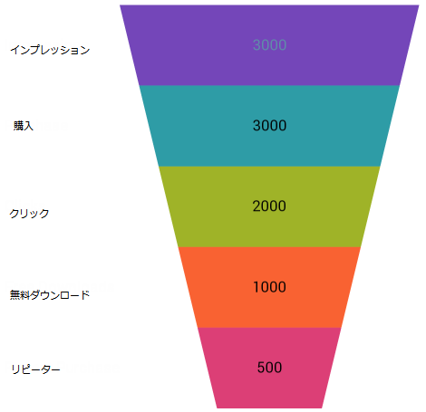
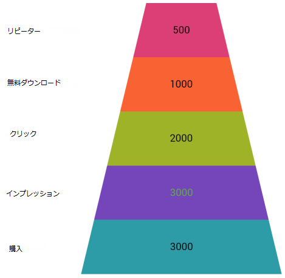

////

|metadata|
{
    "name": "funnelchart",
    "controlName": ["{FunnelChartName}"],
    "tags": ["Getting Started"],
    "guid": "796fd0e0-9374-45dc-9c59-2be04473d51b",  
    "buildFlags": ["SL","WPF","win-phone","ANDROID"],
    "createdOn": "2014-06-05T19:53:12.0288794Z"
}
|metadata|
////

= {FunnelChartName}

== 目的

このトピックの目的は、ファンネルチャートを紹介することにあります。ファンネル チャートは全体に対するパーセントとして量を表示するタイプのチャートで、円チャートに非常に似ています。ファンネル チャートは工程の段階に関係して量的なデータを表示するために通常使用されます。たとえば、ファンネル チャートはその製品の製造段階から実際的な販売に至るまでの製品の支出を表示することができます。

== プレビュー

以下は {FunnelChartName} のプレビューです。

ifdef::sl,win-phone,win-universal,wpf,android,win-forms[]
image::images/xamFunnelChart_Overview_01.png[]
endif::sl,win-phone,win-universal,wpf,android,win-forms[]

ifdef::xamarin[]

endif::xamarin[]

図 1: {FunnelChartName} コントロールの例

{FunnelChartName} は、以下の画像のように IsInverted Boolean プロパティを使用してスライスを垂直に反転できます。

ifdef::sl,win-phone,win-universal,wpf,android,win-forms[]
image::images/xamFunnelChart_Overview_03.png[]
endif::sl,win-phone,win-universal,wpf,android,win-forms[]

ifdef::xamarin[]

endif::xamarin[]

図 2: {FunnelChartName} 反転の例

詳細は以下の関連ドキュメントを参照してください。

* 「 link:funnelchart-getting-started-with-funnelchart.html[{FunnelChartName} を使用した作業の開始]」は、ファンネル チャートで提供される主な機能を説明しています。
* link:funnelchart-data-binding.html[データ バインド]は、ファンネル チャートにバインドする方法を説明します。
* link:funnelchart-api-overview.html[APIの概要] には、コントロールを使ったプログラミングの差異に知っておくべき名前空間といくつかの主要なクラスのリストが含まれます。