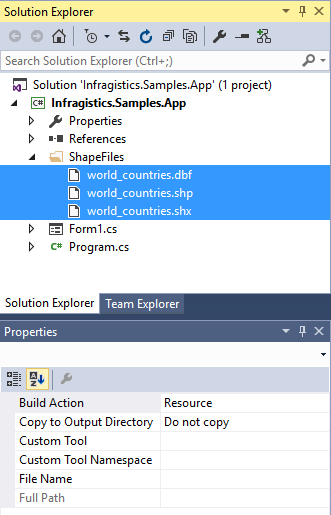

////
|metadata|
{
    "controlName": ["{GeoMapName}"],
    "tags": []
}
|metadata|
////

= シェープ ファイルを地理的データにバインディング

== トピックの概要

=== 目的

このトピックは、シェープ ファイルを読み込んで、 link:{GeoMapLink}.{GeoMapName}_members.html[{GeoMapName}]™ コントロールに地理的データをバインドする方法を提供します。

=== 前提条件

以下の表に、このトピックを理解するための前提条件として求められるトピックをリストします。

[options="header", cols="a,a"]
|====
|トピック|目的

| link:geographicmap-adding-geographicmap-to-a-page.html[{GeoMapName} をページに追加]
|このトピックは、 {GeoMapName} コントロールをアプリケーション ページに追加する方法を示します。

| link:geographicmap-shape-files-reference.html[シェープ ファイルの参照]
|このトピックは、マップ、シェープ ファイル、および地理的な関連資料についての情報を提供します。このトピックを使用して、地理的シェープ ファイルおよび編集のためのツールの詳細を学習し入手します。

| link:geographicmap-using-geographic-series.html[地理的シリーズを使用]
|このトピックは、 {GeoMapName} コントロールによってサポートされている地理的シリーズのタイプの概要を提供します。

|====

=== 本トピックの内容

このトピックには次のセクションがあります。

* <<_Ref320193469,シェープ ファイルをアプリケーションに追加>>

** <<_Ref320193474,概要>>
** <<_Ref320193482,例>>

* <<_Ref320193486,シェープ ファイルから地理的データを読み込む>>

** <<_Ref317163220,概要>>
** <<_Ref320193492,例>>

* <<_Ref320193495,地理的データを地理的シリーズにバインディング>>

** <<_Ref320193500,概要>>
** <<_Ref320226068,プレビュー>>
** <<_Ref320218367,例>>

* <<_Ref320185294,関連コンテンツ>>

[[_Ref320193469]]
== シェープ ファイルをアプリケーションに追加

[[_Ref320193474]]

=== 概要

アプリケーションへのシェープ ファイルの追加は、画像、オーディオ、ビデオ ファイルなどの実行可能ではないデータ ファイルの通常の追加と同じです。開発者として、アプリケーションでシェープ ファイルを配置するための多くの方法があります。これらの方法は、以下の MSDN トピックで説明されています。

ifdef::sl[]
* link:http://msdn.microsoft.com/ja-jp/library/cc296240(v=vs.95).aspx[SL アプリケーションでファイルを配置]

endif::sl[]

ifdef::wpf[]
* link:http://msdn.microsoft.com/ja-jp/library/aa970494.aspx[WPF アプリケーションでファイルを配置]

endif::wpf[]

ifdef::win-forms[]
* link:https://msdn.microsoft.com/ja-jp/library/t71a733d(v=vs.140).aspx[ClickOnce のセキュリティと配置]
endif::win-forms[]

すべてのシェープ ファイルは、アプリケーションの同じフォルダに配置してください。

[[_Ref320193482]]

=== 例

ifdef::wpf[]
以下の画像は、リソース ファイルとして追加されたシェープ ファイルがある WPF アプリケーション プロジェクトのサンプル構造を示します。
endif::wpf[]

ifdef::wpf[]

image::images/GeographicMap_Binding_Shape_Files_with_Geospatial_Data_1.png[]

endif::wpf[]

ifdef::sl[]
以下の画像は、コンテンツ ファイルとして追加されたシェープ ファイルがある SL アプリケーション プロジェクトのサンプル構造を示します。
endif::sl[]

ifdef::sl[]

image::images/GeographicMap_Binding_Shape_Files_with_Geospatial_Data_2.png[]
endif::sl[]

ifdef::win-forms[]
以下の画像は、リソース ファイルとして追加されたシェープ ファイルのある Windows Forms アプリケーション プロジェクトのサンプル構造を示します。
endif::win-forms[]

ifdef::win-forms[]

endif::win-forms[]

[[_Ref320193486]]
== シェープ ファイルから地理的データを読み込む

[[_Ref317163220]]

=== 概要

{GeoMapName} コントロールでは、 link:{DataVizMapsLink}.shapefileconverter_members.html[ShapefileConverter] クラスはシェープ ファイルから地理的データを読み込んで、それを link:{DataVizMapsLink}.shapefilerecord_members.html[ShapefileRecord]  オブジェクトのコレクションに変換します。

以下の表は、シェープ ファイルを読み込むための link:{DataVizMapsLink}.shapefileconverter_members.html[ShapefileConverter] クラスのプロパティを説明します。

[options="header", cols="a,a,a"]
|====
|*プロパティ*|*タイプ*|*説明*

| link:{DataVizMapsLink}.shapefileconverter~shapefilesource.html[ShapefileSource]
|Uri
|Uri を地理的データ項目を含むシェープ ファイル (.shp) に指定します。

| link:{DataVizMapsLink}.shapefileconverter~databasesource.html[DatabaseSource]
|Uri
|Uri を地理的データ項目のデータ テーブルを含むシェイプ データベース ファイル (.dbf) に指定します。

|====

シェープ ファイルのソース プロパティは両方とも Uri タイプです。つまり、シェープ ファイルは、インターネット上（http を介して） assemblypick:[wpf,win-forms=" または "]pick:[sl=","] で、アプリケーション アセンブリ内の埋め込みリソースとすることができます。この手順の詳細については、link:geographicmap-binding-shape-files-with-geospatial-data.html[「地理的データでシェープ ファイルをバインディング」]のセクションを参照してください。Uri オブジェクトを解決するルールは、たとえば link:http://msdn.microsoft.com/ja-jp/library/system.windows.media.imaging.bitmapimage.urisource(v=vs.95).aspx[BitmapImage.UriSource] プロパティの標準的な Uri プロパティと同じです。

両方のソース プロパティが null 以外の値に設定されると、 link:{DataVizMapsLink}.shapefileconverter_members.html[ShapefileConverter] オブジェクトの ImportAsync メソッドが起動し、シェープ ファイルを取得して読み込み、最終的に変換を実行します。この操作が完了すると、 link:{DataVizMapsLink}.shapefileconverter_members.html[ShapefileConverter] は link:{DataVizMapsLink}.shapefilerecord_members.html[ShapefileRecord] オブジェクトで生成され、シェープ ファイルから地理的データを読み込んで変換するプロセスが完了したことを通知するために、 link:{DataVizMapsLink}.shapefileconverter~importcompleted_ev.html[ImportCompleted] イベントが起動されます。

[[_Ref320193492]]

=== 例

以下のコードは、世界の主要都市の場所を含むシェープ ファイルを読み込むための link:{DataVizMapsLink}.shapefileconverter_members.html[ShapefileConverter]　オブジェクトのインスタンスを作成します。また、{GeoMapName} コントロールにデータをバインドするための前提条件として link:{DataVizMapsLink}.shapefileconverter~importcompleted_ev.html[ImportCompleted] イベントを処理する方法も示します。

ifdef::wpf[]
*XAML の場合:*

[source,xaml]
----
xmlns:ig="http://schemas.infragistics.com/xaml"
<ig:ShapefileConverter x:Key="shapefileConverter"
      ImportCompleted="OnShapefileImportCompleted"
      ShapefileSource="ShapeFiles/world_countries.shp"
      DatabaseSource="ShapeFiles/world_countries.dbf" >
</ig:ShapefileConverter>
----

endif::wpf[]

*Visual Basic の場合:*

[source,vb]
----
Imports {GeoMapNamespace}

Private WithEvents shapefileConverter As New ShapefileConverter()

shapefileConverter.ShapefileSource = New Uri("ShapeFiles/world_countries.shp", UriKind.RelativeOrAbsolute)
shapefileConverter.DatabaseSource = New Uri("ShapeFiles/world_countries.dbf", UriKind.RelativeOrAbsolute)
Private Sub OnShapefileConverterImportCompleted(sender As Object, e As System.ComponentModel.AsyncCompletedEventArgs) Handles shapefileConverter.ImportCompleted
      ' TODO: bind shapefileConverter to the {GeoMapName} control
End Sub
----

*C# の場合:*

[source,csharp]
----
using {GeoMapNamespace};
ShapefileConverter shapefileConverter = new ShapefileConverter();
shapefileConverter.ImportCompleted += OnShapefileImportCompleted;
shapefileConverter.ShapefileSource = new Uri("ShapeFiles/world_countries.shp", UriKind.RelativeOrAbsolute);
shapefileConverter.DatabaseSource = new Uri("ShapeFiles/world_countries.dbf", UriKind.RelativeOrAbsolute);
private void OnShapefileImportCompleted(object sender, System.ComponentModel.AsyncCompletedEventArgs e)
{
      // TODO: shapefileConverter を {GeoMapName} コントロールにバインドします
}
----

[[_Ref320193495]]
== 地理的データを地理的シリーズにバインディング

[[_Ref320193500]]

=== 概要

{GeoMapName} コントロールでは、地理的シリーズは、シェープ ファイルから読み込まれる地理的データを表示するために使用されます。{GeoMapName} コントロールによってサポートされている地理的シリーズの概要については、 link:geographicmap-using-geographic-series.html[「地理的シリーズを使用」]のトピックを参照してください。地理的シリーズのすべてのタイプには、このインターフェイス（たとえば、 link:http://msdn.microsoft.com/ja-jp/library/6sh2ey19.aspx[List]、 link:http://msdn.microsoft.com/ja-jp/library/ms132397.aspx[Collection]、 link:http://msdn.microsoft.com/ja-jp/library/7977ey2c.aspx[Queue]、 link:http://msdn.microsoft.com/ja-jp/library/system.collections.stack.aspx[Stack]）を実装するオブジェクトにバインドできる link:{DataChartLink}.series~{ApiDataSource}.html[{ApiDataSource}] プロパティがあります。 link:{DataVizMapsLink}.shapefileconverter_members.html[ShapefileConverter] は Enumerable オブジェクトのもうひとつの例です。 link:{DataVizMapsLink}.shapefilerecord_members.html[ShapefileRecord] オブジェクトのコレクションを実装するからです。

link:{DataVizMapsLink}.shapefilerecord_members.html[ShapefileRecord] クラスは、以下の表にリストする地理的データを保存するためのプロパティを提供します。

[options="header", cols="a,a,a"]
|====
|*プロパティ*|*タイプ*|*説明*

| link:{DataVizMapsLink}.shapefilerecord~points.html[Points]
| <link:http://msdn.microsoft.com/ja-jp/library/6sh2ey19(v=VS.80).aspx[List]<pick:[wpf="link:http://msdn.microsoft.com/ja-jp/library/system.windows.point(v=VS.95).aspx[Point]"]pick:[win-forms="{GeoMapNamespace}.Point"]>>
|シェープ ファイル(.shp) から読み込まれた 1 つの地理的シェイプにすべてのポイントが含まれます。たとえば、日本のシェープ ファイルでは、次のように世界はポイント オブジェクトのリストとして表されます。 

* ポイントの最初のリストは北海道のシェイプを表します。 

* ポイントの 2 番目のリストは本州のシェイプを表します。 

* ポイントの 3 番目のリストは九州のシェイプを表します。 

* ポイントの 4 番目のリストは四国のシェイプを表します。 

国のすべてのシェイプ/県/島が表されるまでポイントが続きます。

| link:{DataVizMapsLink}.shapefilerecord~fields.html[Fields]
| link:https://msdn.microsoft.com/en-us/library/xfhwa508(v=vs.80).aspx[Dictionary]<link:https://msdn.microsoft.com/en-us/library/system.string(v=vs.80).aspx[String], link:https://msdn.microsoft.com/en-us/library/system.object(v=vs.80).aspx[Object]>
|列名でキーが付けられたシェイプ データベース ファイル (.dbf) からのデータ行を含みます。たとえば、日本についてのデータには、人口、地域、首都名などが含まれます。

|====

このデータ構造は、適切なデータ列がマップされている限り、ほとんどの地理的シリーズでの使用に適しています。

以下のトピックは、地理的シリーズの各タイプのバインディングおよびデータ要件を詳細に説明しています。

* link:geographicmap-using-geographic-shape-series.html[地理的シェイプ シリーズを使用]
* link:geographicmap-using-geographic-symbol-series.html[地理的シンボル シリーズを使用]
* link:geographicmap-using-geographic-polyline-series.html[地理的ポリライン シリーズを使用]

[[_Ref320226068]]

=== プレビュー

以下の画像は、世界のシェープ ファイルにバインドされている link:{GeoMapLink}.geographicshapeseries_members.html[GeographicShapeSeries] のある {GeoMapName} コントロールのプレビューです。

image::images/GeographicMap_Binding_Shape_Files_with_Geospatial_Data_4.png[]

[[_Ref320218367]]

=== 例

このコードは、このトピックの link:geographicmap-binding-shape-files-with-geospatial-data.html[「地理的データでシェープ ファイルをバインディング」]のセクションで説明しているように、シェープ ファイルが link:{DataVizMapsLink}.shapefileconverter_members.html[ShapefileConverter] を使用して読み込まれることを想定しています。

以下のコードは、{GeoMapName} コントロールの  link:{GeoMapLink}.geographicshapeseries_members.html[GeographicShapeSeries] を link:{DataVizMapsLink}.shapefileconverter_members.html[ShapefileConverter] にバインドし、すべての link:{DataVizMapsLink}.shapefilerecord_members.html[ShapefileRecord]  オブジェクトの link:{DataVizMapsLink}.shapefilerecord~points.html[Points] プロパティをマップします。

ifdef::wpf[]
*XAML の場合:*

[source,xaml]
----
<ig:XamGeographicMap x:Name="GeoMap">
     <ig:XamGeographicMap.Series>
          <ig:GeographicShapeSeries Brush="DimGray" 
                                    {ApiDataSource}="{StaticResource shapeFileSource}"
                                    ShapeMemberPath="Points" >
          </ig:GeographicShapeSeries>
     </ig:XamGeographicMap.Series>
</ig:XamGeographicMap>
----
endif::wpf[]

*Visual Basic の場合:*

[source,vb]
----
Private Sub OnShapefileConverterImportCompleted(sender As Object, e As System.ComponentModel.AsyncCompletedEventArgs) Handles shapeFileConverter.ImportCompleted
      Me.GeoMap.Series[0].{ApiDataSource} = shapefileConverter
      Me.GeoMap.Series[0].ShapeMemberPath = “Points” 
End Sub
----

*C# の場合:*

[source,csharp]
----
private void OnShapefileConverterImportCompleted(object sender, System.ComponentModel.AsyncCompletedEventArgs e)
{
      this.GeoMap.Series[0].{ApiDataSource} = shapefileConverter;
      this.GeoMap.Series[0].ShapeMemberPath = “Points”;
}
----

[[_Ref320185294]]
== 関連コンテンツ

以下のトピックでは、このトピックに関連する情報を提供しています。

[options="header", cols="a,a"]
|====
| *トピック* | *目的* 

| link:geographicmap-adding-geographicmap-to-a-page.html[{GeoMapName} をページに追加]
|このトピックは、{GeoMapName} コントロールをアプリケーション ページに追加する方法を示します。

| link:geographicmap-shape-files-reference.html[シェープ ファイルの参照]
|このトピックは、マップ、シェープ ファイル、および地理的な関連資料についての情報を提供します。このトピックを使用して、地理的シェープ ファイルおよび編集のためのツールの詳細を学習し入手します。

| link:geographicmap-using-geographic-series.html[地理的シリーズを使用]
|このトピックは、{GeoMapName} コントロールによってサポートされている地理的シリーズのタイプの概要を提供します。

| link:geographicmap-using-geographic-shape-series.html[地理的シェイプ シリーズを使用]
|このトピックは、{GeoMapName} コントロールで  link:{GeoMapLink}.geographicshapeseries_members.html[GeographicShapeSeries] を使用する方法を提供します。

| link:geographicmap-using-geographic-symbol-series.html[地理的シンボル シリーズを使用]
|このトピックは、{GeoMapName} コントロールで link:{GeoMapLink}.geographicsymbolseries_members.html[GeographicSymbolSeries] を使用する方法を提供します。

| link:geographicmap-using-geographic-polyline-series.html[地理的ポリライン シリーズを使用]
|このトピックは、{GeoMapName} コントロールで link:{GeoMapLink}.geographicpolylineseries_members.html[GeographicPolylineSeries] を使用する方法を提供します。

| link:geographicmap-api-overview.html[API の概要]
|このトピックは、{GeoMapName} コントロールおよびそのコンポーネントのキー クラスとプロパティの API 概要を提供します。

|====