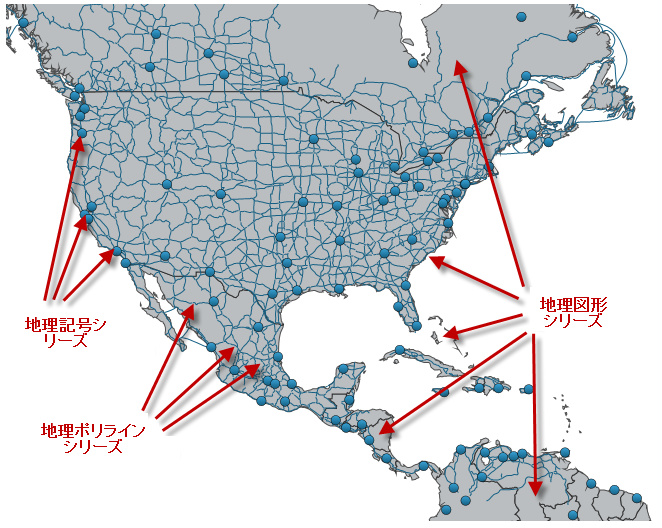

////
|metadata|
{
    "controlName": ["{GeoMapName}"],
    "tags": []
}
|metadata|
////

= 複数の地理的シリーズを表示

== 目的

このトピックは、 link:{GeoMapLink}.{GeoMapName}_members.html[{GeoMapName}]™ コントロールで複数の地理的シリーズを表示する方法を提供します。

== 前提条件

以下の表に、このトピックを理解するための前提条件として求められるトピックをリストします。

[options="header", cols="a,a"]
|====
|トピック|目的

| link:geographicmap-adding-geographicmap-to-a-page.html[{GeoMapName} をページに追加]
|このトピックは、 {GeoMapName} コントロールをアプリケーション ページに追加する方法を示します。

| link:geographicmap-visual-elements-of-geographicmap.html[{GeoMapName} の視覚要素]
|このトピックは、 {GeoMapName} コントロールのマップ要素のレイアウトについての情報を提供します。

| link:geographicmap-shape-files-reference.html[シェープ ファイルの参照]
|このトピックは、マップ、シェープ ファイル、および地理的な関連資料についての情報を提供します。これらのリソースを使用して、地理的シェープ ファイルおよび編集のためのツールの詳細を学習し入手します。

| link:geographicmap-binding-shape-files-with-geospatial-data.html[シェープ ファイルを地理的データにバインディング]
|このトピックは、 {GeoMapName} コントロールに地理的データがあるシェープ ファイルをバインドする方法を提供します。

| link:geographicmap-using-geographic-series.html[地理的シリーズを使用]
|このトピックは、 {GeoMapName} コントロールの地理的シリーズのサポートされているタイプについての情報を提供します。

|====

== 本トピックの内容

このトピックには次のセクションがあります。

* <<_Ref320193474,概要>>
* <<_Ref320651783,プレビュー>>
* <<_Ref321213942,概要>>
* <<_Ref321213944,手順>>
* <<_Ref320185294,関連コンテンツ>>

[[_Ref320193474]]
== 概要

{GeoMapName} コントロールの link:{DataChartLinkBase}.seriesviewer~series.html[Series] プロパティは、地理的シリーズの無制限の数の描画をサポートするために使用されます。このプロパティは、地理的シリーズ オブジェクトのコレクションで、任意のタイプの地理的シリーズをそれに追加できます。たとえば、都市などの地理的位置をプロットするために link:{GeoMapLink}.geographicsymbolseries_members.html[GeographicSymbolSeries] を追加でき、またこれらの地理的位置の間の接続 (たとえば、道路) をプロットするために link:{GeoMapLink}.geographicpolylineseries_members.html[GeographicPolylineSeries] を追加できます。

[[_Ref320651783]]

== プレビュー

以下は、複数の地理的シリーズがある {GeoMapName} コントロールのプレビューです。

[[_Ref321213942]]

== 概要

このトピックは、複数の地理的シリーズを {GeoMapName} コントロールに表示する方法を順に説明します。 link:{DataChartLinkBase}.seriesviewer~series.html[Series] プロパティにすべての地理的シリーズが追加され、 link:{DataVizMapsLink}.shapefileconverter_members.html[ShapefileConverter] クラスを使用して、シェープ ファイルから読み込まれた以下の地理的データをプロットします。

* link:{GeoMapLink}.geographicshapeseries_members.html[GeographicShapeSeries] - 世界の国々を表示します。
* link:{GeoMapLink}.geographicsymbolseries_members.html[GeographicSymbolSeries] - 主要都市の場所を表示します。
* link:{GeoMapLink}.geographicpolylineseries_members.html[GeographicPolylineSeries] - 主要都市間の道路を表示します。

希望のデータをプロットするために、これまたは他の組み合わせで地理的シリーズを使用できます。また、シェープ ファイルがアプリケーション用に十分な地理的コンテンツを提供していれば、マップ背景コンテンツから地理的画像を非表示にしたい場合があります。この詳細は、 link:geographicmap-hiding-geographic-imagery-in-map-background-content.html[「マップ背景コンテンツで地理的画像を非表示にする」]のトピックを参照してください。

以下はプロセスの概念的概要です。

[start=1]
. *ShapefileConverter オブジェクトをリソースとして追加します。* 
[start=2]
. *{GeoMapName} コントロールを追加します。* 
[start=3]
. *GeographicShapeSeries オブジェクトを追加します。*
[start=4]
. *GeographicPolylineSeries オブジェクトを追加します。*
[start=5]
. *GeographicSymbolSeries オブジェクトを追加します。*
[start=6]
. *結果を確認します。*

[[_Ref321213944]]

== 手順

以下は、複数の地理的シリーズを {GeoMapName} コントロールに表示する手順です。

=== ShapefileConverter オブジェクトをリソースとして追加します。

利用者のページのリソース セクションで、{GeoMapName} コントロールに表示したい各シェープ ファイルに link:{DataVizMapsLink}.shapefileconverter_members.html[ShapefileConverter] を追加します。

ifdef::wpf[]
*XAML の場合:*

[source,xaml]
----
<ig:ShapefileConverter x:Key="countriesShapeSource"
                        ShapefileSource="ShapeFiles/world_countries.shp"
                        DatabaseSource="ShapeFiles/world_countries.dbf" >
</ig:ShapefileConverter>
<ig:ShapefileConverter x:Key="roadsShapeSource"
                        ShapefileSource="ShapeFiles/north_america_primary_roads.shp"
                        DatabaseSource="ShapeFiles/north_america_primary_roads.dbf" >
</ig:ShapefileConverter>
<ig:ShapefileConverter x:Key="citiesLocationSource"
                        ShapefileSource="ShapeFiles/world_cities.shp"
                        DatabaseSource="ShapeFiles/world_cities.dbf" >
</ig:ShapefileConverter>
----
endif::wpf[]

*Visual Basic の場合:*

[source,vb]
----
Dim countriesShapeSource = New ShapefileConverter()
countriesShapeSource.ShapefileSource = "ShapeFiles/world_countries.shp"
countriesShapeSource.DatabaseSource = "ShapeFiles/world_countries.dbf"
Dim roadsShapeSource = New ShapefileConverter()
roadsShapeSource.ShapefileSource = "ShapeFiles/north_america_primary_roads.shp"
roadsShapeSource.DatabaseSource = "ShapeFiles/north_america_primary_roads.dbf"
Dim citiesLocationSource = New ShapefileConverter()
citiesLocationSource.ShapefileSource = "ShapeFiles/world_cities.shp"
citiesLocationSource.DatabaseSource = "ShapeFiles/world_cities.dbf"
----

*C# の場合:*

[source,csharp]
----
var countriesShapeSource = new ShapefileConverter();
countriesShapeSource.ShapefileSource="ShapeFiles/world_countries.shp";
countriesShapeSource.DatabaseSource="ShapeFiles/world_countries.dbf";
var roadsShapeSource = new ShapefileConverter();
roadsShapeSource.ShapefileSource="ShapeFiles/north_america_primary_roads.shp";
roadsShapeSource.DatabaseSource="ShapeFiles/north_america_primary_roads.dbf";
var citiesLocationSource = new ShapefileConverter();
citiesLocationSource.ShapefileSource="ShapeFiles/world_cities.shp";
citiesLocationSource.DatabaseSource="ShapeFiles/world_cities.dbf";
----

=== {GeoMapName} コントロールを追加します。

null 値に設定された  pick:[wpf="link:{GeoMapLink}.xamgeographicmap~backgroundcontent.html[BackgroundContent]"]pick:[win-forms="BackgroundContent"] プロパティで {GeoMapName} コントロールを追加します。

ifdef::wpf[]
*XAML の場合:*

[source,xaml]
----
<ig:XamGeographicMap x:Name="GeoMap" BackgroundContent="{x:Null}" >
    <ig:XamGeographicMap.Series>
       <!-- TODO: ここに GeographicShapeSeries を追加 -->
       <!-- TODO: ここに GeographicPolylineSeries を追加 -->
       <!-- TODO: ここに GeographicSymbolSeries を追加 -->
    </ig:XamGeographicMap.Series>
</ig:XamGeographicMap>
----
endif::wpf[]

*Visual Basic の場合:*

[source,vb]
----
Dim GeoMap = New {GeoMapName}()
ifdef::wpf[]
GeoMap.BackgroundContent = Nothing
endif::wpf[]
ifdef::win-forms[]
GeoMap.ResetBackgroundContent()
GeoMap.Refresh()
endif::win-forms[]
‘ TODO: ここに GeographicShapeSeries を追加
‘ TODO: ここに GeographicPolylineSeries を追加
‘ TODO: ここに GeographicSymbolSeries を追加
ifdef::wpf[]
Me.Children.Add(GeoMap)
endif::wpf[]
ifdef::win-forms[]
Me.Controls.Add(GeoMap)
endif::win-forms[]
----

*C# の場合:*

[source,csharp]
----
var GeoMap = new {GeoMapName}();
ifdef::wpf[]
GeoMap.BackgroundContent = null;
endif::wpf[]
ifdef::win-forms[]
GeoMap.ResetBackgroundContent()
GeoMap.Refresh()
endif::win-forms[]
// TODO: ここに GeographicShapeSeries を追加 
// TODO: ここに GeographicPolylineSeries を追加 
// TODO: ここに GeographicSymbolSeries を追加 
ifdef::wpf[]
this.Children.Add(GeoMap);
endif::wpf[]
ifdef::win-forms[]
this.Controls.Add(GeoMap);
endif::win-forms[]
----

=== GeographicShapeSeries オブジェクトを追加します。

{GeoMapName} コントロールの Series コレクションで、世界の国々の図形を表示するために link:{GeoMapLink}.geographicshapeseries_members.html[GeographicShapeSeries] オブジェクトを追加します。

ifdef::wpf[]

*XAML の場合:*

[source,xaml]
----
<ig:GeographicShapeSeries {ApiDataSource}="{StaticResource countriesShapeSource}"
                          ShapeMemberPath="Points">
</ig:GeographicShapeSeries>
----

endif::wpf[]

*Visual Basic の場合:*

[source,vb]
----
Dim geoShapeSeries = New GeographicShapeSeries()
geoShapeSeries.{ApiDataSource} = countriesShapeSource
geoShapeSeries.ShapeMemberPath = "Points"
Me.GeoMap.Series.Add(geoShapeSeries)
----

*C# の場合:*

[source,csharp]
----
var geoShapeSeries = new GeographicShapeSeries();
geoShapeSeries.{ApiDataSource} = countriesShapeSource
geoShapeSeries.ShapeMemberPath = "Points";
this.GeoMap.Series.Add(geoShapeSeries);
----

=== GeographicPolylineSeries オブジェクトを追加します。

{GeoMapName} コントロールの Series コレクションに、主要都市間の道路を表示するために link:{GeoMapLink}.geographicpolylineseries_members.html[GeographicPolylineSeries] オブジェクトを追加します。

ifdef::wpf[]

*XAML の場合:*

[source,xaml]
----
<ig:GeographicPolylineSeries {ApiDataSource}="{StaticResource roadsShapeSource}"
                             ShapeMemberPath="Points">
</ig:GeographicPolylineSeries>
----

endif::wpf[]

*Visual Basic の場合:*

[source,vb]
----
Dim geoPolylineSeries = New GeographicPolylineSeries()
geoPolylineSeries.{ApiDataSource} = roadsShapeSource
geoPolylineSeries.ShapeMemberPath = "Points"
Me.GeoMap.Series.Add(geoPolylineSeries)
----

*C# の場合:*

[source,csharp]
----
var geoPolylineSeries = new GeographicPolylineSeries();
geoPolylineSeries.{ApiDataSource} = roadsShapeSource;
geoPolylineSeries.ShapeMemberPath = "Points";
this.GeoMap.Series.Add(geoPolylineSeries);
----

=== GeographicSymbolSeries オブジェクトを追加します。

{GeoMapName} コントロールの Series コレクションで、主要都市の位置を表示するために link:{GeoMapLink}.geographicsymbolseries_members.html[GeographicSymbolSeries] オブジェクトを追加します。

ifdef::wpf[]

*XAML の場合:*

[source,xaml]
----
<ig:GeographicSymbolSeries {ApiDataSource}="{StaticResource citiesLocationSource}"
                           LongitudeMemberPath="Points[0][0].X"
                           LatitudeMemberPath="Points[0][0].Y">
</ig:GeographicSymbolSeries>
----

endif::wpf[]

*Visual Basic の場合:*

[source,vb]
----
Dim geoSymbolSeries = New GeographicSymbolSeries()
geoSymbolSeries.{ApiDataSource} = citiesLocationSource
geoSymbolSeries.LongitudeMemberPath = "Points[0][0].X"
geoSymbolSeries.LatitudeMemberPath = "Points[0][0].Y"
Me.GeoMap.Series.Add(geoSymbolSeries)
----

*C# の場合:*

[source,csharp]
----
var geoSymbolSeries = new GeographicSymbolSeries();
geoSymbolSeries.{ApiDataSource} = citiesLocationSource;
geoSymbolSeries.LongitudeMemberPath = "Points[0][0].X";
geoSymbolSeries.LatitudeMemberPath = "Points[0][0].Y";
this.GeoMap.Series.Add(geoSymbolSeries);
----

=== 結果を確認します。

結果を確認するために、プロジェクトをビルドおよび実行します。手順を正しく実装した場合、{GeoMapName} は上記の<<_Ref320651783,プレビュー>> セクションで示したように表示されるはずです。

[[_Ref320185294]]
== 関連コンテンツ

=== トピック

以下のトピックでは、このトピックに関連する情報を提供しています。

[options="header", cols="a,a"]
|====
|トピック|目的

| link:geographicmap-adding-geographicmap-to-a-page.html[{GeoMapName} をページに追加] 

|このトピックは、 {GeoMapName} コントロールをアプリケーション ページに追加する方法を示します。

| link:geographicmap-visual-elements-of-geographicmap.html[{GeoMapName} の視覚要素]
|このトピックは、 {GeoMapName} コントロールのマップ要素のレイアウトについての情報を提供します。

| link:geographicmap-shape-files-reference.html[シェープ ファイルの参照]
|このトピックは、マップ、シェープ ファイル、および地理的な関連資料についての情報を提供します。これらのリソースを使用して、地理的シェープ ファイルおよび編集のためのツールの詳細を学習し入手します。

| link:geographicmap-binding-shape-files-with-geospatial-data.html[シェープ ファイルを地理的データにバインディング]
|このトピックは、 {GeoMapName} コントロールに地理的データがあるシェープ ファイルをバインドする方法を提供します。

| link:geographicmap-using-geographic-series.html[地理的シリーズを使用]
|このトピックは、 {GeoMapName} コントロールの地理的シリーズのサポートされているタイプについての情報を提供します。

| link:geographicmap-hiding-geographic-imagery-in-map-background-content.html[マップ背景コンテンツで地理的画像を非表示]
|このトピックは、 {GeoMapName} コントロールの背景コンテンツの地理的画像を非表示にする方法を提供します。

|====