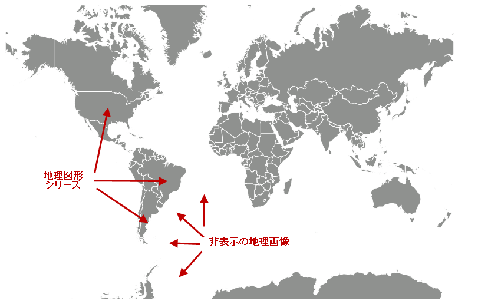

////
|metadata|
{
    "controlName": ["{GeoMapName}"],
    "tags": []
}
|metadata|
////

= マップ背景コンテンツで地理的画像を非表示

== トピックの概要

=== 目的

このトピックは、 link:{GeoMapLink}.{GeoMapName}_members.html[{GeoMapName}]™ コントロールの背景コンテンツで地理的画像を非表示にする方法を提供します。

=== 前提条件

以下の表に、このトピックを理解するための前提条件として求められるトピックをリストします。

[options="header", cols="a,a"]
|====
|トピック|目的

| link:geographicmap-adding-geographicmap-to-a-page.html[{GeoMapName} をページに追加]
|このトピックは、 {GeoMapName} コントロールをアプリケーション ページに追加する方法を示します。

| link:geographicmap-visual-elements-of-geographicmap.html[{GeoMapName} の視覚要素] 

|このトピックは、 {GeoMapName} コントロールのマップ要素のレイアウトについての情報を提供します。

| link:geographicmap-using-geographic-imagery.html[地理的画像を使用]
|このトピックは、 {GeoMapName} コントロールの背景コンテンツで地理的画像を描画する概要を提供します。

| link:geographicmap-using-geographic-series.html[地理的シリーズを使用]
|このトピックは、 {GeoMapName} コントロールで地理的シリーズを使用する方法を提供します。

|====

=== 本トピックの内容

このトピックには次のセクションがあります。

* <<_Ref320388672,マップ背景コンテンツ>>
** <<_Ref320193474,概要>>
** <<_Ref320388681,プレビュー>>
** <<_Ref320388684,例>>

* <<_Ref320185294,関連コンテンツ>>

[[_Ref320388672]]
== マップ背景コンテンツ

[[_Ref320193474]]

=== 概要

デフォルトでは、 {GeoMapName}     コントロールは、 link:{GeoMapLink}.openstreetmapimagery_members.html[OpenStreetMapImagery] クラスを使用して、マップ背景コンテンツで Open Street Maps からの地理的画像を表示します。ただし、シェープ ファイルからの地理的データが十分な地理的コンテンツを提供し、地理的画像がマップ背景コンテンツで希望されないというシナリオがあります（たとえば、世界の詳細なシェープ ファイルがある地理的図形シリーズ）。

[[_Ref320388681]]

=== プレビュー

以下の画像は、マップ背景コンテンツで非表示の地理的画像がある {GeoMapName} コントロールのプレビューです。

[[_Ref320388684]]

=== 例

このコード例は、{GeoMapName} コントロールの pick:[wpf="link:{GeoMapLink}.xamgeographicmap~backgroundcontent.html[BackgroundContent]"]pick:[win-forms="BackgroundContent"] を null 値に設定することによって、地理的画像を非表示にします。

ifdef::wpf[]

*XAML の場合:*

[source,xaml]
----
<ig:XamGeographicMap x:Name="GeoMap" BackgroundContent="{x:Null}">
    <ig:XamGeographicMap.Series>
        <!-- ここに地理的シリーズを追加します -->
    </ig:GeographicShapeSeries>
</ig:XamGeographicMap>
----

endif::wpf[]

*Visual Basic の場合:*

[source,vb]
----
ifdef::wpf[]
Dim geoMap As New XamGeographicMap()
Me.geoMap.BackgroundContent = Nothing
endif::wpf[]
ifdef::win-forms[]
Dim geoMap As New UltraGeographicMap()
Me.geoMap.ResetBackgroundContent()
Me.geoMap.Refresh()
endif::win-forms[]
----

*C# の場合:*

[source,csharp]
----
ifdef::wpf[]
XamGeographicMap geoMap = new XamGeographicMap();
this.geoMap.BackgroundContent = null;
endif::wpf[]
ifdef::win-forms[]
UltraGeographicMap geoMap = new UltraGeographicMap();
this.geoMap.ResetBackgroundContent();
this.geoMap.Refresh();
endif::win-forms[]
----

[[_Ref320185294]]
== 関連コンテンツ

以下のトピックでは、このトピックに関連する情報を提供しています。

[options="header", cols="a,a"]
|====
| *トピック* | *目的* 

| link:geographicmap-adding-geographicmap-to-a-page.html[{GeoMapName} をページに追加]
|このトピックは、 {GeoMapName} コントロールで地理的画像をバインドする方法を提供します。

| link:geographicmap-visual-elements-of-geographicmap.html[{GeoMapName} の視覚要素] 
|このトピックは、 {GeoMapName} コントロールのマップ要素のレイアウトについての情報を提供します。

| link:geographicmap-using-geographic-series.html[地理的シリーズを使用]
|このトピックは、 {GeoMapName} コントロールで地理的シリーズを使用する方法を提供します。

|====
