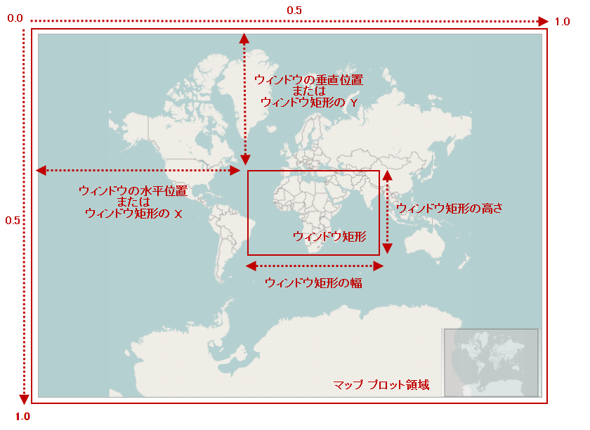
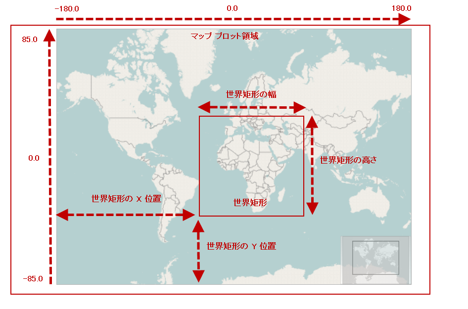

////
|metadata|
{
    "controlName": ["{GeoMapName}"],
    "tags": []
}
|metadata|
////

= コードを使用してマップ コンテンツをナビゲート

== トピックの概要

=== 目的

このトピックは、コードを使用して、 link:{GeoMapLink}.{GeoMapName}_members.html[{GeoMapName}]™ コントロールのマップ コンテンツをナビゲートする情報を提供します。

=== 前提条件

以下の表に、このトピックを理解するための前提条件として求められるトピックをリストします。

[options="header", cols="a,a"]
|====
|トピック|目的

| link:geographicmap-visual-elements-of-geographicmap.html[{GeoMapName} の視覚要素] 

|このトピックは、 {GeoMapName} コントロールのマップ要素のレイアウトについての情報を提供します。

| link:geographicmap-navigating-map-content.html[マップ コンテンツをナビゲート]
|このトピックは、 {GeoMapName} コントロールでのマップ コンテンツのナビゲート、およびコントロールのすべてのサポートされるナビゲーション機能に関する概念を提供します。

|====

=== このトピックの構成

このトピックには次のセクションがあります。

* <<_Ref320554189,マップ ナビゲーション>>

** <<_Ref320573436,概要>>
** <<_Ref320787194,ウィンドウ ナビゲーション システム>>
** <<_Ref320787228,ワールド ナビゲーション システム>>

* <<_Ref320573442,マップ ナビゲーション機能>>
* <<_Ref320185294,関連コンテンツ>>

[[_Ref320554189]]
== マップ ナビゲーション

[[_Ref320573436]]

=== 概要

{GeoMapName} コントロールを使用して 2 つの方法でナビゲートをすることができ、コードを使用してマップ コンテンツをナビゲートします。最初はウィンドウ ナビゲーション システムを使用する方法で、2 番目はワールド ナビゲーション システムを使用する方法です。

* ウィンドウ ナビゲーション システム
* ワールド ナビゲーション システム

{GeoMapName} コントロールは、値を変換するメソッドを提供することで、両方のナビゲーション システムに対応します。これらの方法については、このトピックの<<_Ref320573406,実例>>のセクションをごらんください。

[[_Ref320787194]]

=== ウィンドウ ナビゲーション システム

ウィンドウ ナビゲーション システムは、 link:{DataChartLinkBase}.seriesviewer~windowrect.html[WindowRect]　の位置とサイズ（ウィンドウ座標のマップ ビュー）を設定するためのプロパティで構成されます。このナビゲーション システムでは、値はマップ ウィンドウ ビューのプロパティで 0 および 1 に設定できます。

次のプレビュー画像は {GeoMapName} コントロールで link:{DataChartLinkBase}.seriesviewer~windowrect.html[WindowRect]　の位置やサイズが強調表示され、マップ コンテンツのある特定の地域 (アフリカ大陸やヨーロッパ大陸など) にズームしています。

以下の表では、{GeoMapName} コントロールのマップ ウィンドウの位置とサイズを設定するプロパティについて簡単に説明します。

[options="header", cols="20a,20a,60a"]
|====
|プロパティ|タイプ|説明

| link:{DataChartLinkBase}.seriesviewer~windowrect.html[WindowRect]
| {ApiRectClass}
|マップ ウィンドウの位置とサイズを指定します。表示中の領域の座標とアンカー ポイントがウィンドウの左上に表示されます。

| link:{DataChartLinkBase}.seriesviewer~windowpositionhorizontal.html[WindowPositionHorizontal]
|double
|マップ ウィンドウの水平方向のアンカー ポイントを {GeoMapName} コントロールの左端からを指定します。これは link:{DataChartLinkBase}.seriesviewer~windowrect.html[WindowRect] 　プロパティの Left に保存された値と等しくなります。

| link:{DataChartLinkBase}.seriesviewer~windowpositionvertical.html[WindowPositionVertical]
|double
|マップ ウィンドウの垂直方向のアンカー ポイントを {GeoMapName} コントロールの上端から指定します。これは link:{DataChartLinkBase}.seriesviewer~windowrect.html[WindowRect] 　プロパティの Top に保存された値と等しくなります。

|====

[[_Ref320787228]]

=== ワールド ナビゲーション システム

ワールド ナビゲーション システムは、link:{GeoMapLink}.{GeoMapName}~worldrect.html[WorldRect] の位置とサイズを設定するためのプロパティで構成されます（地理的座標のマップ ビュー）。このナビゲーション システムでは、link:{GeoMapLink}.{GeoMapName}~worldrect.html[WorldRect] の経度プロパティでは -180～180 の値、 link:{GeoMapLink}.{GeoMapName}~worldrect.html[WorldRect] ビューの緯度プロパティでは -85～85 の値に設定できます。

次のプレビュー画像は {GeoMapName} コントロールで link:{GeoMapLink}.{GeoMapName}~worldrect.html[WorldRect] の位置やサイズが強調表示され、マップ コンテンツのある特定の地域 (アフリカ大陸やヨーロッパ大陸など) にズームしています。

以下の表では、{GeoMapName} コントロールのマップ ウィンドウの位置とサイズを設定するプロパティについて簡単に説明します。

[options="header", cols="20a,20a,60a"]
|====
|プロパティ|タイプ|説明

| link:{GeoMapLink}.{GeoMapName}~worldrect.html[WorldRect]
| {ApiRectClass}
|マップ ナビゲーションの表示領域について位置やサイズを指定すると、マップ ナビゲーションの中に、世界地図座標で指定領域のマップ コンテンツが表示されます。

|====

[[_Ref320573442]]
== マップ ナビゲーション機能

[[_Ref320573406]]

=== 実例

以下の表で、{GeoMapName} コントロールでサポートされているコード ナビゲーション機能について簡単に説明します。

==== マップ コンテンツの拡大

*C# の場合:* 

[source,csharp]
---- 
// 0.1 の係数で地図の中心にズームインします
var widthScale = (0.1 * this.GeoMap.WindowRect.Width); 
var heightScale = (0.1 * this.GeoMap.WindowRect.Height); 
var x = this.GeoMap.WindowRect.X + (widthScale / 2); 
var y = this.GeoMap.WindowRect.Y + (heightScale / 2);
var w = this.GeoMap.WindowRect.Width - widthScale; 
var h = this.GeoMap.WindowRect.Height - heightScale; 
this.GeoMap.WindowRect = new {ApiRectClass}(x, y, w, h);
---- 

*Visual Basic の場合:*

[source,vb]
---- 
' 0.1 の係数で地図の中心にズームインします
Dim widthScale = (0.1 * Me.GeoMap.WindowRect.Width) 
Dim heightScale = (0.1 * Me.GeoMap.WindowRect.Height) 
Dim x = Me.GeoMap.WindowRect.X + (widthScale / 2) 
Dim y = Me.GeoMap.WindowRect.Y + (heightScale / 2) 
Dim w = Me.GeoMap.WindowRect.Width - widthScale 
Dim h = Me.GeoMap.WindowRect.Height - heightScale 
Me.GeoMap.WindowRect = New {ApiRectClass}(x, y, w, h) 
---- 

==== マップ コンテンツの縮小

*C# の場合:* 

[source,csharp]
---- 
// 0.1 の係数でズームアウトします
var widthScale = (0.1 * this.GeoMap.WindowRect.Width); 
var heightScale = (0.1 * this.GeoMap.WindowRect.Height); 
var x = this.GeoMap.WindowRect.X - (widthScale / 2); 
var y = this.GeoMap.WindowRect.Y - (heightScale / 2); 
var w = this.GeoMap.WindowRect.Width + widthScale;
var h = this.GeoMap.WindowRect.Height + heightScale; 
this.GeoMap.WindowRect = new {ApiRectClass}(x, y, w, h);
---- 

*Visual Basic の場合:*

[source,vb]
---- 
' 0.1 の係数でズームアウトします
Dim widthScale = (0.1 * Me.GeoMap.WindowRect.Width) 
Dim heightScale = (0.1 * Me.GeoMap.WindowRect.Height) 
Dim x = Me.GeoMap.WindowRect.X - (widthScale / 2) 
Dim y = Me.GeoMap.WindowRect.Y - (heightScale / 2) 
Dim w = Me.GeoMap.WindowRect.Width + widthScale 
Dim h = Me.GeoMap.WindowRect.Height + heightScale 
Me.GeoMap.WindowRect = New {ApiRectClass}(x, y, w, h) 
---- 

==== マップ コンテンツのある領域へのズーム
*C# の場合:* 

[source,csharp]
---- 
// マップ ウィンドウの座標を使用してマップ エリアへズームします 
this.GeoMap.WindowRect = new {ApiRectClass}(0.2, 0.3, 0.6, 0.4); 
---- 

*Visual Basic の場合:*

[source,vb]
---- 
' マップ ウィンドウの座標を使用してマップ エリアへズームします 
Me.GeoMap.WindowRect = New {ApiRectClass}(0.2, 0.3, 0.6, 0.4) 
---- 

==== マップ コンテンツの地理的な領域へのズーム
*C# の場合:* 

[source,csharp]
---- 
// マップ ウィンドウの地理的座標を使用してマップ エリアへズームします 
var geoRegion = new {ApiRectClass}(-30, -40, 120, 80);
this.GeoMap.WindowRect = this.GeoMap.GetZoomFromGeographic(geoRegion); 
---- 

*Visual Basic の場合:*

[source,vb]
---- 
' マップ ウィンドウの地理的座標を使用してマップ エリアへズームします 
Dim geoRegion = New {ApiRectClass}(-30, -40, 120, 80) 
Me.GeoMap.WindowRect = Me.GeoMap.GetZoomFromGeographic(geoRegion) 
---- 

==== マップ コンテンツのサイズを表示可能領域に合わる
*C# の場合:* 

[source,csharp]
---- 
// マップ ウィンドウ座標を使用してマップ コンテンツの表示領域を最大表示に合わせます 
this.GeoMap.WindowRect = new {ApiRectClass}(0.0, 0.0, 1.0, 1.0);  
// 世界地図座標を使用してマップ コンテンツの表示領域を最大表示に合わせます 
var geoRegion = new {ApiRectClass}(-180, -75, 360, 150); 
this.GeoMap.WindowRect = this.GeoMap.GetZoomFromGeographic(geoRegion); 
---- 

*Visual Basic の場合:*

[source,vb]
---- 
' マップ ウィンドウ座標を使用してマップ コンテンツの表示領域を最大表示に合わせます 
Me.GeoMap.WindowRect = New {ApiRectClass}(0.0, 0.0, 1.0, 1.0) 
' 世界地図座標を使用してマップ コンテンツの表示領域を最大表示に合わせます 
Dim geoRegion = New {ApiRectClass}(-180, -75, 360, 150) 
Me.GeoMap.WindowRect = Me.GeoMap.GetZoomFromGeographic(geoRegion) 
---- 

==== マップ コンテンツの地理的領域へのバインド
*C# の場合:* 

[source,csharp]
---- 
// マップ コンテンツを地理的領域にバインドおよび制限します 
this.GeoMap.WorldRect = new {ApiRectClass}(-30, -40, 120, 80); 
---- 

*Visual Basic の場合:*

[source,vb]
---- 
' マップ コンテンツを地理的領域にバインドおよび制限します 
Me.GeoMap.WorldRect = New {ApiRectClass}(-30, -40, 120, 80) 
---- 

==== マップ コンテンツのパンニング
*C# の場合:* 

[source,csharp]
---- 
// 0.05 の係数でパンレフト（西方向）します 
this.GeoMap.WindowPositionHorizontal = this.GeoMap.WindowRect.X - 0.05;  
// 0.05 の係数でパンライト（東方向）します 
this.GeoMap.WindowPositionHorizontal = this.GeoMap.WindowRect.X + 0.05;  
// 0.05 の係数でパンアップ（北方向）します 
this.GeoMap.WindowPositionVertical = this.GeoMap.WindowRect.Y - 0.05;  
// 0.05 の係数でパンダウン（南方向）します 
this.GeoMap.WindowPositionVertical = this.GeoMap.WindowRect.Y + 0.05; 
---- 

*Visual Basic の場合:*

[source,vb]
---- 
' 0.05 の係数でパンレフト（西方向）します 
Me.GeoMap.WindowPositionHorizontal = Me.GeoMap.WindowRect.X - 0.05  
' 0.05 の係数でパンライト（東方向）します 
Me.GeoMap.WindowPositionHorizontal = Me.GeoMap.WindowRect.X + 0.05  
' 0.05 の係数でパンアップ（北方向）します 
Me.GeoMap.WindowPositionVertical = Me.GeoMap.WindowRect.Y - 0.05  
' 0.05 の係数でパンダウン（南方向）します 
Me.GeoMap.WindowPositionVertical = Me.GeoMap.WindowRect.Y + 0.05 
---- 

[[_Ref320185294]]
== 関連コンテンツ

以下のトピックでは、このトピックに関連する情報を提供しています。

[options="header", cols="a,a"]
|====
| *トピック* | *目的* 

| link:geographicmap-visual-elements-of-geographicmap.html[{GeoMapName} の視覚要素] 

|このトピックは、 {GeoMapName} コントロールのマップ要素のレイアウトについての情報を提供します。

| link:geographicmap-navigating-map-content.html[マップ コンテンツをナビゲート]
|このトピックは、 {GeoMapName} コントロールでのマップ コンテンツのナビゲート、およびコントロールのすべてのサポートされるナビゲーション機能に関する概念を提供します。

| link:geographicmap-navigating-map-content-using-keyboard.html[キーボードを使用してマップ コンテンツをナビゲート]
|このトピックは、キーボードからの入力を使用して、 {GeoMapName} コントロールでのマップ コンテンツのナビゲートに関する情報を提供します。

| link:geographicmap-navigating-map-content-using-a-mouse.html[マウスを使用してマップ コンテンツをナビゲート]
|このトピックは、マウス操作を使用した {GeoMapName} コントロールのマップ コンテンツのナビゲートに関する情報を提供します。

|====