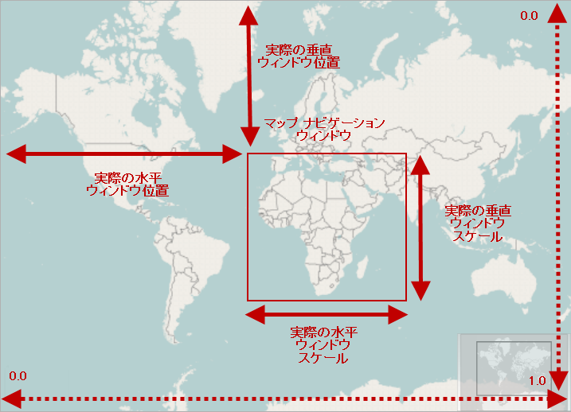

////
|metadata|
{
    "controlName": ["{GeoMapName}"],
    "tags": []
}
|metadata|
////

= マップ コンテンツをナビゲート

== トピックの概要

=== 目的

このトピックは、 link:{GeoMapLink}.{GeoMapName}_members.html[{GeoMapName}]™ コントロールのマップ コンテンツのナビゲートについて、このコントロールがサポートするすべてのナビゲーション機能に関する概念を提供します。

=== 前提条件

以下の表は、このトピックを理解するための前提条件として必要なトピックを示しています。

[options="header", cols="a,a"]
|====
|トピック|目的

| link:geographicmap-visual-elements-of-geographicmap.html[{GeoMapName} の視覚要素] 

|このトピックは、{GeoMapName} コントロールのマップ要素のレイアウトについての情報を提供します。

|====

=== このトピックの構成

このトピックは以下のセクションからなります。

* <<_Ref320573147,マップ ナビゲーション>>
* <<_Ref320573152,マップ ナビゲーション ウィンドウ>>
* <<_Ref320573096,マップ ナビゲーション機能>>
* <<_Ref320185294,関連コンテンツ>>

[[_Ref320573147]]
== マップ ナビゲーション

=== 概要

{GeoMapName} コントロールは、  {DataChartName} コントロールでも使用できる link:{DataChartLinkBase}.seriesviewer_members.html[SeriesViewer] コントロールかのナビゲーション機能を継承しています。

{GeoMapName} コントロールのナビゲーションは、既定では有効にされており、マップ コンテンツのズームとパンが可能です。ただし、 link:{GeoMapLink}.{GeoMapName}~zoomable.html[Zoomable]  プロパティを使用して、この動作を変更できます。知っておくべき重要な情報としては  {GeoMapName}     コントロールのズームは、あらかじめ決められた割合に同期してマップ コンテンツをスケーリングする動作に過ぎません。その結果、水平方向およびその逆にも拡大縮小することなく、マップ コンテンツを垂直方向に拡大縮小することはできません。したがって、 link:{GeoMapLink}.{GeoMapName}~zoomable.html[Zoomable] プロパティは、マップ ナビゲーションを有効または無効にするために同じ値に設定する必要があります。

[[_Ref320573152]]
== マップ ナビゲーション ウィンドウ

{GeoMapName} コントロールでは、ナビゲーション ウィンドウは、マップ コンテンツの現在の表示可能な領域を表示します。 link:{DataChartLinkBase}.seriesviewer~actualwindowrect.html[ActualWindowRect] プロパティは、ナビゲーション ウィンドウの位置とサイズをトラックします。 {GeoMapName} コントロールでパンまたはズーム操作を行うたびに、ナビゲーション ウィンドウが変化し、 link:{DataChartLinkBase}.seriesviewer~actualwindowrect.html[ActualWindowRect] プロパティは新しい値で更新されます。

以下の表で、 {GeoMapName} コントロールのナビゲーション ウィンドウをトラックするために使用するプロパティについて簡単に説明します。

[options="header", cols="30a,10a,40a,20a"]
|====
|プロパティ|タイプ|解説|デフォルト値

| link:{DataChartLinkBase}.seriesviewer~actualwindowrect.html[ActualWindowRect] 
| {ApiRectClass}
|{GeoMapName} コントロールのマップ コンテンツを表示するナビゲーション ウィンドウの位置とサイズを表しています。
|0, 0, 1, 1 

ナビゲーション ウィンドウにマップ コンテンツ全体を表示します。

| link:{DataChartLinkBase}.seriesviewer~actualwindowpositionhorizontal.html[ActualWindowPositionHorizontal]
|double
|ナビゲーション ウィンドウの水平方向のアンカー ポイントを {GeoMapName} コントロールの左端からを指定します。これは link:{DataChartLinkBase}.seriesviewer~actualwindowrect.html[ActualWindowRect] プロパティの Left に保存された値と等しくなります。
|0 

ナビゲーション ウィンドウにマップ コンテンツの左部分を表示します。

| link:{DataChartLinkBase}.seriesviewer~actualwindowpositionvertical.html[ActualWindowPositionVertical]
|double
|ナビゲーション ウィンドウの垂直方向のアンカー ポイントを {GeoMapName}  コントロールの上端から指定します。これは  link:{DataChartLinkBase}.seriesviewer~actualwindowrect.html[ActualWindowRect] プロパティの Top に保存された値と等しくなります。
|0 

ナビゲーション ウィンドウにマップ コンテンツの上部分を表示します。

| link:{GeoMapLink}.{GeoMapName}~actualwindowscale.html[ActualWindowScale]
|double
|{GeoMapName} コントロールのナビゲーション ウィンドウのサイズを表しています。これは link:{DataChartLinkBase}.seriesviewer~actualwindowrect.html[ActualWindowRect]  プロパティに保存された値と等しくなります。
|1 

ナビゲーション ウィンドウに水平方向のマップ コンテンツ全体を表示します。

|====

次のプレビュー画像は {GeoMapName} コントロールで ナビゲーション ウィンドウの位置やサイズが強調表示され、マップ コンテンツのある特定の地域 (アフリカ大陸など) にズームしています。

[[_Ref320573096]]
== マップ ナビゲーション機能

以下の表で、{GeoMapName} コントロールがサポートするコード ナビゲーション機能について簡単に説明します。

[options="header", cols="30a,70a"]
|====
|ナビゲーションの特徴|解説

|すべてのマップ方向にパン
|マウスとキーボード入力を組み合わせて使用して、すべての方向にマップ コンテンツの基本的なパンが可能です。この特徴の機能は、以下のトピックで説明されています。 

* link:geographicmap-navigating-map-content-using-a-mouse.html[マウスを使用してマップ コンテンツをナビゲート] 

* link:geographicmap-navigating-map-content-using-keyboard.html[キーボードを使用してマップ コンテンツをナビゲート] 

|マップの表示可能領域にマップ コンテンツを収めます。
|キーボード入力またはコードビハインドを使用することで、マップ コンテンツのスケールを {GeoMapName} コントロールの表示可能領域に合わせて表示することが可能です。この特徴の機能は、以下のトピックで説明されています。 

* link:geographicmap-navigating-map-content-using-code.html[コードを使用してマップ コンテンツをナビゲート] 

* link:geographicmap-navigating-map-content-using-keyboard.html[キーボードを使用してマップ コンテンツをナビゲート] 

|ズームインとズームアウト
|マウスとキーボード入力を組み合わせて使用して、マップ コンテンツの基本的なズームインとズームアウトが可能です。この特徴の機能は、以下のトピックで説明されています。 

* link:geographicmap-navigating-map-content-using-code.html[コードを使用してマップ コンテンツをナビゲート] 

* link:geographicmap-navigating-map-content-using-keyboard.html[キーボードを使用してマップ コンテンツをナビゲート] 

* link:geographicmap-navigating-map-content-using-a-mouse.html[マウスを使用してマップ コンテンツをナビゲート] 

|マップ領域をズーム
|マウスとキーボード入力を組み合わせて使用して、マップ コンテンツをマップの領域にズームできます。この特徴の機能は、以下のトピックで説明されています。 

* link:geographicmap-navigating-map-content-using-code.html[コードを使用してマップ コンテンツをナビゲート] 

* link:geographicmap-navigating-map-content-using-a-mouse.html[マウスを使用してマップ コンテンツをナビゲート] 

|地理的領域にズーム
|コードビハインドでマップの地理的領域にマップ コンテンツをズームするためにカスタム ナビゲーション アクションを実装できます。この特徴の機能は、以下のトピックで説明されています。 

link:geographicmap-navigating-map-content-using-code.html[コードを使用してマップ コンテンツをナビゲート]

|マップ コンテンツを地理的領域にバインド
|マップ コンテンツのナビゲーションをコードビハインドでマップの地理的領域にバインドおよび制限することができます。この特徴の機能は、以下のトピックで説明されています。 

link:geographicmap-navigating-map-content-using-code.html[コードを使用してマップ コンテンツをナビゲート]

|====

[[_Ref320185294]]
== 関連コンテンツ

このトピックについては、以下のトピックも参照してください。

[options="header", cols="a,a"]
|====
| *トピック* | *目的* 

| link:geographicmap-visual-elements-of-geographicmap.html[{GeoMapName} の視覚要素] 

|このトピックは、 {GeoMapName} コントロールのマップ要素のレイアウトについての情報を提供します。

| link:geographicmap-navigating-map-content-using-keyboard.html[キーボードを使用してマップ コンテンツをナビゲート]
|このトピックは、キーボードからの入力を使用して、 {GeoMapName} コントロールでのマップ コンテンツのナビゲートに関する情報を提供します。

| link:geographicmap-navigating-map-content-using-a-mouse.html[マウスを使用してマップ コンテンツをナビゲート]
|このトピックは、マウス操作を使用した {GeoMapName} コントロールのマップ コンテンツのナビゲートに関する情報を提供します。

| link:geographicmap-navigating-map-content-using-code.html[コードを使用してマップ コンテンツをナビゲート]
|このトピックは、コードを使用して、 {GeoMapName} コントロールのマップ コンテンツをナビゲートする情報を提供します。

ifdef::wpf[]
| link:geographicmap-navigating-map-content-using-overview-plus-detail-pane.html[概要と詳細ペインを使用してマップ コンテンツをナビゲート]
|このトピックは、 xamOverviewPlusDetailPane™ コントロールを使用して {GeoMapName} コントロールでマップのコンテンツをナビゲートする方法を示します。
endif::wpf[]
|====