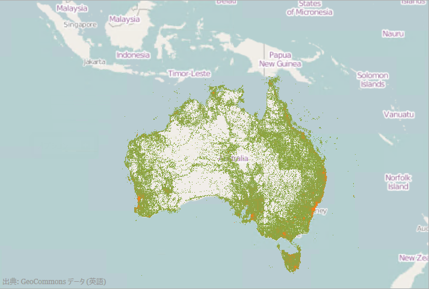

////
|metadata|
{
    "controlName": ["{GeoMapName}"],
    "tags": []
}
|metadata|
////

= 地理高密度散布系列の使用

== トピックの概要

=== 目的

このトピックは、 link:{GeoMapLink}.{GeoMapName}_members.html[{GeoMapName}]™ コントロールの link:{GeoMapLink}.geographichighdensityscatterseries_members.html[GeographicHighDensityScatterSeries] 系列タイプの追加と構成についての情報を提供します。

=== 前提条件

このトピックをより理解するために、以下のトピックを参照することをお勧めします。

[options="header", cols="a,a"]
|====
|トピック|目的

| link:geographicmap-adding-geographicmap-to-a-page.html[{GeoMapName} をページに追加]
|このトピックでは、 {GeoMapName} コントロールをアプリケーション ページに追加する方法を示します。

| link:geographicmap-using-geographic-series.html[地理的シリーズを使用]
|このトピックは、 {GeoMapName} コントロールの地理的シリーズのサポートされているタイプについての情報を提供します。

|====

=== このトピックの内容

このトピックは、以下のセクションで構成されます。

* <<GeographicHighDensityScatterSeries,地理高密度散布系列>>

** <<Overview,概要>>
** <<Preview,プレビュー>>
** <<DataRequirements,データ要件>>
** <<DataBinding,データ バインディング>>
** <<HeatColorScale,熱色スケール>>
** <<Example,例>>

* <<Performance,パフォーマンス>>

** <<Overview1,概要>>
** <<SeriesResolution,シリーズの解像度>>
** <<Example1,例>>
** <<ProgressiveLoading,プログレッシブ ローディング>>
** <<Example2,例>>
** <<MouseOverSupport,マウス オーバーのサポート>>
** <<Example3,例>>
** <<BruteForceMode,ブルート フォース モード>>
** <<Example4,例>>
** <<PointSize,ポイント サイズ>>
** <<Example5,例>>

* <<RelatedContent,関連コンテンツ>>

[[GeographicHighDensityScatterSeries]]
== 地理高密度散布系列

[[Overview]]

=== 概要

{GeoMapName}     コントロールの link:{GeoMapLink}.geographichighdensityscatterseries_members.html[GeographicHighDensityScatterSeries] 系列を使用すると、数百から数百万のデータ ポイントから成る散布図データを最短の読み込み時間でバインドして表示できます。相当数のデータ ポイントがあるため、シリーズではフルサイズのマーカーに対して散布データを小さな点として表示し、領域にはデータポイントの集合を表す高い色密度を使用した大半のデータを表示します。

[[Preview]]

=== プレビュー

以下の画像は、{GeoMapName} コントロールの link:{GeoMapLink}.geographichighdensityscatterseries_members.html[GeographicHighDensityScatterSeries] 系列のプレビューです。マップはオーストラリアの人口密度を表す数千のデータ ポイントにバインドされます。大量のデータ ポイントを含むマップのプロット領域は凝縮された赤色のピクセルによって表します。少量のデータ ポイントを含む領域は青色のピクセルによって表します。

image::images/GeographicMap_High_Density_Scatter_Series_1.png[]

[[DataRequirements]]

=== データ要件

{GeoMapName} コントロールの散布シリーズの他のタイプと同様、 link:{GeoMapLink}.geographichighdensityscatterseries_members.html[GeographicHighDensityScatterSeries] には、データ バインディングのための link:{GeoMapLink}.geographichighdensityscatterseries~{ApiDataSource}.html[ {ApiDataSource}] プロパティがあります。このプロパティは、 link:http://msdn.microsoft.com/en-us/library/system.collections.ienumerable.aspx[IEnumerable] インターフェイスを実装するオブジェクトにバインドできます。

また、項目ソースの各項目は、地理経度および緯度を表す 2 つのデータ列があります。 link:{GeoMapLink}.geographichighdensityscatterseries~longitudememberpath.html[LongitudeMemberPath] および link:{GeoMapLink}.geographichighdensityscatterseries~latitudememberpath.html[LatitudeMemberPath] プロパティはこのデータ列をマップします。

[[DataBinding]]

=== データ バインディング

以下の表に、データ バインドに使用される link:{GeoMapLink}.geographichighdensityscatterseries_members.html[GeographicHighDensityScatterSeries] シリーズのプロパティをまとめています。

[options="header", cols="a,a,a"]
|====
|*プロパティ名*|*プロパティ タイプ*|*説明*

| link:{GeoMapLink}.geographichighdensityscatterseries~{ApiDataSource}.html[ {ApiDataSource}]
|`IEnumerable`
|項目ソースを取得または設定します。

| link:{GeoMapLink}.geographichighdensityscatterseries~longitudememberpath.html[LongitudeMemberPath]
|`String`
|経度値が割り当てられた項目上の位置を決定するには link:{GeoMapLink}.geographichighdensityscatterseries~{ApiDataSource}.html[ {ApiDataSource}] プロパティを使用します。

| link:{GeoMapLink}.geographichighdensityscatterseries~latitudememberpath.html[LatitudeMemberPath]
|`String`
|緯度値が割り当てられた項目上の位置を決定するには link:{GeoMapLink}.geographichighdensityscatterseries~{ApiDataSource}.html[ {ApiDataSource}] プロパティを使用します。

|====

[[HeatColorScale]]

=== 熱色スケール

熱色スケールは、シリーズ内のカラー パターンを決定するオプションの機能です。以下の表は、カラー スケールを決定するために使用するプロパティをまとめたものです。

[options="header", cols="a,a,a"]
|====
|*プロパティ名*|*プロパティ タイプ*|*説明*

| link:{GeoMapLink}.geographichighdensityscatterseries~heatminimum.html[HeatMinimum]
|`Double`
|カラー スケールの最小端を表す double 値を定義します。

| link:{GeoMapLink}.geographichighdensityscatterseries~heatmaximum.html[HeatMaximum]
|`Double`
|カラー スケールの最大端を表す double 値を定義します。

| link:{GeoMapLink}.geographichighdensityscatterseries~heatminimumcolor.html[HeatMinimumColor]
|`Color`
|カラー スケールの下端で使用するポイント密度カラーを定義します。

| link:{GeoMapLink}.geographichighdensityscatterseries~heatmaximumcolor.html[HeatMaximumColor]
|`Color`
|カラー スケールの上端で使用するポイント密度カラーを定義します。

|====

[[Example]]

=== 例

表の次にあるスクリーンショットは、 link:{GeoMapLink}.geographichighdensityscatterseries_members.html[GeographicHighDensityScatterSeries] の link:{GeoMapLink}.geographichighdensityscatterseries~heatminimumcolor.html[HeatMinimumColor] と link:{GeoMapLink}.geographichighdensityscatterseries~heatmaximumcolor.html[HeatMaximumColor] のプロパティを持つ {GeoMapName}   が以下の設定後どのように見えるかを示しています。

[options="header", cols="a,a"]
|====
|プロパティ|値

| link:{GeoMapLink}.geographichighdensityscatterseries~heatminimumcolor.html[HeatMinimumColor]
|Green

| link:{GeoMapLink}.geographichighdensityscatterseries~heatmaximumcolor.html[HeatMaximumColor]
|Orange

|====

以下のコードはこの例を実装します。

ifdef::wpf[]
*XAML の場合:*

[source,xaml]
----
<ig:XamGeographicMap.Series>
   <ig:GeographicHighDensityScatterSeries
      LatitudeMemberPath="Latitude"
      LongitudeMemberPath="Longitude"
      HeatMaximumColor="Orange"
      HeatMinimumColor="Green">
   </ig:HighDensityScatterSeries>
</ig:XamGeographicMap.Series>
----
endif::wpf[]

*C# の場合:*

[source,csharp]
----
series.LatitudeMemberPath = "Latitude";
series.LongitudeMemberPath = "Longitude";
series.HeatMaximumColor = Color.FromArgb(255, 46, 139, 87);
series.HeatMinimumColor = Color.FromArgb(255, 238, 154, 0);
----

*Visual Basic の場合:*

[source,vb]
----
series.LatitudeMemberPath = "Latitude"
series.LongitudeMemberPath = "Longitude"
series.HeatMaximumColor = Color.FromArgb(255, 46, 139, 87)
series.HeatMinimumColor = Color.FromArgb(255, 238, 154, 0)
----

[[Performance]]
== パフォーマンス

[[Overview1]]

=== 概要

{GeoMapName} の link:{GeoMapLink}.geographichighdensityscatterseries_members.html[GeographicHighDensityScatterSeries] シリーズはパフォーマンスが最適化されています。数万のデータ ポイントにバインドする場合、 {GeoMapName}   のパフォーマンスを最適化するためのプロパティおよびメソッドがあります。

[[SeriesResolution]]

=== 解像度

link:{GeoMapLink}.geographichighdensityscatterseries_members.html[GeographicHighDensityScatterSeries] シリーズの link:{GeoMapLink}.geographichighdensityscatterseries~resolution.html[Resolution] プロパティは、シリーズがどの程度積極的に表示データを統合するかを決定します。値が大きい場合、より積極的にデータが統合され、系列のパフォーマンスが向上します。より低い値を使用している場合、表示解像度が強化され、それに応じてパフォーマンスも下がります。

[[Example1]]

=== 例

表の下にある画像は、 link:{GeoMapLink}.geographichighdensityscatterseries_members.html[GeographicHighDensityScatterSeries] の link:{GeoMapLink}.geographichighdensityscatterseries~resolution.html[Resolution] プロパティを以下のように設定した {GeoMapName}   を表示します。

[options="header", cols="a,a"]
|====
|プロパティ|値

| link:{GeoMapLink}.geographichighdensityscatterseries~resolution.html[Resolution]
|10

|====

image::images/GeographicMap_High_Density_Scatter_Series_3.png[]

以下はこの例における実装コードです。

ifdef::wpf[]

*XAML の場合:*

[source,xaml]
----
<ig:XamGeographicMap.Series>
   <ig:GeographicHighDensityScatterSeries
      LatitudeMemberPath="Latitude"
      LongitudeMemberPath="Longitude"
      Resolution="10">
   </ig:GeographicHighDensityScatterSeries>
</ig:XamGeographicMap.Series>
----
endif::wpf[]

*C# の場合:*

[source,csharp]
----
series.LatitudeMemberPath = "Latitude";
series.LongitudeMemberPath = "Longitude";
series.Resolution = 10;
----

*Visual Basic の場合:*

[source,vb]
----
series.LatitudeMemberPath = "Latitude"
series.LongitudeMemberPath = "Longitude"
series.Resolution = 10
----

[[ProgressiveLoading]]

=== プログレッシブ ローディング

{GeoMapName}     コントロールは、  {DataChartName}   をロードする間中の UI の応答性を保つようデータをばらばらに読み込む link:{GeoMapLink}.geographichighdensityscatterseries_members.html[GeographicHighDensityScatterSeries] シリーズを段階的に描画します。デフォルトで、 link:{GeoMapLink}.geographichighdensityscatterseries~progressiveload.html[ProgressiveLoad] プロパティは True に設定されています。 link:{GeoMapLink}.geographichighdensityscatterseries_members.html[GeographicHighDensityScatterSeries] シリーズは、{GeoMapName}   のレンダリング中にローディング状態を表示できる 2 通りの方法を提供します。

* ローディング状態を表示できる link:{GeoMapLink}.geographichighdensityscatterseries~progressiveloadstatuschanged_ev.html[ProgressiveLoadStatusChanged] イベントをリッスンします。
* link:{GeoMapLink}.geographichighdensityscatterseries~progressivestatus.html[ProgressiveStatus] プロパティは、値が 0 から 100 まで (完全なロードは 100) のプログレッシブ ロード シリーズの状態を表します。このプロパティは、プログレスバーなどのローディング状態を示すコントロールにバインドします。

[[Example2]]

=== 例

この表の下のスクリーン ショットは、 link:{GeoMapLink}.geographichighdensityscatterseries_members.html[GeographicHighDensityScatterSeries] シリーズの構成された link:{GeoMapLink}.geographichighdensityscatterseries~progressiveloadstatuschanged_ev.html[ProgressiveLoadStatusChanged] イベントでどのように  {GeoMapName} を描画するかを示します。

[options="header", cols="a,a"]
|====
|プロパティ|値

| link:{GeoMapLink}.geographichighdensityscatterseries~progressiveload.html[ProgressiveLoad]
|`True`

| link:{GeoMapLink}.geographichighdensityscatterseries~progressiveloadstatuschanged_ev.html[ProgressiveLoadStatusChanged]
|`OnSeriesProgressiveLoadStatusChanged`

|====

以下は、先行例を実装するために使用するコードです。

ifdef::wpf[]
*XAML の場合:*

[source,xaml]
----
<ig:XamGeographicMap.Series>
   <ig:GeographicHighDensityScatterSeries
      LatitudeMemberPath="Latitude"
      LongitudeMemberPath="Longitude"
      ProgressiveLoad="True"
      ProgressiveLoadStatusChanged="OnSeriesProgressiveLoadStatusChanged">
   </ig:GeographicHighDensityScatterSeries>
</ig:XamGeographicMap.Series>
----
endif::wpf[]

*C# の場合:*

[source,csharp]
----
private void OnSeriesProgressiveLoadStatusChanged(object sender,   
                                   ProgressiveLoadStatusEventArgs e)
{
   this.SeriesLoadingProgressBar.Value = e.CurrentStatus;
   if (e.CurrentStatus == 100)
   {
      SeriesLoadingPanel.Visibility = Visibility.Collapsed;
   }
}
----

*Visual Basic の場合:*

[source,vb]
----
Private Sub OnSeriesProgressiveLoadStatusChanged(ByVal sender As Object, ByVal e As ProgressiveLoadStatusEventArgs) 
Me.SeriesLoadingProgressBar.Value = e.CurrentStatus 
If (e.CurrentStatus = 100) 
      SeriesLoadingPanel.Visibility = Visibility.Collapsed 
End If
End Sub
----

[[MouseoverSupport]]

=== マウス オーバーのサポート

link:{GeoMapLink}.geographichighdensityscatterseries_members.html[GeographicHighDensityScatterSeries] シリーズの link:{GeoMapLink}.geographichighdensityscatterseries~mouseoverenabled.html[MouseOverEnabled] プロパティは、`MouseOver` イベントが発生するかどうかを指定します。デフォルト値は `False` です。この系列のマウス オーバー サポートは、メモリとパフォーマンスに大きく影響する場合があります。この値を False に設定することの主なデメリットは、ツールチップを描画できないことです。

[[Example3]]

=== 例

この表の下のスクリーンショットは、 link:{GeoMapLink}.geographichighdensityscatterseries_members.html[GeographicHighDensityScatterSeries] シリーズの link:{GeoMapLink}.geographichighdensityscatterseries~mouseoverenabled.html[MouseOverEnabled] プロパティを以下のように設定したカスタム ツールチップのある {GeoMapName}   の描画を示しています。

[options="header", cols="a,a"]
|====
|プロパティ|値

| link:{GeoMapLink}.geographichighdensityscatterseries~mouseoverenabled.html[MouseOverEnabled]
|`True`

|====

image::images/GeographicMap_High_Density_Scatter_Series_5.png[]

以下は、先行例を実装するために使用するコードです。

ifdef::wpf[]
*XAML の場合:*

[source,xaml]
----
<ig:XamGeographicMap.Series>
   <ig:GeographicHighDensityScatterSeries
      LatitudeMemberPath="Latitude"
      LongitudeMemberPath="Longitude"
      MouseOverEnabled="True">
      <ig:GeographicHighDensityScatterSeries.ToolTip>
         <Border Padding="4”>
            <TextBlock Text="Binding Path=Item.Name" />
         </Border>
      </ig:GeographicHighDensityScatterSeries.ToolTip>
   </ig:GeographicHighDensityScatterSeries>
</ig:XamGeographicMap.Series>
----
endif::wpf[]
*C# の場合:*

[source,csharp]
----
series.LatitudeMemberPath = "Latitude";
series.LongitudeMemberPath = "Longitude";
series.MouseOverEnabled = "True";
----

*Visual Basic の場合:*

[source,vb]
----
series.LatitudeMemberPath = "Latitude"
series.LongitudeMemberPath = "Longitude"
series.MouseOverEnabled = "True"
----

[[BruteForceMode]]

=== ブルート フォース モード

link:{GeoMapLink}.geographichighdensityscatterseries_members.html[GeographicHighDensityScatterSeries] シリーズの link:{GeoMapLink}.geographichighdensityscatterseries~usebruteforce.html[UseBruteForce] プロパティによって、シリーズの描画方法が決まります。True の場合、内部データ構造を構築する代わりに、毎度すべてのデータ ポイントを描画します。初期ロード時間が早く、メモリ使用率が低いですが、データのナビゲーションは遅くなります。

[[Example4]]

=== 例

この表の下のスクリーンショットは、 link:{GeoMapLink}.geographichighdensityscatterseries_members.html[GeographicHighDensityScatterSeries] シリーズの link:{GeoMapLink}.geographichighdensityscatterseries~usebruteforce.html[UseBruteForce] プロパティを以下のように設定した {GeoMapName}   の描画を示しています。

[options="header", cols="a,a"]
|====
|プロパティ|値

| link:{GeoMapLink}.geographichighdensityscatterseries~usebruteforce.html[UseBruteForce]
|True

|====

以下は、先行例を実装するために使用するコードです。

ifdef::wpf[]

*XAML の場合:*

[source,xaml]
----
<ig:XamGeographicMap.Series>
   <ig:GeographicHighDensityScatterSeries
       LatitudeMemberPath="Latitude"
       LongitudeMemberPath="Longitude"
       ProgressiveLoadStatusChanged="OnSeriesProgressiveLoadStatusChanged"
       UseBruteForce="True">
   </ig:GeographicHighDensityScatterSeries>
</ig:XamGeographicMap.Series>
----

endif::wpf[]
*C# の場合:*

[source,csharp]
----
series.LatitudeMemberPath = "Latitude";
series.LongitudeMemberPath = "Longitude";
series.UseBruteForce = "True";
series.ProgressiveLoadStatusChanged += series_ProgressiveLoadStatusChanged;
----

*Visual Basic の場合:*

[source,vb]
----
series.LatitudeMemberPath = "Latitude"
series.LongitudeMemberPath = "Longitude"
series.HeatMaximumColor = "True"
series.ProgressiveLoadStatusChanged += series_ProgressiveLoadStatusChanged
----

[[PointSize]]

=== ポイント サイズ

link:{GeoMapLink}.geographichighdensityscatterseries_members.html[GeographicHighDensityScatterSeries] シリーズの link:{GeoMapLink}.geographichighdensityscatterseries~pointextent.html[PointExtent] プロパティは、高密度の散布シリーズのポイントを描画するために使用する最小ポイントサイズを上げます。ポイントサイズは、シリーズのパフォーマンスに直接影響します。 link:{GeoMapLink}.geographichighdensityscatterseries~pointextent.html[PointExtent] プロパティの値が大きいとパフォーマンスは下がります。

[[Example5]]

=== 例

この表の下のスクリーンショットは、 link:{GeoMapLink}.geographichighdensityscatterseries_members.html[GeographicHighDensityScatterSeries] シリーズの構成された link:{GeoMapLink}.geographichighdensityscatterseries~pointextent.html[PointExtent] プロパティでどのように {GeoMapName}   を描画するかを示します。

[options="header", cols="a,a"]
|====
|プロパティ|値

| link:{GeoMapLink}.geographichighdensityscatterseries~pointextent.html[PointExtent]
| _3_ 

|====

image::images/GeographicMap_High_Density_Scatter_Series_7.png[]

以下は、先行例を実装するために使用するコードです。

ifdef::wpf[]

*XAML の場合:*

[source,xaml]
----
<ig:XamGeographicMap.Series>
   <ig:GeographicHighDensityScatterSeries
      LatitudeMemberPath="Latitude"
      LongitudeMemberPath="Longitude"
      PointExtent="3">
   </ig:GeographicHighDensityScatterSeries>
</ig:XamGeographicMap.Series>
----

endif::wpf[]

*C# の場合:*

[source,csharp]
----
series.LatitudeMemberPath = "Latitude";
series.LongitudeMemberPath = "Longitude";
series.PointExtent = 3;
----

*Visual Basic の場合:*

[source,vb]
----
series.LatitudeMemberPath = "Latitude"
series.LongitudeMemberPath = "Longitude"
series.PointExtent = 3
----

[[RelatedContent]]
== 関連コンテンツ

このトピックの追加情報については、以下のトピックも合わせてご参照ください。

[options="header", cols="a,a"]
|====
|トピック|目的

| link:geographicmap-adding-geographicmap-to-a-page.html[{GeoMapName} をページに追加]
|このトピックでは、 {GeoMapName} コントロールをアプリケーション ページに追加する方法を示します。

| link:geographicmap-using-geographic-series.html[地理的シリーズを使用]
|このトピックは、 {GeoMapName} コントロールの地理的シリーズのサポートされているタイプについての情報を提供します。

|====