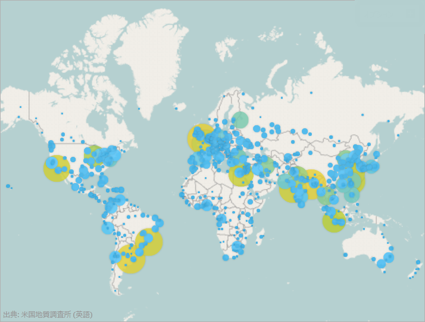
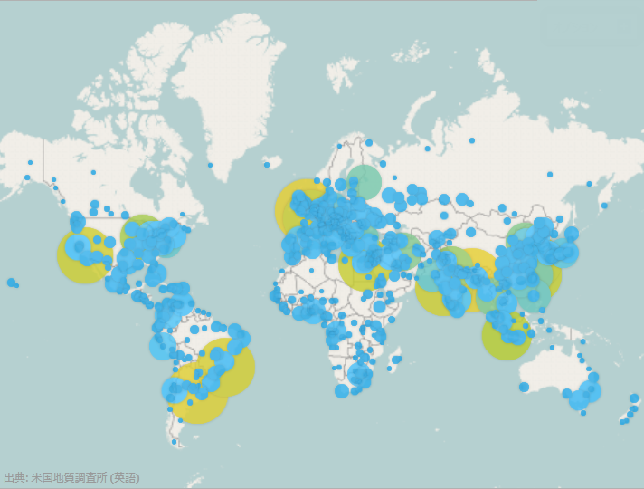
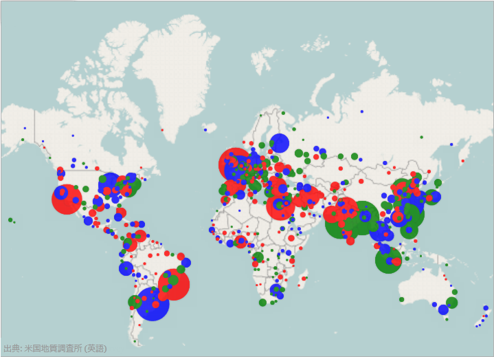
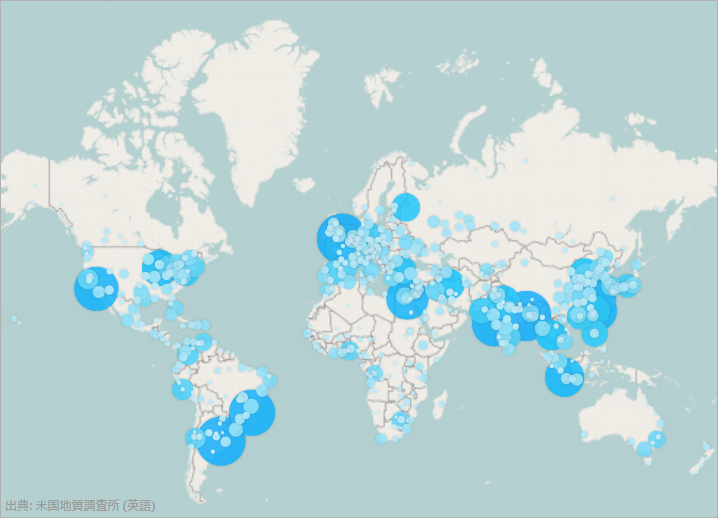

////
|metadata|
{
    "controlName": ["{GeoMapName}"],
    "tags": []
}
|metadata|
////

= 地理比例シンボル シリーズの使用

== トピックの概要

=== 目的

このトピックは、 link:{GeoMapLink}.{GeoMapName}_members.html[{GeoMapName}]™ コントロールで link:{GeoMapLink}.geographicproportionalsymbolseries_members.html[GeographicProportionalSymbolSeries] 要素を使用する方法を提供します。

=== 前提条件

このトピックを理解するためには、以下のトピックを理解しておく必要があります。

[options="header", cols="a,a"]
|====
|トピック|目的

| link:geographicmap-adding-geographicmap-to-a-page.html[{GeoMapName} をページに追加]
|このトピックでは、{GeoMapName} コントロールをアプリケーション ページに追加する方法を示します。

| link:geographicmap-visual-elements-of-geographicmap.html[{GeoMapName} の視覚要素]
|このトピックでは、{GeoMapName} コントロールのマップ要素のレイアウトについての情報を提供します。

| link:geographicmap-shape-files-reference.html[シェープ ファイルの参照]
|このトピックでは、マップおよび関連する地理的素材についてのリソースおよびシェープ ファイルの情報を提供します。これらのリソースを使用して、{GeoMapName}™ コントロールに地理データをバインドする前に編集で使用するツールおよびシェープ ファイルを取得します。

| link:geographicmap-binding-shape-files-with-geospatial-data.html[シェープ ファイルを地理的データにバインディング]
|このトピックでは、{GeoMapName} コントロールに地理的データがあるシェープ ファイルをバインドする方法を提供します。

| link:geographicmap-using-geographic-series.html[地理的シリーズを使用]
|このトピックは、{GeoMapName} コントロールの地理的シリーズのサポートされているタイプについての情報を提供します。

|====

=== このトピックの内容

このトピックは、以下のセクションで構成されます。

* <<GeographicProportionalSymbolSeries,地理比例シンボル シリーズ>>

** <<Overview,概要>>
** <<Preview,プレビュー>>
** <<DataRequirements,データ要件>>
** <<DataBinding,データ バインディング>>

* <<SizeScale,サイズ スケール>>

** <<SizeScaleOverview,概要>>
** <<SizeScalePreview,プレビュー>>
** <<SizeScaleExample,例>>

* <<FillScale,塗りつぶしスケール>>

** <<FillScaleOverview,概要>>
** <<FillScalePreview,プレビュー>>
** <<FillScaleExample,例>>

* <<RelatedContent,関連コンテンツ>>

[[GeographicProportionalSymbolSeries]]
== 地理比例シンボル シリーズ

[[Overview]]

=== 概要

link:{GeoMapLink}.geographicproportionalsymbolseries_members.html[GeographicProportionalSymbolSeries] はデータ駆動型の記号サイズを持つ散布シリーズです。 link:{GeoMapLink}.geographicproportionalsymbolseries.html[GeographicProportionalSeries] を実装し、 {DataChartName} コントロールの link:{DataChartLink}.bubbleseries_members.html[BubbleSeries] の基本機能があります。

[[Preview]]

=== プレビュー

以下の画像は、{GeoMapName} コントロールで世界の人口密度の高い都市の位置を表示する link:{GeoMapLink}.geographicproportionalsymbolseries_members.html[GeographicProportionalSymbolSeries] シリーズのプレビューです。記号の link:{GeoMapLink}.geographicproportionalsymbolseries~radiusscale.html[RadiusScale] は、比例半径スケールを使用すると、人口に基づいて都市のサイズを表示します。

[[DataRequirements]]

=== データ要件

{GeoMapName} コントロールの地理的シリーズの他のタイプと同様、 link:{GeoMapLink}.geographicproportionalsymbolseries_members.html[GeographicProportionalSymbolSeries] には、データ バインディングのための link:{DataChartLink}.series~{ApiDataSource}.html[{ApiDataSource}] プロパティがあります。このプロパティは、 link:http://msdn.microsoft.com/ja-jp/library/system.collections.ienumerable.aspx[IEnumerable] インターフェイスを実装するオブジェクトにバインドできます。

また、項目ソースの各の項目は、地理位置 (経度と緯度) を保存する 2 つの数値データ列を持ち、記号サイズを保存する数値列を持ちます。このデータ列は link:{GeoMapLink}.geographicproportionalsymbolseries~longitudememberpath.html[LongitudeMemberPath]、 link:{GeoMapLink}.geographicproportionalsymbolseries~latitudememberpath.html[LatitudeMemberPath]、および link:{GeoMapLink}.geographicproportionalsymbolseries~radiusmemberpath.html[RadiusMemberPath] プロパティにマップします。

[[DataBinding]]

=== データ バインディング

以下の表に、データ バインドに使用される link:{GeoMapLink}.geographicproportionalsymbolseries_members.html[GeographicProportionalSymbolSeries] のプロパティをまとめています。

[options="header", cols="a,a,a"]
|====
|*プロパティ名*|*プロパティ タイプ*|*説明*

| link:{GeoMapLink}.geographicproportionalsymbolseries~{ApiDataSource}.html[ {ApiDataSource}]
|IEnumerable
|項目のソースを取得または設定します。

| link:{GeoMapLink}.geographicproportionalsymbolseries~longitudememberpath.html[LongitudeMemberPath]
|String
|記号の経度座標を設定します。

| link:{GeoMapLink}.geographicproportionalsymbolseries~latitudememberpath.html[LatitudeMemberPath]
|String
|記号の緯度座標を設定します。

| link:{GeoMapLink}.geographicproportionalsymbolseries~radiusmemberpath.html[RadiusMemberPath]
|String
|記号のサイズを設定します。

| link:{GeoMapLink}.geographicproportionalsymbolseries~fillmemberpath.html[FillMemberPath]
|String
| link:{GeoMapLink}.geographicproportionalsymbolseries~fillscale.html[FillScale] を使用して Brush へ変換する数値を含む  {ApiDataSource} 項目のプロパティの名前。

|====

[[Example]]

=== 例

ifdef::wpf[]
*XAML の場合:*

[source,xaml]
----
<ig:XamGeographicMap x:Name="map">    
 <ig:XamGeographicMap.Series>        
 <ig:GeographicProportionalSymbolSeries {ApiDataSource}="{StaticResource sampleData}"                              
 LatitudeMemberPath="LatColumnName"                              
 LongitudeMemberPath="LongColumnName"
 RadiusMemberPath="RadiusColumnName"/>    
 </ig:XamGeographicMap.Series>
</ig:XamGeographicMap>
----
endif::wpf[]

*Visual Basic の場合:*

[source,vb]
----
ifdef::wpf[]
Imports Infragistics.Controls.Charts
Imports Infragistics.Controls.Maps
endif::wpf[]
ifdef::win-forms[]
Imports Infragistics.Win.Datavisualization
endif::win-forms[]
' GeographicProportionalSymbolSeries を作成して、データ バインディングを設定する
Dim geoSeries = New GeographicProportionalSymbolSeries()
geoSeries.{ApiDataSource} = sampleData
geoSeries.LongitudeMemberPath = "LongColumnName"
geoSeries.LatitudeMemberPath = "LatColumnName"
geoSeries.RadiusMemberPath = "RadiusColumnName"
' GeographicProportionalSymbolSeries を {GeoMapName} に追加する
Me.GeoMap.Series.Add(geoSeries)
----

*C# の場合:*

[source,csharp]
----
ifdef::wpf[]
using Infragistics.Controls.Charts;
using Infragistics.Controls.Maps;
endif::wpf[]
ifdef::win-forms[]
using Infragistics.Win.Datavisualization;
endif::win-forms[]
using System.ComponentModel;
// GeographicProportionalSymbolSeries を作成して、データ バインディングを設定する
var geoSeries = new GeographicProportionalSymbolSeries();
geoSeries.{ApiDataSource} = sampleData;
geoSeries.LongitudeMemberPath = "LongColumnName";
geoSeries.LatitudeMemberPath = "LatColumnName";
geoSeries.RadiusMemberPath = "RadiusColumnName";
// GeographicProportionalSymbolSeries を {GeoMapName} に追加する
this.GeoMap.Series.Add(geoSeries);
----

[[SizeScale]]
== サイズ スケール

[[SizeScaleOverview]]

=== 概要

link:{DataChartLink}.sizescale_members.html[SizeScale] はシリーズの記号のサイズを決定します。 link:{DataChartLink}.sizescale_members.html[SizeScale] 値が設定されていない場合には、各記号のサイズは link:{GeoMapLink}.geographicproportionalsymbolseries~radiusmemberpath.html[RadiusMemberPath] 列の値に等しくなります。 link:{DataChartLink}.sizescale_members.html[SizeScale] を設定する場合、最小記号は link:{DataChartLink}.sizescale~minimumvalue.html[MinimumValue] と等しいで、最大記号は link:{DataChartLink}.sizescale~maximumvalue.html[MaximumValue] と等しいで、他の記号は範囲の間のスケールにサイズ変更されます。 link:{DataChartLink}.sizescale_members.html[SizeScale] はリニアと対数のいずれかにすることができます。

[[SizeScaleExample]]

=== 例

以下のスクリーンショットは、以下の link:{DataChartLink}.sizescale_members.html[SizeScale] 設定の結果として、{GeoMapName} コントロールの link:{GeoMapLink}.geographicproportionalsymbolseries_members.html[GeographicProportionalSymbolSeries] がどのように描画されるかを示します。

[options="header", cols="a,a"]
|====
|プロパティ|値

| link:{DataChartLink}.sizescale~minimumvalue.html[MinimumValue]
|5

| link:{DataChartLink}.sizescale~maximumvalue.html[MaximumValue]
|70

|====

ifdef::wpf[]
以下のコードはこの例を実装します。

*XAML の場合:*

[source,xaml]
----
<ig:SizeScale x:Key="sizeScale"              
 MinimumValue="5" 
 MaximumValue="70"              
 LogarithmBase="10"              
 IsLogarithmic="/>
 <ig:GeographicProportionalSymbolSeries 
       ...              
 RadiusScale="{StaticResource sizeScale}" />
----
endif::wpf[]

[[FillScale]]
== 塗りつぶしスケール

[[FillScaleOverview]]

=== 概要

塗りつぶしスケールは単一の link:{GeoMapLink}.geographicproportionalsymbolseries_members.html[GeographicProportionalSymbolSeries] の色パターンを定義します。 link:{GeoMapLink}.geographicproportionalsymbolseries_members.html[GeographicProportionalSymbolSeries] シリーズの link:{GeoMapLink}.geographicproportionalsymbolseries~fillscale.html[FillScale] プロパティは記号の色を設定します。各の色軸は Brush のコレクションを含みます。

link:{GeoMapLink}.geographicproportionalsymbolseries_members.html[GeographicProportionalSymbolSeries] は 2 つの塗りつぶしスケールをサポートします。

* link:{DataChartLink}.custompalettebrushscale_members.html[CustomPaletteBrushScale] - 記号マーカーのインデックスを使用して Brushes コレクションのブラシを選択します。
* link:{DataChartLink}.valuebrushscale_members.html[ValueBrushScale] -  {ApiDataSource} の数値列からの値セットを使用してブラシを補間します。対数的な値セットが可能です。 link:{GeoMapLink}.geographicproportionalsymbolseries_members.html[GeographicProportionalSymbolSeries] シリーズは、使用する値を決定する方法が 2 つあります。
** link:{GeoMapLink}.geographicproportionalsymbolseries~fillmemberpath.html[FillMemberPath] - プロパティは使用する列を明示的に指定します。
** link:{DataChartLink}.sizescale~minimumvalue.html[MinimumValue] および link:{DataChartLink}.sizescale~maximumvalue.html[MaximumValue] - 値の範囲を決定するユーザー定義の値。

[[FillScaleExample]]

=== 例

以下のスクリーンショットは、以下の設定の結果として、{GeoMapName} コントロールの link:{GeoMapLink}.geographicproportionalsymbolseries_members.html[GeographicProportionalSymbolSeries] がどのように描画されるかを示しています。

[options="header", cols="a,a"]
|====
|プロパティ|値

| link:{GeoMapLink}.geographicproportionalsymbolseries~fillscale.html[FillScale]
|CustomPaletteBrushScale

|====

ifdef::wpf[]
以下のコードはこの例を実装します。

*XAML の場合:*

[source,xaml]
----
<ig:CustomPaletteBrushScale x:Key="CustomPaletteBrushScale" >    
 <ig:CustomPaletteBrushScale.Brushes>        
 <SolidColorBrush Color="Red"/>        
 <SolidColorBrush Color="Green"/>        
 <SolidColorBrush Color="Blue"/>    
 </ig:CustomPaletteBrushScale.Brushes/>
</ig:CustomPaletteBrushScale>
<ig:GeographicProportionalSymbolSeries 
   ...
 FillScale="{StaticResource CustomPaletteBrushScale}" />
----
endif::wpf[]

以下のスクリーンショットは、以下の設定の結果として、{GeoMapName} コントロールの link:{GeoMapLink}.geographicproportionalsymbolseries_members.html[GeographicProportionalSymbolSeries] がどのように描画されるかを示しています。

[options="header", cols="a,a"]
|====
|プロパティ|値

| link:{GeoMapLink}.geographicproportionalsymbolseries~fillscale.html[FillScale]
|ValueBrushScale

| link:{GeoMapLink}.geographicproportionalsymbolseries~fillmemberpath.html[FillMemberPath]
|Population

|====

ifdef::wpf[]
以下のコードはこの例を実装します。

*XAML の場合:*

[source,xaml]
----
<ig:ValueBrushScale x:Key="ValueBrushScale"          
 MinimumValue="1000"           
 MaximumValue="25000000"          
 IsLogarithmic="           
 LogarithmBase="10">    
 <ig:ValueBrushScale.Brushes>        
 <SolidColorBrush Color="#FFC6EEFB" />   
 <SolidColorBrush Color="#FF08C3FE" />                                    
 <SolidColorBrush Color="#FF08A5FE" />                                    
 <SolidColorBrush Color="#FF086AFE" />                                    
 <SolidColorBrush Color="#FF084CFE" />
 </ig:ValueBrushScale.Brushes>
</ig:ValueBrushScale>
<ig:GeographicProportionalSymbolSeries 
   ...
 FillScale="{StaticResource ValueBrushScale}"                      
 FillMemberPath="Population" />
----
endif::wpf[]

[[RelatedContent]]
== 関連コンテンツ

このトピックにの追加情報については、以下のトピックも合わせてご参照ください。

[options="header", cols="a,a"]
|====
|トピック|目的

| link:geographicmap-adding-geographicmap-to-a-page.html[{GeoMapName} をページに追加]
|このトピックは、link:{GeoMapLink}.{GeoMapName}_members.html[{GeoMapName}]™  コントロールをアプリケーション ページに追加する方法を示します。

| link:geographicmap-using-geographic-symbol-series.html[地理的シンボル シリーズを使用]
|このトピックでは、 link:{GeoMapLink}.{GeoMapName}_members.html[{GeoMapName}]™ コントロールで要素を使用する方法を提供します。

|====