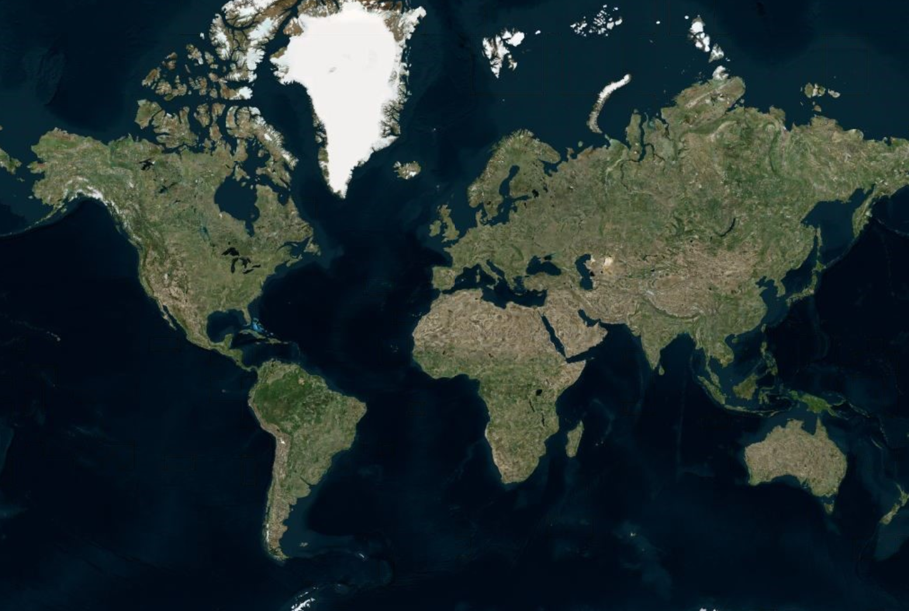
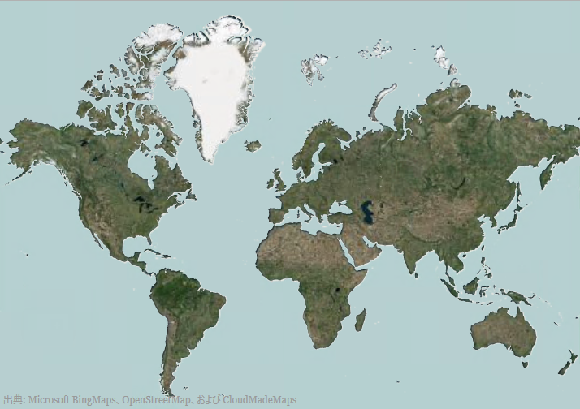

////
|metadata|
{
    "controlName": ["{GeoMapName}"],
    "tags": []
}
|metadata|
////

= 地理タイル シリーズの使用

== トピックの概要

=== 目的

このトピックでは、link:{GeoMapLink}.{GeoMapName}_members.html[{GeoMapName}]™ コントロールで link:{GeoMapLink}.geographictileseries_members.html[GeographicTileSeries]  タイプのシリーズを使用する方法を提供します。

=== 前提条件

このトピックを理解するためには、以下のトピックを理解しておく必要があります。

[options="header", cols="a,a"]
|====
|トピック|目的

| link:geographicmap-adding-geographicmap-to-a-page.html[{GeoMapName} をページに追加]
|このトピックでは、{GeoMapName} コントロールをアプリケーション ページに追加する方法を示します。

| link:geographicmap-using-geographic-series.html[地理的シリーズを使用]
|このトピックは、{GeoMapName} コントロールの地理的シリーズのサポートされているタイプについての情報を提供します。

| link:geographicmap-visual-elements-of-geographicmap.html[{GeoMapName} の視覚要素]
|このトピックでは、{GeoMapName} コントロールのマップ要素のレイアウトについての情報を提供します。

|====

=== このトピックの内容

このトピックは、以下のセクションで構成されます。

* <<GeographicTileSeris,地理タイル シリーズ>>

** <<Overview,概要>>
** <<Preview,プレビュー>>
** <<TileImagery,タイル画像>>
** <<ApiDataSource,{ApiDataSource}>>
** <<DataBinding,データ バインディング>>

* <<UsingTileImageryProperty,TileImagery プロパティの使用>>
* <<UsingApiDataSourceProperty,{ApiDataSource} プロパティの使用>>
* <<RelatedContent,関連コンテンツ>>

[[GeographicTileSeris]]
== 地理タイル シリーズ

[[Overview]]

=== 概要

link:{GeoMapLink}.geographictileseries_members.html[GeographicTileSeries] は、 {GeoMapName} コントロールの link:{GeoMapLink}.xamgeographicmap~backgroundcontent.html[BackgroundContent] プロパティで定義されたベース タイル画像に対し追加のタイル画像をオーバーレイする {GeoMapName} コントロールに属する視覚マップ要素です。

link:{GeoMapLink}.geographictileseries_members.html[GeographicTileSeries] は、ポリライン関数がポリラインを描画するのでなくタイルのビジュアルをクリップする点を除いて GeographicPolylineSeries に似ています。

link:{GeoMapLink}.geographictileseries_members.html[GeographicTileSeries] シリーズの不透明度プロパティを設定すると、コントロールの複数の link:{GeoMapLink}.geographictileseries_members.html[GeographicTileSeries] シリーズを使用して複合/オーバーレイ タイル マップを作成できます。

[[Preview]]

=== プレビュー

以下のスクリーンショットでは、Open Source Map を link:{GeoMapLink}.{GeoMapName}{ApiProp}backgroundcontent.html[BackgroundContent] に設定し、Azure Maps を世界の Shapefile にクリップされた link:{GeoMapLink}.geographictileseries~tileimagery.html[TileImagery] に設定した {GeoMapName} コントロールをプレビューします。

[[TileImagery]]

=== タイル画像

link:{GeoMapLink}.geographictileseries_members.html[GeographicTileSeries] シリーズの link:{GeoMapLink}.geographictileseries~tileimagery.html[TileImagery] プロパティを使用してシリーズの地理画像ソースを表示します。このプロパティは、{GeoMapName} コントロールの link:{GeoMapLink}.{GeoMapName}{ApiProp}backgroundcontent.html[BackgroundContent] を設定する方法と同じ方法を設定できます。 link:{GeoMapLink}.geographictileseries_members.html[GeographicTileSeries] は、Azure Maps のように同じタイプの地理的画像ソースをサポートします。詳細は、「 link:geographicmap-using-geographic-imagery.html[地理的画像を使用]」トピックを参照してください。

[[ApiDataSource]]

=== {ApiDataSource}

{GeoMapName} コントロールの地理的シリーズの他のタイプと同様、 link:{GeoMapLink}.geographictileseries_members.html[GeographicTileSeries] には、データ バインディングのための link:{GeoMapLink}.geographictileseries~{ApiDataSource}.html[{ApiDataSource}]  プロパティがあります。このオプションのプロパティは、インターフェイスを実装するオブジェクトにバインドできます。さらに、このオブジェクト内の各項目は、< link:http://msdn.microsoft.com/ja-jp/library/system.windows.point.aspx[Point]> または < link:http://msdn.microsoft.com/ja-jp/library/system.collections.ienumerable.aspx[IEnumerable]< link:http://msdn.microsoft.com/ja-jp/library/system.windows.point.aspx[Point]>> の構造を使用してシェイプの地理的位置 (緯度および経度) を保存するデータ列があります。後者は、シェイプ ファイルおよび link:{DataVizMapsLink}.shapefileconverter_members.html[ShapefileConverter] クラスで使用される標準的なデータ構造です。このデータ列を link:{GeoMapLink}.geographicshapeseriesbase~shapememberpath.html[ShapeMemberPath] プロパティにマップします。 link:{GeoMapLink}.geographictileseries_members.html[GeographicTileSeries] は、{GeoMapName} コントロールでポリラインをクリップするために、このマップされたデータ列のポイントを使用します。

[[DataBinding]]

=== データ バインディング

以下の表で、 link:{GeoMapLink}.geographictileseries_members.html[GeographicTileSeries] レイヤーのデータ バインド プロパティを簡単に説明します。

[options="header", cols="a,a,a"]
|====
|*プロパティ名*|*プロパティ タイプ*|*説明*

| link:{GeoMapLink}.geographictileseries~{ApiDataSource}.html[{ApiDataSource}]
|IEnumerable
|シェイプ ファイルが描画される項目のソースを取得または設定します。

| link:{GeoMapLink}.geographicshapeseriesbase~shapememberpath.html[ShapeMemberPath]
|String
| link:{GeoMapLink}.geographictileseries~{ApiDataSource}.html[{ApiDataSource}]  の各項目の図形のポイントを取得するプロパティの名前。

| link:{GeoMapLink}.geographictileseries~tileimagery.html[TileImagery]
|GeographicMapImagery
|このシリーズの地理画像を表示するために使用する画像のタイプ

|====

[[UsingTileImageryProperty]]
== TileImagery プロパティの使用

=== 例

以下のスクリーン ショットは、以下の設定の結果として、 link:{GeoMapLink}.geographictileseries_members.html[GeographicTileSeries] オブジェクトの link:{GeoMapLink}.geographictileseries~tileimagery.html[TileImagery] および Opacity プロパティを持つ {GeoMapName} コントロールがどのように表示されるのかを示します。

[options="header", cols="a,a"]
|====
|*プロパティ*|*値*

| link:{GeoMapLink}.geographictileseries~tileimagery.html[TileImagery]
|AzureMapsImagery

|Opacity
|0.5

|====

link:{GeoMapLink}.azuremapsimagery_members.html[AzureMapsImagery] クラスの link:{GeoMapLink}.azuremapsimagery~imagerystyle.html[ImageryStyle] が AzureMapsImageryStyle.Satellite として設定

ifdef::wpf[]
*XAML の場合:*

[source,xaml]
----
<ig:XamGeographicMap x:Name="GeoMap"
                     HorizontalZoomable="True"
                     VerticalZoomable="True">
   <ig:XamGeographicMap.BackgroundContent>
      <ig:OpenStreetMapImagery/>
   </ig:XamGeographicMap.BackgroundContent>
   <ig:XamGeographicMap.Series>
      <ig:GeographicTileSeries Opacity="0.5">
         <ig:GeographicTileSeries.TileImagery>
            <ig:AzureMapsImagery ApiKey="API_KEY" ImageryStyle="Satellite" 
                                   />
         </ig:GeographicTileSeries.TileImagery>
      </ig:GeographicTileSeries>
   </ig:XamGeographicMap.Series>
</ig:XamGeographicMap>
----
endif::wpf[]

*C# の場合:*

[source,csharp]
----
var series = this.GeoMap.Series.OfType<GeographicTileSeries>().First();
series.Opacity = 0.5;
series.TileImagery = new AzureMapsImagery { ImageryStyle = AzureMapsImageryStyle.Satellite, ApiKey = API_KEY};
----

*Visual Basic の場合:*

[source,vb]
----
Dim series As var = Me.GeoMap.Series.OfType.First
Series.Opacity = 0.5;
series.TileImagery = New AzureMapsImagery() {AzureMapsImageryStyle.Satellite, ApiKey=API_KEY}
----

[[UsingApiDataSourceProperty]]
==  {ApiDataSource} プロパティの使用

以下のスクリーンショットは、簡易な地理的四角形に設定された link:{GeoMapLink}.geographictileseries~{ApiDataSource}.html[{ApiDataSource}]  プロパティでどのように xamGeorgraphicMap コントロールを描画するかを示します。

image::images/GeographicMap_Using_Geographic_Tile_Series_3.png[]

*C# の場合:*

[source,csharp]
----
var customRegion = new List<List<Point>>();
var shapePoints = new List<Point>
   { 
      new Point(-100, 60), 
      new Point(100, 60),
      new Point(100, -30),
      new Point(-100, -30) 
   };
customRegion.Add(shapePoints);
var series = this.GeoMap.Series.OfType<GeographicTileSeries>().First();
series.ShapeMemberPath = "";
series.{ApiDataSource} = customRegion;
----

*Visual Basic の場合:*

[source,vb]
----
Dim customRegion As var = New List(Of List)
Dim shapePoints As var = New List(Of Point)() 
{New Point(-100, 60), New Point(100, 60), New Point(100, -30), NewPoint(-100, -30)}
customRegion.Add(shapePoints) 
Dim series As var = Me.GeoMap.Series.OfType.First
series.ShapeMemberPath = ""
series.{ApiDataSource} = customRegion
----

表の後のスクリーンショットは、ShapeFileConverter に設定された link:{GeoMapLink}.geographictileseries~{ApiDataSource}.html[{ApiDataSource}] プロパティのある xamGeorgraphicMap コントロールが以下の設定でどのように描画するかを示します。

[options="header", cols="a,a"]
|====
|*プロパティ*|*値*

| link:{GeoMapLink}.geographictileseries~{ApiDataSource}.html[{ApiDataSource}] 
|WorldContinentsShapefile

| link:{GeoMapLink}.geographicshapeseriesbase~shapememberpath.html[ShapeMemberPath]
|Points

|====

ifdef::wpf[]
*XAML の場合:*

[source,xaml]
----
<ResourceDictionary>
   <!-- ShapeFileProvider provides absolute path to a shape file -->
   <providers:ShapeFileProvider x:Key="WorldContinentsProvider" 
   ShapeFileRelativePath="/world/world_continents.shp"
   ShapeDatabaseRelativePath="world/world_continents.dbf"/>
   <!-- ShapefileConverter loads shapes from shape files (SHP) and -->
   <!-- stores them in the Points property as List<List<Point>> object type -->
   <ig:ShapefileConverter x:Key="WorldContinentsShapefile"
                          ImportCompleted="OnShapefileImportCompleted"
                          CollectionChanged="OnShapefileCollectionChanged"
                          ShapefileSource="{Binding Path=ShapeFileAbsolutePath, Source={StaticResource WorldContinentsProvider}}"
                          DatabaseSource="{Binding Path=ShapeDatabaseAbsolutePath, Source={StaticResource WorldContinentsProvider}}" />
</ResourceDictionary>
<Grid x:Name="LayoutRoot">
   <ig:XamGeographicMap x:Name="GeoMap"
                        Zoomable="True"
                        BackgroundContent="{x:Null}" >
      <ig:XamGeographicMap.Series>
         <ig:GeographicTileSeries {ApiDataSource}="{StaticResource WorldContinentsShapefile}" 
                                  ShapeMemberPath="Points"  >
            <ig:GeographicTileSeries.TileImagery>
               <ig:OpenStreetMapImagery />
            </ig:GeographicTileSeries.TileImagery>
         </ig:GeographicTileSeries>
      </ig:XamGeographicMap.Series>
   </ig:XamGeographicMap>
</Grid>
----
endif::wpf[]

*C# の場合:*

[source,csharp]
----
series.ShapeMemberPath = "Points";
series.{ApiDataSource} = this.Resources["WorldContinentsShapefile"] as ShapefileConverter;
----

*Visual Basic の場合:*

[source,vb]
----
series.ShapeMemberPath = "Points"
series.{ApiDataSource} = CType(Me.Resources("WorldContinentsShapefile"),ShapefileConverter)
----

[[RelatedContent]]
== 関連コンテンツ

このトピックの追加情報については、以下のトピックも合わせてご参照ください。

[options="header", cols="a,a"]
|====
|トピック|目的

| link:geographicmap-adding-geographicmap-to-a-page.html[{GeoMapName} をページに追加]
|このトピックでは、 {GeoMapName} コントロールをアプリケーション ページに追加する方法を示します。

| link:geographicmap-visual-elements-of-geographicmap.html[{GeoMapName} の視覚要素]
|このトピックでは、 {GeoMapName} コントロールのマップ要素のレイアウトについての情報を提供します。

| link:geographicmap-shape-files-reference.html[シェープ ファイルの参照]
|このトピックでは、マップ、シェイプ ファイル、および地理的な関連資料についての情報を提供します。これらのリソースを使用して、地理的シェイプ ファイルおよび編集のためのツールの詳細を学習し入手します。

|====