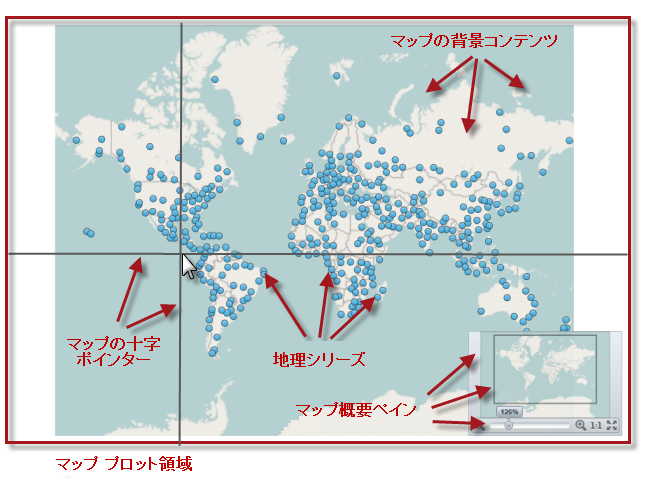

////
|metadata|
{
    "controlName": ["{GeoMapName}"],
    "tags": []
}
|metadata|
////

= {GeoMapName} の視覚要素

== トピックの概要

=== 目的

このトピックは、 link:{GeoMapLink}.{GeoMapName}_members.html[{GeoMapName}]™  コントロールの視覚要素のレイアウトについての情報を提供します。

=== 本トピックの内容

このトピックには次のセクションがあります。

* <<_Ref320715791,{GeoMapName} コントロールの視覚要素と関連プロパティ>>

** <<_Ref320715795,視覚要素の概要>>
** <<_Ref320715799,視覚要素と関連プロパティ>>

* <<_Ref320185294,関連コンテンツ>>

[[_Ref320715791]]
== {GeoMapName} コントロールの視覚要素と関連プロパティ

[[_Ref320715795]]

=== 視覚要素の概要

以下のスクリーンショットは、 {GeoMapName} コントロールの視覚要素を示しています。構成可能な要素が画像の後にリストされています。

*構成可能な視覚要素:*

* マップ プロット エリア
* マップ背景コンテンツ
* 地理的シリーズ
* マップの十字ポインター線
ifdef::wpf[]
* マップの概要ペイン
endif::wpf[]

[[_Ref320715799]]

=== 視覚要素と関連プロパティ

以下の表は、{GeoMapName} コントロールとそれらを構成するプロパティの視覚要素をマップします。

[options="header", cols="a,a,a"]
|====
|視覚要素|説明|プロパティ

|マップ プロット エリア
|地理的シリーズを使用し、そしてマップの十字ポインター線pick:[wpf="とマップ概要ペイン"]を表示し、地理的画像タイルと地理的データをプロットするために使用される {GeoMapName} コントロール内の領域を表します。この領域の背景は、 {GeoMapName} コントロールの link:{DataChartLinkBase}.seriesviewer~plotareabackground.html[PlotAreaBackground] プロパティを設定することによって、 pick:[wpf="link:http://msdn.microsoft.com/en-us/library/system.windows.media.brush.aspx[Brush]"]pick:[win-forms="Infragistics.Win.DataVisualization.Brush"] オブジェクトに変更できます。
| link:{DataChartLinkBase}.seriesviewer~plotareabackground.html[PlotAreaBackground]

|マップ背景コンテンツ
|Open Street Map、pick:[wpf="ArcGIS Maps、"]そして Azure Maps などのサポートされている地図サービスから地理的画像タイルをプロットするための {GeoMapName} コントロールの領域を表します。マップ要素についての詳細は、 link:geographicmap-using-geographic-imagery.html[「地理的画像を使用」]のトピックを参照してください。
| pick:[wpf="link:{GeoMapLink}.{GeoMapName}{ApiProp}backgroundcontent.html[BackgroundContent]"]pick:[win-forms="link:{GeoMapLink}.{GeoMapName}{ApiProp}SetImagery.html[SetImagery()]"]

|地理的シリーズ
|地理的ベクトル データを描画するためのマップ要素を表します。これは、地理的コンテキストのポイント (link:{GeoMapLink}.geographicsymbolseries_members.html[GeographicSymbolSeries])、ポリライン(link:{GeoMapLink}.geographicpolylineseries_members.html[GeographicPolylineSeries])、またはポリゴン(link:{GeoMapLink}.geographicshapeseries_members.html[GeographicShapeSeries]) です。 {GeoMapName} コントロールの link:{DataChartLinkBase}.seriesviewer~series.html[Series] プロパティは、地理的シリーズ オブジェクトのコレクションです。 {GeoMapName} コントロールでサポートされている地理的シリーズ要素の詳細は、 link:geographicmap-using-geographic-series.html[「地理的シリーズを使用」]のトピックを参照してください。
| link:{DataChartLinkBase}.seriesviewer~series.html[Series]

|マップの十字ポインター線
|{GeoMapName} コントロールのマップ プロット エリアにマウスを重ねたときに、マウス カーソルの位置で交差する垂直と水平線を表します。
|link:{DataChartLinkBase}.seriesviewer~crosshairvisibility.html[CrosshairVisibility] pick:[wpf="link:{DataChartLinkBase}.seriesviewer~crosshairlinestyle.html[CrosshairLineStyle]"]

ifdef::wpf[]
|マップの概要ペイン
|{GeoMapName} コントロールのマップ コンテンツをナビゲートするための構成可能な場所、使用が簡単なズーム/パン機能がある link:{ApiPlatform}{OpdAssembly}{ApiVersion}~{OpdNamespace}.{OpdName}_members.html[{OpdName}]  コントロールを表します。
| link:{DataChartLinkBase}.seriesviewer~overviewplusdetailpanevisibility.html[OverviewPlusDetailPaneVisibility] link:{DataChartLinkBase}.seriesviewer~overviewplusdetailpanestyle.html[OverviewPlusDetailPaneStyle]
endif::wpf[]
|====

[[_Ref320185294]]
== 関連コンテンツ

=== トピック

以下のトピックでは、このトピックに関連する情報を提供しています。

[options="header", cols="a,a"]
|====
| *トピック* | *目的* 

| link:geographicmap-using-geographic-imagery.html[地理的画像を使用]
|このトピックは、{GeoMapName} コントロールで地理的画像タイルを使用する方法を提供します。

| link:geographicmap-using-geographic-series.html[地理的シリーズを使用]
|このトピックは、{GeoMapName} コントロールでの地理的シリーズのすべてのタイプの一般的な使用法、その利点、および共有機能について説明します。

| link:geographicmap-navigating-map-content.html[マップ コンテンツをナビゲート]
|このトピックは、{GeoMapName} コントロールでマップ コンテンツをナビゲートする方法を提供します。

| link:geographicmap-api-overview.html[API の概要]
|このトピックは、{GeoMapName} コントロールおよびそのコンポーネントのキー クラスとプロパティの API 概要を提供します。

|====