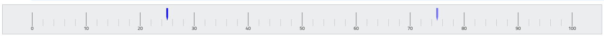

////
|metadata|
{
    "name": "lineargauge-configuring-the-needle",
    "controlName": ["{LinearGaugeName}"],
    "tags": ["Charting","How Do I"],
    "guid": "abaea24a-612b-4e0a-9edc-955df77af1f4",
    "buildFlags": [],
    "createdOn": "2014-06-05T19:53:12.05489Z"
}
|metadata|
////

= 針の構成 ({LinearGaugeName})
0

== トピックの概要

=== 目的

このトピックではコード例を使用して、 _{LinearGaugeName}_   コントロールの針を構成する方法を説明します。説明には、針が示す値、幅、位置、および書式設定が含まれます。

=== 前提条件

本トピックの理解を深めるために、以下のトピックを参照することをお勧めします。

[options="header", cols="a,a"]
|====
|トピック|目的

| link:lineargauge-overview.html[*{LinearGaugeName} 概要* ]
|このトピックでは、主要機能、最小要件、ユーザー機能など、 _{LinearGaugeName}_ コントロールに関する概念的な情報を提供します。

ifdef::xaml[]
| link:lineargauge-adding.html[{LinearGaugeName} の追加]
|このトピックでは、{LinearGaugeName} コントロールを {PlatformName} アプリケーションに追加する方法を説明します。
endif::xaml[]

ifdef::android[]
| link:android-adding-linear-gauge.html[{LinearGaugeName} の追加]
|このトピックでは、{LinearGaugeName} コントロールを {PlatformName} アプリケーションに追加する方法を説明します。
endif::android[]

|====

=== このトピックの内容

このトピックは、以下のセクションで構成されます。

* <<_Ref362941112,針を構成 – 概念的概要>>

** <<_Ref369722464,針構成の概要>>
** <<_Ref369722470,針構成の概要表>>
** <<_Ref369722475,プロパティ設定>>

* <<_Ref362941136,針図形の構成>>

** <<_Needle_shape_configuration,針図形構成の概要>>
** <<_Ref369722614,部分毎のプロパティ サブセット>>
** <<_Ref369722621,針図形タイプのプロパティ サブセット>>
** <<_Ref369720263,プロパティ リファレンス>>

* <<_Ref369722641,コード例の概要>>
* <<_Code_Example:_Configuring,コード例: 基本針の構成>>

** <<_Ref369722653,説明>>
** <<_Ref369722658,コード>>

* <<_Ref369722666,コード例: カスタム針の構成>>

** <<_Ref369722683,説明>>
** <<_Ref369722688,コード>>

* <<ハイライト値針の構成,ハイライト値針の構成>>

* <<_Ref366784385,関連コンテンツ>>

[[_Ref362941112]]
== 針を構成 – 概念的概要

[[_Ref369722464]]

=== 針構成の概要

針を構成するには、針の図形、サイズ、スケールでの位置を指定します。境界線の幅、色、塗りつぶし色などの針のルック アンド フィールを構成し、ツールチップを提供することも可能です。針の図形を指定するには、 link:{LinearGaugeLink}.{LinearGaugeName}{ApiProp}needleshape.html[NeedleShape] プロパティを定義済みの針図形タイプまたはカスタム針タイプに設定します。定義済みの針図形は:

*  *針*
*  *長方形* 
*  *台形* 
*  *三角形* 

デフォルトの針図形は、長方形の針本体と三角形のポイントを持つ針です。

image::images/XamLinearGauge_Configuring_the_Needle_1.png[]

カスタムな針図形タイプを指定するには、`NeedleShape` プロパティを _“Custom”_ に設定します。

定義済みの図形をカスタマイズできます。図形をカスタマイズしないで定義済みの針図形を使用する場合、基本針を使用しています。カスタム図形を選択するか、定義済みの図形を<<_Needle_shape_configuration,範囲タイプまたは幅プロパティ>>によってカスタマイズする場合、<<_Ref369722666,カスタム針の構成>>になります。

スケールで、針は link:{LinearGaugeLink}.{LinearGaugeName}{ApiProp}value.html[Value] プロパティによって指定した値に配置されます。

スケール全域のディメンションでの針位置は、 link:{LinearGaugeLink}.{LinearGaugeName}{ApiProp}needleinnerextent.html[NeedleInnerExtent] および link:{LinearGaugeLink}.{LinearGaugeName}{ApiProp}needleouterextent.html[NeedleOuterExtent] プロパティにより、グラフ領域の端に対して構成できます。針図形は link:{LinearGaugeLink}.{LinearGaugeName}{ApiProp}needleshape.html[NeedleShape] プロパティによって構成されます。針で使用する複数の定義済みの図形があります。カスタムな図形もサポートされます。

image::images/XamLinearGauge_Overview_10.png[]

針のルック アンド フィールは、各プロパティ ( link:{LinearGaugeLink}.{LinearGaugeName}{ApiProp}needlebrush.html[NeedleBrush]、 link:{LinearGaugeLink}.{LinearGaugeName}{ApiProp}needleoutline.html[NeedleOutline] および link:{LinearGaugeLink}.{LinearGaugeName}{ApiProp}needlestrokethickness.html[NeedleStrokeThickness]) を使用して塗りつぶし色、境界線の色および境界線の線幅をカスタマイズできます。

[[_Ref369722470]]

=== 針構成の概要表

以下の表で、_{LinearGaugeName}_ コントロールの針で構成できる要素を簡単に説明し、それらを管理に使用するプロパティにマップします。

[options="header", cols="a,a,a,a"]
|====
|*構成可能な点* |詳細|プロパティ|デフォルト値

|図形タイプ
|針図形を示す値
| link:{LinearGaugeLink}.{LinearGaugeName}{ApiProp}needleshape.html[NeedleShape]
|針

|名前
|針の名前 ( pick:[sl,wpf=" link:lineargauge-configuring-the-tooltips.html#_Ref363158489[ツールチップ]"] の表示用)
| link:{LinearGaugeLink}.{LinearGaugeName}{ApiProp}needlename.html[NeedleName]
|設定なし

|表示する値
|針で示された値
| link:{LinearGaugeLink}.{LinearGaugeName}{ApiProp}value.html[Value]
|設定なし

|スケール全域のサイズおよび位置
|針の内部端の位置
| link:{LinearGaugeLink}.{LinearGaugeName}{ApiProp}needleinnerextent.html[NeedleInnerExtent]
|デフォルトのテーマで定義済み

|
|針の外部端の位置
| link:{LinearGaugeLink}.{LinearGaugeName}{ApiProp}needleouterextent.html[NeedleOuterExtent]
|デフォルトのテーマで定義済み

|バーの塗りつぶし色
|
| link:{LinearGaugeLink}.{LinearGaugeName}{ApiProp}needlebrush.html[NeedleBrush]
|デフォルトのテーマで定義済み

|針の境界線の幅
|ピクセル単位
| link:{LinearGaugeLink}.{LinearGaugeName}{ApiProp}needlestrokethickness.html[NeedleStrokeThickness]
|_1.0_

|針の境界線の色
|
| link:{LinearGaugeLink}.{LinearGaugeName}{ApiProp}needleoutline.html[NeedleOutline]
|デフォルトのテーマで定義済み

ifdef::sl,wpf[]
|ツールチップ
|針のツールチップの内容
| link:{LinearGaugeLink}.{LinearGaugeName}{ApiProp}needletooltip.html[NeedleToolTip]
| link:{LinearGaugeLink}.{LinearGaugeName}{ApiProp}needlename.html[NeedleName] の初期化状態による
endif::sl,wpf[]

|====

ifdef::sl,wpf[]
注:
endif::sl,wpf[]

ifdef::sl,wpf[]
[NOTE]
====
ツールチップの構成の詳細は、 pick:[sl=" link:lineargauge-configuring-the-tooltips.html[ツールチップの構成 ({LinearGaugeName})]"] トピックの link:lineargauge-configuring-the-tooltips.html#_Ref363158489[針のカスタム ツールチップの構成]を参照してください。
====
endif::sl,wpf[]

[[_Ref369722475]]

=== プロパティ設定

以下の表では、任意の動作と各プロパティ設定のマップを示します。

[options="header", cols="a,a,a"]
|====
|構成の目的:|使用するプロパティ:|設定の選択肢:

| 図形タイプ
| link:{LinearGaugeLink}.{LinearGaugeName}{ApiProp}needleshape.html[NeedleShape]
|定義済みの図形または「Custom」

|名前
| link:{LinearGaugeLink}.{LinearGaugeName}{ApiProp}needlename.html[NeedleName]
|針の名前を表す文字列

|表示する値
| link:{LinearGaugeLink}.{LinearGaugeName}{ApiProp}value.html[Value]
|スケールのメジャーにおける任意の値

|スケール全域のサイズおよび位置
| link:{LinearGaugeLink}.{LinearGaugeName}{ApiProp}needleinnerextent.html[NeedleInnerExtent]
|方向に応じた link:lineargauge-overview.html#_GraphAreaLink[チャート領域]の高さと幅の相対部分として定義した針の内部端の位置。小数で指定されます (例: 0.2)。

|
| link:{LinearGaugeLink}.{LinearGaugeName}{ApiProp}needleouterextent.html[NeedleOuterExtent]
|方向に応じた link:lineargauge-overview.html#_GraphAreaLink[チャート領域]の高さと幅の相対部分として定義した針の外部端の位置。小数で指定されます (例: 0.2)。

|塗りつぶし色
| link:{LinearGaugeLink}.{LinearGaugeName}{ApiProp}needlebrush.html[NeedleBrush]
|任意の色

|境界線の線幅
| link:{LinearGaugeLink}.{LinearGaugeName}{ApiProp}needlestrokethickness.html[NeedleStrokeThickness]
|任意の値 (ピクセル)

|境界線の色
| link:{LinearGaugeLink}.{LinearGaugeName}{ApiProp}needleoutline.html[NeedleOutline]
|任意の色

ifdef::sl,wpf[]
|ツールチップ
| link:{LinearGaugeLink}.{LinearGaugeName}{ApiProp}needletooltip.html[NeedleToolTip]
|
ifdef::wpf[] 

任意の文字列、`UIElement`、または `DataTemplate` ( link:lineargauge-configuring-the-tooltips.html[ツールチップの構成 ({LinearGaugeName})]を参照) 

endif::wpf[]
endif::sl,wpf[]

|====

[[_Ref362941136]]
== 針図形の構成

[[_Needle_shape_configuration]]

=== 針図形構成の概要

定義済みの図形またはカスタムな図形の針図形を構成できます。カスタムな図形の場合、新しい針図形を作成する必要があります。

針図形を構成するには、幅と範囲を制御するプロパティを設定します。このプロパティは、針図形の 3 つの基本部分を定義します。基本部分 (垂直方向に上から下) は:

*  *Outer 部分* – 針のスケールから一番遠い部分。
*  *Middle 部分* – Outer 部分および Inner 部分の間にある部分。幅に関連するプロパティは 2 つのセグメントと共有されます。
*  *Inner 部分* – 針のスケールに一番近い部分。

以下の画像は、水平方向が使用される場合、針図形に関連するプロパティを表示します。プロパティの詳細については、<<_Ref366784367,プロパティ リファレンス>>を参照してください。

image::images/XamLinearGauge_Configuring_the_Needle_2.png[]

==== プロパティ カテゴリ

針を構成するプロパティは、針の幅またはスケールからの範囲を構成するかどうかに基づいて 2 つのタイプがあります。

*  *範囲タイプ プロパティ* ( link:{LinearGaugeLink}.{LinearGaugeName}{ApiProp}needleinnerextent.html[NeedleInnerExtent]、 link:{LinearGaugeLink}.{LinearGaugeName}{ApiProp}needleinnerpointextent.html[NeedleInnerPointExtent]、 link:{LinearGaugeLink}.{LinearGaugeName}{ApiProp}needleouterpointextent.html[NeedleOuterPointExtent]、 link:{LinearGaugeLink}.{LinearGaugeName}{ApiProp}needleouterextent.html[NeedleOuterExtent])

link:lineargauge-overview.html#_GraphAreaLink[チャート領域]の内部端に相対してスケール ディメンションで針の図形と位置を構成します。値は、スケール ディメンションでチャート領域の範囲の相対部分を表します。小数で指定されます (0.2 など)。0 はチャート領域の内部端で、1 は外部端です。

*  *幅に関連するプロパティ*  ( link:{LinearGaugeLink}.{LinearGaugeName}{ApiProp}needleinnerbasewidth.html[NeedleInnerBaseWidth]、 link:{LinearGaugeLink}.{LinearGaugeName}{ApiProp}needleouterbasewidth.html[NeedleOuterBaseWidth]、 link:{LinearGaugeLink}.{LinearGaugeName}{ApiProp}needleinnerpointwidth.html[NeedleInnerPointWidth]、 link:{LinearGaugeLink}.{LinearGaugeName}{ApiProp}needleouterpointwidth.html[NeedleOuterPointWidth])

link:{LinearGaugeLink}.{LinearGaugeName}{ApiProp}needlebreadth.html[NeedleBreadth] プロパティに設定される基本値の相対する部分として定義される設定を示します。相対する部分は小数で指定されます。たとえば、 link:{LinearGaugeLink}.{LinearGaugeName}{ApiProp}needlebreadth.html[NeedleBreadth] が _20_ に設定し、`NeedleOuterBaseWidth` が _0.5_ に設定される場合、外部の基本セグメントの実際サイズは 10 ピクセル (20 x 0.5 = 10) になります。

==== プロパティ サブセット

カスタム図形を構成する ( link:{LinearGaugeLink}.{LinearGaugeName}{ApiProp}needleshape.html[NeedleShape] プロパティが _“Custom”_ の) 場合、すべてのプロパティが適用されます。定義済み図形タイプの場合、この図形の描画が 3 つの基本図形をすべて使用しないため、この幅と範囲のサブセットのみを適用します。

[[_Ref369722614]]

=== 部分毎のプロパティ サブセット

以下のリストは、カスタム針の基本部分を構成するために必要なプロパティです。

*  *Outer 部分* のプロパティ:

** link:{LinearGaugeLink}.{LinearGaugeName}{ApiProp}needleouterextent.html[NeedleOuterExtent]
** link:{LinearGaugeLink}.{LinearGaugeName}{ApiProp}needleouterpointextent.html[NeedleOuterPointExtent] – Outer および Middle の基本部分の共有設定
** link:{LinearGaugeLink}.{LinearGaugeName}{ApiProp}needleouterbasewidth.html[NeedleOuterBaseWidth]
** link:{LinearGaugeLink}.{LinearGaugeName}{ApiProp}needleouterpointwidth.html[NeedleOuterPointWidth] – Outer および Middle の基本部分の共有設定

*  *Middle 部分* のプロパティ:

** link:{LinearGaugeLink}.{LinearGaugeName}{ApiProp}needleouterpointextent.html[NeedleOuterPointExtent] – Outer および Middle の基本部分の共有設定
** link:{LinearGaugeLink}.{LinearGaugeName}{ApiProp}needleinnerpointextent.html[NeedleInnerPointExtent] – Inner および Middle の基本部分の共有設定
** link:{LinearGaugeLink}.{LinearGaugeName}{ApiProp}needleouterpointwidth.html[NeedleOuterPointWidth] – Outer および Middle の基本部分の共有設定
** link:{LinearGaugeLink}.{LinearGaugeName}{ApiProp}needleinnerpointwidth.html[NeedleInnerPointWidth] – Inner および Middle の基本部分の共有設定

*  *Inner 部分* のプロパティ:

** link:{LinearGaugeLink}.{LinearGaugeName}{ApiProp}needleinnerpointextent.html[NeedleInnerPointExtent] – Inner および Middle の基本部分の共有設定
** link:{LinearGaugeLink}.{LinearGaugeName}{ApiProp}needleinnerextent.html[NeedleInnerExtent]
** link:{LinearGaugeLink}.{LinearGaugeName}{ApiProp}needleinnerpointwidth.html[NeedleInnerPointWidth] – Inner および Middle の基本部分の共有設定
** link:{LinearGaugeLink}.{LinearGaugeName}{ApiProp}needleinnerbasewidth.html[NeedleInnerBaseWidth]

[[_Ref369722621]]

=== 針図形タイプのプロパティ サブセット

以下の表では、特定の針図形タイプをカスタマイズする場合に設定する図形構成プロパティを表示します。プロパティおよびその設定の詳細については、<<_Ref369720263,プロパティ リファレンス>>を参照してください。

[options="header", cols="a,a"]
|====
|針図形タイプ|プロパティ

| *カスタム* 
|
* link:{LinearGaugeLink}.{LinearGaugeName}{ApiProp}needlebreadth.html[NeedleBreadth] 

* link:{LinearGaugeLink}.{LinearGaugeName}{ApiProp}needleinnerbasewidth.html[NeedleInnerBaseWidth] 

* link:{LinearGaugeLink}.{LinearGaugeName}{ApiProp}needleinnerextent.html[NeedleInnerExtent] 

* link:{LinearGaugeLink}.{LinearGaugeName}{ApiProp}needleinnerpointextent.html[NeedleInnerPointExtent] 

* link:{LinearGaugeLink}.{LinearGaugeName}{ApiProp}needleinnerpointwidth.html[NeedleInnerPointWidth] 

* link:{LinearGaugeLink}.{LinearGaugeName}{ApiProp}needleouterbasewidth.html[NeedleOuterBaseWidth] 

* link:{LinearGaugeLink}.{LinearGaugeName}{ApiProp}needleouterextent.html[NeedleOuterExtent] 

* link:{LinearGaugeLink}.{LinearGaugeName}{ApiProp}needleouterpointextent.html[NeedleOuterPointExtent] 

* link:{LinearGaugeLink}.{LinearGaugeName}{ApiProp}needleouterpointwidth.html[NeedleOuterPointWidth] 

| *針* 
|
* `NeedleBreadth` 

* `NeedleInnerExtent` 

* `NeedleInnerPointExtent` 

* `NeedleInnerPointWidth` 

* `NeedleOuterBaseWidth` 

* `NeedleOuterExtent` 

* `NeedleOuterPointWidth` 

| *長方形* 
|
* `NeedleBreadth` 

* `NeedleInnerBaseWidth` 

* `NeedleInnerExtent` 

* `NeedleOuterBaseWidth` 

* `NeedleOuterExtent` 

| *台形* 
|
* `NeedleBreadth` 

* `NeedleInnerBaseWidth` 

* `NeedleInnerExtent` 

* `NeedleOuterBaseWidth` 

* `NeedleOuterExtent` 

| *三角形* 
|
* `NeedleBreadth` 

* `NeedleInnerExtent` 

* `NeedleOuterBaseWidth` 

* `NeedleOuterExtent` 

|====

[[_Ref369720263]]

=== プロパティ リファレンス

以下の表は、針図形を構成するプロパティを説明し、適用する図形タイプおよび部分にマップします。プロパティはアルファベット順に紹介します。

[options="header", cols="a,a,a,a"]
|====
|プロパティ|部分|詳細|適用する `NeedleShape` の設定

| link:{LinearGaugeLink}.{LinearGaugeName}{ApiProp}needlebreadth.html[NeedleBreadth] 
|すべて
|幅に関連するプロパティを定義するために使用される基本幅 (ピクセル単位)。有効な値は 0 より大きいの数値です。大きい値の場合、針は非常に大きくなります。
|
* _"Custom"_ 

* _“Needle”_ 

* _“Rectangle”_ 

* _“Trapezoid_ ” 

* _“Triangle”_ 

| link:{LinearGaugeLink}.{LinearGaugeName}{ApiProp}needleinnerbasewidth.html[NeedleInnerBaseWidth]
|Inner
|針の内部端の Inner 基本セグメントの幅。
|
* _“Custom’_ 

* _“Rectangle”_ 

* _“Trapezoid”_ 

| link:{LinearGaugeLink}.{LinearGaugeName}{ApiProp}needleinnerextent.html[NeedleInnerExtent]
|Inner
|方向に応じた link:lineargauge-overview.html#_GraphAreaLink[チャート領域]の高さと幅の相対部分として定義した内部基本セグメントの内部端の位置。小数で指定されます (例: 0.2)。 

`NeedleInnerPointExtent` プロパティと Inner 部分のスケールの範囲および位置を指定します。
|
* _"Custom"_ 

* _“Needle”_ 

* _“Rectangle”_ 

* _“Trapezoid”_ 

* _“Triangle”_ 

| link:{LinearGaugeLink}.{LinearGaugeName}{ApiProp}needleinnerpointextent.html[NeedleInnerPointExtent]
|Inner/Middle
|スケール全体での位置: 

* Inner 部分の外部端 

* Middle 部分の内部端 

位置はチャート領域の幅の相対部分として定義されます。小数で指定 (例: 0.2) 

`NeedleInnerExtent` プロパティと Inner 部分のスケールの範囲および位置を指定します。 

`NeedleOuterPointExtent` プロパティと Middle 部分のスケールの範囲および位置を指定します。方向に応じたチャート領域の高さと幅の相対部分として定義した針 (ポイント) の内部ポイントの位置。小数で指定されます (例: 0.2)。
|
* _"Custom"_ 

* _“Needle”_ 

| link:{LinearGaugeLink}.{LinearGaugeName}{ApiProp}needleinnerpointwidth.html[NeedleInnerPointWidth]
|Inner/ 

Middle
|以下の要素の幅: 

* 針の Inner 部分の外部端 

* Middle 部分の内部端 

|
* _"Custom"_ 

* _“Needle”_ 

| link:{LinearGaugeLink}.{LinearGaugeName}{ApiProp}needleouterbasewidth.html[NeedleOuterBaseWidth]
|Outer
|Outer 部分の外部端の幅。
|
* _"Custom"_ 

* _“Needle”_ 

* _“Rectangle”_ 

* _“Trapezoid”_ 

* _“Triangle”_ 

| link:{LinearGaugeLink}.{LinearGaugeName}{ApiProp}needleouterextent.html[NeedleOuterExtent]
|Inner
|方向に応じたチャート領域の高さと幅の相対部分として定義した外部基本セグメントの位置。小数で指定されます (例: 0.2)。 

チャート領域の幅の相対部分として定義した Outer 部分の外部端の位置。小数で指定されます (例: 0.2)。`NeedleOuterPointExtent` プロパティと Inner 部分のスケールの範囲および位置を指定します。
|
* _"Custom"_ 

* _“Needle”_ 

* _“Rectangle”_ 

* _“Trapezoid”_ 

* _"Triangle"_ 

| link:{LinearGaugeLink}.{LinearGaugeName}{ApiProp}needleouterpointextent.html[NeedleOuterPointExtent]
|Outer/Middle
|スケール全体での位置: 

* Middle 部分の外部端 

* Outer 部分の内部端 

位置はチャート領域の幅の相対部分として定義されます。小数で指定 (例: 0.2) 

`NeedleInnerPointExtent` プロパティと Middle 部分のスケールの範囲および位置を指定します。 

`NeedleOuterExtent` プロパティと Outer 部分のスケールの範囲および位置を指定します。方向に応じたチャート領域の高さと幅の相対部分として定義した Middle 部分の外部端の位置。小数で指定されます (例: 0.2)。
|_"Custom"_

| link:{LinearGaugeLink}.{LinearGaugeName}{ApiProp}needleouterpointwidth.html[NeedleOuterPointWidth]
|Outer/Middle
|以下の要素の幅: 

* Middle 部分の外部端 

* Outer 部分の内部端 

|
* _"Custom"_ 

* _“Needle”_ 

| link:{LinearGaugeLink}.{LinearGaugeName}{ApiProp}needleshape.html[NeedleShape]
|図形タイプに基づきます。
|針の図形デフォルトの値は _“Needle”_ です。長方形の針本体と三角形のポイントを定義します。有効な設定は以下のとおりです。 

* _"Custom"_ 

* “ _Needle_ ” (デフォルト値) 

* “ _Rectangle”_ 

* _“Trapezoid_ ” 

* “ _Triangle”_ 

|`NeedleShape` プロパティに適用できません。

|====

[[_Ref369722641]]
== コード例の概要

=== コード例の概要表

以下の表は、このトピックで使用したコード例をまとめたものです。

[options="header", cols="a,a"]
|====
|例|説明

|<<_Code_Example:_Configuring,基本針の構成>>
|この例は、カスタム ルック アンド フィール (3 ピクセル幅の茶色の境界線、オレンジの塗りつぶし) でデフォルトの針を設定する方法を紹介します。

|<<_Ref369722666,カスタム針の構成>>
|この例は、カスタムなチョウ図形の針を定義する方法を紹介します。

|====

[[_Code_Example:_Configuring]]
== コード例: 基本針の構成

[[_Ref369722653]]

=== 説明

この例は、カスタム ルック アンド フィール (3 ピクセル幅の茶色の境界線、オレンジの塗りつぶし) でデフォルトの針を設定する方法を紹介します。

以下のスクリーンショットは、下記設定の結果、_{LinearGaugeName}_ の外観がどのようになるかを示しています。

[options="header", cols="a,a"]
|====
|プロパティ|値

| link:{LinearGaugeLink}.{LinearGaugeName}{ApiProp}value.html[Value]
|_"85"_

| link:{LinearGaugeLink}.{LinearGaugeName}{ApiProp}needlebrush.html[NeedleBrush]
|「 _Orange_ 」

| link:{LinearGaugeLink}.{LinearGaugeName}{ApiProp}needleoutline.html[NeedleOutline]
|「 _Brown_ 」

| link:{LinearGaugeLink}.{LinearGaugeName}{ApiProp}needlestrokethickness.html[NeedleStrokeThickness]
|_"3"_

|====

image::images/XamLinearGauge_Configuring_the_Needle_3_17_1.png[]

[[_Ref369722658]]

=== コード

以下のコードはこの例を実装します。

ifdef::xaml[]

*XAML の場合:*

[source,xaml]
----
<ig:{LinearGaugeName} x:Name="linearGauge"
               Value="85"
               NeedleBrush="Orange"
               NeedleOutline="Brown"
               NeedleStrokeThickness="3"/>
----

endif::xaml[]

ifdef::sl[]

*C# の場合:*

[source,csharp]
----
linearGauge.NeedleBrush = new SolidColorBrush(Color.FromRgb(255, 128, 0));
linearGauge.NeedleOutline = new SolidColorBrush(Color.FromRgb(102, 51, 0));
linearGauge.NeedleStrokeThickness = 3;
linearGauge.Value = 85;
----

endif::sl[]

ifdef::wpf[]

*C# の場合:*

[source,csharp]
----
linearGauge.NeedleBrush = new SolidColorBrush(Color.FromRgb(255, 128, 0));
linearGauge.NeedleOutline = new SolidColorBrush(Color.FromRgb(102, 51, 0));
linearGauge.NeedleStrokeThickness = 3;
linearGauge.Value = 85;
----

endif::wpf[]

ifdef::win-forms[]

*C# の場合:*

[source,csharp]
----
linearGauge.NeedleBrush = new SolidColorBrush(Color.FromArgb(255, 128, 0));
linearGauge.NeedleOutline = new SolidColorBrush(Color.FromArgb(102, 51, 0));
linearGauge.NeedleStrokeThickness = 3;
linearGauge.Value = 85;
----

endif::win-forms[]

ifdef::win-universal[]

*C# の場合:*

[source,csharp]
----
linearGauge.NeedleBrush = new SolidColorBrush(Color.FromRgb(255, 128, 0));
linearGauge.NeedleOutline = new SolidColorBrush(Color.FromRgb(102, 51, 0));
linearGauge.NeedleStrokeThickness = 3;
linearGauge.Value = 85;
----

endif::win-universal[]

ifdef::xamarin[]

*C# の場合:*

[source,csharp]
----
linearGauge.NeedleBrush = new SolidColorBrush(Color.FromRgb(255, 128, 0));
linearGauge.NeedleOutline = new SolidColorBrush(Color.FromRgb(102, 51, 0));
linearGauge.NeedleStrokeThickness = 3;
linearGauge.Value = 85;
----

endif::xamarin[]

ifdef::sl[]

*Visual Basic の場合:*

[source,vb]
----
.Value = "85"
.NeedleBrush = New SolidColorBrush(Color.FromRgb(255, 128, 0))
.NeedleOutline = New SolidColorBrush(Color.FromRgb(102, 51, 0))
.NeedleStrokeThickness = "3"
----

endif::sl[]

ifdef::wpf[]

*Visual Basic の場合:*

[source,vb]
----
.Value = "85"
.NeedleBrush = New SolidColorBrush(Color.FromRgb(255, 128, 0))
.NeedleOutline = New SolidColorBrush(Color.FromRgb(102, 51, 0))
.NeedleStrokeThickness = "3"
----

endif::wpf[]

ifdef::win-forms[]

*Visual Basic の場合:*

[source,vb]
----
.Value = "85"
.NeedleBrush = New SolidColorBrush(Color.FromArgb(255, 128, 0))
.NeedleOutline = New SolidColorBrush(Color.FromArgb(102, 51, 0))
.NeedleStrokeThickness = "3"
----

endif::win-forms[]

ifdef::win-universal[]

*Visual Basic の場合:*

[source,vb]
----
.Value = "85"
.NeedleBrush = New SolidColorBrush(Color.FromRgb(255, 128, 0))
.NeedleOutline = New SolidColorBrush(Color.FromRgb(102, 51, 0))
.NeedleStrokeThickness = "3"
----

endif::win-universal[]

ifdef::android[]

*Java の場合:*

[source,js]
----
linearGauge.setValue(85);
linearGauge.setNeedleBrush(new SolidColorBrush(Color.parseColor("#FE9A2E")));
linearGauge.setNeedleOutline(new SolidColorBrush(Color.parseColor("#61210B")));
linearGauge.setNeedleStrokeThickness(3);
----

endif::android[]

[[_Code_Example:_Configuring_1]]
[[_Ref369722666]]
== コード例: カスタム針の構成

[[_Ref369722683]]

=== 説明

以下のスクリーンショットは、以下の設定の結果、カスタムなチョウ形の針を定義したことを示しています。

[options="header", cols="a,a"]
|====
|プロパティ|値

| link:{LinearGaugeLink}.{LinearGaugeName}{ApiProp}needleshape.html[NeedleShape]
|_Custom_

| link:{LinearGaugeLink}.{LinearGaugeName}{ApiProp}needlebreadth.html[NeedleBreadth]
|_50_

| link:{LinearGaugeLink}.{LinearGaugeName}{ApiProp}needleinnerbasewidth.html[NeedleInnerBaseWidth]
|_0_

| link:{LinearGaugeLink}.{LinearGaugeName}{ApiProp}needleinnerpointwidth.html[NeedleInnerPointWidth]
|_0.3_

| link:{LinearGaugeLink}.{LinearGaugeName}{ApiProp}needleouterpointwidth.html[NeedleOuterPointWidth]
|_0.35_

| link:{LinearGaugeLink}.{LinearGaugeName}{ApiProp}needleouterbasewidth.html[NeedleOuterBaseWidth]
|_0.1_

| link:{LinearGaugeLink}.{LinearGaugeName}{ApiProp}needleinnerextent.html[NeedleInnerExtent]
|_0.4_

| link:{LinearGaugeLink}.{LinearGaugeName}{ApiProp}needleinnerpointextent.html[NeedleInnerPointExtent]
|_0.1_

| link:{LinearGaugeLink}.{LinearGaugeName}{ApiProp}needleouterpointextent.html[NeedleOuterPointExtent]
|_0.9_

| link:{LinearGaugeLink}.{LinearGaugeName}{ApiProp}needleouterextent.html[NeedleOuterExtent]
|_0.6_

|====

image::images/XamLinearGauge_Configuring_the_Needle_4_17_1.png[]

[[_Ref369722688]]

=== コード

以下のコードはこの例を実装します。

ifdef::xaml[]

*XAML の場合:*

[source,xaml]
----
<ig:{LinearGaugeName} x:Name="linearGauge"
                     NeedleShape="Custom" 
                     Value="50"
                     NeedleInnerExtent=".4"
                     NeedleOuterExtent=".6"
                     NeedleInnerPointExtent="0.1"
                     NeedleOuterPointExtent=".9"
                     NeedleInnerBaseWidth="0"
                     NeedleOuterBaseWidth=".1"
                     NeedleInnerPointWidth=".3"
                     NeedleOuterPointWidth=".35"/>
----

endif::xaml[]

ifdef::sl[]

*C# の場合:*

[source,csharp]
----
linearGauge.NeedleShape = LinearGraphNeedleShape.Custom;
linearGauge.Value = 50;
linearGauge.NeedleInnerExtent = .4;
linearGauge.NeedleOuterExtent = .6;
linearGauge.NeedleInnerPointExtent = .1;
linearGauge.NeedleOuterPointExtent = .9;
linearGauge.NeedleInnerBaseWidth = 0;
linearGauge.NeedleOuterBaseWidth = .1;
linearGauge.NeedleInnerPointWidth = .3;
linearGauge.NeedleOuterPointWidth = .35;
----

endif::sl[]

ifdef::wpf[]

*C# の場合:*

[source,csharp]
----
linearGauge.NeedleShape = LinearGraphNeedleShape.Custom;
linearGauge.Value = 50;
linearGauge.NeedleInnerExtent = .4;
linearGauge.NeedleOuterExtent = .6;
linearGauge.NeedleInnerPointExtent = .1;
linearGauge.NeedleOuterPointExtent = .9;
linearGauge.NeedleInnerBaseWidth = 0;
linearGauge.NeedleOuterBaseWidth = .1;
linearGauge.NeedleInnerPointWidth = .3;
linearGauge.NeedleOuterPointWidth = .35;
----

endif::wpf[]

ifdef::win-forms[]

*C# の場合:*

[source,csharp]
----
linearGauge.NeedleShape = LinearGraphNeedleShape.Custom;
linearGauge.Value = 50;
linearGauge.NeedleInnerExtent = .4;
linearGauge.NeedleOuterExtent = .6;
linearGauge.NeedleInnerPointExtent = .1;
linearGauge.NeedleOuterPointExtent = .9;
linearGauge.NeedleInnerBaseWidth = 0;
linearGauge.NeedleOuterBaseWidth = .1;
linearGauge.NeedleInnerPointWidth = .3;
linearGauge.NeedleOuterPointWidth = .35;
----

endif::win-forms[]

ifdef::win-universal[]

*C# の場合:*

[source,csharp]
----
linearGauge.NeedleShape = LinearGraphNeedleShape.Custom;
linearGauge.Value = 50;
linearGauge.NeedleInnerExtent = .4;
linearGauge.NeedleOuterExtent = .6;
linearGauge.NeedleInnerPointExtent = .1;
linearGauge.NeedleOuterPointExtent = .9;
linearGauge.NeedleInnerBaseWidth = 0;
linearGauge.NeedleOuterBaseWidth = .1;
linearGauge.NeedleInnerPointWidth = .3;
linearGauge.NeedleOuterPointWidth = .35;
----

endif::win-universal[]

ifdef::xamarin[]

*C# の場合:*

[source,csharp]
----
linearGauge.NeedleShape = LinearGraphNeedleShape.Custom;
linearGauge.Value = 50;
linearGauge.NeedleInnerExtent = .4;
linearGauge.NeedleOuterExtent = .6;
linearGauge.NeedleInnerPointExtent = .1;
linearGauge.NeedleOuterPointExtent = .9;
linearGauge.NeedleInnerBaseWidth = 0;
linearGauge.NeedleOuterBaseWidth = .1;
linearGauge.NeedleInnerPointWidth = .3;
linearGauge.NeedleOuterPointWidth = .35;
----

endif::xamarin[]

ifdef::sl[]

*Visual Basic の場合:*

[source,vb]
----
.NeedleShape = LinearGraphNeedleShape.Custom
.Value = "50"
.NeedleInnerExtent = ".4"
.NeedleOuterExtent = ".6"
.NeedleInnerPointExtent = ".1"
.NeedleOuterPointExtent = ".9"
.NeedleInnerBaseWidth = "0"
.NeedleOuterBaseWidth = ".1"
.NeedleInnerPointWidth = ".3"
.NeedleOuterPointWidth = ".35"
----

endif::sl[]

ifdef::wpf[]

*Visual Basic の場合:*

[source,vb]
----
.NeedleShape = LinearGraphNeedleShape.Custom
.Value = "50"
.NeedleInnerExtent = ".4"
.NeedleOuterExtent = ".6"
.NeedleInnerPointExtent = ".1"
.NeedleOuterPointExtent = ".9"
.NeedleInnerBaseWidth = "0"
.NeedleOuterBaseWidth = ".1"
.NeedleInnerPointWidth = ".3"
.NeedleOuterPointWidth = ".35"
----

endif::wpf[]

ifdef::win-forms[]

*Visual Basic の場合:*

[source,vb]
----
.NeedleShape = LinearGraphNeedleShape.Custom
.Value = "50"
.NeedleInnerExtent = ".4"
.NeedleOuterExtent = ".6"
.NeedleInnerPointExtent = ".1"
.NeedleOuterPointExtent = ".9"
.NeedleInnerBaseWidth = "0"
.NeedleOuterBaseWidth = ".1"
.NeedleInnerPointWidth = ".3"
.NeedleOuterPointWidth = ".35"
----

endif::win-forms[]

ifdef::win-universal[]

*Visual Basic の場合:*

[source,vb]
----
.NeedleShape = LinearGraphNeedleShape.Custom
.Value = "50"
.NeedleInnerExtent = ".4"
.NeedleOuterExtent = ".6"
.NeedleInnerPointExtent = ".1"
.NeedleOuterPointExtent = ".9"
.NeedleInnerBaseWidth = "0"
.NeedleOuterBaseWidth = ".1"
.NeedleInnerPointWidth = ".3"
.NeedleOuterPointWidth = ".35"
----

endif::win-universal[]

ifdef::android[]

*Java の場合:*

[source,js]
----
linearGauge.setNeedleShape(LinearGraphNeedleShape.CUSTOM);
linearGauge.setValue(50);
linearGauge.setNeedleInnerExtent(.4);
linearGauge.setNeedleOuterExtent(.6);
linearGauge.setNeedleInnerPointExtent(.1);
linearGauge.setNeedleOuterPointExtent(9);
linearGauge.setNeedleInnerBaseWidth(0);
linearGauge.setNeedleOuterBaseWidth(.1);
linearGauge.setNeedleInnerPointWidth(.3);
linearGauge.setNeedleOuterPointWidth(.35);
----

endif::android[]

[[ハイライト値針の構成]]
== ハイライト値針の構成

=== ハイライトの例

以下のスクリーンショットは、以下の設定の結果、ハイライト針が有効になっている _{LinearGaugeName}_ コントロールの外観がどのようになるか示しています。

[options="header", cols="a,a"]
|====
|プロパティ|プロパティ タイプ

| link:{LinearGaugeLink}.{LinearGaugeName}{ApiProp}highlightvalue.html[HighlightValue]
|Double

| link:{LinearGaugeLink}.{LinearGaugeName}{ApiProp}ishighlightneedledraggingenabled.html[IsHighlightNeedleDraggingEnabled]
|Bool

| link:{LinearGaugeLink}.{LinearGaugeName}{ApiProp}highlightvaluedisplaymode.html[HighlightValueDisplayMode]
|Enum 

|====

[[_Ref366784385]]
== 関連コンテンツ

このトピックの追加情報については、以下のトピックも合わせてご参照ください。

[options="header", cols="a,a"]
|====
|トピック|目的

ifdef::sl,wpf[]
| link:lineargauge-configuring-the-title-subtitle.html[タイトル / サブタイトルの構成 ({LinearGaugeName})]
|このトピックでは、コード例を使用して、{LinearGaugeName} コントロールのタイトルおよびサブタイトルを構成する方法を説明します。説明には、タイトル領域の幅、テキストの開始位置、およびタイトル / サブタイトルのテキストが含まれます。
endif::sl,wpf[]

| link:lineargauge-configuring-the-scale.html[スケールの構成 ({LinearGaugeName})]
|このトピックではコード例を使用して、 _{LinearGaugeName}_ コントロールのスケールを構成する方法を説明します。説明には、コントロール内のスケールの配置、スケールの目盛およびラベルの構成が含まれます。

| link:lineargauge-configuring-the-ranges.html[範囲の構成 ({LinearGaugeName})]
|このトピックではコード例を使用して、 _{LinearGaugeName}_ コントロールの範囲を構成する方法を説明します。説明には、範囲の数、位置、長さ、幅、および書式設定が含まれます。

| link:lineargauge-configuring-the-background.html[背景の構成 ({LinearGaugeName})]
|このトピックではコード例を使用して、リニア ゲージの背景を構成する方法を説明します。説明には、背景のサイズ、位置、色、および境界線の設定が含まれます。

ifdef::sl,wpf[]
| link:lineargauge-configuring-the-tooltips.html[ツールチップの構成 ({LinearGaugeName})]
|このトピックではコード例を使用して、 _{LinearGaugeName}_ コントロールのツールチップを有効にする方法および表示する遅延時間を設定する方法を説明します。
endif::sl,wpf[]

|====