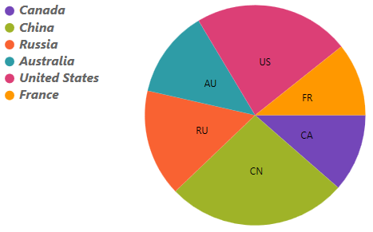

////
|metadata|
{
    "name": "piechart-legend",
    "controlName": ["{PieChartName}"],
    "tags": ["How Do I"],
    "guid": "",
    "buildFlags": [],
    "createdOn": "2017-05-09T19:53:12.0768992Z"
}
|metadata|
////

= 凡例

このトピックは、pick:[android,xamarin,wpf,win-universal="link:{ItemLegendLink}.ItemLegend.html[ItemLegend]"]pick:[win-forms="link:{ItemLegendLink}.UltraItemLegend.html[UltraItemLegend]"] を使用するために link:{PieChartLink}.{PieChartName}.html[{PieChartName}]™ の構成する情報を提供します。

=== 概要

このトピックは、以下のセクションで構成されます。

* <<Requirements,要件>>
* <<Properties,プロパティ>>
* <<CodeExample,コード例>>
* <<RelatedContent,関連コンテンツ>>

[[Requirements]]
=== 要件

前提条件として「link:piechart-data-binding.html[データ バインディング]」トピックを呼んだ、データにバインドされる円チャートを作成しました。

[[Properties]]
=== プロパティ

ifdef::wpf[]

{PieChartName} の隣に凡例を表示するには、ItemLegend を作成し、link:{PieChartLink}.{PieChartBase}{ApiProp}Legend.html[Legend] プロパティに割り当てます。 link:{PieChartLink}.{PieChartBase}{ApiProp}LegendLabelMemberPath.html[LegendLabelMemberPath] は、各円スライスの凡例項目を表示するために使用するデータ モデルのプロパティを指定します。

また、凡例項目の外観をカスタマイズするために link:{PieChartLink}.{PieChartBase}{ApiProp}LegendItemTemplate.html[LegendItemTemplate] および link:{PieChartLink}.{PieChartBase}{ApiProp}LegendItemBadgeTemplate.html[LegendItemBadgeTemplate]、 ItemLegend の複数のフォント プロパティも使用できます。凡例項目の外観に影響するプロパティのリストは以下です。

[options="header", cols="a,a,a"]
|====
|プロパティ名|プロパティ タイプ|説明

|*{PieChartName} プロパティ:*
|
|

|link:{PieChartLink}.{PieChartBase}{ApiProp}LegendItemTemplate.html[LegendItemTemplate]
|`DataTemplate`
|各凡例項目を描画する DataTemplate。

|link:{PieChartLink}.{PieChartBase}{ApiProp}LegendLabelMemberPath.html[LegendLabelMemberPath]
|`string`
|各円スライスの凡例項目を表示するために値を使用するデータ モデルのプロパティ。

|link:{PieChartLink}.{PieChartBase}{ApiProp}LegendItemBadgeTemplate.html[LegendItemBadgeTemplate]
|`DataTemplate`
|各凡例項目のバッジ アイコンを描画する DataTemplate。

|*ItemLegend プロパティ:*
|
|

|link:{LegendLinkBase}.LegendBase{ApiProp}ItemsFontFamily.html[ItemsFontFamily]
|`FontFamily`
|各凡例項目で使用するフォント ファミリ。

|link:{LegendLinkBase}.LegendBase{ApiProp}ItemsFontSize.html[ItemsFontSize]
|`double`
|各凡例項目で使用するフォント サイズ。

|link:{LegendLinkBase}.LegendBase{ApiProp}ItemsFontStretch.html[ItemsFontStretch]
|`FontStretch`
|各凡例項目で使用するフォント伸縮。

|link:{LegendLinkBase}.LegendBase{ApiProp}ItemsFontStyle.html[ItemsFontStyle]
|`FontStyle`
|各凡例項目で使用するフォント スタイル。

|link:{LegendLinkBase}.LegendBase{ApiProp}ItemsFontWeight.html[ItemsFontWeight]
|`FontWeight`
|各凡例項目で使用するフォントの太さ。

|link:{LegendLinkBase}.LegendBase{ApiProp}ItemsForeground.html[ItemsForeground]
|`Brush`
|各凡例項目で使用する前景色。

|link:{LegendLinkBase}.LegendBase{ApiProp}ItemsHorizontalAlignment.html[ItemsHorizontalAlignment]
|`HorizontalAlignment`
|各凡例項目で使用する水平方向の配置。

|link:{LegendLinkBase}.LegendBase{ApiProp}ItemsVerticalAlignment.html[ItemsVerticalAlignment]
|`VerticalAlignment`
|各凡例項目で使用する垂直方向の配置。

|====

endif::wpf[]

ifdef::xamarin,win-forms,win-universal[]

{PieChartName} の隣に凡例を表示するには、ItemLegend を作成し、{PieChartName} の link:{PieChartLink}.{PieChartBase}{ApiProp}Legend.html[Legend] プロパティに割り当てます。各凡例項目で使用するデータ ソースのプロパティを凡例に通知する link:{PieChartLink}.{PieChartBase}{ApiProp}LegendLabelMemberPath.html[LegendLabelMemberPath] も設定できます。link:{PieChartLink}.{PieChartBase}{ApiProp}LegendLabelMemberPath.html[LegendLabelMemberPath] が指定されていない場合、凡例は {PieChartName} の link:{PieChartLink}.{PieChartBase}{ApiProp}LabelMemberPath.html[LabelMemberPath] プロパティを使用します。

endif::xamarin,win-forms,win-universal[]

[[CodeExample]]

ifdef::wpf[]

*XAML の場合:*

----
<Grid x:Name="RootLayout">
    <Grid.ColumnDefinitions>
        <ColumnDefinition Width="Auto"/>
        <ColumnDefinition Width="*"/>
    </Grid.ColumnDefinitions>
    
    <ig:{PieChartName} x:Name="pieChart" Grid.Column="1"
                    ItemsSource="{Binding Path=EnergyData}"
                    ValueMemberPath="Coal"
                    LabelMemberPath="CountryAbbreviation"
                    Legend="{Binding ElementName=itemLegend1}">
        <ig:XamPieChart.LegendItemTemplate>
            <DataTemplate>
                <StackPanel Orientation="Horizontal" Margin="1" Visibility="{Binding Series.Visibility}">
                    <ContentPresenter Content="{Binding}"
                                      ContentTemplate="{Binding Series.LegendItemBadgeTemplate}"/>
                    <TextBlock Text="{Binding Path=Item.Country}"
                               Foreground="{Binding Series.Legend.ItemsForeground}"
                               FontStretch="{Binding Series.Legend.ItemsFontStretch}"
                               FontStyle="Italic"
                               FontWeight="Bold"
                               FontSize="16"
                               FontFamily="MS Arial"/>
                </StackPanel>
            </DataTemplate>
        </ig:XamPieChart.LegendItemTemplate>
    </ig:XamPieChart>
    
    <ig:ItemLegend x:Name="itemLegend1" Grid.Column="0"/>
</Grid>
----

*C# の場合:*

----
// Get the DataTemplate from where ever you have it defined.
DataTemplate customLegendItemTemplate = this.Resources["CustomLegendItemTemplate"] as DataTemplate;

ItemLegend legend = new ItemLegend();

{PieChartName} pieChart = new {PieChartName}();
pieChart.ItemsSource = EnergyData;
pieChart.ValueMemberPath = "Coal";
pieChart.LabelMemberPath = "CountryAbbreviation";
pieChart.LegendItemTemplate = customLegendItemTemplate;
pieChart.Legend = legend;
----

*Visual Basic の場合:*

----
'Get the DataTemplate from where ever you have it defined.
Dim customLegendItemTemplate As DataTemplate
customLegendItemTemplate = TryCast(Me.FindResource("CustomLegendItemTemplate"), DataTemplate)

Dim legend As New ItemLegend()

Dim pieChart As New {PieChartName}()
pieChart.ItemsSource = EnergyData
pieChart.ValueMemberPath = "Coal"
pieChart.LabelMemberPath = "CountryAbbreviation"
pieChart.LegendItemTemplate = customLegendItemTemplate;
pieChart.Legend = legend
----

endif::wpf[]

ifdef::xamarin,win-forms,win-universal[]

image::images/PieChartWithLegend.png[align="center"]

ifdef::xaml[]

*XAML の場合:*

----
<Grid x:Name="RootLayout">
    <Grid.ColumnDefinitions>
        <ColumnDefinition Width="Auto"/>
        <ColumnDefinition Width="*"/>
    </Grid.ColumnDefinitions>
    
    <ig:{PieChartName} x:Name="pieChart" Grid.Column="1"
                    ItemsSource="{Binding Path=EnergyData}"
                    ValueMemberPath="Coal"
                    LabelMemberPath="CountryAbbreviation"
                    LegendLabelMemberPath="Country"
                    Legend="{x:Reference itemLegend1}">
    </ig:XamPieChart>
    
    <ig:ItemLegend x:Name="itemLegend1" Grid.Column="0"/>
</Grid>
----

endif::xaml[]

*C# の場合:*

----
ItemLegend legend = new ItemLegend();

{PieChartName} pieChart = new {PieChartName}();
pieChart.ItemsSource = EnergyData;
pieChart.ValueMemberPath = "Coal";
pieChart.LabelMemberPath = "CountryAbbreviation";
pieChart.LegendLabelMemberPath = "Country";
pieChart.Legend = legend;
----

ifdef::win-forms,win-universal[]

*Visual Basic の場合:*

----
Dim legend As New ItemLegend()

Dim pieChart As New {PieChartName}()
pieChart.ItemsSource = EnergyData
pieChart.ValueMemberPath = "Coal"
pieChart.LabelMemberPath = "CountryAbbreviation"
pieChart.LegendLabelMemberPath = "Country";
pieChart.Legend = legend
----

endif::win-forms,win-universal[]

endif::xamarin,win-forms,win-universal[]

[[RelatedContent]]
=== 関連コンテンツ

* link:piechart-data-binding.html[データ バインディング]