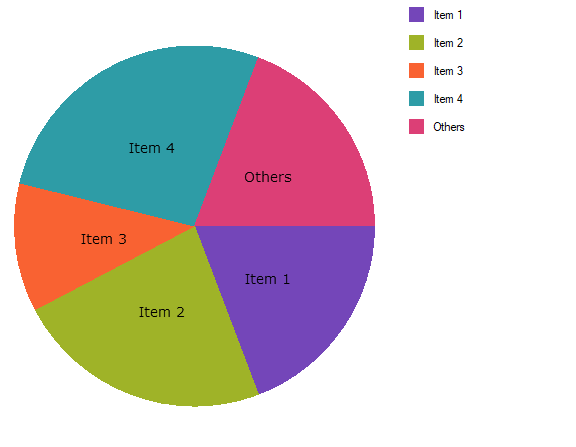

////
|metadata|
{
    "name": "piechart-others-category",
    "controlName": ["{PieChartName}"],
    "tags": ["How Do I"],
    "guid": "5b5ba0e9-953a-4a6c-84d3-0a4d1641c57b",
    "buildFlags": ["SL","WPF","win-phone","XAMARIN","ANDROID","WINFORMS"],
    "createdOn": "2014-06-05T19:53:12.0768992Z"
}
|metadata|
////

= その他の分類項目

このトピックは、 link:{PieChartLink}.{PieChartName}.html[{PieChartName}] コントロールの Others カテゴリの構成方法を示します。トピックの最後で、完全なコード例を提供します。

トピックは以下のとおりです。

* <<Introduction,概要>>
* <<Preview,プレビュー>>
* <<Requirements,要件>>
* <<Overview,概要>>
* <<Steps,手順>>
* <<RelatedTopics,関連トピック>>

[[Introduction]]
== 概要

Pie Chart コントロールの基本データに、小さい値を含む多くの項目が含まれる場合があります。この場合、Others カテゴリは、単一スライスへの複数のデータ値の自動集計を許可します。

[[Preview]]
== プレビュー

以下は最終結果のプレビューです。

ifdef::xaml,android[]
image::images/PieChart_OthersCategory_02.png[]
endif::xaml,android[]

ifdef::win-forms[]

endif::win-forms[]

図 1: サンプル コードによって実装された Others カテゴリを備える円チャート

[[Requirements]]
== 要件

このトピックは、ユーザーが link:piechart-data-binding.html[データ バインディング]トピックを既に読んでいることを前提とし、開始点としてその中のコードを使用します。

[[Overview]]
== 概要

[start=1]
. データ モデルの定義。
[start=2]
. 円チャートの  pick:[xaml,android="ItemSource"]  pick:[win-forms="DataSource"]  として Data クラスのインスタンスを構成
[start=3]
. Others カテゴリ の構成
[start=4]
. (オプション) 結果の検証

[[Steps]]
== 手順

[start=1]
. *データ モデルを定義* します。

DataItem と呼ばれるシンプルなデータ モデルを定義します。次に、相対的に小さい値の複数の DataItems を含む Data コレクションを定義します。

ifdef::xaml[]

*C# の場合:*

----
    public class DataItem
    {
        public string Label { get; set; }
        public double Value { get; set; }
    }
    public class Data : ObservableCollection<DataItem>
    {
        public Data()
        {
            Add(new DataItem { Label = "Item 1", Value = 5 });
            Add(new DataItem { Label = "Item 2", Value = 6 });
            Add(new DataItem { Label = "Item 3", Value = 3 });
            Add(new DataItem { Label = "Item 4", Value = 7 });
            Add(new DataItem { Label = "Item 5", Value = 1 });
            Add(new DataItem { Label = "Item 6", Value = 1 });
            Add(new DataItem { Label = "Item 7", Value = 1 });
            Add(new DataItem { Label = "Item 8", Value = 1 });
            Add(new DataItem { Label = "Item 9", Value = 1 });
        }
    }
----

endif::xaml[]

ifdef::win-forms[]

*C# の場合:*

----
    public class DataItem
    {
        public string Label { get; set; }
        public double Value { get; set; }
    }
    public class Data : ObservableCollection<DataItem>
    {
        public Data()
        {
            Add(new DataItem { Label = "Item 1", Value = 5 });
            Add(new DataItem { Label = "Item 2", Value = 6 });
            Add(new DataItem { Label = "Item 3", Value = 3 });
            Add(new DataItem { Label = "Item 4", Value = 7 });
            Add(new DataItem { Label = "Item 5", Value = 1 });
            Add(new DataItem { Label = "Item 6", Value = 1 });
            Add(new DataItem { Label = "Item 7", Value = 1 });
            Add(new DataItem { Label = "Item 8", Value = 1 });
            Add(new DataItem { Label = "Item 9", Value = 1 });
        }
    }
----

endif::win-forms[]

ifdef::wpf,sl[]

*Visual Basic の場合:*

----
Public Class DataItem
    Public Property Label() As String
        Get
            Return _Label
        End Get
        Set
            _Label = Value
        End Set
    End Property
    Private _Label As String
    Public Property Value() As Double
        Get
            Return _Value
        End Get
        Set
            _Value = Value
        End Set
    End Property
    Private _Value As Double
End Class
Public Class Data
    Inherits ObservableCollection(Of DataItem)
    Public Sub New()
        Add(New DataItem() With { .Label = "Item 1", .Value = 5  })
        Add(New DataItem() With { .Label = "Item 2", .Value = 6  })
        Add(New DataItem() With { .Label = "Item 3", .Value = 3  })
        Add(New DataItem() With { .Label = "Item 4", .Value = 7  })
        Add(New DataItem() With { .Label = "Item 5", .Value = 1  })
        Add(New DataItem() With { .Label = "Item 6", .Value = 1  })
        Add(New DataItem() With { .Label = "Item 7", .Value = 1  })
        Add(New DataItem() With { .Label = "Item 8", .Value = 1  })
        Add(New DataItem() With { .Label = "Item 9", .Value = 1  })
    End Sub
End Class
----

endif::wpf,sl[]

ifdef::win-forms[]

*Visual Basic の場合:*

----
Public Class DataItem
    Public Property Label() As String
        Get
            Return _Label
        End Get
        Set
            _Label = Value
        End Set
    End Property
    Private _Label As String
    Public Property Value() As Double
        Get
            Return _Value
        End Get
        Set
            _Value = Value
        End Set
    End Property
    Private _Value As Double
End Class
Public Class Data
    Inherits ObservableCollection(Of DataItem)
    Public Sub New()
        Add(New DataItem() With { .Label = "Item 1", .Value = 5  })
        Add(New DataItem() With { .Label = "Item 2", .Value = 6  })
        Add(New DataItem() With { .Label = "Item 3", .Value = 3  })
        Add(New DataItem() With { .Label = "Item 4", .Value = 7  })
        Add(New DataItem() With { .Label = "Item 5", .Value = 1  })
        Add(New DataItem() With { .Label = "Item 6", .Value = 1  })
        Add(New DataItem() With { .Label = "Item 7", .Value = 1  })
        Add(New DataItem() With { .Label = "Item 8", .Value = 1  })
        Add(New DataItem() With { .Label = "Item 9", .Value = 1  })
    End Sub
End Class
----

endif::win-forms[]

ifdef::android[]

*Java の場合:*

[source,js]
----
public class DataItem {
private String _label;
public String getLabel() {
 return _label;
 } 
public String setLabel(String label) {
_label = label;
 return label;
 }
private double _value;
public double getValue(){
 return _value;
 }
public double setValue(double value) {
_value = value;
 return _value;
 } 
public DataItem(String label, double value){
_label = label;
_value = value;
 }
}
public class Data extends ArrayList<DataItem> {
public Data() {
 add(new DataItem("Item 1", 5));
 add(new DataItem("Item 2", 6));
 add(new DataItem("Item 3", 3));
 add(new DataItem("Item 4", 7));
 add(new DataItem("Item 5", 1));
 add(new DataItem("Item 6", 1));
 add(new DataItem("Item 7", 1));
 add(new DataItem("Item 8", 1)); 
 add(new DataItem("Item 9", 1));
 }
}
----

endif::android[]

[start=2]
. *円チャートの  pick:[xaml,android="ItemSource"]  pick:[win-forms="DataSource"]  として Data クラスのインスタンスを構成します。*

ifdef::wpf,sl[]

*XAML の場合:*

----
    <Grid x:Name="LayoutRoot" Background="White">
        <Grid.Resources>
            <local:Data x:Key="data" />
        </Grid.Resources>
        <ig:ItemLegend x:Name="Legend"
                       Grid.Row="1"
                       VerticalAlignment="Top"
                       HorizontalAlignment="Right" />
        <ig:{PieChartName} Name="pieChart"
                        Grid.Row="2"
                        ItemsSource="{StaticResource data}"
                        LabelMemberPath="{}{Label}"
                        ValueMemberPath="Value"
                        LabelsPosition="BestFit"
                        Legend="{Binding ElementName=Legend}" />
    </Grid>
----

endif::wpf,sl[]

ifdef::xamarin[]

*XAML の場合:*

----
Grid x:Name="layoutRoot">
     <ig:XamPieChart x:Name="pieChart"
                    LabelMemberPath="Label"
                    ValueMemberPath="Value"
                    LabelsPosition="BestFit"
                    Legend="{x:Reference legend}">
      <ig:XamPieChart.ItemsSource>
        <local:Data/>
      </ig:XamPieChart.ItemsSource>
    </ig:XamPieChart>
    <ig:ItemLegend x:Name="legend"/>
</Grid>
----

endif::xamarin[]

ifdef::android[]

*Java の場合:*

[source,js]
----
FrameLayout rootView = (FrameLayout) inflater.inflate(R.layout.fragment_main, container, false);
Data data = new Data();
PieChartView pieChart = new PieChartView(rootView.getContext());
FrameLayout.LayoutParams chartParams = new FrameLayout.LayoutParams(FrameLayout.LayoutParams.MATCH_PARENT,FrameLayout.LayoutParams.MATCH_PARENT);
pieChart.setLayoutParams(chartParams);
ItemLegendView legend = new ItemLegendView(rootView.getContext());
pieChart.setLegend(legend);
FrameLayout.LayoutParams legendParams = new FrameLayout.LayoutParams(FrameLayout.LayoutParams.WRAP_CONTENT,FrameLayout.LayoutParams.WRAP_CONTENT);
legendParams.gravity = Gravity.TOP | Gravity.RIGHT;
legend.setLayoutParams(legendParams);
pieChart.setDataSource(data);
pieChart.setLabelMemberPath("Label");
pieChart.setValueMemberPath("Value");
pieChart.setLabelsPosition(LabelsPosition.BESTFIT);
----

endif::android[]

ifdef::win-forms[]

*C# の場合:*

----
 public partial class Form1 : Form
    {
        public Form1()
        {
            InitializeComponent(); 
        }
        UltraPieChart pieChart;
        UltraLabel ultraLabel1;
        UltraItemLegend legend;
        private void Form1_Load(object sender, EventArgs e)
        {        
            pieChart = new UltraPieChart
            {
                Dock = DockStyle.Left,
                LabelMemberPath = "Label",
                ValueMemberPath = "Value",
                DataSource = new Data(),
            };
            this.Controls.Add(pieChart);
            ultraLabel1 = new UltraLabel
            {                
                Name = "ultraLabel1",
                Dock = DockStyle.Right,                
                Text = ""
            };
            this.Controls.Add(ultraLabel1);
            this.ultraLabel1.BringToFront();
            legend = new UltraItemLegend
            {             
                Dock = DockStyle.Right,   
                Height = 500
            };
            this.Controls.Add(legend);
            this.pieChart.Legend = legend;
            this.legend.BringToFront();
     }
----
*VB の場合:*

----
Partial Public Class Form1
    Inherits Form
    Public Sub New()
        InitializeComponent()
    End Sub
    Private pieChart As UltraPieChart
    Private ultraLabel1 As UltraLabel
    Private legend As UltraItemLegend
    Private Sub Form1_Load(sender As Object, e As EventArgs)
                pieChart = New UltraPieChart() With { _
                        .Dock = DockStyle.Left, _
                        .LabelMemberPath = "Label", _
                        .ValueMemberPath = "Value", _
                        .DataSource = New Data() _
                }
        Me.Controls.Add(pieChart)
                ultraLabel1 = New UltraLabel() With { _
                        .Name = "ultraLabel1", _
                        .Dock = DockStyle.Right, _
                        .Text = "" _
                }
        Me.Controls.Add(ultraLabel1)
        Me.ultraLabel1.BringToFront()
                legend = New UltraItemLegend() With { _
                        .Dock = DockStyle.Right, _
                        .Height = 500 _
                }
        Me.Controls.Add(legend)
        Me.pieChart.Legend = legend
        Me.legend.BringToFront()
    End Sub
End Class
----
endif::win-forms[]

円チャートは図 2 として表示します。

ifdef::xaml,android[]
image::images/PieChart_OthersCategory_01.png[]
endif::xaml,android[]

ifdef::win-forms[]
image::images/BeforeOthersCategory_Win.png[]
endif::win-forms[]

図 2: Others カテゴリを構成する前の円チャート
[start=3]
. *Others カテゴリを構成します。*

項目の 5～9 は非常に小さく、雑然とした外観のチャートになります。{PieChartName} の link:{PieChartLink}.{PieChartBase}{ApiProp}otherscategorythreshold.html[OthersCategoryThreshold]、 link:{PieChartLink}.{PieChartBase}{ApiProp}otherscategorytype.html[OthersCategoryType]、および link:{PieChartLink}.{PieChartBase}{ApiProp}otherscategorytext.html[OthersCategoryText] プロパティを使用して、Others カテゴリにこれらの項目を割り当てます。

ifdef::xaml[]

*XAML の場合:*

----
<ig:{PieChartName} Name="pieChart"
                   OthersCategoryThreshold="2"
                   OthersCategoryType="Number"
                   OthersCategoryText="Others" />
----

endif::xaml[]

ifdef::android[]

*Java の場合:*

[source,js]
----
pieChart.setOthersCategoryType(OthersCategoryType.NUMBER);
pieChart.setOthersCategoryThreshold(2);
pieChart.setOthersCategoryText("Others");
----

endif::android[]

ifdef::win-forms[]

pick:[win-forms="*C# の場合:*"]

ifdef::win-forms[]
----
pieChart.OthersCategoryThreshold = 2;
pieChart.OthersCategoryType = OthersCategoryType.Number;
pieChart.OthersCategoryText = "Others";
----
endif::win-forms[]

endif::win-forms[]

ifdef::win-forms[]

pick:[win-forms="*VB の場合:*"]

ifdef::win-forms[]
----
pieChart.OthersCategoryThreshold = 2
pieChart.OthersCategoryType = OthersCategoryType.Number
pieChart.OthersCategoryText = "Others"
----
endif::win-forms[]

endif::win-forms[]

OthersCategoryThreshold は 2 に設定、OthersCategoryType は Number に設定されています。したがって、2 以下の値を含む項目は、Others カテゴリに割り当てられます。
[start=4]
. *(オプション) 結果を確認します。*

アプリケーションを実行します。上記の円チャートは図 1 として表示します。

.注:
[NOTE]
====
OthersCategoryType  を Percent に設定すると、OthersCategoryThreshold は値ではなくパーセンテージとして解釈されます。つまり、値がすべての項目の値の合計の 2% 未満である項目は、Others カテゴリに割り当てられます。使用しているアプリケーションに最も適切な OthersCategoryType を使用できます。
====

[[RelatedTopics]]
== 関連トピック

* link:piechart-data-binding.html[データ バインディング]
* link:piechart-selection-and-explosion.html[展開]
* link:piechart-selection.html[選択]