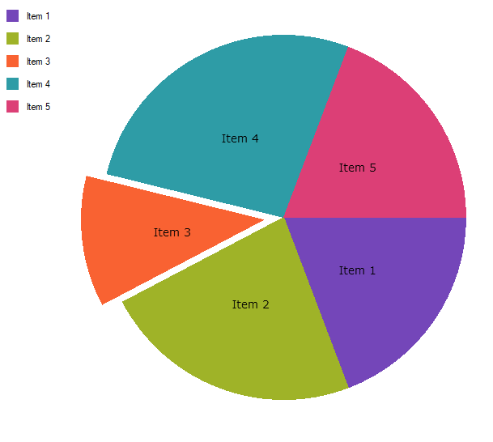

////
|metadata|
{
    "name": "piechart",
    "controlName": ["{PieChartName}"],
    "tags": ["Getting Started"],
    "guid": "7327342b-32f9-4a1e-b74a-3d4163b47378",
    "buildFlags": ["SL","WPF","win-phone","XAMARIN","ANDROID","WINFORMS"],
    "createdOn": "2014-06-05T19:53:12.0688959Z"
}
|metadata|
////

= {PieChartName}

link:{PieChartLink}.{PieChartName}.html[{PieChartName}] は、セクションに分割された円形の領域で構成される円チャートを描画する特別なコントロールです。各セクションには、基本データ値に比例する円弧の長さがあります。

ifdef::xaml,android[]
image::images/PieChart_GettingStarted_01.png[]
endif::xaml,android[]

ifdef::win-forms[]

endif::win-forms[]

図 1: {PieChartName} コントロールの例

{PieChartName} コントロールは分類データを表すために使用されます。カテゴリが少ない場合や各カテゴリが全体としてデータの相対的に大きなパーセンテージを構成する場合、これは最も効率的です。

ifdef::wpf,win-universal,sl,android,win-forms[]
{PieChartName} コントロールは、データ チャート アセンブリに同梱されます。
endif::wpf,win-universal,sl,android,win-forms[]

ifdef::xamarin[]
{PieChartName} コントロールは、チャート アセンブリに同梱されます。
endif::xamarin[]

== link:piechart-getting-started-with-piechart.html[{PieChartName} を使用した作業の開始]

{PieChartName} コントロールを使用してすばやく作業を開始するためのコントロールの使用方法を提供します。

== link:piechart-using-piechart.html[{PieChartName} の構成]

このセクションには、{PieChartName} コントロールで提供される主要な特徴および機能についての情報が含まれています。

== link:piechart-api-overview.html[API の概要]

このトピックは、{PieChartName} コントロールを使用して開発する際の名前空間とクラスについて説明します。