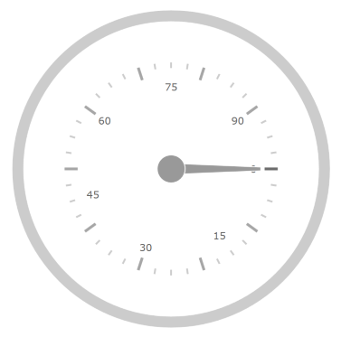

////
|metadata|
{
    "name": "radialgauge-configuring-labels",
    "tags": ["Getting Started","How Do I"],
    "controlName": ["{RadialGaugeName}"],
    "guid": "d556c180-8b27-4566-9214-5605612bbf33",
    "buildFlags": ["SL","WPF","XAMARIN","ANDROID","WINFORMS"],
    "createdOn": "2014-06-05T19:53:11.9738536Z"
}
|metadata|
////

= ラベルの構成 ({RadialGaugeName})

=== 目的

このトピックでは、{RadialGaugeName} コントロールを使用したラベルの概念的な概要を提供します。ラベルのプロパティの説明およびラベルの構成方法を例で示します。

=== 前提条件

本トピックの理解を深めるために、以下のトピックを参照することをお勧めします。

[options="header", cols="a,a"]
|====
|トピック|目的

| link:radialgauge.html[{RadialGaugeName}]
|このセクションでは、 _{RadialGaugeName}_ コントロールおよびその主要機能の概要を説明します。

| link:radialgauge-getting-started-with-radialgauge.html[{RadialGaugeName} の追加]
|このトピックではコード例を使用して、{RadialGaugeName} コントロールを {PlatformName} アプリケーションに追加する方法を説明します。

|====

=== このトピックの内容

このトピックは、以下のセクションで構成されます。

* <<Overview,ラベルの概要>>
* <<Preview,プレビュー>>
* <<Properties,ラベルのプロパティとイベント>>
* <<Example,ラベルの構成>>
* <<TitleProperties,Title プロパティとスタイル設定>>
* <<RelatedContent,関連コンテンツ>>

[[Overview]]
== ラベルの概要

=== ラベルの概要

ゲージ ラベルはスケールで指定された間隔で数値を表示する視覚要素です。

[[Preview]]

=== プレビュー

以下の画像は、ラベルを表示する {RadialGaugeName} コントロールのプレビューです。

image::images/Configuring_Labels_1_17_1.png[]

[[Properties]]
== ラベルのプロパティとイベント

=== ラベルのプロパティとイベントの概要

以下の表は、{RadialGaugeName} コントロールのラベルのプロパティの概要を示します。

[options="header", cols="a,a,a"]
|====
|プロパティ名|プロパティ タイプ|説明

| link:{RadialGaugeLink}.{RadialGaugeName}{ApiProp}labelextent.html[LabelExtent]
|`Double`
|ゲージの中心に 0 のラベルを配置し、ゲージの半径 1 のラベルを配置した場合のゲージの中心からの距離 0 と 1 の間の値としてのラベル位置を決定します。

| link:{RadialGaugeLink}.{RadialGaugeName}{ApiProp}labelinterval.html[LabelInterval]
|`Double`
|ラベルの描画に使用する間隔を決定します。デフォルトで、スケールの目盛と同じ間隔です。

|====

以下の表で、{RadialGaugeName} コントロールのラベルに関連するイベントを簡単に説明します。

[options="header", cols="a,a"]
|====
|イベント名|説明

| link:{RadialGaugeLink}.{RadialGaugeName}{ApiProp}alignlabel_ev.html[AlignLabel]
|このイベントは、ゲージ ラベルがスケールに沿って配置されると発生します。

| link:{RadialGaugeLink}.{RadialGaugeName}{ApiProp}formatlabel_ev.html[FormatLabel]
|このイベントは、ゲージ ラベルが書式設定されると発生します。

|====

[[Example]]
== ラベルの構成

=== 例

以下のスクリーンショットは、ラベルのプロパティを以下の構成にした場合の {RadialGaugeName} コントロールの描画方法を示しています。

[options="header", cols="a,a"]
|====
|プロパティ|値

| link:{RadialGaugeLink}.{RadialGaugeName}{ApiProp}labelinterval.html[LabelInterval]
|15

| link:{RadialGaugeLink}.{RadialGaugeName}{ApiProp}labelextent.html[LabelExtent]
|0.44

|====

以下のコードはこの例を実装します。

ifdef::xaml[]

*XAML の場合:*

[source,xaml]
----
<{RadialGaugeName} x:Name="radialGauge"
         LabelExtent="0.44" 
         LabelInterval="15"/>
----

endif::xaml[]

ifdef::sl[]

*C# の場合:*

[source,csharp]
----
var radialGauge = new {RadialGaugeName}();
radialGauge.LabelExtent = 0.44;
radialGauge.LabelInterval = 15;
----

endif::sl[]

ifdef::win-universal[]

*C# の場合:*

[source,csharp]
----
var radialGauge = new {RadialGaugeName}();
radialGauge.LabelExtent = 0.44;
radialGauge.LabelInterval = 15;
----

endif::win-universal[]

ifdef::wpf[]

*C# の場合:*

[source,csharp]
----
var radialGauge = new {RadialGaugeName}();
radialGauge.LabelExtent = 0.44;
radialGauge.LabelInterval = 15;
----

endif::wpf[]

ifdef::win-forms[]

*C# の場合:*

[source,csharp]
----
var radialGauge = new {RadialGaugeName}();
radialGauge.LabelExtent = 0.44;
radialGauge.LabelInterval = 15;
----

endif::win-forms[]

ifdef::xamarin[]

*C# の場合:*

[source,csharp]
----
var radialGauge = new {RadialGaugeName}();
radialGauge.LabelExtent = 0.44;
radialGauge.LabelInterval = 15;
----

endif::xamarin[]

ifdef::sl[]

*Visual Basic の場合:*

[source,vb]
----
Dim radialGauge As {RadialGaugeName} = New {RadialGaugeName}
radialGauge.LabelExtent = 0.44
radialGauge.LabelInterval = 15
----

endif::sl[]

ifdef::win-universal[]

*Visual Basic の場合:*

[source,vb]
----
Dim radialGauge As {RadialGaugeName} = New {RadialGaugeName}
radialGauge.LabelExtent = 0.44
radialGauge.LabelInterval = 15
----

endif::win-universal[]

ifdef::wpf[]

*Visual Basic の場合:*

[source,vb]
----
Dim radialGauge As {RadialGaugeName} = New {RadialGaugeName}
radialGauge.LabelExtent = 0.44
radialGauge.LabelInterval = 15
----

endif::wpf[]

ifdef::win-forms[]

*Visual Basic の場合:*

[source,vb]
----
Dim radialGauge As {RadialGaugeName} = New {RadialGaugeName}
radialGauge.LabelExtent = 0.44
radialGauge.LabelInterval = 15
----

endif::win-forms[]

ifdef::android[]

*Java の場合:*

[source,js]
----
radialGauge.setLabelExtent(.44);
radialGauge.setLabelInterval(15);
----

endif::android[]

[[TitleProperties]]
== Title プロパティ

以下の表は、_{RadialGaugeName}_ コントロールのタイトルのプロパティの概要を示します。

[options="header", cols="a,a,a"]
|====
|プロパティ名|プロパティ タイプ

| link:{RadialGaugeLink}.{RadialGaugeName}{ApiProp}titletext.html[TitleText]
|`String`
|ゲージのタイトルに表示されるテキストを取得または設定します。

| link:{RadialGaugeLink}.{RadialGaugeName}{ApiProp}subtitletext.html[SubtitleText]
|`String`
|ゲージのサブタイトルに表示されるテキストを取得または設定します。

| link:{RadialGaugeLink}.{RadialGaugeName}{ApiProp}highlightlabeltext.html[HighlightLabelText]
|`String`
|ゲージのハイライト ラベルに表示されるテキストを取得または設定します。

| link:{RadialGaugeLink}.{RadialGaugeName}{ApiProp}titledisplaysvalue.html[TitleDisplaysValue]
|`Bool`
|ゲージの針の位置の値を示すタイトルを取得または設定します。

| link:{RadialGaugeLink}.{RadialGaugeName}{ApiProp}subtitledisplaysvalue.html[SubtitleDisplaysValue]
|`Bool`
|ゲージの針の位置の値を示すサブタイトルを取得または設定します。

| link:{RadialGaugeLink}.{RadialGaugeName}{ApiProp}highlightLabelDisplaysValue.html[HighlightLabelDisplaysValue]
|`Bool`
|ハイライト針のハイライト値を示すハイライト ラベルを取得または設定します。

| link:{RadialGaugeLink}.{RadialGaugeName}{ApiProp}titlebrush.html[Titlebrush]
|`String`
|内側ユニットのテキストの描画に使用するブラシを取得または設定します。

| link:{RadialGaugeLink}.{RadialGaugeName}{ApiProp}titlefontsize.html[TitleFontSize]
|`Double`
|Value のフォント サイズを取得または設定します。

| link:{RadialGaugeLink}.{RadialGaugeName}{ApiProp}subtitlebrush.html[SubtitleBrush]
|`String`
|内側ユニットのテキストの描画に使用するブラシを取得または設定します。

| link:{RadialGaugeLink}.{RadialGaugeName}{ApiProp}subtitlefontsize.html[SubtitleFontSize]
|`Double`
|Value のフォント サイズを取得または設定します。

| link:{RadialGaugeLink}.{RadialGaugeName}{ApiProp}highlightlabelbrush.html[HighlightLabelBrush]
|`String`
|内側ユニットのテキストの描画に使用するブラシを取得または設定します。

| link:{RadialGaugeLink}.{RadialGaugeName}{ApiProp}highlightlabelfontsize.html[HighlightLabelFontSize]
|`Double`
|Value のフォント サイズを取得または設定します。

[[RelatedContent]]
== 関連コンテンツ

このトピックの追加情報については、以下のトピックも合わせてご参照ください。

[options="header", cols="a,a"]
|====
|トピック|目的

| link:radialgauge-getting-started-with-radialgauge.html[{RadialGaugeName} の追加]
|このトピックではコード例を使用して、{RadialGaugeName} コントロールを {PlatformName} アプリケーションに追加する方法を説明します。

| link:radialgauge-configuring-the-backing.html[背景の構成 ({RadialGaugeName})]
|このトピックでは、{RadialGaugeName} コントロールのバッキング機能の概念的な概要を提供します。バッキング領域のプロパティについて説明し、実装例を提供します。

| link:radialgauge-configuring-optical-scaling.html[オプティカル スケーリングの構成 ({RadialGaugeName})]
|このトピックでは、{RadialGaugeName}™ コントロールを使用したラベルの概念的な概要を提供します。スケーリングのプロパティについて説明し、設定を構成します。

| link:radialgauge-configuring-needles.html[針の構成 ({RadialGaugeName})]
|このトピックでは、{RadialGaugeName} コントロールを使用した針の概念的な概要を提供します。針のプロパティの説明および針の構成方法を例で示します。

| link:radialgauge-configuring-ranges.html[範囲の構成 ({RadialGaugeName})]
|このトピックでは、{RadialGaugeName} コントロールの範囲の概念的な概要を提供します。範囲のプロパティについて説明し、範囲をラジアル ゲージに追加する方法の例も示します。

| link:radialgauge-configuring-the-scale.html[スケールの構成 ({RadialGaugeName})]
|このトピックでは、{RadialGaugeName} コントロールのスケールの概念的な概要を提供します。スケールのプロパティの説明およびスケールの実装方法を例で示します。

| link:radialgauge-configuring-tick-marks.html[目盛の構成 ({RadialGaugeName})]
|このトピックでは、{RadialGaugeName} コントロールを使用した目盛の概念的な概要を提供します。目盛プロパティの説明および目盛の実装方法を例で示します。

|====
