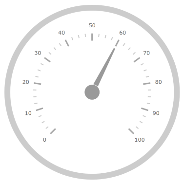

////
|metadata|
{
    "name": "radialgauge-configuring-needles",
    "controlName": ["{RadialGaugeName}"],
    "tags": ["Getting Started","How Do I"],
    "guid": "46c24907-1118-4915-a3d0-72412c487782",
    "buildFlags": ["SL","WPF","XAMARIN","ANDROID","WINFORMS"],
    "createdOn": "2014-06-05T19:53:11.9768547Z"
}
|metadata|
////

= 針の構成 ({RadialGaugeName})

== トピックの概要

=== 目的

このトピックでは、{RadialGaugeName} コントロールを使用した針の概念的な概要を提供します。針のプロパティの説明および針の構成方法を例で示します。

=== 前提条件

本トピックの理解を深めるために、以下のトピックを参照することをお勧めします。

[options="header", cols="a,a"]
|====
|トピック|目的

| link:radialgauge.html[{RadialGaugeName}]
|このセクションでは、 _{RadialGaugeName}_ コントロールおよびその主要機能の概要を説明します。

| link:radialgauge-getting-started-with-radialgauge.html[{RadialGaugeName} の追加]
|このトピックではコード例を使用して、{RadialGaugeName} コントロールを {PlatformName} アプリケーションに追加する方法を説明します。

|====

=== このトピックの内容

このトピックは、以下のセクションで構成されます。

* <<Overview,針の概要>>
* <<Preview,プレビュー>>
* <<Properties,針のプロパティ>>
* <<Example,針の構成>>
* <<Highlight Needle Example,ハイライト値針の構成>>
* <<RelatedContent,関連コンテンツ>>

[[Overview]]
== 針の概要

=== 針の概要

ゲージの針は、ゲージの設定値を表すために使用される視覚要素で、針キャップのオーバーレイまたはアンダーレイなどのゲージの針のピボット ポイントで構成されます。サポートされている針の図形とキャップは、link:{RadialGaugeLink}.{RadialGaugeName}{ApiProp}needleshape.html[NeedleShape] と link:{RadialGaugeLink}.{RadialGaugeName}{ApiProp}needlepivotshape.html[NeedlePivotShape] プロパティで設定します。さまざまな針の図形やピボット図形の表示については、針のサンプルを参照してください。

[[Preview]]

=== プレビュー

以下の画像は、 link:{RadialGaugeLink}.{RadialGaugeName}{ApiProp}value.html[Value] プロパティを 60 に設定した場合の {RadialGaugeName} コントロールのプレビューです。

[[Properties]]
== 針のプロパティ

=== 針のプロパティの概要

以下の表で、{RadialGaugeName} コントロールの針に関連したプロパティを簡単に説明します。

[options="header", cols="a,a,a"]
|====
|プロパティ名|プロパティ タイプ|説明

| link:{RadialGaugeLink}.{RadialGaugeName}{ApiProp}value.html[Value]
|`double`
|針が指すゲージの値を決定します。

| link:{RadialGaugeLink}.{RadialGaugeName}{ApiProp}needlestartextent.html[NeedleStartExtent]
|`double`
|ゲージの中心から測定される、針の開始位置を決定します。このプロパティの値は -1 から 1 の間にする必要があります。

| link:{RadialGaugeLink}.{RadialGaugeName}{ApiProp}needleendextent.html[NeedleEndExtent]
|`double`
|ゲージの中心から測定される、針の終了位置を決定します。このプロパティの値は -1 から 1 の間にする必要があります。

| link:{RadialGaugeLink}.{RadialGaugeName}{ApiProp}needlestartwidthratio.html[NeedleStartWidthRatio]
|`double`
|針のポイント部分の幅を決定します。このプロパティの値は 0 から 1 の間にする必要があります。

| link:{RadialGaugeLink}.{RadialGaugeName}{ApiProp}needleendwidthratio.html[NeedleEndWidthRatio]
|`double`
|針の基部の部分の幅を決定します。このプロパティの値は 0 から 1 の間にする必要があります。 

link:{RadialGaugeLink}.{RadialGaugeName}{ApiProp}needleshape.html[NeedleShape] プロパティの以下のいずれかの値が設定されていない限り、効果は表示されません。 

ifdef::wpf,win-forms,win-universal,xamarin,sl[] 

* Rectangle 

* RectangleWithBulb 

* Trapezoid 

* TrapezoidWithBulb 

endif::wpf,win-forms,win-universal,xamarin,sl[] 

ifdef::android[] 

* RECTANGLE 

* RECTANGLE_WITH_BULB 

* TRAPEZOID 

* TRAPEZOID_WITH_BULB 

endif::android[] 

| link:{RadialGaugeLink}.{RadialGaugeName}{ApiProp}needleshape.html[NeedleShape]
| pick:[android,wpf,win-universal=" link:{RadialGaugeLink}.radialgaugeneedleshape.html[RadialGaugeNeedleShape]"] pick:[xamarin=" link:{RadialGaugeLinkBase}.radialgaugeneedleshape.html[RadialGaugeNeedleShape]"] 
|使用する針の図形を決定します。以下に設定できます。 

ifdef::wpf,win-forms,win-universal,xamarin,sl[] 

* Rectangle 

* RectangleWithBulb 

* Triangle 

* TriangleWithBulb 

* Trapezoid 

* TrapezoidWithBulb 

* Needle 

* NeedleWithBulb 

* None 

endif::wpf,win-forms,win-universal,xamarin,sl[] 

ifdef::android[] 

* RECTANGLE 

* RECTANGLE_WITH_BULB 

* TRIANGLE 

* TRIANGLE_WITH_BULB 

* TRAPEZOID 

* TRAPEZOID_WITH_BULB 

* NEEDLE 

* NEEDLE_WITH_BULB 

* NONE 

endif::android[] 

| link:{RadialGaugeLink}.{RadialGaugeName}{ApiProp}needlepivotshape.html[NeedlePivotShape]
| pick:[android,wpf,win-universal=" link:{RadialGaugeLink}.radialgaugepivotshape.html[RadialGaugePivotShape]"] pick:[xamarin=" link:{RadialGaugeLinkBase}.radialgaugepivotshape.html[RadialGaugePivotShape]"] 
|針に使用するピボットの形を決定します。 

以下に設定できます。 

ifdef::wpf,win-forms,win-universal,xamarin,sl[] 

* Circle 

* CircleWithHole 

* CircleOverlay 

* CircleOverlayWithHole 

* CircleUnderlay 

* CircleUnderlayWithHole 

* None 

endif::wpf,win-forms,win-universal,xamarin,sl[] 

ifdef::android[] 

* CIRCLE 

* CIRCLE_WITH_HOLE 

* CIRCLE_OVERLAY 

* CIRCLE_OVERLAY_WITH_HOLE 

* CIRCLE_UNDERLAY 

* CIRCLE_UNDERLAY_WITH_HOLE 

* None 

endif::android[] 

| link:{RadialGaugeLink}.{RadialGaugeName}{ApiProp}needlebrush.html[NeedleBrush]
|`Brush`
|ゲージの針のブラシを決定します。

| link:{RadialGaugeLink}.{RadialGaugeName}{ApiProp}needleoutline.html[NeedleOutline]
|`Brush`
|アウトラインの針に使用するブラシを決定します。

| link:{RadialGaugeLink}.{RadialGaugeName}{ApiProp}needlepivotbrush.html[NeedlePivotBrush]
|`Brush`
|針のピボット図形の塗りブラシを決定します。このピボット ブラシは、オーバーレイとアンダーレイを描画するピボット図形のみに適用します。そうではない場合は、この設定はピボット図形に効果がありません。

| link:{RadialGaugeLink}.{RadialGaugeName}{ApiProp}needlepivotoutline.html[NeedlePivotOutline]
|`Brush`
|針のピボット図形のアウトラインのブラシを決定します。このピボット ブラシは、オーバーレイとアンダーレイを描画するピボット図形のみに適用します。そうではない場合は、この設定はピボット図形に効果がありません。

|====

[[Example]]
== 針の構成

=== 例

以下のスクリーンショットは、以下の設定の結果、針のプロパティを使用した {RadialGaugeName} コントロールの外観がどのようになるか示しています。

[options="header", cols="a,a"]
|====
|プロパティ|値

| link:{RadialGaugeLink}.{RadialGaugeName}{ApiProp}value.html[Value]
|60

| link:{RadialGaugeLink}.{RadialGaugeName}{ApiProp}needleendextent.html[NeedleEndExtent]
|0.5

| link:{RadialGaugeLink}.{RadialGaugeName}{ApiProp}needleshape.html[NeedleShape]
|
ifdef::wpf,win-forms,win-universal,xamarin,sl[] 

Rectangle 

endif::wpf,win-forms,win-universal,xamarin,sl[] 

ifdef::android[] 

RECTANGLE 

endif::android[]

| link:{RadialGaugeLink}.{RadialGaugeName}{ApiProp}needlepivotshape.html[PivotShape]
|
ifdef::wpf,win-forms,win-universal,xamarin,sl[]

CircleWithHole 

endif::wpf,win-forms,win-universal,xamarin,sl[]

ifdef::android[] 

CIRCLE_WITH_HOLE 

endif::android[]

|====

image::images/Configuring_Needles1_2_17_1.png[]

以下のコードはこの例を実装します。

ifdef::xaml[]

*XAML の場合:*

[source,xaml]
----
<ig:{RadialGaugeName} x:Name="radialGauge"
                   Value="60"
                   NeedleEndExtent="0.5"
                   NeedleShape="Rectangle"
                   NeedlePivotShape="CircleWithHole" />
----

endif::xaml[]

ifdef::wpf,win-forms,win-universal,xamarin,sl[]

*C# の場合:*
[source,csharp]
----
var radialGauge = new {RadialGaugeName}();
radialGauge.Value = 60;
radialGauge.NeedleEndExtent = 0.5;
radialGauge.NeedleShape = RadialGaugeNeedleShape.Rectangle;
radialGauge.NeedlePivotShape = RadialGaugePivotShape.CircleWithHole;
----

endif::wpf,win-forms,win-universal,xamarin,sl[]

ifdef::wpf,win-forms,win-universal,sl[]

*Visual Basic の場合:*
[source,vb]
----
Dim radialGauge As {RadialGaugeName} = New {RadialGaugeName}
radialGauge.Value = 60
radialGauge.NeedleEndExtent = 0.5
radialGauge.NeedleShape = RadialGaugeNeedleShape.Rectangle
radialGauge.NeedlePivotShape = RadialGaugePivotShape.CircleWithHole
----

endif::wpf,win-forms,win-universal,sl[]

ifdef::android[]

*Java の場合:*

[source,js]
----
radialGauge.setValue(60);
radialGauge.setNeedleEndExtent(.5);
radialGauge.setNeedleShape(RadialGaugeNeedleShape.RECTANGLE);
radialGauge.setNeedlePivotShape(RadialGaugePivotShape.CIRCLE_WITH_HOLE);
----

endif::android[]

[[Highlight Needle Example]]
== ハイライト値針の構成

=== ハイライトの例

以下のスクリーンショットは、以下の設定の結果、ハイライト針が有効になっている _{RadialGaugeName}_ コントロールの外観がどのようになるか示しています。

[options="header", cols="a,a"]
|====
|プロパティ|プロパティ タイプ

| link:{RadialGaugeLink}.{RadialGaugeName}{ApiProp}highlightvalue.html[HighlightValue]
|Double

| link:{RadialGaugeLink}.{RadialGaugeName}{ApiProp}ishighlightneedledraggingenabled.html[IsHighlightNeedleDraggingEnabled]
|Bool

| link:{RadialGaugeLink}.{RadialGaugeName}{ApiProp}highlightvaluedisplaymode.html[HighlightValueDisplayMode]
|Enum 

image::images/Configuring_Highlight_Needle.png[]

|====

[[RelatedContent]]
== 関連コンテンツ

このトピックの追加情報については、以下のトピックも合わせてご参照ください。

[options="header", cols="a,a"]
|====
|トピック|目的

| link:radialgauge-getting-started-with-radialgauge.html[{RadialGaugeName} の追加]
|このトピックではコード例を使用して、{RadialGaugeName} コントロールを {PlatformName} アプリケーションに追加する方法を説明します。

| link:radialgauge-configuring-the-backing.html[背景の構成 ({RadialGaugeName})]
|このトピックでは、{RadialGaugeName} コントロールのバッキング機能の概念的な概要を提供します。バッキング領域のプロパティについて説明し、実装例を提供します。

| link:radialgauge-configuring-labels.html[ラベルの構成 ({RadialGaugeName})]
|このトピックでは、{RadialGaugeName} コントロールを使用したラベルの概念的な概要を提供します。ラベルのプロパティの説明およびラベルの構成方法を例で示します。

| link:radialgauge-configuring-ranges.html[範囲の構成 ({RadialGaugeName})]
|このトピックでは、{RadialGaugeName} コントロールの範囲の概念的な概要を提供します。範囲のプロパティについて説明し、範囲をラジアル ゲージに追加する方法の例も示します。

| link:radialgauge-configuring-the-scale.html[スケールの構成 ({RadialGaugeName})]
|このトピックでは、{RadialGaugeName} コントロールのスケールの概念的な概要を提供します。スケールのプロパティの説明およびスケールの実装方法を例で示します。

| link:radialgauge-configuring-tick-marks.html[目盛の構成 ({RadialGaugeName})]
|このトピックでは、{RadialGaugeName} コントロールを使用した目盛の概念的な概要を提供します。目盛プロパティの説明および目盛の実装方法を例で示します。

|====
