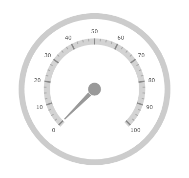
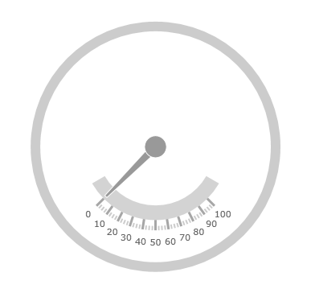

////
|metadata|
{
    "name": "radialgauge-configuring-the-scale",
    "tags": ["Getting Started","How Do I"],
    "controlName": ["{RadialGaugeName}"],
    "guid": "8be0eac7-4e8f-4cc4-9e43-b1fc68d1f353",
    "buildFlags": ["SL","WPF","XAMARIN","ANDROID","WINFORMS"],
    "createdOn": "2014-06-05T19:53:11.9808565Z"
}
|metadata|
////

= スケールの構成 ({RadialGaugeName})

=== 目的

このトピックでは、_{RadialGaugeName}_ コントロールのスケールの概念的な概要を提供します。スケールのプロパティの説明およびスケールの実装方法を例で示します。

=== 前提条件

本トピックの理解を深めるために、以下のトピックを参照することをお勧めします。

[options="header", cols="a,a"]
|====
|トピック|目的

| link:radialgauge.html[{RadialGaugeName}]
|このセクションでは、 _{RadialGaugeName}_™ コントロールおよびその主要機能の概要を説明します。

| link:radialgauge-getting-started-with-radialgauge.html[{RadialGaugeName} の追加]
|このトピックではコード例を使用して、_{RadialGaugeName}_™ コントロールを {PlatformName} アプリケーションに追加する方法を説明します。

|====

=== このトピックの内容

このトピックは、以下のセクションで構成されます。

* <<Overview,スケールの概要>>
* <<Preview,プレビュー>>
* <<Properties,スケールのプロパティ>>
* <<Configuring,スケールの構成>>
* <<RelatedContent,関連コンテンツ>>

[[Overview]]
== スケールの概要

=== スケールの概要

スケールはゲージの値を視覚的に示すために使用され、_{RadialGaugeName}_ コントロールで値の範囲を定義します。目盛と範囲はすべて要素で、スケールに追加できます。

[[Preview]]

=== プレビュー

以下の画像は、スケールを追加した {RadialGaugeName} コントロールのプレビューです。

[[Properties]]
== スケールのプロパティ

=== スケールのプロパティの概要

以下の表で、_{RadialGaugeName}_ コントロールのスケールに関連するプロパティを簡単に説明します。

[options="header", cols="a,a,a"]
|====
|プロパティ名|プロパティ タイプ|説明

| link:{RadialGaugeLink}.{RadialGaugeName}{ApiProp}scalestartextent.html[ScaleStartExtent]
|`Double`
|ゲージの中心から測定される、スケールの開始位置を決定します。このプロパティの値は 0 から 1 の間にする必要があります。 

このプロパティの値を、 link:{RadialGaugeLink}.{RadialGaugeName}{ApiProp}scaleendextent.html[ScaleEndExtent] プロパティよりも大きく設定すると、開始範囲はデフォルト設定されている実際の link:{RadialGaugeLink}.{RadialGaugeName}{ApiProp}scaleendextent.html[ScaleEndExtent] 値に戻ります。

| link:{RadialGaugeLink}.{RadialGaugeName}{ApiProp}scaleendextent.html[ScaleEndExtent]
|`Double`
|ゲージの中心から測定される、スケールの終了位置を決定します。このプロパティの値は 0 から 1 の間にする必要があります。 

このプロパティの値を、 link:{RadialGaugeLink}.{RadialGaugeName}{ApiProp}scalestartextent.html[ScaleStartExtent] プロパティよりも小さく設定すると、終了範囲はデフォルト設定されている実際の link:{RadialGaugeLink}.{RadialGaugeName}{ApiProp}scalestartextent.html[ScaleStartExtent] 値に戻ります。

| link:{RadialGaugeLink}.{RadialGaugeName}{ApiProp}scalestartangle.html[ScaleStartAngle]
|`Double`
|スケールの開始角度を度数で指定します。

| link:{RadialGaugeLink}.{RadialGaugeName}{ApiProp}scaleendangle.html[ScaleEndAngle]
|`Double`
|スケールの終了角度を度数で指定します。

| link:{RadialGaugeLink}.{RadialGaugeName}{ApiProp}scaleoversweep.html[ScaleOversweep]
|`Double`
|スケールが両方向で、開始と終了の値を越えて移動する余分なスペース (度数) の値を指定します。値を 0 より大きい値に設定する必要があります。デフォルト値は 3 です。

| link:{RadialGaugeLink}.{RadialGaugeName}{ApiProp}scalebrush.html[ScaleBrush]
|`Brush`
|スケールの背景の塗りつぶし使用するブラシを指定します。

| link:{RadialGaugeLink}.{RadialGaugeName}{ApiProp}scalesweepdirection.html[ScaleSweepDirection]
|SweepDirection
|スケールの移動を時計周りまたは反時計回りに指定します。

| link:{RadialGaugeLink}.{RadialGaugeName}{ApiProp}scaleoversweepshape.html[ScaleOversweepShape]
| pick:[android,wpf,win-universal=" link:{RadialGaugeLink}.radialgaugescaleoversweepshape.html[RadialGaugeScaleOversweepShape]"] pick:[xamarin=" link:{RadialGaugeLinkBase}.radialgaugescaleoversweepshape.html[RadialGaugeScaleOversweepShape]"] 

|
ifdef::sl,wpf,win-forms,xamarin,win-universal[] 

*Circular* - 図形の終了部分を描く角度を大きくします。

endif::sl,wpf,win-forms,xamarin,win-universal[] 

ifdef::android[] 

*CIRCULAR* - 図形の終了部分を描く角度を大きくします。

endif::android[]

ifdef::sl,wpf,win-forms,xamarin,win-universal[] 

*Fitted* - 外部アークと内部アークの角度を大きくしますが、 link:{RadialGaugeLink}.{RadialGaugeName}{ApiProp}scaleoversweep.html[ScaleOversweep] プロパティが 0 に設定された場合に、スケール図形の接続線を平衡に保持するように内部アークの角度をより大きくします。 

endif::sl,wpf,win-forms,xamarin,win-universal[] 

ifdef::android[] 

*FITTED* - 外部アークと内部アークの角度を大きくしますが、 link:{RadialGaugeLink}.{RadialGaugeName}{ApiProp}scaleoversweep.html[ScaleOversweep] プロパティが 0 に設定された場合に、スケール図形の接続線を平衡に保持するように内部アークの角度をより大きくします。 

endif::android[] 

ifdef::sl,wpf,win-forms,xamarin,win-universal[] 

*Auto* - デフォルト設定の Auto の場合は、背景図形が自動的に決定され、それに応じて link:{RadialGaugeLink}.{RadialGaugeName}{ApiProp}scaleoversweep.html[ScaleOversweep] プロパティを設定します。 

endif::sl,wpf,win-forms,xamarin,win-universal[] 

ifdef::android[] 

*AUTO* - デフォルト設定の Auto の場合は、背景図形が自動的に決定され、それに応じて link:{RadialGaugeLink}.{RadialGaugeName}{ApiProp}scaleoversweep.html[ScaleOversweep] プロパティを設定します。 

endif::android[] 

このプロパティを Circular に設定し、 link:{RadialGaugeLink}.{RadialGaugeName}{ApiProp}backingshape.html[BackingShape] プロパティの値を Fitted に設定した場合は、スケールと背景図形のアークとの間に、目視できるギャップが表示されます。スケールをゲージの背景領域と正しく揃えるには、 link:{RadialGaugeLink}.{RadialGaugeName}{ApiProp}scaleoversweep.html[ScaleOversweep] プロパティと link:{RadialGaugeLink}.{RadialGaugeName}{ApiProp}backingshape.html[BackingShape] プロパティを同じ値に設定する必要があります。

|====

[[Configuring]]
== スケールの構成

=== 例

以下のスクリーンショットは、スケール プロパティを以下のように構成して {RadialGaugeName} を描画する方法を示します。

[options="header", cols="a,a"]
|====
|プロパティ|値

| link:{RadialGaugeLink}.{RadialGaugeName}{ApiProp}scalestartextent.html[ScaleStartExtent]
|0.5

| link:{RadialGaugeLink}.{RadialGaugeName}{ApiProp}scaleendextent.html[ScaleEndExtent]
|0.4

| link:{RadialGaugeLink}.{RadialGaugeName}{ApiProp}scaleoversweep.html[ScaleOversweep]
|15

| link:{RadialGaugeLink}.{RadialGaugeName}{ApiProp}scalesweepdirection.html[ScaleSweepDirection]
|
ifdef::sl,wpf,win-forms,win-universal,xamarin[] 

Counterclockwise 

endif::sl,wpf,win-forms,win-universal,xamarin[] 

ifdef::android[] 

COUNTER_CLOCKWISE 

endif::android[]

|====

以下のコードはこの例を実装します。

ifdef::xaml[]

*XAML の場合:*

[source,xaml]
----
<ig:{RadialGaugeName} x:Name="radialGauge" 
         ScaleBrush="LightGray"
         ScaleStartExtent="0.5" 
         ScaleEndExtent="0.4"
         ScaleOversweep="15"
         ScaleSweepDirection="Counterclockwise"/>
----

endif::xaml[]

ifdef::sl[]

*C# の場合:*

[source,csharp]
----
var radialGauge = new {RadialGaugeName}();
radialGauge.ScaleStartExtent = 0.5;
radialGauge.ScaleEndExtent = 0.4;
radialGauge.ScaleOversweep = 15;
radialGauge.ScaleSweepDirection = SweepDirection.Counterclockwise;
----
endif::sl[]

ifdef::wpf[]

*C# の場合:*

[source,csharp]
----
var radialGauge = new {RadialGaugeName}();
radialGauge.ScaleBrush = new SolidColorBrush(Colors.LightGray);
radialGauge.ScaleStartExtent = 0.5;
radialGauge.ScaleEndExtent = 0.4;
radialGauge.ScaleOversweep = 15;
radialGauge.ScaleSweepDirection = SweepDirection.Counterclockwise;
----

endif::wpf[]

ifdef::win-forms[]

*C# の場合:*

[source,csharp]
----
var radialGauge = new {RadialGaugeName}();
radialGauge.ScaleBrush = new SolidColorBrush(Colors.LightGray);
radialGauge.ScaleStartExtent = 0.5;
radialGauge.ScaleEndExtent = 0.4;
radialGauge.ScaleOversweep = 15;
radialGauge.ScaleSweepDirection = SweepDirection.Counterclockwise;
----

endif::win-forms[]

ifdef::win-universal[]

*C# の場合:*

[source,csharp]
----
var radialGauge = new {RadialGaugeName}();
radialGauge.ScaleBrush = new SolidColorBrush(Color.LightGray);
radialGauge.ScaleStartExtent = 0.5;
radialGauge.ScaleEndExtent = 0.4;
radialGauge.ScaleOversweep = 15;
radialGauge.ScaleSweepDirection = SweepDirection.Counterclockwise;
----
endif::win-universal[]

ifdef::xamarin[]

*C# の場合:*

[source,csharp]
----
var radialGauge = new {RadialGaugeName}();
radialGauge.ScaleBrush = new SolidColorBrush(Color.LightGray);
radialGauge.ScaleStartExtent = 0.5;
radialGauge.ScaleEndExtent = 0.4;
radialGauge.ScaleOversweep = 15;
radialGauge.ScaleSweepDirection = SweepDirection.Counterclockwise;
----

endif::xamarin[]

ifdef::sl[]

*Visual Basic の場合:*

[source,vb]
----
Dim radialGauge As {RadialGaugeName} = New {RadialGaugeName}
radialGauge.ScaleStartExtent = 0.5
radialGauge.ScaleEndExtent = 0.4
radialGauge.ScaleOversweep = 15
radialGauge.ScaleSweepDirection = SweepDirection.Counterclockwise
----

endif::sl[]

ifdef::wpf[]

*Visual Basic の場合:*

[source,vb]
----
Dim radialGauge As {RadialGaugeName} = New {RadialGaugeName}
radialGauge.ScaleBrush = New SolidColorBrush(Colors.LightGray)
radialGauge.ScaleStartExtent = 0.5
radialGauge.ScaleEndExtent = 0.4
radialGauge.ScaleOversweep = 15
radialGauge.ScaleSweepDirection = SweepDirection.Counterclockwise
----

endif::wpf[]

ifdef::win-forms[]

*Visual Basic の場合:*

[source,vb]
----
Dim radialGauge As {RadialGaugeName} = New {RadialGaugeName}
radialGauge.ScaleBrush = New SolidColorBrush(Colors.LightGray)
radialGauge.ScaleStartExtent = 0.5
radialGauge.ScaleEndExtent = 0.4
radialGauge.ScaleOversweep = 15
radialGauge.ScaleSweepDirection = SweepDirection.Counterclockwise
----

endif::win-forms[]

ifdef::win-universal[]

*Visual Basic の場合:*

[source,vb]
----
Dim radialGauge As {RadialGaugeName} = New {RadialGaugeName}
radialGauge.ScaleBrush = New SolidColorBrush(Color.LightGray)
radialGauge.ScaleStartExtent = 0.5
radialGauge.ScaleEndExtent = 0.4
radialGauge.ScaleOversweep = 15
radialGauge.ScaleSweepDirection = SweepDirection.Counterclockwise
----

endif::win-universal[]

ifdef::android[]

*Java の場合:*

[source,js]
----
radialGauge.setScaleStartExtent(.5);
radialGauge.setScaleEndExtent(.4); 
radialGauge.setScaleOversweep(15);
radialGauge.setScaleSweepDirection(SweepDirection.COUNTER_CLOCKWISE);
----

endif::android[]

[[RelatedContent]]
== 関連コンテンツ

このトピックの追加情報については、以下のトピックも合わせてご参照ください。

[options="header", cols="a,a"]
|====
|トピック|目的

| link:radialgauge-getting-started-with-radialgauge.html[{RadialGaugeName} の追加]
|このトピックではコード例を使用して、_{RadialGaugeName}_™ コントロールを {PlatformName} アプリケーションに追加する方法を説明します。

| link:radialgauge-configuring-the-backing.html[背景の構成 ({RadialGaugeName})]
|このトピックでは、_{RadialGaugeName}_™ コントロールのバッキング機能の概念的な概要を提供します。バッキング領域のプロパティについて説明し、実装例を提供します。

| link:radialgauge-configuring-labels.html[ラベルの構成 ({RadialGaugeName})]
|このトピックでは、{RadialGaugeName} コントロールを使用したラベルの概念的な概要を提供します。ラベルのプロパティの説明およびラベルの構成方法を例で示します。

| link:radialgauge-configuring-optical-scaling.html[オプティカル スケーリングの構成 ({RadialGaugeName})]
|このトピックでは、_{RadialGaugeName}_™ コントロールを使用したラベルの概念的な概要を提供します。スケーリングのプロパティについて説明し、設定を構成します。

| link:radialgauge-configuring-needles.html[針の構成 ({RadialGaugeName})]
|このトピックでは、{RadialGaugeName} コントロールを使用した針の概念的な概要を提供します。針のプロパティの説明および針の構成方法を例で示します。

| link:radialgauge-configuring-ranges.html[範囲の構成 ({RadialGaugeName})]
|このトピックでは、{RadialGaugeName} コントロールの範囲の概念的な概要を提供します。範囲のプロパティについて説明し、範囲をラジアル ゲージに追加する方法の例も示します。

| link:radialgauge-configuring-tick-marks.html[目盛の構成 ({RadialGaugeName})]
|このトピックでは、{RadialGaugeName} コントロールを使用した目盛の概念的な概要を提供します。目盛プロパティの説明および目盛の実装方法を例で示します。

|====
