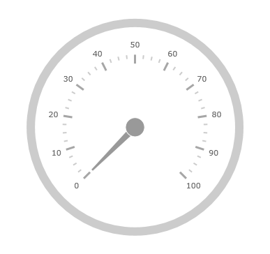

////
|metadata|
{
    "name": "radialgauge-getting-started-with-radialgauge",
    "controlName": ["{RadialGaugeName}"],
    "tags": ["Getting Started","How Do I"],
    "guid": "ea74c1c1-87da-4a46-aaa2-2a2572233abe",
    "buildFlags": ["SL","WPF","XAMARIN","ANDROID","WINFORMS"],
    "createdOn": "2014-06-05T19:53:11.967851Z"
}
|metadata|
////

= {RadialGaugeName} の追加

== トピックの概要

=== 目的

このトピックではコード例を使用して、{RadialGaugeName} コントロールを {PlatformName} アプリケーションに追加する方法を説明します。

=== このトピックの内容

このトピックは、以下のセクションで構成されます。

* <<Adding,{RadialGaugeName} コントロールを {PlatformName} アプリケーションへ追加>>

** <<Introduction,概要>>
** <<Preview,プレビュー>>
** <<Prerequisites,要件>>
** <<Overview,概要>>
** <<Steps,手順>>

* <<RelatedContent,関連コンテンツ>>

[[Adding]]
== {RadialGaugeName} コントロールを {PlatformName} アプリケーションへ追加

[[Introduction]]

=== 概要

以下の手順は、{RadialGaugeName} コントロールを {PlatformName} アプリケーションに追加する方法を示します。

[[Preview]]

=== プレビュー

以下は {RadialGaugeName} の画像です。

[[Prerequisites]]

=== 要件

ifdef::android[]
以下の Infragistics jar 参照をプロジェクトに追加します。

** Infragistics.Gauge.jar
** Infragistics.Core.jar
** Infragistics.UI.jar
** DV.Shared.jar
endif::android[]

ifdef::wpf[]
以下の NuGet パッケージをメイン プロジェクトに追加します。

** Infragistics.WPF.Gauges

NuGet フィードのセットアップと NuGet パッケージの追加の詳細については、link:nuget-feeds.html[NuGet フィード] ドキュメントを参照してください。

endif::wpf[]

ifdef::win-forms[]
以下のアセンブリ参照をプロジェクトに追加します。

** {ApiPlatform}{RadialGaugeAssembly}.{DllVersion}dll
** {ApiPlatform}{DataVizAssembly}.{DllVersion}dll
** {ApiPlatform}Win.Portable.Core.{DllVersion}dll
endif::win-forms[]

ifdef::xamarin[]
link:xamarin-project-with-infragistics-controls.html#NuGetPackages[「NuGet パッケージによって参照を追加」]を参照してください。
endif::xamarin[]

以下の名前空間の参照を追加します。

ifdef::xamarin[]
*XAML の場合:*
[source,xaml]
----
xmlns:ig="clr-namespace:{LinearGaugeNamespace};assembly={ApiPlatform}Gauges"
----
*C# の場合:*
[source,csharp]
----
using Infragistics.XamarinForms.Controls.Gauges;
----
endif::xamarin[]

ifdef::wpf[]
*XAML の場合:*
[source,xaml]
----
xmlns:ig="http://schemas.infragistics.com/xaml"
---- 
*C# の場合:*
[source,csharp]
----
using {RadialGaugeNamespace};
----
*VB の場合:*
[source,vb]
----
Imports {RadialGaugeNamespace}
---- 
endif::wpf[]

ifdef::win-forms[] 
*C# の場合:*
[source,csharp]
----
using {RadialGaugeNamespace}; 
---- 
*VB の場合:*
[source,vb]
----
Imports {RadialGaugeNamespace}
---- 
endif::win-forms[]

ifdef::android[] 
*Java の場合:*
[source,js]
----
import {RadialGaugeNamespace}.{RadialGaugeName};
---- 
endif::android[]

[[Overview]]

=== 概要

以下はプロセスの概要です。

*1.{RadialGaugeName} コントロールを {PlatformName} アプリケーションに追加*

*2.結果の確認*

[[Steps]]

=== 手順

以下では {RadialGaugeName} コントロールをページに追加するために必要な手順を示します。

=== 1.{RadialGaugeName} コントロールをページに追加します。

以下のコードは、表示に必要な最小限のコードとプロパティ設定で {RadialGaugeName} コントロールを追加することを示しています。

ifdef::xaml[]
*XAML の場合:*
[source,xaml]
<ig:XamRadialGauge x:Name="Gauge" />
endif::xaml[]

ifdef::sl,wpf,win-forms,win-universal[]

*Visual Basic の場合:*

ifdef::xaml[]
----
Dim radialGauge As New {RadialGaugeName}()
Me.LayoutRoot.Children.Add(radialGauge)  
----
endif::xaml[]

ifdef::win-forms[]
----
Dim radialGauge As New {RadialGaugeName}()
  Me.Controls.Add(radialGauge)
----
endif::win-forms[]

endif::sl,wpf,win-forms,win-universal[]

ifdef::sl,wpf,win-forms,win-universal,xamarin[]

*C# の場合:*

ifdef::xaml[]
[source, csharp]
var radialGauge = new {RadialGaugeName}();
endif::xaml[]

ifdef::win-forms[]
[source, csharp]
----
var radialGauge = new {RadialGaugeName}();
this.Controls.Add(radialGauge);
----
endif::win-forms[]
endif::sl,wpf,win-forms,win-universal,xamarin[]

ifdef::android[]

*Java の場合:*

[source,js]
----
View rootView = inflater.inflate(R.layout.fragment_main, container, false);
RadialGaugeView radialGauge = new RadialGaugeView(rootView.getContext());
return (radialGauge);
----

endif::android[]

=== 2.結果を確認します。

結果を確認するために、プロジェクトをビルドおよび実行します。手順を正しく実装した場合、{RadialGaugeName} は上記のプレビュー セクションで示したように表示されます。

[[_Ref348111483]]

[[RelatedContent]]

== 関連コンテンツ

このトピックの追加情報については、以下のトピックも合わせてご参照ください。

[options="header", cols="a,a"]
|====
|トピック|目的

| link:radialgauge-configuring-the-backing.html[背景の構成 ({RadialGaugeName})]
|このトピックでは、{RadialGaugeName} コントロールのバッキング機能の概念的な概要を提供します。バッキング領域のプロパティについて説明し、実装例を提供します。

| link:radialgauge-configuring-labels.html[ラベルの構成 ({RadialGaugeName})]
|このトピックでは、{RadialGaugeName} コントロールを使用したラベルの概念的な概要を提供します。ラベルのプロパティの説明およびラベルの構成方法を例で示します。

| link:radialgauge-configuring-optical-scaling.html[オプティカル スケーリングの構成 ({RadialGaugeName})]
|このトピックでは、{RadialGaugeName}™ コントロールを使用したラベルの概念的な概要を提供します。スケーリングのプロパティについて説明し、設定を構成します。

| link:radialgauge-configuring-needles.html[針の構成 ({RadialGaugeName})]
|このトピックでは、{RadialGaugeName} コントロールを使用した針の概念的な概要を提供します。針のプロパティの説明および針の構成方法を例で示します。

| link:radialgauge-configuring-ranges.html[範囲の構成 ({RadialGaugeName})]
|このトピックでは、{RadialGaugeName} コントロールの範囲の概念的な概要を提供します。範囲のプロパティについて説明し、範囲をラジアル ゲージに追加する方法の例も示します。

| link:radialgauge-configuring-the-scale.html[スケールの構成 ({RadialGaugeName})]
|このトピックでは、{RadialGaugeName} コントロールのスケールの概念的な概要を提供します。スケールのプロパティの説明およびスケールの実装方法を例で示します。

| link:radialgauge-configuring-tick-marks.html[目盛の構成 ({RadialGaugeName})]
|このトピックでは、{RadialGaugeName} コントロールを使用した目盛の概念的な概要を提供します。目盛プロパティの説明および目盛の実装方法を例で示します。

|====