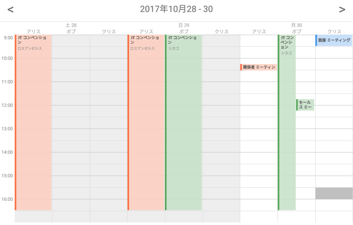
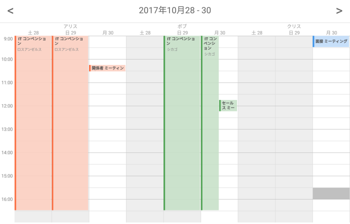

////
|metadata|
{
    "name": "scheduler-activity-grouping",
    "controlName": ["scheduler"],
    "tags": [],
    "guid": "","buildFlags": [],
    "createdOn": "2017-09-13T09:37:02.0484523Z"
}
|metadata|
////

= アクティビティのグループ化 ({SchedulerName})

== 目的

このトピックは、条件に基づいてアクティビティをグループ化する方法を説明します。

== 前提条件

[options="header", cols="a,a"]
|=======
|トピック|目的

|link:scheduler-overview.html[概要 ({SchedulerName})]
|このトピックでは、{SchedulerName} コントロール シリーズの概要を説明します。

|link:scheduler-binding-schedulelistdatasource.html[ScheduleListDataSource へのバインド ({SchedulerName})]
|このトピックでは、コントロールを ScheduleListDataSource を使用してデータ ソースへバインドする方法を説明します。

|link:scheduler-dayview.html[日表示 ({SchedulerName})]
|このトピックは、{SchedulerName} の日表示でデータの表示方法を説明します。

|link:scheduler-weekview.html[週表示 ({SchedulerName})]
|このトピックは、{SchedulerName} の週表示でデータの表示方法を説明します。

|=======

== このトピックの内容

* <<Ref00001, 概要>>
* <<Ref00002, 日付に基づいてグループ化>>
* <<Ref00003, リソースに基づいてグループ化>>
* <<Ref00004, 関連トピック>>

[[Ref00001]]
== 概要

アクティビティのグループ化機能は、日付またはリソースに基づいてアクティビティをグループ化できます。この機能は {SchedulerName} の日表示および週表示にサポートされます。

[[Ref00002]]
== 日付に基づいてグループ化

日付に基づいてアクティビティをグループ化するには、link:{SchedulerXFLink}.xamscheduler~activityGroupingMode.html[ActivityGroupingMode] プロパティを link:{SchedulerCoreLink}.Core.ActivityGroupingMode.html[ResourcesWithinDate] に設定します。

以下のスクリーンショットは、3 日間の範囲表示し、日ごとに利用可能なリソースがすべて表示されます。

[[Ref00003]]
== リソースに基づいてグループ化

リソースに基づいてアクティビティをグループ化するには、link:{SchedulerXFLink}.xamscheduler~activityGroupingMode.html[ActivityGroupingMode] プロパティを link:{SchedulerCoreLink}.Core.ActivityGroupingMode.html[DatesWithinResource] に設定します。

以下のスクリーンショットは、利用可能なリソースをすべて表示し、各リソースに 3 日間の範囲が表示されます。

[[Ref00004]]
== 関連トピック

このトピックに関連する追加情報については、以下のトピックを参照してください。

[options="header", cols="a,a"]
|=======
|トピック|目的

|link:scheduler-agendaview.html[予定一覧 ({SchedulerName})]
|このトピックは、{SchedulerName} の予定一覧でデータの表示方法を説明します。

|link:scheduler-monthview.html[月表示 ({SchedulerName})]
|このトピックは、{SchedulerName} の月表示でデータの表示方法を説明します。

|=======