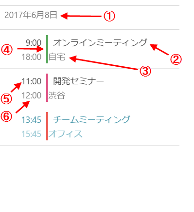

////
|metadata|
{
    "name": "scheduler-agendaview",
    "controlName": ["scheduler"],
    "tags": [],
    "guid": "","buildFlags": [],
    "createdOn": "2017-03-30T09:37:02.0484523Z"
}
|metadata|
////

= 予定一覧 ({SchedulerName})

== 目的

このトピックは、{SchedulerName} の予定一覧でデータの表示方法を説明します。

== 前提条件

[options="header", cols="a,a"]
|=======
|トピック|目的

|link:scheduler-overview.html[概要 ({SchedulerName})]
|このトピックでは、{SchedulerName} コントロール シリーズの概要を説明します。

|link:scheduler-binding-schedulelistdatasource.html[ScheduleListDataSource へのバインド ({SchedulerName})]
|このトピックでは、コントロールを ScheduleListDataSource を使用してデータ ソースへバインドする方法を説明します。

|=======

== このトピックの内容

* <<Ref00001, 概要>>
* <<Ref00002, 構成>>
* <<Ref00003, イベント>>
* <<Ref00004, スタイル設定>>
* <<Ref00005, 関連トピック>>

[[Ref00001]]
== 概要

{SchedulerName} の予定一覧ビューは、指定した時間範囲にあるアクティビティを視覚化します。時間の範囲は link:{SchedulerXFLink}.xamscheduler~agendaviewminimumdate.html[AgendaViewMinimumDate] および link:{SchedulerXFLink}.xamscheduler~agendaviewmaximumdate.html[AgendaViewMaximumDate] プロパティを使用して指定されます。アクティビティの件名、場所、および時間が予定一覧ビューで表示されます。アクティビティに関連付けられたリソースがあり、リソースに色スキーマが設定される場合、この色がアクティビティの時間およびアクティビティの件名の間の垂直セパレーターの描画で使用されます。

以下の画像は、予定一覧ビューおよびその視覚要素を表示します。

. 日ヘッダー
. アクティビティの件名
. アクティビティの場所
. 関連付けられたリソースの色スキーマで描画されるセパレーター
. アクティビティの開始時間 (アクティビティが指定した日で開始する場合)
. アクティビティの終了時間 (アクティビティが指定した日で終了する場合)

[[Ref00002]]
== 構成

以下の表は、予定一覧の構成可能な要素または動作をオプション/メソッドにマップします。

[options="header", cols="a,a,a"]
|=======
|要素|説明|プロパティ / メソッド

|予定一覧の表示状態
|月表示を予定一覧ビューの隣に表示できます。利用可能なスペースが分割されます。
|link:{SchedulerXFLink}.xamscheduler~monthviewagendavisibility.html[MonthViewAgendaVisibility]

|日間のスペース
|予定一覧の日の間のスペースを構成します。
|link:{SchedulerXFLink}.xamscheduler~agendaviewinterdayspacing.html[AgendaViewInterDaySpacing]

|ビューで特定の日を設定
|このメソッドを起動すると、特定の日が予定一覧で表示されることを確認します。
|link:{SchedulerXFLink}.xamscheduler~ensuredayvisibleinagendaview.html[EnsureDayVisibleInAgendaView]

|=======

[[Ref00003]]
== イベント

以下の表は、ユーザー操作をコントロールで発生したイベントにマップします。

[options="header", cols="a,a,a"]
|=======
|ユーザー インタラクション
|説明
|イベント

|アクティビティがタップされました
|月表示または組み合わせた予定一覧でアクティビティのタップで発生します。
|link:{SchedulerXFLink}.xamscheduler~appointmentclicked_ev.html[AppointmentClicked]

|アクティビティが選択されました
|月表示または組み合わせた予定一覧でアクティビティが選択された後に発生します。
|link:{SchedulerXFLink}.xamscheduler~appointmentselected_ev.html[AppointmentSelected]

|=======

[[Ref00004]]
== スタイル設定

予定一覧のフォント、サイズ、色などを構成できます。このビューに構成可能なプロパティが多くありますが、すべての名前が *AgendaView* で始まるため簡単に検索できます。例:

* 前景色と背景色を制御するプロパティは `Brush` 型です。
例: link:{SchedulerXFLink}.xamscheduler~agendaviewbackgroundbrush.html[AgendaViewBackgroundBrush] または link:{SchedulerXFLink}.xamscheduler~agendaviewappointmentsubjecttextbrush.html[AgendaViewAppointmentSubjectTextBrush]。

* フォント サイズを制御するプロパティは `double` 型です。
例: link:{SchedulerXFLink}.xamscheduler~agendaviewappointmentsubjectfontsize.html[AgendaViewAppointmentSubjectFontSize]。

* フォント ファミリを制御するプロパティは `string` 型です。
例: link:{SchedulerXFLink}.xamscheduler~agendaviewappointmentsubjectfontfamily.html[AgendaViewAppointmentSubjectFontFamily]。

* フォント スタイル設定を制御するプロパティは `FontAttributes` 型です。
例: link:{SchedulerXFLink}.xamscheduler~agendaviewappointmentsubjectfontattributes.html[AgendaViewAppointmentSubjectFontAttributes]。

[[Ref00005]]
== 関連トピック

このトピックに関連する追加情報については、以下のトピックを参照してください。

[options="header", cols="a,a"]
|=======
|トピック|目的

|link:scheduler-dayview.html[日表示 ({SchedulerName})]
|このトピックは、{SchedulerName} の日表示でデータの表示方法を説明します。

|link:scheduler-monthview.html[月表示 ({SchedulerName})]
|このトピックは、{SchedulerName} の月表示でデータの表示方法を説明します。

|link:scheduler-weekview.html[週表示 ({SchedulerName})]
|このトピックは、{SchedulerName} の週表示でデータの表示方法を説明します。

|link:scheduler-appointment.html[予定 ({SchedulerName})]
|このトピックは予定アクティビティ型を説明します。

|=======