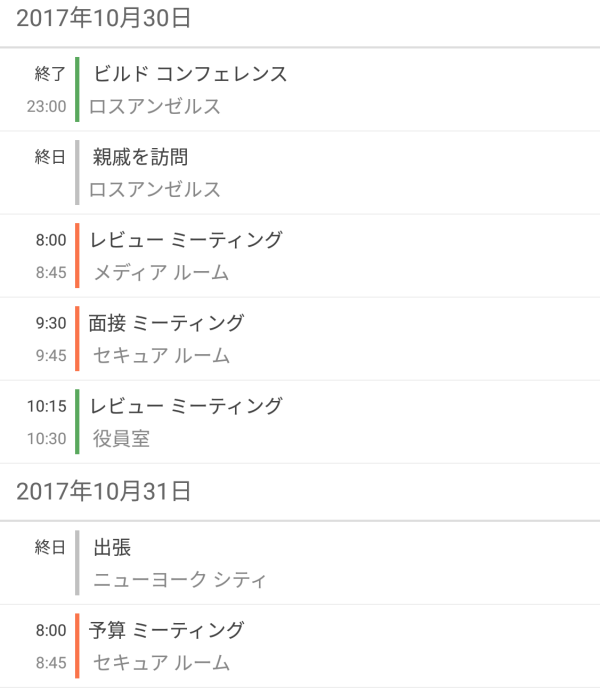
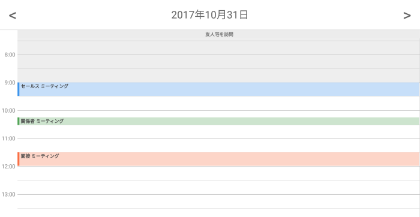
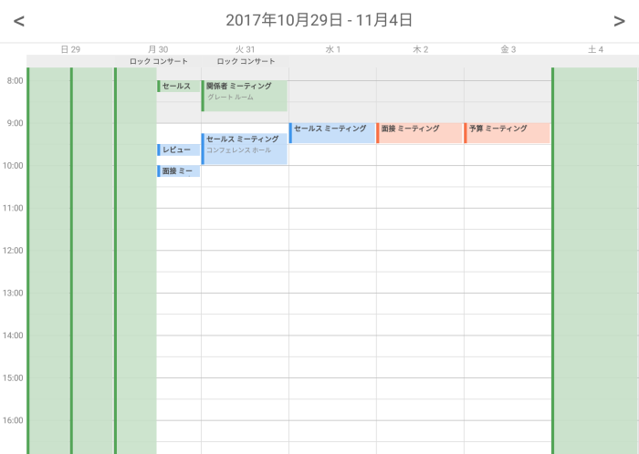

////
|metadata|
{
    "name": "scheduler-all-day-activity",
    "controlName": ["scheduler"],
    "tags": [],
    "guid": "","buildFlags": [],
    "createdOn": "2017-03-30T09:37:02.0484523Z"
}
|metadata|
////

= 終日アクティビティ ({SchedulerName})

== 目的

このトピックは終日のアクティビティ タイプを説明します。

== 前提条件

[options="header", cols="a,a"]
|=======
|トピック|目的

|link:scheduler-overview.html[概要 ({SchedulerName})]
|このトピックでは、{SchedulerName} コントロール シリーズの概要を説明します。

|link:scheduler-binding-schedulelistdatasource.html[ScheduleListDataSource へのバインド ({SchedulerName})]
|このトピックでは、コントロールを ScheduleListDataSource を使用してデータ ソースへバインドする方法を説明します。

|link:scheduler-appointment.html[予定 ({SchedulerName})]
|このトピックは Appointment アクティビティ型を説明します。

|=======

== このトピックの構成

* <<Ref00001, 概要>>
* <<Ref00003, コード例>>
* <<Ref00004, 関連トピック>>

[[Ref00001]]
== 概要

アクティビティが日全体または複数の日をまたがる場合、アクティビティの「終日」機能を使用できます。アクティビティを終日として定義するには、その link:{SchedulerCoreLink}.activitybase~isallDay.html[IsAllDay] プロパティを `true` に設定します。 この場合、アクティビティは開始日付の 00:00 から開始し、終了日以後の日の 00:00 までまたがります。

すべての利用可能な {SchedulerName} ビューは終日のアクティビティをサポートしますが、可視化の方法が異なります。

* 月表示はその他のアクティビティと同じように終日アクティビティを描画します。

* 予定一覧ビューは終日を各日のアクティビティ リストの上に表示し、時間制約スロットで「終日」テキストを表示します。 +

* 日表示はアクティビティの上に特別な終日アクティビティの領域で描画し、時間帯領域に情報がありません。 +

* 週表示はアクティビティの上に特別な終日アクティビティの領域で描画し、時間帯領域に情報がありません。 +

[[Ref00003]]
== コード例

以下のコード例は、アクティビティを「終日」として構成する方法を示します。

*C# の場合:*
[source,csharp]
----
Appointment appointment1 = new Appointment();
appointment1.Subject = "Anniversary";
appointment1.Location = "Restaurant";
appointment1.Start = new DateTime(DateTime.Today.Year, DateTime.Today.Month, DateTime.Today.Day);
appointment1.End = new DateTime(DateTime.Today.Year, DateTime.Today.Month, DateTime.Today.Day);
appointment1.IsAllDay = true;
----

[[Ref00004]]
== 関連トピック

[options="header", cols="a,a"]
|=======
|トピック|目的

|link:scheduler-recurrence.html[定期的なアクティビティ ({SchedulerName})]
|このトピックはアクティビティの繰り返し動作について説明します。

|link:scheduler-resources.html[リソース ({SchedulerName})]
|このトピックは、{SchedulerName} コントロールのリソース概念について説明します。

|=======