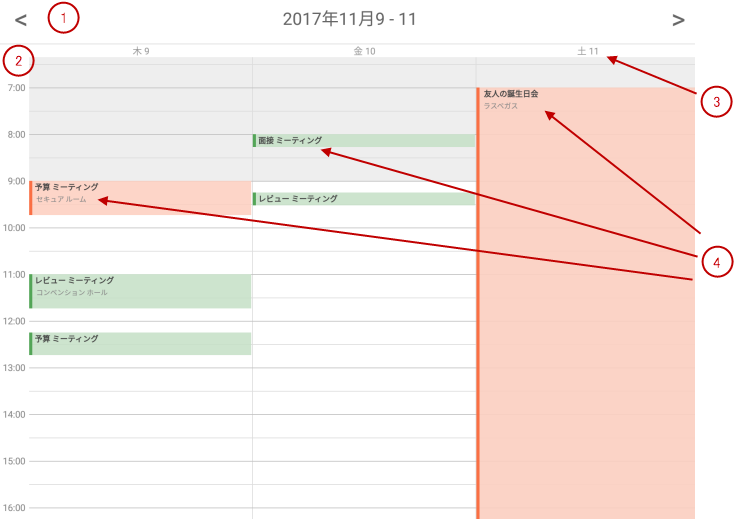

////
|metadata|
{
    "name": "scheduler-dayview",
    "controlName": ["scheduler"],
    "tags": [],
    "guid": "","buildFlags": [],
    "createdOn": "2017-09-13T09:37:02.0484523Z"
}
|metadata|
////

= 日表示 ({SchedulerName})

== 目的

このトピックは、{SchedulerName} の日表示でデータの表示方法を説明します。

== 前提条件

[options="header", cols="a,a"]
|=======
|トピック|目的

|link:scheduler-overview.html[概要 ({SchedulerName})]
|このトピックでは、{SchedulerName} コントロール シリーズの概要を説明します。

|link:scheduler-binding-schedulelistdatasource.html[ScheduleListDataSource へのバインド ({SchedulerName})]
|このトピックでは、コントロールを ScheduleListDataSource を使用してデータ ソースへバインドする方法を説明します。

|=======

== このトピックの内容

* <<Ref00001, 概要>>
* <<Ref00002, 構成>>
* <<Ref00003, イベント>>
* <<Ref00004, スタイル設定>>
* <<Ref00005, 関連トピック>>

[[Ref00001]]
== 概要

{SchedulerName} の日表示は、時間帯の垂直リストで描画してアクティビティを可視化します。時間帯の期間を構成できます。各アクティビティは、開始時間と終了時間の間の時間帯のみ使用します。同じ時間帯に 2 つ以上のアクティビティがある場合、左右に並べて表示されます。

このビューは左右に並べて表示できる 7 日間まで表示できます。日表示の上部分は選択されている日を表示するナビゲーション ヘッダーがあり、ユーザーは以前の日または次の日グループに移動できます。下部分は左に時間帯の時間、右に各日のアクティビティが列で配置されます。

日表示は、24 時間すべてまたは稼働時間のみの表示が構成できます。

以下の画像は 3 日間を表示する日表示を示します。

. ナビゲーション ヘッダー
. 時間帯
. 日ヘッダー
. 時間帯のアクティビティ

[[Ref00002]]
== 構成

以下の表は、日表示の構成可能な要素または動作をオプション/メソッドにマップします。

[options="header", cols="a,a,a"]
|=======
|要素|説明|プロパティ / メソッド

|表示日
|日表示で表示される日数を制御できます。現在 1 日から 7 日間がサポートされます。
|link:{SchedulerXFLink}.xamscheduler~dayviewnumberofdays.html[DayViewNumberOfDays]

|時間帯の期間
|時間帯の期間を構成します。現在 5、6、10、15、30、および 60 分がサポートされます。
|link:{SchedulerXFLink}.xamscheduler~timeslotinterval.html[TimeSlotInterval]

|稼動日および稼働時間
|このビューは稼働時間または 24 時間すべてを表示するために構成できます。
|link:{SchedulerXFLink}.xamscheduler~workinghoursdisplaymode.html[WorkingHoursDisplayMode]

|=======

[[Ref00003]]
== イベント

以下の表は、ユーザー操作をコントロールで発生したイベントにマップします。

[options="header", cols="a,a,a"]
|=======
|ユーザー インタラクション
|説明
|イベント

|アクティビティがタップされました。
|日表示でアクティビティをタップしたときに発生します。
|link:{SchedulerXFLink}.xamscheduler~appointmentclicked_ev.html[AppointmentClicked]

|アクティビティが選択されました。
|日表示でアクティビティを選択した後に発生します。
|link:{SchedulerXFLink}.xamscheduler~appointmentselected_ev.html[AppointmentSelected]

|時間帯が選択されました。
|日表示で時間帯を選択した後に発生します。
|link:{SchedulerXFLink}.xamscheduler~timeslotselected_ev.html[TimeSlotSelected]

|=======

[[Ref00004]]
== スタイル設定

日表示ではフォント、サイズ、色などを詳細に構成できます。このビューに構成可能なプロパティが多くありますが、すべての名前が *DayView* で始まるため簡単に検索できます。例:

* 前景色と背景色を制御するプロパティは `Brush` 型です。 例: link:{SchedulerXFLink}.xamscheduler~dayviewbackgroundbrush.html[DayViewBackgroundBrush] または link:{SchedulerXFLink}.xamscheduler~dayviewappointmentsubjecttextbrush.html[DayViewAppointmentSubjectTextBrush]。

* フォント サイズを制御するプロパティは `double` 型です。 例: link:{SchedulerXFLink}.xamscheduler~dayviewappointmentsubjectfontsize.html[DayViewAppointmentSubjectFontSize]。

* フォント ファミリを制御するプロパティは `string` 型です。 例: link:{SchedulerXFLink}.xamscheduler~dayviewappointmentsubjectfontfamily.html[DayViewAppointmentSubjectFontFamily]。

* フォント スタイル設定を制御するプロパティは `FontAttributes` 型です。 例: link:{SchedulerXFLink}.xamscheduler~dayviewappointmentsubjectfontattributes.html[DayViewAppointmentSubjectFontAttributes]。

[[Ref00005]]
== 関連トピック

このトピックに関連する追加情報については、以下のトピックを参照してください。

[options="header", cols="a,a"]
|=======
|トピック|目的

|link:scheduler-agendaview.html[予定一覧 ({SchedulerName})]
|このトピックは、{SchedulerName} の予定一覧でデータの表示方法を説明します。

|link:scheduler-monthview.html[月表示 ({SchedulerName})]
|このトピックは、{SchedulerName} の月表示でデータの表示方法を説明します。

|link:scheduler-weekview.html[週表示 ({SchedulerName})]
|このトピックは、{SchedulerName} の週表示でデータの表示方法を説明します。

|=======