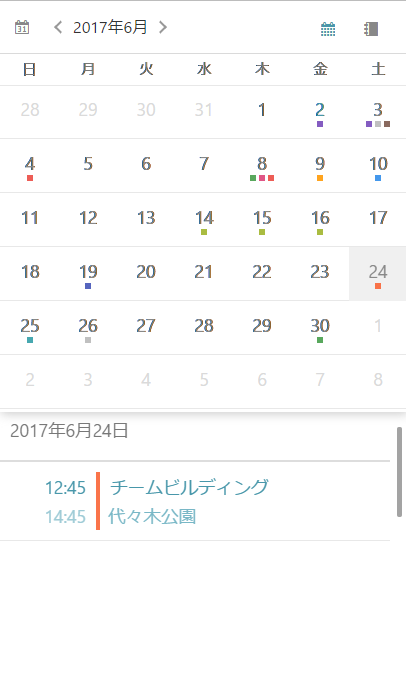

////
|metadata|
{
    "name": "scheduler-getting-started",
    "controlName": ["scheduler"],
    "tags": [],
    "guid": "","buildFlags": [],
    "createdOn": "2017-03-30T09:37:02.0484523Z"
}
|metadata|
////

= {SchedulerName} を使用した作業の開始

== 目的
このトピックでは、{SchedulerName} コントロールを使用して作業を開始する方法に関する情報を提供します。

== 前提条件

[options="header", cols="a,a"]
|=======
|トピック|目的
|link:scheduler-overview.html[概要 ({SchedulerName})]
|このトピックでは、{SchedulerName} コントロール シリーズの概要を説明します。
|=======

== このトピックの構成

* <<Ref00001, 概要>>
* <<Ref00002, 手順>>
* <<Ref00003, 関連トピック>>

[[Ref00001]]
== 概要
以下の手順は、単一の予定を表示する {SchedulerName} をページに追加する方法を説明します。

以下の画像は結果のプレビューです。

[[Ref00002]]
== 手順

ifdef::xamarin[]
. Xamarin.Forms アプリケーション プロジェクトを作成します。

. link:xamarin-project-with-infragistics-controls.html#NuGetPackages[NuGet パッケージで参照を追加します]。

. 新しい Forms コンテンツ ページ XAML を作成します。

. ページの XAML で、以下の名前空間を追加します。
+
*XAML の場合:*
+
[source,xaml]
----
xmlns:igScheduler="clr-namespace:Infragistics.XamarinForms.Controls.Scheduler;assembly=Infragistics.XF.Scheduler"
----

. コンテンツ グリッドで {SchedulerName} の定義を追加します。
+
*XAML の場合:*
+
[source,xaml]
----
<Grid>
    <igScheduler:XamScheduler x:Name="scheduler" />
</Grid>
----

. ページのコードビハインドを開いて以下の名前空間を追加します。
+
*C# の場合:*
+
[source,csharp]
----
using Infragistics.Scheduler;
using Infragistics.XamarinForms.Controls.Scheduler;
----

. {SchedulerName} のアクティビティを生成するプライベート メソッドを作成します。
+
*C# の場合:*
+
[source,csharp]
----
private void PopulateActivities()
{
    DateTime today = DateTime.Now.Date;

    // Create an appointment
    Appointment appointment1 = new Appointment();
    appointment1.Subject = "Team Meeting";
    appointment1.Location = "Conf. Room #3";
    appointment1.Start = new DateTime(today.Year, today.Month, today.Day, 10, 0, 0);
    appointment1.End = new DateTime(today.Year, today.Month, today.Day, 10, 30, 0);
    
    
    // Create a list of appointment
    ObservableCollection<Appointment> appointments = new ObservableCollection<Appointment>();
    appointments.Add(appointment1);

    // Create a ScheduleListDataSource instance
    ScheduleListDataSource dataSource = new ScheduleListDataSource();
    dataSource.AppointmentItemsSource = appointments;

    // Set the data source to the control
    this.scheduler.DataSource = dataSource;
}
----

. 以前の手順で定義されるメソッドをページのコンストラクターで InitializeComponent() 呼び出しの後に起動します。
+
*C# の場合:*
+
[source,csharp]
----
PopulateActivities();
----

. アプリケーションをビルド、配備、および実行します。
endif::xamarin[]

[[Ref00003]]
== 関連トピック

[options="header", cols="a,a"]
|=======
|トピック|目的

|link:scheduler-binding.html[データへのバインド ({SchedulerName})]
|このセクションのトピックでは、{SchedulerName} コントロールでデータを生成する方法を説明します。

|link:scheduler-views.html[ビュー ({SchedulerName})]
|このセクションのトピックは、データを表示する {SchedulerName} コントロールで使用されるビューについての情報を提供します。

|link:scheduler-activities.html[アクティビティ ({SchedulerName})]
|このセクションのトピックでは、{SchedulerName} コントロールのアクティビティ概念について説明します。

|link:scheduler-resources.html[リソース ({SchedulerName})]
|このトピックは、{SchedulerName} コントロールのリソース概念について説明します。

|=======