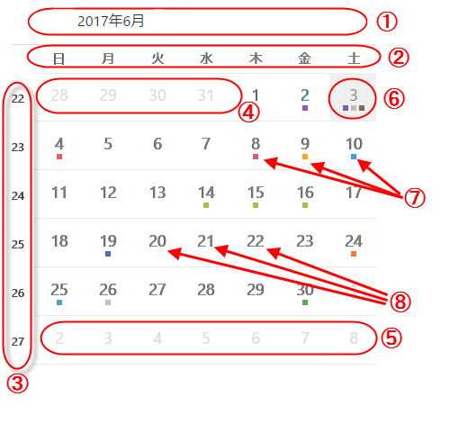
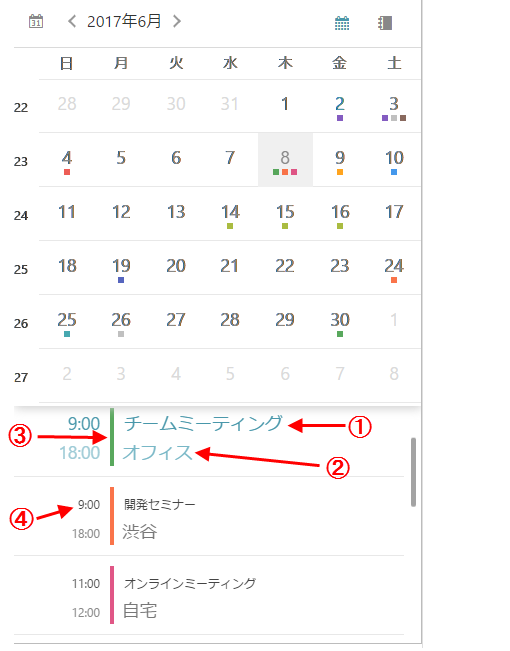

////
|metadata|
{
    "name": "scheduler-monthview",
    "controlName": ["scheduler"],
    "tags": [],
    "guid": "","buildFlags": [],
    "createdOn": "2017-03-30T09:37:02.0484523Z"
}
|metadata|
////

= 月表示 ({SchedulerName})

== 目的

このトピックは、{SchedulerName} の月表示でデータの表示方法を説明します。

== 前提条件

[options="header", cols="a,a"]
|=======
|トピック|目的

|link:scheduler-overview.html[概要 ({SchedulerName})]
|このトピックでは、{SchedulerName} コントロール シリーズの概要を説明します。

|link:scheduler-binding-schedulelistdatasource.html[ScheduleListDataSource へのバインド ({SchedulerName})]
|このトピックでは、コントロールを ScheduleListDataSource を使用してデータ ソースへバインドする方法を説明します。

|=======

== このトピックの構成

* <<Ref00001, 概要>>
* <<Ref00002, 分割モード>>
* <<Ref00003, 構成>>
* <<Ref00004, イベント>>
* <<Ref00005, スタイル設定>>
* <<Ref00006, 関連トピック>>

[[Ref00001]]
== 概要

{SchedulerName} の月表示は月全体の日を可視化します。各日は最大 3 つのアクティビティを含むセルに表示されます。月表示は「選択日」の概念もあります。選択日は別のスタイル設定 (前景色、背景色、フォント サイズ、フォント スタイルなど) で表示されます。初期時では選択した日付がデバイスの現在の時間になりますが、link:{SchedulerXFLink}.xamscheduler~selecteddate.html[SelectedDate] プロパティを使用して選択日を設定または取得できます。

月の日をスワップして月全体をナビゲーションできます。スクロールの方向が link:{SchedulerXFLink}.xamscheduler~monthviewscrolldirection.html[MonthViewScrollDirection] プロパティを使用して構成できます。 link:{SchedulerXFLink}.xamscheduler~minimumdate.html[MinimumDate] および link:{SchedulerXFLink}.xamscheduler~maximumdate.html[MaximumDate] プロパティを使用して定義されるコントロールでアクセス可能な月の範囲。上記のプロパティは任意の順序で設定、あるいは `MinimumDate` プロパティの値を `MaximumDate` の値より大きくするなど非論理的にも設定できます。コントロールが内部で使用される前に日を正規化します。これらの 3 つのプロパティのデフォルトの値は、現在の日から過去 5 年と今後 5 年に及ぶ日付の範囲です。

.注:
[NOTE]
====
Android プラットフォームで稼働日の長い範囲 (100 年より大き範囲) を指定した場合、コントロールのパフォーマンスに影響が出る場合があります。また Android プラットフォームの制限により、範囲の最後で月が任意にクリッピングされる結果となる場合があります。
====

以下の画像は、月表示およびその視覚要素を表示します。

. 月ヘッダー (月および年を含む)
. 曜日ヘッダー
. 週番号
. 先頭日 (以前の月の日)
. 後続日 (次の月の日)
. 現在の日 (別のスタイルで表示)
. アクティビティ インジケーターインジケーターがアクティビティを持つ日で描画されます。描画されるアクティビティ インジケーターの最大数は 3 です。インジケーターは関連リソースの色スキーマを使用して描画されます。
. 現在の月の日

[[Ref00002]]
== 分割モード

コントロールで月を表示する場合に使用するスペースを分割して予定一覧と月表示を一緒に表示できます。予定一覧で現在選択した日またはすべての日のアクティビティを link:{SchedulerXFLink}.xamscheduler~agendaviewappointmentscope.html[AgendaViewAppointmentScope] プロパティに設定した値に基づいて表示します。 予定一覧を月表示の下に描画できます。月表示の右側または非表示にしてスペース全体を使用して月表示することもできます。デフォルトでは、コントロールはサイズに基づいて自動的に 2 つのビューを配置します。

* コントロールの幅が高さより大きい場合、2 つのビューが左右に並べて表示されます。
* コントロールの高さが幅より大きい場合、予定一覧が月表示の下に表示されます。

この自動再配置をオフにするオプションがあり、以下の表のように静的な表示レイアウトを設定できます。

以下のスクリーンショットは、一覧表示と組み合わせた月表示の視覚要素を示します。

. アクティビティの件名
. アクティビティの場所
. このアクティビティと関連付けされたリソースの色
. このアクティビティと関連付けされた開始および終了時間

[[Ref00003]]
== 構成

以下の表は、月表示の構成可能な要素または動作をオプション/メソッドにマップします。

[options="header", cols="a,a,a"]
|=======
|外見/動作
|説明
|プロパティ / メソッド

|アクティビティのプレゼンテーション
|アクティビティがプレーンな長方形 (`SquareIndicator`) または件名 (`ActivitySubject`) を含んで描画するかどうかを選択できます。
|link:{SchedulerXFLink}.xamscheduler~monthviewdaycontentdisplaymode.html[MonthViewDayContentDisplayMode]

|予定一覧の表示状態
|コントロールが予定一覧を月表示と一緒に描画するかどうかを指定できます。
|link:{SchedulerXFLink}.xamscheduler~monthviewagendavisibility.html[MonthViewAgendaVisibility]

|スワイプの方向
|月間の移動で使用するスワイプの方向を構成できます。
|link:{SchedulerXFLink}.xamscheduler~monthviewscrolldirection.html[MonthViewScrollDirection]

|予定一覧のコンテンツ
|予定一覧ビューで選択した日のアクティビティのみを表示するかすべての日のアクティビティを表示するかをカスタマイズできます。
|link:{SchedulerXFLink}.xamscheduler~agendaviewappointmentscope.html[AgendaViewAppointmentScope]

|先頭日
|デフォルトで以前の月の日は非表示ですがこのプロパティを使用して表示を構成できます。
|link:{SchedulerXFLink}.xamscheduler~monthviewleadingdayvisibility.html[MonthViewLeadingDayVisibility]

|後続日
|デフォルトで次の月の日は非表示ですがこのプロパティを使用して表示を構成できます。
|link:{SchedulerXFLink}.xamscheduler~monthviewtrailingdayvisibility.html[MonthViewTrailingDayVisibility]

|曜日ヘッダーの日
|曜日を含むヘッダーを表示または非表示にできます。
|link:{SchedulerXFLink}.xamscheduler~monthviewdayofweekheadervisibility.html[MonthViewDayOfWeekHeaderVisibility]

|週番号
|週番号のある列を表示または非表示にできます。
|link:{SchedulerXFLink}.xamscheduler~monthviewweeknumbervisibility.html[MonthViewWeekNumberVisibility]

|水平セパレーター
|週の間の水平セパレーターを表示または非表示にできます。
|link:{SchedulerXFLink}.xamscheduler~monthviewhorizontalseparatorvisibility.html[MonthViewHorizontalSeparatorVisibility]

|垂直セパレーター
|日の間の垂直セパレーターを表示または非表示にできます。
|link:{SchedulerXFLink}.xamscheduler~monthviewverticalseparatorvisibility.html[MonthViewVerticalSeparatorVisibility]

|予定一覧の配置変更
|予定一覧を月表示の下または右に表示できます。
|link:{SchedulerXFLink}.xamscheduler~viewsplitorientation.html[ViewSplitOrientation]

|予定一覧の動的な配置変更
|表示の縦横比が変更されたときに予定一覧の配置を自動的に変更するかどうかを構成します。
|link:{SchedulerXFLink}.xamscheduler~viewsplitorientationmode.html[ViewSplitOrientationMode]

|特定の日をビューへ移動
|このメソッドを呼び出して指定した日が月表示で表示します。
|link:{SchedulerXFLink}.xamscheduler~ensuredayvisibleinmonthview.html[EnsureDayVisibleInMonthView]

|特定の日をビューへ移動
|このメソッドを呼び出して指定した月が月表示で表示します。
|link:{SchedulerXFLink}.xamscheduler~ensuremonthvisibleinmonthview.html[EnsureMonthVisibleInMonthView]

|=======

[[Ref00004]]
== イベント

以下の表は、ユーザー操作をコントロールで発生したイベントにマップします。

[options="header", cols="a,a,a"]
|=======
|ユーザー インタラクション
|説明
|イベント

|日付が選択されました
|月表示の選択した日が変更されたときに発生します。
|link:{SchedulerXFLink}.xamscheduler~selecteddatechanged_ev.html[SelectedDateChanged]

|アクティビティがタップされました
|月表示または組み合わせた予定一覧でアクティビティのタップで発生します。
|link:{SchedulerXFLink}.xamscheduler~appointmentclicked_ev.html[AppointmentClicked]

|アクティビティが選択されました
|月表示または組み合わせた予定一覧でアクティビティが選択された後に発生します。
|link:{SchedulerXFLink}.xamscheduler~appointmentselected_ev.html[AppointmentSelected]

|月ヘッダーがタップされました
|月ヘッダーがタップされたときに発生します。
|link:{SchedulerXFLink}.xamscheduler~monthheaderclicked_ev.html[MonthHeaderClicked]

|日がタップされました
|日がタップされたときに発生します。
|link:{SchedulerXFLink}.xamscheduler~dayclicked_ev.html[DayClicked]

|曜日ヘッダーがタップされました
|曜日ヘッダーをクリックすると発生します。
|link:{SchedulerXFLink}.xamscheduler~dayofweekheaderclicked_ev.html[DayOfWeekHeaderClicked]

|週番号がタップされました
|週番号がタップされたときに発生します。
|link:{SchedulerXFLink}.xamscheduler~weeknumberclicked_ev.html[WeekNumberClicked]

|=======

[[Ref00005]]
== スタイル設定

月表示ではフォント、サイズ、色などを詳細に構成できます。このビューに構成可能なプロパティが多くありますが、すべての名前が *MonthView* で始まるため簡単に検索できます。例:

* 前景色と背景色を制御するプロパティは `Brush` 型です。
例: link:{SchedulerXFLink}.xamscheduler~monthviewbackgroundbrush.html[MonthViewBackgroundBrush] または link:{SchedulerXFLink}.xamscheduler~monthviewdayofweekheadertextbrush.html[MonthViewDayOfWeekHeaderTextBrush]。

* フォント サイズを制御するプロパティは `double` 型です。
例: link:{SchedulerXFLink}.xamscheduler~monthviewdayfontsize.html[MonthViewDayFontSize]。

* フォント ファミリを制御するプロパティは `string` 型です。
例: link:{SchedulerXFLink}.xamscheduler~monthviewdayfontfamily.html[MonthViewDayFontFamily]。

* フォント スタイル設定を制御するプロパティは `FontAttributes` 型です。
例: link:{SchedulerXFLink}.xamscheduler~monthviewdayfontattributes.html[MonthViewDayFontAttributes]。

[[Ref00006]]
== 関連トピック

このトピックに関連する追加情報については、以下のトピックを参照してください。

[options="header", cols="a,a"]
|=======
|トピック|目的

|link:scheduler-agendaview.html[予定一覧 ({SchedulerName})]
|このトピックは、{SchedulerName} の予定一覧でデータの表示方法を説明します。

|link:scheduler-dayview.html[日表示 ({SchedulerName})]
|このトピックは、{SchedulerName} の日表示でデータの表示方法を説明します。

|link:scheduler-weekview.html[週表示 ({SchedulerName})]
|このトピックは、{SchedulerName} の週表示でデータの表示方法を説明します。

|link:scheduler-appointment.html[予定 ({SchedulerName})]
|このトピックは予定アクティビティ型を説明します。

|=======