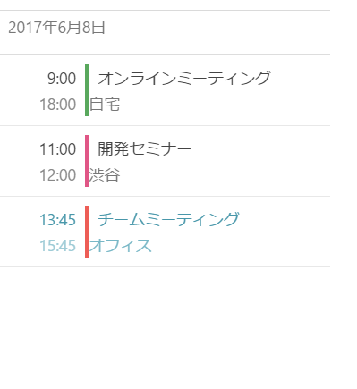

////
|metadata|
{
    "name": "scheduler-overview",
    "controlName": ["scheduler"],
    "tags": [],
    "guid": "","buildFlags": [],
    "createdOn": "2017-03-30T09:37:02.0484523Z"
}
|metadata|
////

= 概要 ({SchedulerName})

{SchedulerName} コントロールは、時間範囲および関連アクティビティを表示し、管理するスケジュール ソリューションを提供します。

コントロール自体は、異なるビューの表示の構成が可能な link:{SchedulerXFLink}.xamscheduler.html[{SchedulerClassName}] クラスによって表されます。ビューは link:{SchedulerCoreLink}.core.schedulerviewmode.html[SchedulerViewMode] タイプの値に設定した link:{SchedulerXFLink}.xamscheduler~viewmode.html[ViewMode] プロパティを使用して切り替えます。デフォルトでコントロールは月表示と選択した日の予定のみを示す統合された予定一覧を描画します。

以下のスクリーンショットはコントロールで提供されるビューを示します。

[cols="a,a"]
|=======
| *月表示* (予定一覧セクションのオプション付き)
| *予定一覧*
| image:images/Scheduler_01.png[]
| 
|=======

各表示についてはlink:scheduler-views.html[ビュー]セクションに示します。

以下のトピックは、コントロールを使用した作業の開始で必要となる基本的な情報を提供します。

== 関連トピック

[options="header", cols="a,a"]
|=======
|トピック|目的

|link:scheduler-getting-started.html[{SchedulerName} を使用した作業の開始]
|このトピックでは、{SchedulerName} コントロールを使用して作業を開始する方法に関する情報を提供します。

|link:scheduler-binding.html[データへのバインド ({SchedulerName})]
|このセクションのトピックでは、{SchedulerName} コントロールでデータを生成する方法を説明します。

|link:scheduler-views.html[ビュー ({SchedulerName})]
|このセクションのトピックは、データを表示する {SchedulerName} コントロールで使用されるビューについての情報を提供します。

|link:scheduler-activities.html[アクティビティ ({SchedulerName})]
|このセクションのトピックでは、{SchedulerName} コントロールのアクティビティ概念について説明します。

|link:scheduler-resources.html[リソース ({SchedulerName})]
|このトピックは、{SchedulerName} コントロールのリソース概念について説明します。

|=======