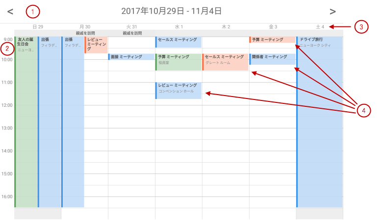

////
|metadata|
{
    "name": "scheduler-weekview",
    "controlName": ["scheduler"],
    "tags": [],
    "guid": "","buildFlags": [],
    "createdOn": "2017-09-13T09:37:02.0484523Z"
}
|metadata|
////

= 週表示 ({SchedulerName})

== 目的

このトピックは、{SchedulerName} の週表示でデータの表示方法を説明します。

== 前提条件

[options="header", cols="a,a"]
|=======
|トピック|目的

|link:scheduler-overview.html[概要 ({SchedulerName})]
|このトピックでは、{SchedulerName} コントロール シリーズの概要を説明します。

|link:scheduler-binding-schedulelistdatasource.html[ScheduleListDataSource へのバインド ({SchedulerName})]
|このトピックでは、コントロールを ScheduleListDataSource を使用してデータ ソースへバインドする方法を説明します。

|link:scheduler-dayview.html[日表示 ({SchedulerName})]
|このトピックは、{SchedulerName} の日表示でデータの表示方法を説明します。

|=======

== このトピックの内容

* <<Ref00001, 概要>>
* <<Ref00002, 構成>>
* <<Ref00003, イベント>>
* <<Ref00004, スタイル設定>>
* <<Ref00005, 関連トピック>>

[[Ref00001]]
== 概要

日表示と同じように、{SchedulerName} の週表示は、時間帯の垂直リストで描画してアクティビティを可視化します。ビューですべての 7 日または稼動日のみを表示するために構成できます。

週表示をすべての 24 時間または稼働時間のみを表示するために構成できます。

以下の画像は、週表示およびその視覚要素を表示します。

. ナビゲーション ヘッダー
. 時間帯
. 日ヘッダー
. 時間帯のアクティビティ

[[Ref00002]]
== 構成

以下の表は、週表示の構成可能な要素または動作をオプション/メソッドにマップします。

[options="header", cols="a,a,a"]
|=======
|要素|説明|プロパティ / メソッド

|表示モード
|週表示はすべての 7 日または稼動日として構成される日のみを表示できます。
|link:{SchedulerXFLink}.xamscheduler~weekviewdisplaymode.html[WeekViewDisplayMode]

|時間帯の期間
|時間帯の期間を構成します。現在 5、6、10、15、30、および 60 分がサポートされます。
|link:{SchedulerXFLink}.xamscheduler~timeslotinterval.html[TimeSlotInterval]

|稼動日および稼働時間
|このビューを稼働時間またはすべての 24 時間を表示するために構成できます。
|link:{SchedulerXFLink}.xamscheduler~workinghoursdisplaymode.html[WorkingHoursDisplayMode]

|=======

[[Ref00003]]
== イベント

以下の表は、ユーザー操作をコントロールで発生したイベントにマップします。

[options="header", cols="a,a,a"]
|=======
|ユーザー インタラクション
|説明
|イベント

|週番号がクリックされました
|週表示で週番号をタップしたときに発生します。
|link:{SchedulerXFLink}.xamscheduler~weeknumberclicked_ev.html[WeekNumberClicked]

|=======

[[Ref00004]]
== スタイル設定

週表示のスタイル設定は日表示と同様です。週表示の背景は link:{SchedulerXFLink}.xamscheduler~weekviewbackgroundbrush.html[WeekViewBackgroundBrush] プロパティで変更できます。週表示はlink:scheduler-dayview#Ref00004[日表示のスタイル設定プロパティ]を使用してカスタマイズできます。

[[Ref00005]]
== 関連トピック

このトピックに関連する追加情報については、以下のトピックを参照してください。

[options="header", cols="a,a"]
|=======
|トピック|目的

|link:scheduler-agendaview.html[予定一覧 ({SchedulerName})]
|このトピックは、{SchedulerName} の予定一覧でデータの表示方法を説明します。

|link:scheduler-monthview.html[月表示 ({SchedulerName})]
|このトピックは、{SchedulerName} の月表示でデータの表示方法を説明します。

|link:scheduler-appointment.html[予定 ({SchedulerName})]
|このトピックは予定アクティビティ型を説明します。

|=======