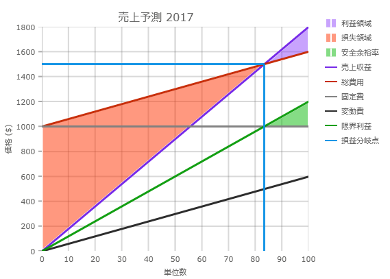

= {ShapeChartName} で損益分岐点データのバインド

このトピックではコード例を使用して、link:{ShapeChartLink}.{ShapeChartName}.html[{ShapeChartName}] コントロールで損益分岐点データにバインドする方法を説明します。

=== 前提条件
 
本トピックの理解を深めるために、以下のトピックを参照することをお勧めします。
|====
|トピック|目的

|link:shapechart-overview.html[{ShapeChartName} の概要]
|このトピックは、主要機能、最小要件およびユーザー機能性など、{ShapeChartName} コントロールの概念的な情報を提供します。

|link:shapechart-getting-started-with-shapechart.html[{ShapeChartName} を使用した作業の開始]
|このトピックでは、データを {ShapeChartName} コントロールにバインドする方法を説明します。

|====

=== このトピックの内容

* <<Overview, 概要>>
* <<Preview, プレビュー>>
* <<CodeExample, コード例>>
* <<RelatedContent, 関連コンテンツ>>

[[Overview]]
== 概要

{ShapeChartName} コントロールは損益分岐点データへのバインドをサポートします。バインドするために、FixedCost、VariableCost、Revenue、および Units と呼ばれる 4 つの `double` プロパティを持つ 1 つ以上のデータ項目が必要です。MarginalProfit と呼ばれる `double` プロパティをオプションに追加してプロットできます。販売単位数を指定し、特定の価格で購入して特定の価格で販売する損益分岐点の会計を可視化できます。 

プロットされた場合、{ShapeChartName} コントロールは Y 軸に Revenue プロパティでビューを描画、そして X 軸に Units プロパティを描画して 2 つの関係を示すリニア会計ビューを生成します。各必須プロパティのためのシリーズを含みます。

総費用、損益分岐点、および限界利益 (オプション) のリニア ビューが生成され、利益領域、損失領域、および限界領域 (オプション) のエリア ビューが生成されます。

=== プレビュー

以下の画像は、損益分岐点データにバインドされる {ShapeChartName} コントロールのプレビューです。

[[CodeExample]]
== コード例

以下のコード例は、{ShapeChartName} コントロールで上記画像のようなチャートを作成する方法を紹介します。この損益分岐点データ項目を使用します。

*C# の場合:*
[source, csharp]
----
public class BreakEvenItem
{
    public BreakEvenItem()
    {
        MarginalProfit = double.NaN;
        VariableCost = double.NaN;
        FixedCost = double.NaN;
        Revenue = double.NaN;
        Units = double.NaN;
    }

    public double FixedCost { get; set; }
    public double VariableCost { get; set; }
    public double Revenue { get; set; }
    public double Units { get; set; }
    public double MarginalProfit { get; set; }    
}

public class BreakEvenList : List<BreakEvenItem>
{
    public BreakEvenList()
    {
                   
    }
}
----

*XAML の場合:*
[source, xaml]
----
<Grid x:Name="layoutRoot">
    <Grid.ColumnDefinitions>
        <ColumnDefinition Width="*"/>
        <ColumnDefinition Width="Auto"/>
    </Grid.ColumnDefinitions>

    <ig:{ShapeChartName} Legend="{Binding ElementName=Legend}" 
                      Brushes="#6E7F2AFA #80FF3100 #7B02B602 #F67222E7 #F4C62600 #F9808080 #F9282828 #EE029802 #EE078FE4"
                      Thickness="3"
                      YAxisTitle="Price ($)"
                      XAxisTitle="Number of Units"
                      Title="Projected Sales">
            <ig:{ShapeChartName}.ItemsSource>
                <local:BreakEvenList>
                    <local:BreakEvenItem FixedCost="1000" VariableCost="600" Revenue="1800" Units="100" />
                </local:BreakEvenList>
            </ig:{ShapeChartName}.ItemsSource>
        </ig:{ShapeChartName}>

        <ig:{LegendName} x:Name="Legend"
                   Content="Legend"
                   Grid.Column="1" />
                   
</Grid>
----

*C# の場合:*
[source, csharp]
----
public MainWindow()
{
    InitializeComponent();

    var shapeChart = new {ShapeChartName}();
    var legend = new {LegendName}() { Content = "Legend" };

    var data = new BreakEvenList();
    var item = new BreakEvenItem() { FixedCost = 1000, VariableCost = 600, Revenue = 1800, Units = 100 };

    data.Add(item);

    shapeChart.ItemsSource = data;
    shapeChart.Legend = legend;
    shapeChart.Thickness = 3;
    shapeChart.YAxisTitle = "Price ($)";
    shapeChart.XAxisTitle = "Number of Units";
    shapeChart.Title = "ShapeChart with BreakEvenData";
    shapeChart.Brushes = this.GetBrushCollection();

    Grid.SetColumn(legend, 1);

    layoutRoot.Children.Add(shapeChart);
    layoutRoot.Children.Add(legend);
}

private BrushCollection GetBrushCollection()
{
    var brushes = new BrushCollection();
    brushes.Add(new SolidColorBrush(Color.FromArgb(110, 127, 42, 250)));
    brushes.Add(new SolidColorBrush(Color.FromArgb(128, 255, 49, 0)));
    brushes.Add(new SolidColorBrush(Color.FromArgb(123, 2, 182, 2)));
    brushes.Add(new SolidColorBrush(Color.FromArgb(246, 114, 34, 231)));
    brushes.Add(new SolidColorBrush(Color.FromArgb(244, 198, 38, 0)));
    brushes.Add(new SolidColorBrush(Color.FromArgb(249, 128, 128, 128)));
    brushes.Add(new SolidColorBrush(Color.FromArgb(249, 40, 40, 40)));
    brushes.Add(new SolidColorBrush(Color.FromArgb(238, 2, 152, 2)));
    brushes.Add(new SolidColorBrush(Color.FromArgb(238, 7, 143, 228)));
    return brushes;
}      
----

ifdef::wpf[]
*VB の場合：*
[source, vb]
----

Public Sub New()
	InitializeComponent()

	Dim shapeChart = New {ShapeChartName}()
	Dim legend = New {LegendName}() With
	{
		.Content = "Legend"
	}

	Dim data = New BreakEvenList()
	Dim item = New BreakEvenItem() With {
		.FixedCost = 1000,
		.VariableCost = 600,
		.Revenue = 1800,
		.Units = 100
	}

	data.Add(item)

	shapeChart.ItemsSource = data
	shapeChart.Legend = legend
	shapeChart.Thickness = 3
	shapeChart.YAxisTitle = "Price ($)"
	shapeChart.XAxisTitle = "Number of Units"
	shapeChart.Title = "ShapeChart with BreakEvenData"
	shapeChart.Brushes = Me.GetBrushCollection()

	Grid.SetColumn(legend, 1)

	layoutRoot.Children.Add(shapeChart)
	layoutRoot.Children.Add(legend)
End Sub

Private Function GetBrushCollection() As BrushCollection
	Dim brushes = New BrushCollection()
	brushes.Add(New SolidColorBrush(Color.FromArgb(110, 127, 42, 250)))
	brushes.Add(New SolidColorBrush(Color.FromArgb(128, 255, 49, 0)))
	brushes.Add(New SolidColorBrush(Color.FromArgb(123, 2, 182, 2)))
	brushes.Add(New SolidColorBrush(Color.FromArgb(246, 114, 34, 231)))
	brushes.Add(New SolidColorBrush(Color.FromArgb(244, 198, 38, 0)))
	brushes.Add(New SolidColorBrush(Color.FromArgb(249, 128, 128, 128)))
	brushes.Add(New SolidColorBrush(Color.FromArgb(249, 40, 40, 40)))
	brushes.Add(New SolidColorBrush(Color.FromArgb(238, 2, 152, 2)))
	brushes.Add(New SolidColorBrush(Color.FromArgb(238, 7, 143, 228)))
	Return brushes
End Function
----

endif::wpf[]

[[RelatedContent]]
== 関連コンテンツ
* link:shapechart-binding-to-shapefile-data.html[シェープ ファイル データにバインド]
* link:shapechart-using-legend.html[凡例の使用]