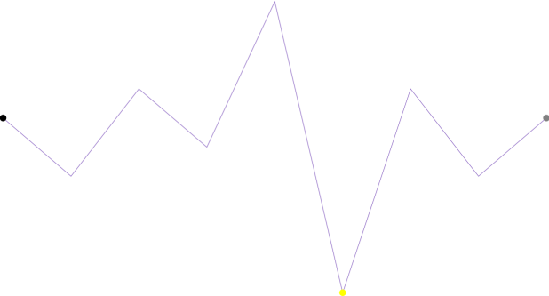

////
|metadata|
{
    "name": "sparkline-configuring-markers",
    "controlName": ["{SparklineName}"],
    "tags": ["Charting","How Do I","Layouts"],
    "guid": "bd81f107-75b4-4b4f-aad4-49273427ea9c",
    "buildFlags": [],
    "createdOn": "2016-05-25T18:21:59.2103536Z"
}
|metadata|
////

= マーカーの構成

== トピックの概要

=== 目的

このトピックは、コード例を示して、 link:{ApiPlatform}{SparklineAssembly}.html[{SparklineName}]™ コントロールのマーカーを構成し、カスタマイズする方法を説明します。

=== 前提条件

以下の表に、このトピックを理解するための前提条件として求められるトピックをリストします。

[options="header", cols="a,a"]
|====
|トピック|目的

| link:sparkline-sparkline-overview.html[{SparklineName} の概要]
|このトピックは、 _{SparklineName}_ コントロールの概要、その利点、およびサポートされるチャート タイプを提供します。

| link:sparkline-configuring-sparkline.html[{SparklineName} の構成]
|このトピックは、 _{SparklineName}_ コントロールを構成するあらゆる方法の概要について説明します。構成の詳細情報へのリンク (別のトピックで参照可能) も記載されています。

| link:sparkline-defining-markers.html[マーカーの定義]
|このトピックは、コード例を示して、 _{SparklineName}_ コントロールのマーカーを定義する方法を説明します。

|====

=== 本トピックの内容

* <<_Ref317083829,マーカーの構成 - 概念的概要>>

** <<_Ref317161385,概要>>
** <<Property_Settings,プロパティ設定>>

* <<_Ref319939969,マーカーの構成 - コード例>>

** <<Description,説明>>
** <<_Ref319940027,プレビュー>>
** <<_Ref319940034,プロパティ設定>>
** <<_Ref319940040,コード>>

* <<_Ref317161501,関連コンテンツ>>

[[_Ref317083829]]
== マーカーの構成 - 概念的概要

[[_Ref317161385]]

=== 概要

link:sparkline-defining-markers.html[マーカーの定義] のトピックで説明しているように、マーカーはスパークラインの上に重なり合ったシンボル (色が付いた円形のアイコン) で、X/Y 座標に基づいて個々のデータ ポイントを示します。

マーカーは、自分好みの外観にするようカスタマイズできます。既定では、マーカーは表示するよう設定されていません。マーカーを表示するには、以下のように visibility プロパティを  _Visible_   に設定する必要があります。`MarkerVisibility="Visible"` 

マーカーは、以下の点で構成できます。

* ブラシ
* サイズ

[[Property_Settings]]

=== プロパティ設定

以下の表は、構成作業と対応するマーカーのプロパティ設定の関係を示しています。

[options="header", cols="a,a,a"]
|====
|以下を行うために:|プロパティ|次に設定

|[[_Hlk319427977]] 

マーカーの色を変更する
| link:{SparklineLink}.{SparklineName}{ApiProp}markerbrush.html[MarkerBrush]
|ブラシ値

|マーカーの色を変更する
| link:{SparklineLink}.{SparklineName}{ApiProp}markersize.html[MarkerSize]
|目的の数値

|====

[[_Ref319939969]]
== マーカーの構成 - コード例

[[Description]]

=== 説明

以下のコードは、最初、最後、および負の各マーカーを構成する方法を示しています。

[[_Ref319940027]]

=== プレビュー

[[_Ref319940034]]

=== プロパティ設定

[options="header", cols="a,a"]
|====
|プロパティ|設定

| link:{SparklineLink}.{SparklineName}{ApiProp}firstmarkervisibility.html[FirstMarkerVisibility]
| _Visible_ 

| link:{SparklineLink}.{SparklineName}{ApiProp}lastmarkervisibility.html[LastMarkerVisibility]
| _Visible_ 

| link:{SparklineLink}.{SparklineName}{ApiProp}negativemarkervisibility.html[NegativeMarkerVisibility]
| _Visible_ 

| link:{SparklineLink}.{SparklineName}{ApiProp}firstmarkersize.html[FirstMarkerSize]
|15

| link:{SparklineLink}.{SparklineName}{ApiProp}lastmarkersize.html[LastMarkerSize]
|15

| link:{SparklineLink}.{SparklineName}{ApiProp}negativemarkersize.html[NegativeMarkerSize]
|15

| link:{SparklineLink}.{SparklineName}{ApiProp}firstmarkerbrush.html[FirstMarkerBrush]
| _Black_ 

| link:{SparklineLink}.{SparklineName}{ApiProp}lastmarkerbrush.html[LastMarkerBrush]
| _Grey_ 

| link:{SparklineLink}.{SparklineName}{ApiProp}negativemarkerbrush.html[NegativeMarkerBrush]
| _Yellow_ 

|====

[[_Ref319940040]]

=== コード

ifdef::sl,wpf,win-phone,win-universal,xamarin[]

*XAML の場合:*

[source,xaml]
----
<ig:XamSparkline x:Name="xamSparkline1" ItemsSource="{StaticResource DataSource}"
    ValueMemberPath="Value"
    DisplayType="Line"
    NegativeMarkerVisibility="Visible"
    NegativeMarkerSize="15"
    NegativeMarkerBrush="#FFFF00"
    FirstMarkerVisibility="Visible"
    FirstMarkerSize="15"
    FirstMarkerBrush="#000000"
    LastMarkerVisibility="Visible"
    LastMarkerSize="15"
    LastMarkerBrush="#808080">
</ig:XamSparkline>
----

endif::sl,wpf,win-phone,win-universal,xamarin[]

ifdef::win-forms[]

*C# の場合:*
[source,csharp]
----
this.ultraSparkline2.DataSource = new TestData();
this.ultraSparkline2.ValueMemberPath = "Value";
this.ultraSparkline2.DisplayType = Infragistics.Win.DataVisualization.SparklineDisplayType.Line;
this.ultraSparkline2.NegativeMarkerVisibility = Infragistics.Portable.Components.UI.Visibility.Visible;
this.ultraSparkline2.NegativeMarkerSize = 15;
this.ultraSparkline2.NegativeMarkerBrush = System.Drawing.Color.FromArgb(255,255,255,0);
this.ultraSparkline2.FirstMarkerVisibility = Infragistics.Portable.Components.UI.Visibility.Visible;
this.ultraSparkline2.FirstMarkerSize = 15;
this.ultraSparkline2.FirstMarkerBrush = System.Drawing.Color.FromArgb(255, 0, 0, 0);
this.ultraSparkline2.LastMarkerVisibility = Infragistics.Portable.Components.UI.Visibility.Visible;
this.ultraSparkline2.LastMarkerSize = 15;
this.ultraSparkline2.LastMarkerBrush = System.Drawing.Color.FromArgb(255, 128, 128, 128);
----

*Visual Basic の場合:*
[source,vb]
----
Me.ultraSparkline2.DataSource = new TestData()
Me.ultraSparkline2.ValueMemberPath = "Value"
Me.ultraSparkline2.DisplayType = Infragistics.Win.DataVisualization.SparklineDisplayType.Line
Me.ultraSparkline2.NegativeMarkerVisibility = Infragistics.Portable.Components.UI.Visibility.Visible
Me.ultraSparkline2.NegativeMarkerSize = 15
Me.ultraSparkline2.NegativeMarkerBrush = System.Drawing.Color.FromArgb(255,255,255,0)
Me.ultraSparkline2.FirstMarkerVisibility = Infragistics.Portable.Components.UI.Visibility.Visible
Me.ultraSparkline2.FirstMarkerSize = 15
Me.ultraSparkline2.FirstMarkerBrush = System.Drawing.Color.FromArgb(255, 0, 0, 0)
Me.ultraSparkline2.LastMarkerVisibility = Infragistics.Portable.Components.UI.Visibility.Visible
Me.ultraSparkline2.LastMarkerSize = 15
Me.ultraSparkline2.LastMarkerBrush = System.Drawing.Color.FromArgb(255, 128, 128, 128)
----

endif::win-forms[]

[[_Ref317161501]]
== 関連コンテンツ

=== トピック

以下のトピックでは、このトピックに関連する情報を提供しています。

[options="header", cols="a,a"]
|====
|トピック|目的

| link:sparkline-sparkline-overview.html[{SparklineName} の概要]
|このトピックは、 _{SparklineName}_ コントロールの概要、その利点、およびサポートされるチャート タイプを提供します。

| link:sparkline-configuring-sparkline.html[{SparklineName} の構成]
|このトピックは、 _{SparklineName}_ コントロールを構成するあらゆる方法の概要について説明します。構成の詳細情報へのリンク (別のトピックで参照可能) も記載されています。

| link:sparkline-sparkline-property-reference.html[{SparklineName} プロパティ参照]
|このトピックは、 _{SparklineName}_ コントロールの主なプロパティを説明します。

|====