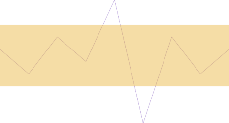

////
|metadata|
{
    "name": "sparkline-configuring-the-normal-range",
    "controlName": ["{SparklineName}"],
    "tags": ["Charting","How Do I","Layouts"],
    "guid": "52797b6e-1ae8-430f-ab9f-05e25d553ff1",
    "buildFlags": [],
    "createdOn": "2016-05-25T18:21:59.2173546Z"
}
|metadata|
////

= 標準範囲の構成

== トピックの概要

=== 目的

このトピックは、コード例を示して、 link:{ApiPlatform}{SparklineAssembly}.html[{SparklineName}]™ コントロールの標準範囲の外観を構成し、カスタマイズする方法を説明します。

=== 前提条件

以下の表に、このトピックを理解するための前提条件として求められるトピックをリストします。

[options="header", cols="a,a"]
|====
|トピック|目的

| link:sparkline-sparkline-overview.html[{SparklineName} の概要]
|このトピックは、 _{SparklineName}_ コントロールの概要、その利点、およびサポートされるチャート タイプを提供します。

| link:sparkline-configuring-sparkline.html[{SparklineName} を構成]
|このトピックは、 _{SparklineName}_ コントロールを構成する方法の概要を提供します。詳細な構成へのリンク（別個のトピックで使用可能）も提供されます。

|====

=== 本トピックの内容

このトピックには次のセクションがあります。

* <<_Ref317087505,標準範囲を構成 - 概念的概要>>

** <<_Ref317163220,概要>>
** <<Property_Settings,プロパティ設定>>

* <<Configuring_the_Normal_Range_Code_Example,標準範囲の構成 - コード例>>

** <<Description,説明>>
** <<Preview,プレビュー>>
** <<Property_Settings_2,プロパティ設定>>
** <<_Ref317178255,コード>>

* <<_Ref317163399,関連コンテンツ>>

[[_Ref317087505]]
== 標準範囲を構成 - 概念的概要

[[_Ref317163220]]

=== 概要

デフォルトで、標準範囲は r表示されません。標準範囲が有効な場合、既定では淡いグレーの色になっています。標準範囲を表示するために必要な最小設定は、表示、範囲の下部の境界線の位置、そして範囲の上部の境界線の位置です。

標準範囲は、以下の面で構成できます。

* 幅と位置
* 塗りつぶし (グラデーションとカラー)

これらの 設定は、それぞれの プロパティで管理されます:

* link:sparkline-sparkline-property-reference.html#NormalRangeMaximum[NormalRangeMaximum]

* link:sparkline-sparkline-property-reference.html#NormalRangeMinimum[NormalRangeMinimum]

* link:sparkline-sparkline-property-reference.html#NormalRangeFill[NormalRangeFill]

[[Property_Settings]]

=== プロパティ設定

以下の表は、構成作業と対応する標準範囲プロパティ設定の関係を示しています。

[options="header", cols="a,a,a"]
|====
|以下を行うために:|プロパティ|次に設定

|標準範囲の幅と位置を指定する
| link:sparkline-sparkline-property-reference.html#NormalRangeMinimum[NormalRangeMinimum]
|任意の数字 (整数)

|
| link:sparkline-sparkline-property-reference.html#NormalRangeMaximum[NormalRangeMaximum]
|任意の数字 (整数)

|標準範囲の塗りつぶし (グラデーション カラー) を設定する
| link:sparkline-sparkline-property-reference.html#NormalRangeFill[NormalRangeFill]
|_SolidColorBrush_ またはグラデーション カラー ブラシの 1 つなどの希望の色

|====

[[Configuring_the_Normal_Range_Code_Example]]
== 標準範囲の構成 - コード例

[[Description]]

=== 説明

この例は、黄色の標準範囲を構成する方法を示しています。標準範囲は、値レベル 4 の幅で値レベル 1 ～ 5 の間に配置されています。

これは、_{SparklineName}_ の link:{SparklineLink}.{SparklineName}~normalrangefill.html[NormalRangeFill] プロパティをカスタマイズすることで行います。

[[Preview]]

=== プレビュー

[[Property_Settings_2]]

=== プロパティ設定

[options="header", cols="a,a"]
|====
|プロパティ|設定

| link:{SparklineLink}.{SparklineName}~normalrangevisibility.html[NormalRangeVisibility]
| _Visible_ 

| link:{SparklineLink}.{SparklineName}~normalrangemaximum.html[NormalRangeMaximum]
|5

| link:{SparklineLink}.{SparklineName}~normalrangeminimum.html[NormalRangeMinimum]
|1

| link:{SparklineLink}.{SparklineName}~normalrangefill.html[NormalRangeFill]
|#6FE7B134

|====

[[_Ref317178255]]

=== コード

ifdef::sl,wpf,win-phone,win-universal,xamarin[]

*XAML の場合:*

[source,xaml]
----
<ig:{SparklineName}
    NormalRangeVisibility="Visible"
    NormalRangeMaximum="5" 
    NormalRangeMinimum="1">
	<ig:{SparklineName}.NormalRangeFill>
      <dv:SolidColorBrush Color="#6FE7B134"/>
    </ig:{SparklineName}.NormalRangeFill>
</ig:{SparklineName}>
----

endif::sl,wpf,win-phone,win-universal,xamarin[]

ifdef::win-forms[]
*C# の場合:*
[source,csharp]
----
this.ultraSparkline2.NormalRangeVisibility = Infragistics.Portable.Components.UI.Visibility.Visible;
this.ultraSparkline2.NormalRangeMaximum = 5;
this.ultraSparkline2.NormalRangeMinimum = 1;
this.ultraSparkline2.NormalRangeFill = System.Drawing.Color.FromArgb(150, 213, 225, 27);
----

*Visual Basic の場合:*
[source,vb]
----
Me.ultraSparkline2.NormalRangeVisibility = Infragistics.Portable.Components.UI.Visibility.Visible
Me.ultraSparkline2.NormalRangeMaximum = 5
Me.ultraSparkline2.NormalRangeMinimum = 1
Me.ultraSparkline2.NormalRangeFill = System.Drawing.Color.FromArgb(150, 213, 225, 27)
----
endif::win-forms[]

[[_Ref317163399]]
== 関連コンテンツ

=== トピック

以下のトピックでは、このトピックに関連する情報を提供しています。

[options="header", cols="a,a"]
|====
|トピック|目的

| link:sparkline-sparkline-property-reference.html[{SparklineName} プロパティ参照]
|このトピックは、 _{SparklineName}_ コントロールの主なプロパティを説明します。

|====