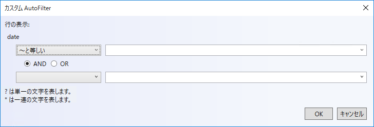

= フィルター ダイアログ インタラクション ({SpreadsheetName})

=== 目的

このトピックでは、コントロールのフィルター ダイアログを使用して列で複雑なフィルターを作成するためにユーザーが実行できる操作を説明します。

=== 前提条件

以下の表は、このトピックを理解するための前提条件として必要な概念とトピックの一覧です。

[options="header", cols="a,a"]
|====

|トピック|目的 

|pick:[wpf,sl,xaml=" link:excelengine-about-infragistics-excel-engine.html[Infragistics Excel Engine について]"] pick:[win-forms=" link:excelengine-understanding-the-infragistics-excel-engine.html[Infragistics Excel Engine の理解]"] 

|このセクションでは、Infragistics Excel Engine のオブジェクト モデルと機能をより深く理解するうえで役立つ情報を提供します。

| link:spreadsheet-features.html[機能の概要 ({SpreadsheetName})] 

|このトピックでは、link:{SpreadsheetLink}.{SpreadsheetName}.html[{SpreadsheetName}] コントロールの機能を開発者の観点から詳しく説明します。

| link:spreadsheet-visual-elements.html[視覚要素の概要 ({SpreadsheetName})] 

|このトピックでは、{SpreadsheetName} コントロールの視覚要素についての概要を紹介します。

|====

=== このトピックの内容

このトピックは、以下のセクションで構成されます。

* <<_Ref389847435, 概要 >>
* <<_Ref396316984, ワークシートの高度なフィルター ダイアログ>>
* <<_Ref396400575, テーブルのフィルター ダイアログ >>
* <<_Ref396313862, 関連コンテンツ >>

[[_Ref389847435]]
== 概要

=== フィルター ダイアログの概要

{SpreadsheetName} コントロールは、読み込んだワークシートまたは作成されたテーブルのヘッダー行のドロップダウン ボタンをクリックすると開いたフィルター ダイアログを提供します。フィルター ダイアログは操作したフィールドに基づいて変更します。

[[_Ref396316984]]
== ワークシートのフィルター ダイアログ

=== コード例
以下のコード例は、0 インデックスにあるワークシート領域の最初の列にフィルター ダイアログを表示する方法を紹介します。指定したインデックスは領域内にある必要があります。

*C# の場合:*

[source,csharp]
----
this.Spreadsheet1.ShowFilterDialogForWorksheet(0, Infragistics.Controls.Grids.SpreadsheetFilterDialogOption.Custom);
----

*Visual Basic の場合:*

[source,vb]
----
Me.Spreadsheet1.ShowFilterDialogForWorksheet(0, Infragistics.Controls.Grids.SpreadsheetFilterDialogOption.Custom)
----

[[_Ref396400575]]
== テーブルのフィルター ダイアログ

=== コード例
以下のコード例は、インデックスによって指定されるワークシート テーブルの最初の列にフィルター ダイアログを表示する方法を紹介します。

*C# の場合:*

[source,csharp]
----
WorksheetTable Table1;
Table1 = this.Spreadsheet1.ActiveWorksheet.Tables[0];
this.Spreadsheet1.ShowFilterDialogForTable(Table1.Columns[0], Infragistics.Controls.Grids.SpreadsheetFilterDialogOption.Custom);
----

*Visual Basic の場合:*

[source,vb]
----
Dim Table1 As WorksheetTable
Table1 = Me.Spreadsheet1.ActiveWorksheet.Tables(0)
Me.Spreadsheet1.ShowFilterDialogForTable(Table1.Columns(0), Infragistics.Controls.Grids.SpreadsheetFilterDialogOption.Custom)
----

[[_Ref396313862]]
== 関連コンテンツ

このトピックに関連する追加情報については、以下のトピックを参照してください。

[options="header", cols="a,a"]
|====
|トピック|目的

| link:spreadsheet-uiu-activation-navigation.html[アクティベーションとナビゲーションのインタラクション ({SpreadsheetName})]
|このトピックでは、コントロールのセルをナビゲートする場合にサポートされるユーザー操作を説明します。

| link:spreadsheet-uiu-cell-editing.html[セル編集のインタラクション ({SpreadsheetName})]
|このトピックでは、セルを編集する場合にユーザーが実行できる操作を説明します。

| link:spreadsheet-uiu-columns-and-rows.html[行と列のインタラクション ({SpreadsheetName})]
|このトピックでは、ワークシートの行と列を操作する場合にユーザーが実行できる操作を説明します。

| link:spreadsheet-uiu-formula-bar.html[数式バーのインタラクション ({SpreadsheetName})]
|このトピックでは、数式バーと対話する場合にユーザーが実行できる操作を説明します。

| link:spreadsheet-uiu-selection.html[選択のインタラクション ({SpreadsheetName})]
|このトピックでは、セル、行、または列を選択する場合にサポートされるユーザー操作を説明します。

| link:spreadsheet-uiu-tab-bar-area.html[タブ バー領域のインタラクション ({SpreadsheetName})]
|このトピックでは、ワークシートと対話する場合にユーザーが実行できる操作を説明します。

|====