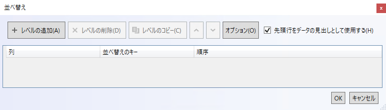
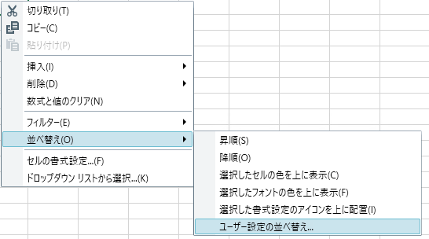

= 並べ替えダイアログのインタラクション ({SpreadsheetName})

=== 目的

このトピックは、コントロールの並べ替えダイアログで実行可能な操作について説明します。テーブル、ワークシート、またはフィルター領域で列または行の複数の並べ替え条件を作成できます。

=== 前提条件

以下の表は、このトピックを理解するための前提条件として必要な概念とトピックの一覧です。

[options="header", cols="a,a"]
|====

|トピック|目的 

|pick:[wpf,sl,xaml=" link:excelengine-about-infragistics-excel-engine.html[Infragistics Excel Engine について]"] pick:[win-forms=" link:excelengine-understanding-the-infragistics-excel-engine.html[Infragistics Excel Engine の理解]"] 

|このセクションでは、Infragistics Excel Engine のオブジェクト モデルと機能をより深く理解するうえで役立つ情報を提供します。

| link:spreadsheet-features.html[機能の概要 ({SpreadsheetName})] 

|このトピックでは、link:{SpreadsheetLink}.{SpreadsheetName}.html[{SpreadsheetName}] コントロールの機能を開発者の観点から詳しく説明します。

| link:spreadsheet-visual-elements.html[視覚要素の概要 ({SpreadsheetName})] 

|このトピックでは、{SpreadsheetName} コントロールの視覚要素についての概要を紹介します。

|====

=== このトピックの内容

このトピックは、以下のセクションで構成されます。

* <<_Ref389847435, カスタム並べ替えダイアログ >>
* <<_Ref396313862, 関連コンテンツ >>

[[_Ref389847435]]
== ユーザー設定の並べ替えダイアログ

=== 並べ替えダイアログの概要

{SpreadsheetName} コントロールは、指定した順序で複数の列または行を並べ替えるためにユーザー設定の並べ替えダイアログを提供します。

ダイアログを開くには、{SpreadsheetName} のコンテキスト メニューを表示します。コンテキスト メニューを表示するには、ワークシート、フィルター領域、またはテーブルにあるセルに右クリックするか、Alt + Shift + F10 を押します。以下の画像のように「並べ替え」>「ユーザー設定の並べ替え」オプションを選択してダイアログを開きます。

最初の並べ替え条件を作成するには、3 つのカテゴリを設定する必要があります。*注*: ダイアログのデフォルト設定は列の並べ替えです。行の並べ替えに変更するには、ダイアログの上部の [オプション] ボタンを使用します。

* **列または行** - 並べ替え条件の最小要件です。デフォルト値は「並べ替えのキー」および「順序」フィールドに設定されます。
* **並べ替えのキー** - 「フォントの色」、「セルの色」、「セルの値」、および「条件付き書式のアイコン」の 4 つの並べ替えオプションがあります。詳細については、以下の画像を参照してください。
* **順序** - 「フォントの色」が並べ替えのキー フィールドに選択される場合、セルの前景の色が「順序」のオプションになります。「セルの色」を並べ替えのキー フィールドで選択した場合、セルの背景の一意の色が「順序」のオプションになります。「セルの値」を並べ替えのキー フィールドで選択した場合、「昇順」または「降順」が「順序」のオプションになります。値が数値を含む場合、「順序」は「小さい順」または「大きい順」になります。「条件付き書式のアイコン」を並べ替えのキー フィールドで選択した場合、行の順序はアイコンに基づいて決定されます。

以下の画像は「**並べ替えのキー**」の 4 つのオプションの例です。

image::images/spreadsheet_custom_sort_dialog.png[]

=== メモ

2 つ以上の並べ替え条件を適用した場合、ダイアログの上部にある「上へ移動」および「下へ移動」ボタンで条件の順序を変更できます。

「削除」ボタンは選択した並べ替え条件を削除します。Shift を押して左クリックすると、複数の並べ替え条件を選択または削除できます。

[[_Ref396313862]]
== 関連コンテンツ

このトピックに関連する追加情報については、以下のトピックを参照してください。

[options="header", cols="a,a"]
|====
|トピック|目的

| link:spreadsheet-uiu-activation-navigation.html[アクティベーションとナビゲーションのインタラクション ({SpreadsheetName})]
|このトピックでは、コントロールのセルをナビゲートする場合にサポートされるユーザー操作を説明します。

| link:spreadsheet-uiu-cell-editing.html[セル編集のインタラクション ({SpreadsheetName})]
|このトピックでは、セルを編集する場合にユーザーが実行できる操作を説明します。

| link:spreadsheet-uiu-columns-and-rows.html[行と列のインタラクション ({SpreadsheetName})]
|このトピックでは、ワークシートの行と列を操作する場合にユーザーが実行できる操作を説明します。

| link:spreadsheet-uiu-formula-bar.html[数式バーのインタラクション ({SpreadsheetName})]
|このトピックでは、数式バーと対話する場合にユーザーが実行できる操作を説明します。

| link:spreadsheet-uiu-selection.html[選択のインタラクション ({SpreadsheetName})]
|このトピックでは、セル、行、または列を選択する場合にサポートされるユーザー操作を説明します。

| link:spreadsheet-uiu-tab-bar-area.html[タブ バー領域のインタラクション ({SpreadsheetName})]
|このトピックでは、ワークシートと対話する場合にユーザーが実行できる操作を説明します。

|=====