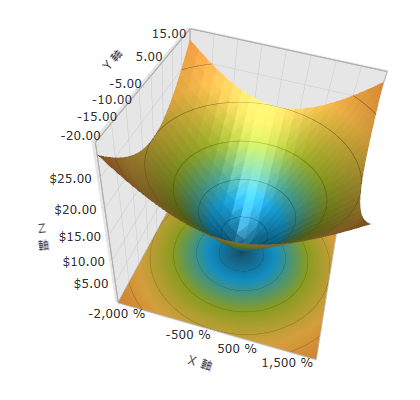

////

|metadata|
{
    "name": "surfacechart-configuring-axis-label-format",
    "controlName": ["{SurfaceChartName}"],
    "tags": [],
    "guid": "fcecd1a6-96da-456e-bf39-83ac136f111c",  
    "buildFlags": ["wpf"],
    "createdOn": "2016-03-02T12:12:21.2034861Z"
}
|metadata|
////

= 軸ラベル形式の構成

== トピックの概要

=== 目的

このトピックは、 link:{SurfaceChartLink}.xamscattersurface3d_members.html[xamScatterSurface3D] コントロールで軸ラベルの形式を構成する方法を説明します。

=== 前提条件

本トピックの理解を深めるために、以下のトピックを参照することをお勧めします。

[options="header", cols="a,a"]
|====
|トピック|目的

| link:surfacechart-getting-started-with-surfacechart.html[xamScatterSurface3D をページに追加]
|このトピックでは、 _xamScatterSurface3D_ コントロールを短時間で起動、実行するために役立つ詳細な操作方法を紹介します。

| link:surfacechart-features-overview.html[機能の概要]
|このトピックでは、このコントロールでサポートする機能を開発者の観点から説明します。

| link:surfacechart-visual-elements.html[視覚要素]
|このトピックでは、コントロールの視覚要素についての概要を紹介します。

|====

以下は、このトピックを理解するための前提条件として必要なオンライン トピックの一覧です。

==== .NET Framework 複合書式文字列

link:http://msdn.microsoft.com/ja-jp/library/dwhawy9k.aspx[標準の数値書式文字列] 

link:http://msdn.microsoft.com/ja-jp/library/az4se3k1(v=VS.100).aspx[標準日付/時刻書式の文字列] 

=== このトピックの内容

このトピックは、以下のセクションで構成されます。

* <<_Ref443558180, 軸ラベル形式の構成 >>
* <<_Ref443558185, 関連コンテンツ >>

[[_Ref443558180]]
== 軸ラベル形式の構成

=== 概要

link:{SurfaceChartLink}.surfacechartaxis.html[SurfaceChartAxis] link:{SurfaceChartLink}.surfacechartaxis~labelformat.html[LabelFormat] プロパティを使用して _xamScatterSurface3D_ コントロールの軸線ストロークを構成します。

.注:
[NOTE]
====
XAML の中括弧 ('{' と '}') はマークアップ拡張のための特殊文字です。文字列の最初の値が中括弧でなければならない場合、中括弧の空のセットをエスケープ シーケンスとして使用する必要があります。これによって、リテラル値として取得すべき中括弧の空のセットにテキストが続くことができます。
====

=== プロパティ設定

以下の表は、任意の構成とそれを管理するプロパティ設定のマッピングを示します。

[options="header", cols="a,a,a"]
|====
|目的:|使用するプロパティ:|設定の選択肢:

|軸ラベルの書式設定
| link:{SurfaceChartLink}.surfacechartaxis~labelformat.html[LabelFormat]
|`文字列`

|====

=== 例

以下のスクリーンショットは、以下の設定の結果として、軸ラベルがどのように表示されるかを示しています。

[options="header", cols="a,a"]
|====
|プロパティ|値

|X 軸ラベル書式
|_{0:P0}_

|Y 軸ラベル書式
|_{0:N2}_

|Z 軸ラベル書式
|_{0:C}_

|====

以下のコードはこの例を実装します。

*XAML の場合:*

[source,xaml]
----
<ig:XamScatterSurface3D Name="SurfaceChart" 
 ItemsSource="{Binding Path=DataCollection}" 
 XMemberPath="X" YMemberPath="Y" ZMemberPath="Z" >
    <ig:XamScatterSurface3D.XAxis>
        <ig:LinearAxis Title="X" LabelFormat="{}{0:P0}"/>
    </ig:XamScatterSurface3D.XAxis>
    <ig:XamScatterSurface3D.YAxis>
        <ig:LinearAxis Title="Y" LabelFormat="{}{0:N2}"/>
    </ig:XamScatterSurface3D.YAxis>
    <ig:XamScatterSurface3D.ZAxis>
        <ig:LinearAxis Title="Z" LabelFormat="{}{0:C}"/>
    </ig:XamScatterSurface3D.ZAxis>
</ig:XamScatterSurface3D>
----

*C# の場合:*

[source,csharp]
----
…
var linearAxisX = new LinearAxis();
var linearAxisY = new LinearAxis();
var linearAxisZ = new LinearAxis();
linearAxisX.LabelFormat = "{0:P0}";
linearAxisY.LabelFormat = "{0:N2}";
linearAxisZ.LabelFormat = "{0:C}";
SurfaceChart.XAxis = linearAxisX;
SurfaceChart.YAxis = linearAxisY;
SurfaceChart.ZAxis = linearAxisZ;
----

*Visual Basic の場合:*

[source,vb]
----
…
Dim linearAxisX = New LinearAxis()
Dim linearAxisY = New LinearAxis()
Dim linearAxisZ = New LinearAxis()
linearAxisX.LabelFormat = "{0:P0}"
linearAxisY.LabelFormat = "{0:N2}"
linearAxisZ.LabelFormat = "{0:C}"
SurfaceChart.XAxis = linearAxisX
SurfaceChart.YAxis = linearAxisY
SurfaceChart.ZAxis = linearAxisZ
----

[[_Ref443558185]]
== 関連コンテンツ

このトピックに関連する追加情報については、以下のトピックを参照してください。

[options="header", cols="a,a"]
|====
|トピック|目的

| link:surfacechart-configuring-axis-label-color-settings.html[軸ラベル色設定の構成]
|このトピックは、 _xamScatterSurface3D_ コントロールで軸ラベルの背景ブラシおよび前景ブラシを構成する方法を説明します。

| link:surfacechart-configuring-axis-label-font-settings.html[軸ラベル フォント設定の構成]
|このトピックは、 _xamScatterSurface3D_ コントロールで軸ラベルのフォント設定を構成する方法を説明します。

| link:surfacechart-configuring-axis-label-offset.html[軸ラベル オフセットの構成]
|このトピックは、 _xamScatterSurface3D_ コントロールで軸からのラベル オフセットを構成する方法を説明します。

| link:surfacechart-configuring-axis-label-visibility-settings.html[軸ラベル表示状態設定の構成]
|このトピックは、 _xamScatterSurface3D_ コントロールで軸ラベルの表示状態および不透明度を構成する方法を説明します。

| link:surfacechart-axis-label-templating.html[軸ラベルのテンプレート]
|このトピックは、 _xamScatterSurface3D_ コントロールで軸ラベルのテンプレートを変更する方法を説明します。

|====