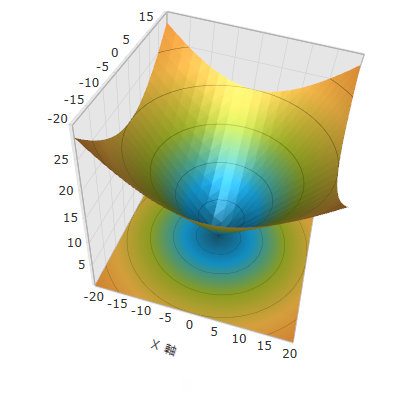

////

|metadata|
{
    "name": "surfacechart-configuring-axis-title-offset",
    "controlName": ["{SurfaceChartName}"],
    "tags": [],
    "guid": "d959fce2-16f6-4f02-8c62-68e058d18bca",  
    "buildFlags": ["wpf"],
    "createdOn": "2016-03-01T20:01:28.7274462Z"
}
|metadata|
////

= 軸タイトル オフセットの構成

== トピックの概要

=== 目的

このトピックは、 link:{SurfaceChartLink}.xamscattersurface3d_members.html[xamScatterSurface3D] コントロールで軸からのタイトル オフセットを構成する方法を説明します。

=== 前提条件

本トピックの理解を深めるために、以下のトピックを参照することをお勧めします。

[options="header", cols="a,a"]
|====
|トピック|目的

| link:surfacechart-getting-started-with-surfacechart.html[xamScatterSurface3D をページに追加]
|このトピックでは、 _xamScatterSurface3D_ コントロールを短時間で起動、実行するために役立つ詳細な操作方法を紹介します。

| link:surfacechart-features-overview.html[機能の概要]
|このトピックでは、このコントロールでサポートする機能を開発者の観点から説明します。

| link:surfacechart-visual-elements.html[視覚要素]
|このトピックでは、コントロールの視覚要素についての概要を紹介します。

|====

=== このトピックの内容

このトピックは、以下のセクションで構成されます。

* <<_Ref443326858, 軸タイトル オフセットの構成 >>
* <<_Ref443404554, 関連コンテンツ >>

[[_Ref443326858]]
== 軸タイトル オフセットの構成

=== 概要

link:{SurfaceChartLink}.surfacechartaxis.html[SurfaceChartAxis] link:{SurfaceChartLink}.surfacechartaxis~titleoffset.html[LabelOffset] プロパティを使用してその軸からのラベル オフセットを設定します。

=== プロパティ設定

以下の表は、任意の構成とそれを管理するプロパティ設定のマッピングを示します。

[options="header", cols="a,a,a"]
|====
|目的:|使用するプロパティ:|設定の選択肢:

|軸からのタイトル オフセットを構成します。
| link:{SurfaceChartLink}.surfacechartaxis~titleoffset.html[TitleOffset]
|`double`

|====

=== 例

以下のスクリーンショットは、以下の設定の結果として軸タイトルがどのように表示されるかを示しています。

[options="header", cols="a,a"]
|====
|プロパティ|値

| link:{SurfaceChartLink}.surfacechartaxis~titleoffset.html[TitleOffset]
| _0.4_ 

|====

以下のコードはこの例を実装します。

*XAML の場合:*

[source,xaml]
----
<ig:XamScatterSurface3D Name="SurfaceChart" 
 ItemsSource="{Binding Path=DataCollection}" 
 XMemberPath="X" YMemberPath="Y" ZMemberPath="Z" >
    <ig:XamScatterSurface3D.XAxis>
        <ig:LinearAxis Title="X Axis" 
 TitleOffset="0.4" />
    </ig:XamScatterSurface3D.XAxis>
</ig:XamScatterSurface3D>
----

*C# の場合:*

[source,csharp]
----
var linearAxis = new LinearAxis();
linearAxis.Title = "X Axis";
linearAxis.TitleOffset = 0.4;
SurfaceChart.XAxis = linearAxis;
----

*Visual Basic の場合:*

[source,vb]
----
Dim linearAxis = New LinearAxis()
linearAxis.Title = "X Axis"
linearAxis.TitleOffset = 0.4
SurfaceChart.XAxis = linearAxis
----

[[_Ref443404554]]
== 関連コンテンツ

このトピックに関連する追加情報については、以下のトピックを参照してください。

[options="header", cols="a,a"]
|====
|トピック|目的

| link:surfacechart-setting-axis-title.html[軸タイトルの設定]
|このトピックでは、 _XamScatterSurface3D_ コントロールで軸タイトルを設定する方法を説明します。

| link:surfacechart-configuring-axis-title-color-settings.html[軸タイトル色設定の構成]
|このトピックは、 _xamScatterSurface3D_ コントロールで軸タイトルの背景ブラシおよび前景ブラシを構成する方法を説明します。

| link:surfacechart-configuring-axis-title-font-settings.html[軸タイトル フォント設定の構成]
|このトピックは、 _xamScatterSurface3D_ コントロールで軸タイトルのフォント設定を構成する方法を説明します。

| link:surfacechart-configuring-axis-title-visibility-settings.html[軸タイトル表示状態設定の構成]
|このトピックは、 _xamScatterSurface3D_ コントロールで軸タイトルの表示状態および不透明度を構成する方法を説明します。

| link:surfacechart-axis-title-templating.html[軸タイトルのテンプレート]
|このトピックは、 _xamScatterSurface3D_ コントロールで軸タイトルのテンプレートを変更する方法を説明します。

|====