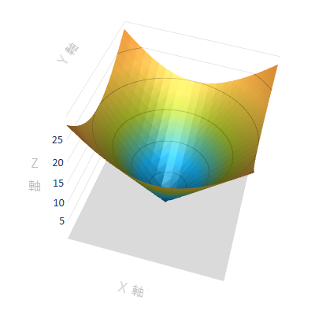
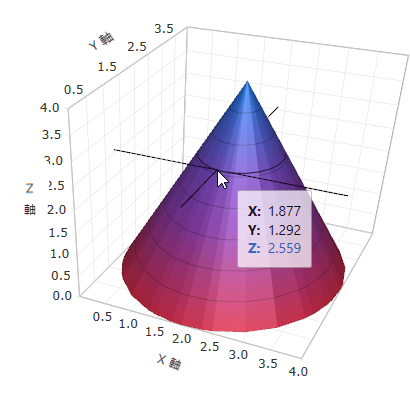

////
|metadata|
{
    "name": "surfacechart-features-overview",
    "controlName": ["{SurfaceChartName}"],
    "tags": [],
    "guid": "3f543a22-5762-447e-b06f-937629891ffe",
    "buildFlags": ["wpf"],
    "createdOn": "2016-02-29T13:36:50.2239621Z"
}
|metadata|
////

= 機能の概要

== トピックの概要

=== 目的

このトピックでは、このコントロールでサポートする機能を開発者の観点から説明します。

=== このトピックの内容

このトピックは、以下のセクションで構成されます。

* <<_Ref445151869, 概要 >>
* <<_Ref445151873, 主要機能 >>
* <<_Ref445151878, 関連コンテンツ >>

[[_Ref445151869]]
== 概要

=== xamScatterSurface3D 概要

link:{SurfaceChartLink}.xamscattersurface3d_members.html[xamScatterSurface3D] コントロールは、散布データの 3D 表面の視覚化をすばやく簡単に実現できます。

このコントロールは、あらゆる 3D 等高線の描画要件の実装が可能な API オプションを提供し、デフォルト値が設定されているためコーディングを最小限に抑えることができます。

_xamScatterSurface3D_ コントロールは、シリーズ、プロットライン、軸、マーカーなどの多くの主要な要素の完全なカスタマイズ オプションを提供します。

更に _xamScatterSurface3D_ コントロールには、豊富なテーマ セットが含まれます。

image::images/3D_Surface_Chart_Features_Overview_1.png[]

[[_Ref445151873]]
== 主要機能

=== 十字線

十字線はデフォルトで _xamScatterSurface3D_ コントロールに表示され、サーフェス上でマウス ホバー時に表示されます。

image::images/3D_Surface_Chart_Features_Overview_2.png[]

==== 関連トピック:

* link:surfacechart-crosshairs.html[十字線の設定]

=== 軸設定のカスタマイズ

_xamScatterSurface3D_ コントロールは、軸設定、軸反転、リニア、対数軸の完全なカスタマイズが可能です。

コントロールは、ラベルおよびタイトルの表示および詳細なカスタマイズ機能があります。

==== 関連トピック:

* link:surfacechart-axis.html[軸設定]

=== キューブ設定のカスタマイズ

_xamScatterSurface3D_ コントロールは、サーフェス キューブ テクスチャやその他のキューブ プロパティ (グリッド線、シリーズ投影) の完全なカスタマイズを提供します。

image::images/3D_Surface_Chart_Features_Overview_4.png[]

==== 関連トピック:

* link:surfacechart-cube.html[キューブ設定]
* link:surfacechart-floor.html[フロアの設定]
* link:surfacechart-grid-lines.html[グリッド線の設定]

=== カスタマイズ可能なシリーズの設定

_xamScatterSurface3D_ コントロールは、シリーズ設定 (シリーズの色、テクスチャ) の完全なカスタマイズを提供します。

大きいデータ セットを速くプロットするには、シリーズが構成可能なテクスチャおよび太さとワイヤフレーム サーフェイスとして表示できます。

image::images/3D_Surface_Chart_Features_Overview_5.png[]

image::images/3D_Surface_Chart_Features_Overview_6.png[]

==== 関連トピック:

* link:surfacechart-series.html[シリーズ設定]

=== 回転

_xamScatterSurface3D_ コントロールは、マウス、キーボード矢印キー、またはタッチ ジェスチャにより簡単に回転できます。

==== 関連トピック:

* link:surfacechart-rotation.html[回転]

=== ツールチップ

_xamScatterSurface3D_ コントロールの上にマウスをホバーすると、ツールチップが表示されます。選択されたデータ ポイントについての情報を表示します。ツールチップのテンプレートを変更できます。

==== 関連トピック:

* link:surfacechart-tooltip.html[ツールチップ]

[[_Ref445151878]]

=== タッチ サポート

_xamScatterSurface3D_ コントロールは、回転またはズームなどの操作を開始するために標準のタッチ ジェスチャを使用します。

==== 関連トピック:

* link:surfacechart-interacting-with-touch-gestures.html[タッチ ジェスチャとの操作]

=== ズーム

ズーム操作はコードで実装できるか、マウス ホイールにより実行できます。

==== 関連トピック:

* link:surfacechart-zooming.html[ズーム]

[[_Ref445151878]]
== 関連コンテンツ

このトピックに関連する追加情報については、以下のトピックを参照してください。

[options="header", cols="a,a"]
|====
|トピック|目的

| link:surfacechart-visual-elements.html[視覚要素]
|このトピックでは、コントロールの視覚要素についての概要を紹介します。

| link:surfacechart-user-interactions.html[ユーザー インタラクション]
|このグループのこのトピックでは、 _xamScatterSurface3D_ コントロールにおけるユーザー インタラクションについて説明します。

|====