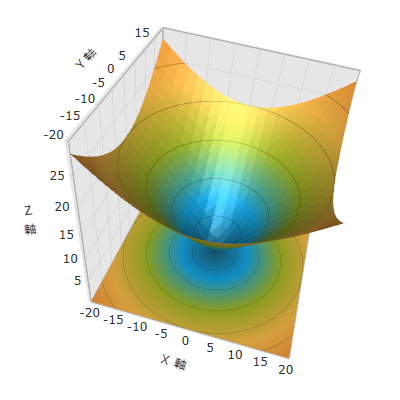

////
|metadata|
{
    "name": "surfacechart-getting-started-with-surfacechart",
    "controlName": ["{SurfaceChartName}"],
    "tags": [],
    "guid": "5f6c1c5a-af05-4af3-af4b-5c09f71531fb",
    "buildFlags": ["wpf"],
    "createdOn": "2015-12-17T15:02:10.6907564Z"
}
|metadata|
////

= 等高線グラフをユーザーのページに追加

== トピックの概要

=== 目的

このトピックでは、link:{SurfaceChartLink}.xamscattersurface3d_members.html[XamScatterSurface3D]™ コントロールを短時間で起動、実行するために役立つ詳細な操作方法を紹介します。

=== 前提条件

本トピックの理解を深めるために、以下のトピックを参照することをお勧めします。

[options="header", cols="a,a"]
|====
|トピック|目的

| link:surfacechart-features-overview.html[機能の概要]
|このトピックでは、このコントロールでサポートする機能を開発者の観点から説明します。

| link:surfacechart-visual-elements.html[視覚要素]
|このトピックでは、コントロールの視覚要素についての概要を紹介します。

|====

=== このトピックの内容

このトピックは、以下のセクションで構成されます。

* <<_Ref444182898, **等高線グラフをユーザーのページに追加 - 例** >>

** <<_Ref444182946, はじめに >>
** <<_Preview, プレビュー >>
** <<_Prerequisites, 前提条件>>
** <<_Overview, 概要 >>
** <<_Ref444182962, 手順 >>
** <<_Ref382317785, 完全なコード >>

* <<_Ref444182909, **関連コンテンツ** >>

[[_Ref444182898]]
== 等高線グラフをユーザーのページに追加 - 例

[[_Ref444182946]]
=== はじめに

このトピックでは、_xamScatterSurface3D_ コントロールをページに追加し、データポイントのセットにバインドする方法を紹介します。

[[_Preview]]
=== プレビュー

以下のスクリーンショットは最終結果のプレビューです。

[[_Prerequisites]]
=== 前提条件

この手順を実行するには、以下が必要です。

* {PlatformName} プロジェクトを作成し、以下の NuGet パッケージ参照を追加します。

** Infagistics.WPF.SurfaceChart3D

+
NuGet フィードのセットアップと NuGet パッケージの追加の詳細については、link:nuget-feeds.html[NuGet フィード] ドキュメントを参照してください。

* 以下の名前空間宣言を追加します。

**XAML の場合:**
[source,xaml]
----
xmlns:ig="http://schemas.infragistics.com/xaml"
----

**C# の場合:**
[source,csharp]
----
using Infragistics.Controls.Charts;
----

**Visual Basic の場合:**
[source,vb]
----
Imports Infragistics.Controls.Charts
----

* _xamSurfaceChart3D_ コントロールをページに追加します。

**XAML の場合:**
[source,xaml]
----
<ig:XamScatterSurface3D Name="SurfaceChart">
    <!-- ... -->
</ig:XamScatterSurface3D>
----

**C# の場合:**
[source,csharp]
----
var surfaceChart = new XamScatterSurface3D();
----

**Visual Basic の場合:**
[source,vb]
----
Dim surfaceChart = New XamScatterSurface3D()
----

[[_Overview]]
=== 概要

以下はプロセスの概要です。

* <<_Ref444183101, **等高線グラフに ItemsSource を設定**>> 
* <<_Ref444183122, **等高線グラフにメンバー パス プロパティを設定**>> 
* <<_Ref444530102, **軸プロパティを指定 (オプション)**>>

[[_Ref444182962]]
=== 手順

以下の手順は、_xamScatterSurface3D_ コントロールの基本オプションを構成し、データ ポイントのセットにバインドする方法です。

[[_Ref444183101]]
==== 等高線グラフに ItemsSource を設定

等高線グラフに ItemsSource を設定:

**XAML の場合:**
[source,xaml]
----
<ig:XamScatterSurface3D Name="SurfaceChart" 
    ItemsSource="{Binding Path=DataCollection}" …>
</ig:XamScatterSurface3D>
----

[[_Ref444183122]]
==== 等高線グラフにメンバー パス プロパティを設定

特定のサンプルでデータ モデルは 3 つのプロパティがあります。プロットする位置データを保持する X、Y、および Z です。

XMemberPath、YMemberPath、および ZMemberPath プロパティを設定し、データモデル メンバーと X、Y、および Z の位置のマッピングを作成します。

**XAML の場合:**
[source,xaml]
----
<ig:XamScatterSurface3D Name="SurfaceChart" 
    ItemsSource="{Binding Path=DataCollection}" 
    XMemberPath="X" YMemberPath="Y" ZMemberPath="Z">
</ig:XamScatterSurface3D>
----

[[_Ref444530102]]
==== 軸プロパティを指定 (オプション)

LinearAxis オブジェクトの 3 つのインスタンスを作成し、等高線グラフの XAxis、YAxis、および ZAxis プロパティに割り当てます。

**XAML の場合:**
[source,xaml]
----
<ig:XamScatterSurface3D Name="SurfaceChart" 
    ItemsSource="{Binding Path=DataCollection}"
    XMemberPath="X" YMemberPath="Y" ZMemberPath="Z">
    <ig:XamScatterSurface3D.XAxis>
        <ig:LinearAxis Title="X Axis" />
    </ig:XamScatterSurface3D.XAxis>
    <ig:XamScatterSurface3D.YAxis>
        <ig:LinearAxis Title="Y Axis" />
    </ig:XamScatterSurface3D.YAxis>
    <ig:XamScatterSurface3D.ZAxis>
        <ig:LinearAxis Title="Z Axis" />
    </ig:XamScatterSurface3D.ZAxis>
</ig:XamScatterSurface3D>
----

[[_Ref382317785]]
=== 完全なコード

以下は、この手順の完全なコードです。

**C# の場合:**

[source,csharp]
----
public class DataPoint
{
    public DataPoint() { }
    public DataPoint(double x, double y, double z)
    {
        this.X = x;
        this.Y = y;
        this.Z = z;
    }
    public double X { get; set; }
    public double Y { get; set; }
    public double Z { get; set; }
}
----

**Visual Basic の場合:**

[source,vb]
----
public Class DataPoint
Public Sub New()
End Sub
Public Sub New(x As Double, y As Double, z As Double)
    Me.X = x
    Me.Y = y
    Me.Z = z
End Sub
Private m_X As Double
Private m_Y As Double
Private m_Z As Double
Public Property X() As Double
    Get
      Return m_X
    End Get
    Set
        m_X = Value
    End Set
End Property
Public Property Y() As Double
    Get
        Return m_Y
    End Get
    Set
        m_Y = Value
    End Set
End Property
Public Property Z() As Double
    Get
        Return m_Z
    End Get
    Set
        m_Z = Value
    End Set
End Property
End Class
----

**C# の場合:**

[source,csharp]
----
public class ViewModel
{
    public List<DataPoint> DataCollection { get; set; }
    public ViewModel()
    {
        DataCollection = GenerateFormulaData();
    }
    internal static List<DataPoint> GenerateFormulaData()
    {
        var data = new List<DataPoint>();
        for (int x = -20; x <= 20; x += 2)
        {
            for (int y = -20; y <= 20; y += 2)
            {
                double z = Math.Sqrt(Math.Pow(x, 2) + Math.Pow(y, 2));
                var point = new DataPoint(x, y, z);
                data.Add(point);
            }
        }
        return data;
    }
}
----

**Visual Basic の場合:**

[source,vb]
----
Public Class ViewModel
    Public Property DataCollection() As List(Of DataPoint)
        Get
            Return m_DataCollection
        End Get
        Set
            m_DataCollection = Value
        End Set
    End Property
    Private m_DataCollection As List(Of DataPoint)
    Public Sub New()
        DataCollection = GenerateFormulaData()
    End Sub
    Friend Shared Function GenerateFormulaData() As List(Of DataPoint)
        Dim data = New List(Of DataPoint)()
        For x As Integer = -20 To 20 Step 2
            For y As Integer = -20 To 20 Step 2
                Dim z As Double = Math.Sqrt(Math.Pow(x, 2) + Math.Pow(y, 2))
                Dim point = New DataPoint(x, y, z)
                data.Add(point)
            Next
        Next
        Return data
    End Function
End Class
----

**XAML の場合:**

[source,xaml]
----
<Grid>
    <Grid.DataContext>
        <data:ViewModel />
    </Grid.DataContext>
    <ig:XamScatterSurface3D Name="SurfaceChart" 
        ItemsSource="{Binding Path=DataCollection}" 
        XMemberPath="X" YMemberPath="Y" ZMemberPath="Z">
        <ig:XamScatterSurface3D.XAxis>
            <ig:LinearAxis Title="X Axis" />
        </ig:XamScatterSurface3D.XAxis>
        <ig:XamScatterSurface3D.YAxis>
            <ig:LinearAxis Title="Y Axis" />
        </ig:XamScatterSurface3D.YAxis>
        <ig:XamScatterSurface3D.ZAxis>
            <ig:LinearAxis Title="Z Axis" />
        </ig:XamScatterSurface3D.ZAxis>
    </ig:XamScatterSurface3D>
</Grid>
----

**C# の場合:**

[source,csharp]
----
var surfaceChart = new XamScatterSurface3D();
surfaceChart.ItemsSource = new ViewModel().DataCollection;

surfaceChart.XMemberPath = "X";
surfaceChart.YMemberPath = "Y";
surfaceChart.ZMemberPath = "Z";

var xLinearAxis = new LinearAxis();
var yLinearAxis = new LinearAxis();
var zLinearAxis = new LinearAxis();

xLinearAxis.Title = "X Axis";
yLinearAxis.Title = "Y Axis";
zLinearAxis.Title = "Z Axis";

surfaceChart.XAxis = xLinearAxis;
surfaceChart.YAxis = yLinearAxis;
surfaceChart.ZAxis = zLinearAxis;
----

**Visual Basic の場合:**

[source,vb]
----
Dim surfaceChart = New XamScatterSurface3D()
surfaceChart.ItemsSource = New ViewModel().DataCollection

surfaceChart.XMemberPath = "X"
surfaceChart.YMemberPath = "Y"
surfaceChart.ZMemberPath = "Z"

Dim xLinearAxis = New LinearAxis()
Dim yLinearAxis = New LinearAxis()
Dim zLinearAxis = New LinearAxis()

xLinearAxis.Title = "X Axis"
yLinearAxis.Title = "Y Axis"
zLinearAxis.Title = "Z Axis"

surfaceChart.XAxis = xLinearAxis
surfaceChart.YAxis = yLinearAxis
surfaceChart.ZAxis = zLinearAxis
----

[[_Ref444182909]]
== 関連コンテンツ

本トピックに関連する追加情報については、以下のトピックを参照してください。

[options="header", cols="a,a"]
|====
|トピック|目的

| link:surfacechart-overview.html[概要]
|このトピックのグループでは、_xamScatterSurface3D_ コントロールの機能および視覚要素の概要を説明します。

| link:surfacechart-configuring-surfacechart.html[等高線グラフの構成]
|このセクションのトピックでは、_xamScatterSurface3D_ コントロールの様々な機能の構成について説明します。

| link:surfacechart-api-reference.html[API リファレンス]
|このトピックでは、コントロールに関連した名前空間およびクラスに関する参考情報を提供します。

|====
