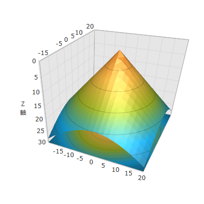

////

|metadata|
{
    "name": "surfacechart-inverting-axis",
    "controlName": ["{SurfaceChartName}"],
    "tags": [],
    "guid": "c2d77297-f098-40d0-9262-611c572763b6",  
    "buildFlags": ["wpf"],
    "createdOn": "2016-02-29T13:28:53.7712439Z"
}
|metadata|
////

= 軸を反転

== トピックの概要

=== 目的

このトピックは、 link:{SurfaceChartLink}.xamscattersurface3d_members.html[XamScatterSurface3D] コントロールで軸を反転する方法を説明します。

=== 前提条件

本トピックの理解を深めるために、以下のトピックを参照することをお勧めします。

[options="header", cols="a,a"]
|====
|トピック|目的

| link:surfacechart-getting-started-with-surfacechart.html[xamScatterSurface3D をページに追加]
|このトピックでは、 _xamScatterSurface3D_ コントロールを短時間で起動、実行するために役立つ詳細な操作方法を紹介します。

| link:surfacechart-features-overview.html[機能の概要]
|このトピックでは、このコントロールでサポートする機能を開発者の観点から説明します。

| link:surfacechart-visual-elements.html[視覚要素]
|このトピックでは、コントロールの視覚要素についての概要を紹介します。

|====

=== このトピックの内容

このトピックは、以下のセクションで構成されます。

* <<_Ref444008825, 軸を反転 >>
* <<_Ref444008830, 関連コンテンツ >>

[[_Ref444008825]]
== 軸を反転

=== 概要

link:{SurfaceChartLink}.surfacechartaxis.html[SurfaceChartAxis] link:{SurfaceChartLink}.surfacechartaxis~isinverted.html[IsInverted] プロパティを使用して _xamScatterSurface3D_ コントロールの特定の軸を反転します。

=== プロパティ設定

以下の表は、任意の構成とそれを管理するプロパティ設定のマッピングを示します。

[options="header", cols="a,a,a"]
|====
|目的:|使用するプロパティ:|設定の選択肢:

|軸を反転
| link:{SurfaceChartLink}.surfacechartaxis~isinverted.html[IsInverted]
|`True`

|====

=== 例

以下のスクリーンショットは、以下の設定の結果として軸がどのように表示されるかを示しています。

[options="header", cols="a,a"]
|====
|プロパティ|値

| link:{SurfaceChartLink}.surfacechartaxis~isinverted.html[IsInverted]
| _True_ 

|====

以下のコードはこの例を実装します。

*XAML の場合:*

[source,xaml]
----
<ig:XamScatterSurface3D Name="SurfaceChart" 
    ItemsSource="{Binding Path=DataCollection}" 
    XMemberPath="X" YMemberPath="Y" ZMemberPath="Z">
    <ig:XamScatterSurface3D.ZAxis>
        <ig:LinearAxis Title="Z Axis" IsInverted="True" />
    </ig:XamScatterSurface3D.ZAxis>
</ig:XamScatterSurface3D>
----

*C# の場合:*

[source,csharp]
----
…
var linearAxis = new LinearAxis();
linearAxis.Title = "Z Axis";
linearAxis.IsInverted = true;
SurfaceChart.ZAxis = linearAxis;
----

*Visual Basic の場合:*

[source,vb]
----
…
Dim linearAxis = New LinearAxis()
linearAxis.Title = "Z Axis"
linearAxis.IsInverted = True
SurfaceChart.ZAxis = linearAxis
----

[[_Ref444008830]]
== 関連コンテンツ

このトピックに関連する追加情報については、以下のトピックを参照してください。

[options="header", cols="a,a"]
|====
|トピック|目的

| link:surfacechart-grid-lines.html[軸のグリッド線の構成]
|このトピックは、 _xamScatterSurface3D_ コントロールでグリッド線のブラシおよび太さを構成する方法を説明します。

| link:surfacechart-configuring-axis-interval.html[軸間隔の構成]
|このトピックは、 _xamScatterSurface3D_ コントロールで軸間隔を構成する方法を説明します。

| link:surfacechart-configuring-axis-label.html[軸ラベルの構成]
|このグループのトピックでは、 _xamScatterSurface3D_ コントロールの軸ラベルの外観を構成する方法を説明します。

| link:surfacechart-configuring-axis-line.html[軸線の構成]
|このトピックは、 _xamScatterSurface3D_ コントロールで軸線を構成する方法を説明します。

| link:surfacechart-configuring-axis-range.html[軸範囲の構成]
|このトピックは、 _xamScatterSurface3D_ コントロールで軸範囲を構成するために MinimumValue および MaximumValue プロパティを設定方法を説明します。

| link:surfacechart-configuring-axis-scales.html[軸型の構成]
|このトピックは、 _xamScatterSurface3D_ コントロールで利用可能な軸型を説明します。

| link:surfacechart-configuring-axis-tick-marks-range.html[軸目盛範囲の構成]
|このトピックは、 _xamScatterSurface3D_ コントロールで軸目盛の範囲を構成する方法を説明します。

| link:surfacechart-configuring-axis-title.html[軸タイトルの構成]
|このグループのトピックでは、 _xamScatterSurface3D_ コントロールの軸タイトルの外観を構成する方法を説明します。

|====