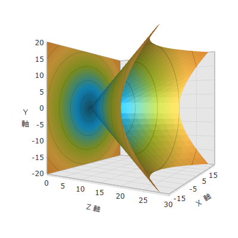

////

|metadata|
{
    "name": "surfacechart-rotation",
    "controlName": ["{SurfaceChartName}"],
    "tags": [],
    "guid": "95521e71-305e-44de-853c-bc6da83942b3",  
    "buildFlags": ["wpf"],
    "createdOn": "2016-02-29T13:59:48.6542797Z"
}
|metadata|
////

= 回転

== トピックの概要

=== 目的

このトピックでは、 link:{SurfaceChartLink}.xamscattersurface3d_members.html[XamScatterSurface3D]™ コントロールを構成する方法を説明します。

=== 前提条件

本トピックの理解を深めるために、以下のトピックを参照することをお勧めします。

[options="header", cols="a,a"]
|====
|トピック|目的

| link:surfacechart-getting-started-with-surfacechart.html[xamScatterSurface3D をページに追加]
|このトピックでは、 _xamScatterSurface3D_ コントロールを短時間で起動、実行するために役立つ詳細な操作方法を紹介します。

| link:surfacechart-features-overview.html[機能の概要]
|このトピックでは、このコントロールでサポートする機能を開発者の観点から説明します。

| link:surfacechart-visual-elements.html[視覚要素]
|このトピックでは、コントロールの視覚要素についての概要を紹介します。

|====

以下の表は、このトピックを理解するための前提条件として必要な外部トピックの一覧です。

==== 3D 回転 

[options="header", cols="a,a"] 

|==== 

|記事|目的 

| link:https://msdn.microsoft.com/ja-jp/library/system.windows.media.media3d.rotation3d(v=vs.110).aspx[Rotation3D クラス] 

|この記事は、WPF で抽象 Rotation3D クラスを使用する方法について説明します。 

| link:https://msdn.microsoft.com/ja-jp/library/system.windows.media.media3d.axisanglerotation3d(v=vs.110).aspx[AxisAngleRotation3D クラス] 

|この記事は、指定した軸と角度で 3D 回転する方法について説明します。 

| link:https://msdn.microsoft.com/ja-jp/library/system.windows.media.media3d.quaternionrotation3d(v=vs.110).aspx[QuaternionRotation3D クラス] 

|この記事は、四元数として定義した回転変換を表す方法について説明します。 

|====

=== このトピックの内容

このトピックは、以下のセクションで構成されます。

* <<_Ref445738631, 軸と角度を指定して回転を構成 >>
* <<_Ref445738635, 四元数を使用した回転の構成 >>
* <<_Ref445738643, 関連コンテンツ >>

[[_Ref445738631]]
== 軸と角度を指定して回転を構成

=== 概要

_xamScatterSurface3D_ でプログラミングによって link:{SurfaceChartLink}.xamchart3d~rotation.html[Rotation] プロパティを使用して回転を設定します。

`Rotation` プロパティを指定した角度と軸回転で `AxisAngleRotation3D` オブジェクトに設定します。

=== プロパティ設定

以下の表は、任意の構成とそれを管理するプロパティ設定のマッピングを示します。

[options="header", cols="a,a,a"]
|====
|目的:|使用するプロパティ:|設定の選択肢:

|軸と角度を指定して回転を構成
| link:{SurfaceChartLink}.xamchart3d~rotation.html[Rotation]
|`AxisAngleRotation3D`

|====

=== 例

以下のスクリーンショットは、以下の設定の結果、_xamScatterSurface3D_ コントロールの外観がどのようになるかを示しています。Y 軸周りを 60 度で回転:

[options="header", cols="a,a"]
|====
|プロパティ|値

| link:{SurfaceChartLink}.xamchart3d~rotation.html[Rotation]
| `<AxisAngleRotation3D Angle="60" Axis="0 1 0" />` 

|====

以下のコードはこの例を実装します。

*XAML の場合:*

[source,xaml]
----
<ig:XamScatterSurface3D Name="SurfaceChart" 
 ItemsSource="{Binding Path=DataCollection}" 
 XMemberPath="X" YMemberPath="Y" ZMemberPath="Z">
    <ig:XamScatterSurface3D.Rotation>
        <AxisAngleRotation3D Angle="60" Axis="0 1 0" />
    </ig:XamScatterSurface3D.Rotation>
</ig:XamScatterSurface3D>
----

*C# の場合:*

[source,csharp]
----
var axis = new Vector3D(0, 1, 0);
var axisAngleRotation3D = new AxisAngleRotation3D(axis, 60);
SurfaceChart.Rotation = axisAngleRotation3D;
----

*Visual Basic の場合:*

[source,vb]
----
Dim axis = New Vector3D(0, 1, 0)
Dim axisAngleRotation3D = New AxisAngleRotation3D(axis, 60)
SurfaceChart.Rotation = axisAngleRotation3D
----

[[_Ref445738635]]
== 四元数を使用した回転の構成

=== 概要

_xamScatterSurface3D_ でプログラミングによって link:{SurfaceChartLink}.xamchart3d~rotation.html[Rotation] プロパティを使用して回転を設定します。

`Rotation` プロパティを四元数で回転変換を表す `QuaternionRotation3D` オブジェクトに設定します。

回転軸の名前が ax、ay、および az で回転角度の名前が theta の場合、以下の数式を使用して四元数を計算できます。

四元数 (x, y, z, w) :

x = ax $$*$$ sin(theta/2)

y = ay $$*$$ sin(theta/2)

z = az $$*$$ sin(theta/2)

w = cos(theta/2)

上記の例のように _xamScatterSurface3D_ コントロールの周りを角度 60 度で回転する場合、四元数は (0, 0.5, 0, 0.866) と等しくなります。

=== プロパティ設定

以下の表は、任意の構成とそれを管理するプロパティ設定のマッピングを示します。

[options="header", cols="a,a,a"]
|====
|目的:|使用するプロパティ:|設定の選択肢:

|四元数を使用した回転の実行
| link:{SurfaceChartLink}.xamchart3d~rotation.html[Rotation]
|`QuaternionRotation3D`

|====

=== 例

以下のスクリーンショットは、以下のコードの結果として _xamScatterSurface3D_ コントロールの外観がどのようになるかを示しています。

以下のコードはこの例を実装します。

*XAML の場合:*

[source,xaml]
----
<ig:XamScatterSurface3D Name="SurfaceChart" 
 ItemsSource="{Binding Path=DataCollection}" 
 XMemberPath="X" YMemberPath="Y" ZMemberPath="Z">
    <ig:XamScatterSurface3D.Rotation>
        <QuaternionRotation3D Quaternion="0, 0.5, 0, 0.866" />
    </ig:XamScatterSurface3D.Rotation>
</ig:XamScatterSurface3D>
----

*C# の場合:*

[source,csharp]
----
…
var quaternion = new Quaternion();
quaternion.X = 0;
quaternion.Y = 0.5;
quaternion.Z = 0;
quaternion.W = 0.866;
var quaternionRotation3D = new QuaternionRotation3D();
quaternionRotation3D.Quaternion = quaternion;
SurfaceChart.Rotation = quaternionRotation3D;
----

*Visual Basic の場合:*

[source,vb]
----
…
Dim quaternion = New Quaternion()
quaternion.X = 0
quaternion.Y = 0.5
quaternion.Z = 0
quaternion.W = 0.866
Dim quaternionRotation3D = New QuaternionRotation3D()
quaternionRotation3D.Quaternion = quaternion
SurfaceChart.Rotation = quaternionRotation3D
----

[[_Ref445738643]]

== 関連コンテンツ

このトピックに関連する追加情報については、以下のトピックを参照してください。

[options="header", cols="a,a"]
|====
|トピック|目的

| link:surfacechart-aspect-perspective.html[次元と視点]
|このトピックでは、 _xamScatterSurface3D_ コントロールの機能およびビヘイビアを構成する方法を説明します。

| link:surfacechart-axis.html[軸設定]
|このグループのトピックでは、 _xamScatterSurface3D_ コントロールの軸設定を構成する方法を説明します。

| link:surfacechart-crosshairs.html[十字線の設定]
|このトピックでは、 _xamScatterSurface3D_ コントロールで十字線を構成する方法を説明します。

| link:surfacechart-cube.html[キューブ設定]
|このトピックでは、 _xamScatterSurface3D_ コントロールの縁の太さとキューブの素材を構成する方法を説明します。

| link:surfacechart-data-point-marker.html[データ ポイント マーカー]
|このグループのトピックでは、 _xamScatterSurface3D_ コントロールのデータ ポイント マーカーを構成する方法を説明します。

| link:surfacechart-floor.html[フロアの設定]
|このトピックでは、 _xamScatterSurface3D_ コントロールのフロア設定を構成する方法について説明します。

| link:surfacechart-performance.html[パフォーマンス]
|大きなデータ ポイントのセットを描画する際に _xamScatterSurface3D_ コントロールのパフォーマンスを最適化する方法について説明します。

| link:surfacechart-series.html[シリーズ設定]
|このグループのトピックでは、 _xamScatterSurface3D_ コントロールのシリーズ設定を構成する方法を説明します。

| link:surfacechart-tooltip.html[ツールチップ]
|このトピックは、 _xamScatterSurface3D_ コントロールでデフォルトのツールチップを表示/非表示、およびカスタム ツールチップを適用する方法について説明します。

| link:surfacechart-zooming.html[ズーム]
|このトピックでは、 _xamScatterSurface3D_ コントロールのスケーリングを実行する方法について説明します。

|====