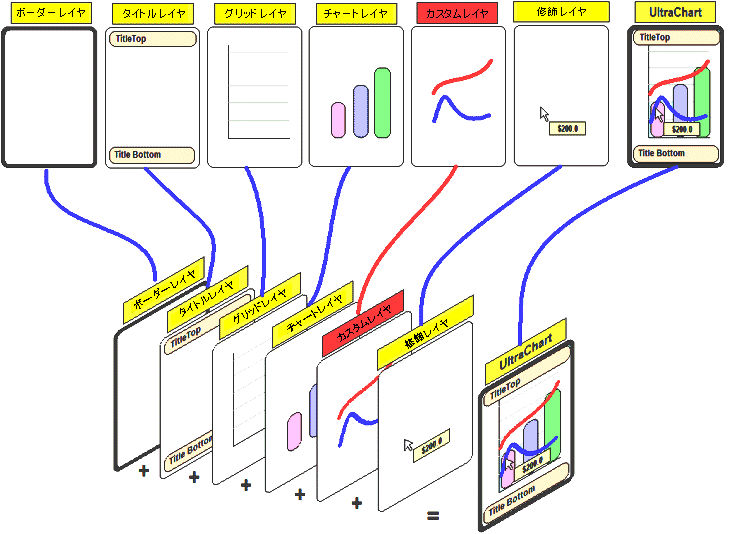

////

|metadata|
{
    "name": "chart-about-custom-layers",
    "controlName": ["{WawChartName}"],
    "tags": [],
    "guid": "{7FACBAD4-AEE0-4675-8A11-80FA2C2248B2}",  
    "buildFlags": [],
    "createdOn": "0001-01-01T00:00:00Z"
}
|metadata|
////

= カスタム レイヤについて

Chart は、チャートのレイヤを別々に描画し、それらのレイヤを互いに重ね合わせて 最終的なチャートを合成します。チャート コア、すなわち内部グラフ作成エンジンは、開発者の設定に応じてレイヤを 1 つずつ作成し、それらを重ね合わせて 最終的なチャートを作成します。

このアーキテクチャによって、アプリケーション開発者はチャートを簡単かつ非常に柔軟に拡張できます。Chart のレイヤ フレームワークでは、アプリケーション開発者はカスタム レイヤを既存のレイヤセットに挿入できます。

複雑すぎるかカスタマイズされすぎていて Chart 内のプロパティの設定では達成できないタスクの場合、カスタム レイヤを実装できます（以下のスクリーンショットの赤のカスタム レイヤを参照）。カスタム レイヤでは、開発者はグラフ領域に追加のグラフィックスを描画したり、既存のグラフィックスを編集したりできます。

== 関連トピック

link:chart-adding-primitives-to-a-chart-layer.html[プリミティブをグラフ レイヤに追加する]

link:chart-implementing-a-custom-layer.html[カスタム レイヤを実装]