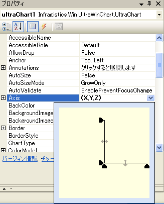

////

|metadata|
{
    "name": "chart-axis-margins",
    "controlName": ["{WawChartName}"],
    "tags": [],
    "guid": "{4268749A-04F6-4479-9AD2-9601C12C9B3B}",  
    "buildFlags": [],
    "createdOn": "0001-01-01T00:00:00Z"
}
|metadata|
////

= 軸のマージン

以下の画像に示すように、デフォルトで、Chart は軸の 100% にわたってデータを表示します。

image::images/Chart_Axis_Margins_01.png[]

軸のマージンを使用して、開発者は軸の各側面にスペースを追加できます。これにより、グラフの外観と鮮明度を向上できます。

上図の同じグラフに、X 軸の最も近い端と最も遠い端に 5% のマージンを追加した画像を以下に示します。

image::images/Chart_Axis_Margins_02.png[]

軸のマージンをカスタマイズするには、以下のプロパティを使用します（ここで、 _N_  はカスタマイズする軸を示します）。

* UltraChart.Axis.N.Margins.Near
* UltraChart.Axis.N.Margins.Far

マージンのサイズは、ピクセル値、パーセント値、またはデータ値を使用して設定できます。 pick:[win-forms="link:{ApiPlatform}win.ultrawinchart{ApiVersion}~infragistics.ultrachart.resources.appearance.axismargin~margintype.html[MarginType]"]  pick:[asp-net="link:{ApiPlatform}webui.ultrawebchart{ApiVersion}~infragistics.ultrachart.resources.appearance.axismargin~margintype.html[MarginType]"]  pick:[aspnet-old="link:{ApiPlatform}webui.ultrawebchart{ApiVersion}~infragistics.ultrachart.resources.appearance.axismargin~margintype.html[MarginType]"]  プロパティを適切な測定単位に設定します。 pick:[win-forms="link:{ApiPlatform}win.ultrawinchart{ApiVersion}~infragistics.ultrachart.resources.appearance.axismargin~value.html[Value]"]  pick:[asp-net="link:{ApiPlatform}webui.ultrawebchart{ApiVersion}~infragistics.ultrachart.resources.appearance.axismargin~value.html[Value]"]  pick:[aspnet-old="link:{ApiPlatform}webui.ultrawebchart{ApiVersion}~infragistics.ultrachart.resources.appearance.axismargin~value.html[Value]"]  プロパティは、マージンに使用するスペースの大きさを決定します。

また、エディタ コントロールは、軸のマージンを調整するために使用できます。このエディタはグラフ ウィザードの軸タブに表示するか、プロパティ グリッドの UltraChart.Axis プロパティをクリックして表示できます。

image::images/Chart_Axis_Margins_04.png[]

[NOTE]
====
*注：* エディタ コントロールは、MarginType が「Pixels」または「Percentage」に設定されるマージンだけに機能します。
====

== 関連トピック

* link:chart-apply-chart-text-labels.html[チャート テキスト ラベルの適用]
* link:chart-display-data-on-a-time-scale-axis.html[時間のスケール軸でデータを表示]
* link:chart-display-labels-at-intervals-on-a-time-scale-axis.html[時間のスケール軸で間隔でラベルを表示]
* link:chart-scale-chart-axes.html[チャート軸のスケール]
* link:chart-set-minimum-and-maximum-data-values.html[最小データ値と最大データ値の設定]
* link:chart-plot-log-zero-values.html[ログ ゼロ値をプロット]